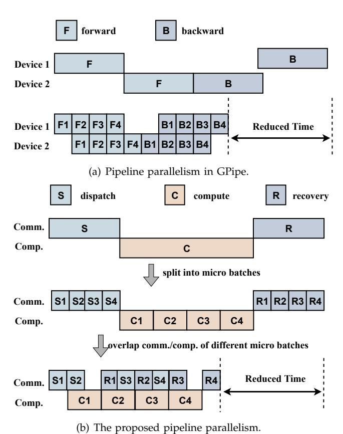
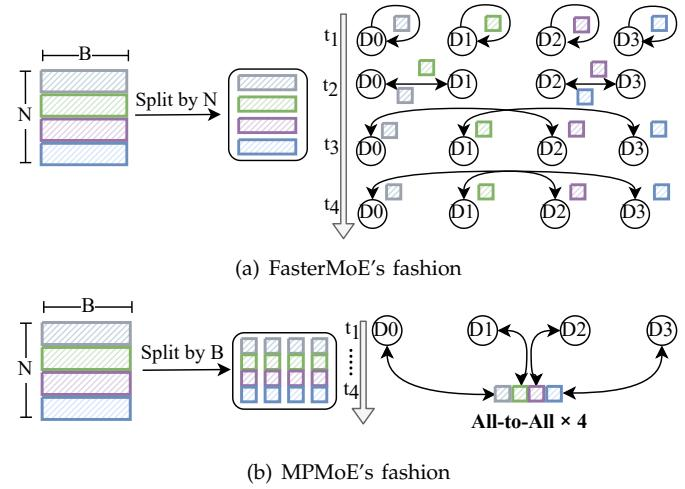

# MPMoE: Memory Efficient MoE for Pre-trained Models with Adaptive Pipeline Parallelism

Zheng Zhang, Yaqi Xia, Hulin Wang, Donglin Yang, Chuang Hu, Xiaobo Zhou, *Senior Member, IEEE*, Dazhao Cheng, *Senior Member, IEEE*,

**Abstract**—In recent years, the Mixture-of-Experts (MoE) technique has gained widespread popularity as a means to scale pretrained models to exceptionally large sizes. Dynamic activation of experts allows for conditional computation, increasing the number of parameters of neural networks, which is critical for absorbing the vast amounts of knowledge available in many deep learning areas. However, despite the existing system and algorithm optimizations, there are significant challenges to be tackled when it comes to the inefficiencies of communication and memory consumption. In this paper, we present the design and implementation of MPMoE, a high-performance library that accelerates MoE training with adaptive and memory-efficient pipeline parallelism. Inspired by that the MoE training procedure can be divided into multiple independent sub-stages. We design a pipeline parallelism method for reducing communication latency by overlapping with computation operations. Further, we analyze the memory footprint breakdown of MoE training and identify that activations and temporary buffers are the primary contributors to the overall memory footprint. Toward memory efficiency, we propose memory reuse strategies to reduce memory requirements by eliminating memory redundancies. Finally, to optimize pipeline granularity and memory reuse strategies jointly, we propose a profile-based algorithm and a performance model to determine the configurations of MPMoE at runtime. We implement MPMoE upon PyTorch and evaluate it with common MoE models in two physical clusters, including 64 NVIDIA A100 GPU cards and 16 NVIDIA V100 GPU cards. Compared with the state-of-art approach, MPMoE achieves up to 2.3× speedup while reducing more than 30% memory footprint for training large models.

✦

**Index Terms**—Mixture of Experts, Pipeline Parallelism, Distributed Training, Memory Redundancy, Performance Model

## **1 INTRODUCTION**

Scaling up the size of neural networks has emerged as a promising approach for improving model accuracy across various applications [1]–[4]. Notably, in natural language processing (NLP), the utilization of large pretrained language models [5]–[8] has demonstrated effectiveness in diverse domains, including language understanding [6], sequence generating [9], [10] and crosslingual downstream transfer [11]. Recently, Mixture-of-Experts (MoE) has been adopted to scale neural networks to an extreme size without introducing a proportional increase in computational cost [12]–[14]. The MoE architecture consists of many sub-models called *experts*. It employs a trainable gating network to intelligently forward the input token to specific experts. The sparse combination of experts makes it practical to save much computation capacity and improve model accuracy compared to dense models with the same computation resources, such as Google's Switch Transformer [14] and Meta's BASE Layer [15].

During the training of a MoE model, a large number of GPU servers are utilized to distribute differ-

*(Corresponding author: Dazhao Cheng.)*

ent experts. This training process involves performing All-to-All [16]–[18] communication primitive operations, responsible for dispatching tokens to the desired experts and collecting them after processing. This approach, known as expert parallelism [14], is illustrated in Figure 1. In distributed settings, the communication phase becomes a significant performance bottleneck. It is reported in the literature [19] that a variant of MoE without All-to-All can achieve a relative improvement of communication cost by more than 90% in extreme cases. Furthermore, when scaling up models to extralarge sizes, the limited capacity of GPU DRAM poses a significant challenge for researchers aiming to explore deeper and wider neural networks. The constrained memory size of GPU DRAM limits the maximum model size that can be accommodated, requiring careful consideration and optimization strategies. Addressing these challenges becomes crucial to effectively leverage the potential benefits of scaling up models for improved performance and accuracy.

1

There are system and algorithm optimizations that tackle the intrinsic inefficiency of All-to-All synchronous communication in MoE [13], [19]–[21]. For example, the work [19] proposed a gating dropout algorithm to reduce the traffic of communication. Recently, Faster-MoE [21] adopted pipeline parallelism to alleviate the overhead of communication with expert shadowing. In parallel with our works, [22] accelerates DNN training using SPMD parallelism and overlap communication and computation of two micro-batches. These works achieve significant speedup upon the existing systems

• *Zheng Zhang, Yaqi Xia, Hulin Wang, Chuang Hu and Dazhao Cheng are with the School of Computer Science, Wuhan University, Hubei 430072, China. (E-mail:* {*zzhang3031,yaqixia,wonghulin,handc,dcheng*}*@whu.edu.cn.)*

• *Donglin Yang is at Nvidia Corp. (E-mail: dongliny@nvidia.com)*

• *Xiaobo Zhou is with IOTSC & Department of Computer and Information Sciences, University of Macau, Macau. (E-mail: waynexzhou@um.edu.mo.)*

in training large MoE models. However, the granularity of pipelining is pre-defined and it is fixed throughout the training. In practice, the dynamic nature of communication demands adaptive pipeline parallelism, because the coarse-grained pipelining fails to fully exploit parallelism while very fine-grained pipelining results in excessive overhead due to frequent kernel launches and under-utilization of GPU resources. Furthermore, the existing approaches ignore memory efficiency in MoE training, which is the key to scaling up the model to extra-scale.

In this paper, we propose to address the inefficiency of communication and memory usage of MoE training in a holistic manner. First, to alleviate the overhead of communication, we analyze the system behaviors of communication and computation for the MoE architecture and design pipeline parallelism [23] method for MoE, which partitions a batch of tokens into several micro-batches and overlaps the execution of computation and communication. Different from FasterMoE [21], we partition tokens in a more effective manner to avoid inefficient NCCL [24] calls.

Furthermore, we examine the memory footprint of MoE training, which mainly comes from three components: i) *model states of experts*; ii) *activations*; iii) *temporary buffers*. Among the three components, activations are the primary contributor to the memory footprint when the batch size is increased. As shown in Figure 1, expert parallelism [14] is designed to scale up the model size by distributing experts across devices evenly. Similarly to Zero Redundancy Optimizer [25], [26], it partitions parameters, optimizer states, and gradients of the model across devices, alleviating the memory footprint of model states in MoE. However, the memory footprints of activations and temporary buffers have the potential for further reduction.

We aim to reduce the memory footprint by sharing buffers for different partitions of tensors. However, a new challenge is introduced, as activations are overwritten when different partitions request the same memory address. To deal with this problem, we resort to re-computation/communication [27] and CPU offloading [28], [29] for recovering activations in the backward pass. By leveraging that modern GPUs support overlapping computations and data transfers, we offload data to CPUs in the forward pass and compute at GPUs simultaneously. What's more, the performance of pipeline parallelism is sensitive to pipeline granularity and memory reuse strategies. To achieve optimal performance, we propose two methods to find the best configuration at runtime. By adopting these approaches, we can effectively optimize both pipeline parallelism and memory reuse, resulting in improved performance and efficient memory usage during the runtime.

A preliminary version of this paper appears in [30]. The conference version studies MoE training acceleration through pipeline parallelism and memory reuse but they are deployed separately. In this manuscript,

Fig. 1. The illustration of expert parallelism of MoE and its data flow. The green circles represent sub-modules of the MoE layer, and the purple rectangles represent activation tensors of MoE training. For simplicity, We take  $T_I, T_{DI}, T_M, T_{DO}, T_O$  at the bottom of the figure as abbreviations of *input*, *dispatched input*, *middle*, *dispatched output*, *output* tensors, which are in green color.

we holistically combine these two strategies and further propose a profile-based algorithm with a performance model to determine the configurations of MPMoE at runtime. More specifically, we make the following new contributions:

- To jointly optimize pipeline parallelism and memory reuse strategies, we propose a lightweight profilebased algorithm, which leverages profiling information to identify the most suitable configuration at runtime.
- We categorize all the pipeline parallelism patterns into three paradigms and establish performance models to estimate their performance on the fly. We leverage the performance model to determine MPMoE's configuration holistically.
- We conduct experiments in a new cluster, i.e., valor, which consists of 4 servers with 16 NVIDIA Tesla V100. We supplement more analysis experiments and update some existing experiments in various settings.
- We add a micro-benchmark to further validate the communication efficiency of MPMoE. Additional performance breakdown experiments for analyzing the overhead of data partitioning and the efficiency of pipelining are presented.

The rest of this paper is organized as follows. Section 2 gives background and motivations for distributed training of MoE models. Section 3 describes the main system design of MPMoE. Section 4 depicts two methods for optimizing the granularity of pipeline parallelism and memory reuse jointly. Section 5 presents the experimental setup and evaluation results. Section 6 reviews related works. Section 7 concludes the paper.

## 2 BACKGROUND AND MOTIVATION

## 2.1 Mixture of Experts (MoE)

The transformer architecture gained significant attention in the NLP community for its exceptional performance in sequence-to-sequence tasks, particularly in neural machine translation. A transformer model is composed of several blocks, each of which comprises of self-attention, cross-attention, and Feed-Forward-Network (FFN) modules. Ever since, transformer-based models become the top performers in various NLP tasks, such as BERT [5], RoBERTa [7], and GPT-3 [8]. Scaling up the model size results in a significant increase in computational cost for both training and inference. These transformer models are densely activated, meaning that all model parameters are used to process all input examples at a tremendous expense [31].

MoE provides an efficient solution to reducing the cost of training extra-scale models, which incurs only sub-linear compute costs concerning the model size by sparsely activating a subset of the model parameters for given inputs. For example, the cost of training the Switch Transformer [14] with 1.6 trillion parameters is indeed less than the computation budget required to train a dense model with 10 billion parameters. The core component of these MoE models [12], [14], [26] is the MoE layer, which replaces the FFN sub-layer in the original dense transformers.

Expert Parallelism for MoE. In training large-scale MoE models, expert parallelism [14] is commonly employed to mitigate memory footprint by distributing individual experts across multiple devices. As depicted in Figure 1, a gating network assigns a destination device for each token, followed by an All-to-All communication operation. Subsequently, each device executes its local expert, which typically consists of an FFN layer comprising two linear layers and an activation function. Finally, a second All-to-All communication phase is conducted to transmit the processed tokens back to their respective devices.

Inefficient Synchronous Communication. In training MoE models, each expert relies on All-to-All communication to exchange tokens with other devices. However, the communication phase poses a significant time-consuming aspect in the training process [19], [21]. Both the All-to-All and expert process procedures are synchronous operations, involving blocking mechanisms as they wait for the arrival of the required data. These synchronous operations can lead to potential bottlenecks and increased training time. Therefore, optimizing the communication phase is crucial for improving the efficiency and overall performance of MoE models.

## 2.2 Memory Footprint of MoE

#### 2.2.1 Constituents of Memory Footprint

We first analyze the usage of the memory, including model states, activations, and temporary buffers.

TABLE 1
Notations used in memory usage formulation.

| Notation | Definition          | Notation | Definition               |
|----------|---------------------|----------|--------------------------|
| M        | model dimension     | В        | the batch size of tokens |
| H        | hidden dimension    | n        | the number of partitions |
| N        | the number of nodes |          | •                        |

Fig. 2. Breakdown of memory footprint ratio and GPU utilization. The experiments are conducted on three different MoE layers with various numbers of tokens ranging from 256 to 16k with exponential factor 2.

**Model States**. Model states are one of the main contributors to memory consumption during training, which includes parameters, gradients, and optimizer states [25]. For optimizers like ADAM [32], momentum and variance are necessary for update gradients, leading to several times more memory requirement than parameters.

Activations. Activations are the intermediate tensors in forward computing, accounting for a significant amount of memory usage [27], especially for the large batch size. As a concrete example, the 1.5B parameters' GPT-2 model that is trained with a sequence length of 1K and batch size of 32 requires about 60GB of GPU memory.

**Temporary Buffers**. Temporary buffers are used to store intermediate results for a very short period, which are not required for future computation, i.e., the backward pass. For instance, gradients generated in the backward pass are consumed immediately and can be discarded after they are used.

#### 2.2.2 Formulation of Memory Footprint of MoE

In order to analyze the memory footprint of MoE, we provide a detailed depiction of the data flow during the communication and expert computation stages, as illustrated in Figure 1. The process begins with the input tensor  $T_I$ , which is then sliced and dispatched across devices during the All-to-All stage, resulting in the tensor  $T_{DI}$ . Each expert takes  $T_{DI}$  as input and produces output tensors  $T_M$  and  $T_{DO}$  through two sequential linear layers (FFNs). It is worth noting that the activation function is omitted in this case, as in-place operations can be

utilized. Finally, the collective operations on slices of TDO yield the tensor TO.

The memory footprint of model states, activation, and temporary buffers are denoted as Mms, Mact, and Mbuf, respectively. We summarize other notations in Table 1. The structure of an MoE layer consists of a gating network and an expert. As formulated in Equation (1), E∗M equals the number of parameters in the gating network and 2∗H∗M equals that of an expert. Besides, Adam [32] is chosen as the default optimizer, requiring an additional memory footprint for momentum and variance. As a result, it takes 4 times the memory of parameters for storing model states, including parameters, gradients, momentum, and variance.

The memory footprint of activations is summarized in Equation 2, where the shape of tensors TI , TDI , TDO, TO is (B, M) and the shape of tensor TM is (B, H). For simplicity, we do not consider small tensors such as the routing data of the gating network, because their sizes are one to two orders of magnitude smaller than other activation tensors.

In the backward pass, the GPU device is required to allocate temporary buffers to store the gradients of activations which will be discarded as soon as they are used. When operations are executed in sequence, only two adjacent tensors are required to be cached in the device. The formulation of memory footprint is presented in Equation 3, which is the peak requirement of temporary buffers.

$$\mathcal{M}_{\text{ms}} = 4 * (E * M + 2 * H * M)$$
 (1)

$$\mathcal{M}_{\text{act}} = 4 * B * M + B * H \tag{2}$$

$$\mathcal{M}_{\text{buf}} = B * M + B * H \tag{3}$$

To visualize the memory consumption of Mms, Mact, Mbuf, we plot the ratio of memory footprint in different MoE settings as shown in Figure 2. It can be seen that activations and temporary buffers account for the major portions of the memory footprint with the increasing number of tokens. We also monitor the GPU utilization for the experiment. We observe that a small batch size leads to GPU under-utilization, especially for the MoE layer in GPT-S. As a result, it is necessary to increase the batch size for higher GPU utilization. Based on the above observations, we motivate the need to reduce the memory footprint of activation tensors and temporary buffers to train the model with the large batch size.

## **2.3 Feasibility of Parallelism**

The speed of the communication, computation, and memory copy is denoted as Wcomp, Wcomm, and Wmem, respectively. Ideally, three types of operations do not affect each other when they are being executed in parallel because they request individual hardware resources in principle. However, in a real environment, there exists resource competition when executing multiple operations in parallel CUDA streams. For example, the communication and memory copy race for memory band-

Fig. 3. One case of α(y, x), denoting the slowdown factor of y influenced by x. The range of values for y is "comm", "comp", and "mem", while that for x is extended to include "all". α(y, all) represents the slowdown factor of y when it is simultaneously influenced by the other two operations.

width. Performance slowdown occurs if running multiple NVIDIA Collective Communication Library (NCCL) kernels concurrently with computation kernels on the same device. To quantify the degree of slowdown, we define the α(y, x) as the slowdown factor of y influenced by x. In practice, x and y represent different operations streams, i.e. "comm", "comp", and "mem". Specifically, x has an additional value "all", which is regarded as the case when all three types of CUDA streams are executed in parallel.

The values of α(y, x) indicate the feasibility of parallelism. For example, to take advantage of overlapping between communication and computation, α(comp, comm) and α(comm, comp) are required to be greater than 0.5, otherwise, the execution time of communication or computation would exceed the original end-to-end time, leading to deterioration of the end-toend performance.

To better understand the interference between operations, we run micro-benchmarks in our cluster and measure the actual slowdown factors of communication, computation, and memory copy in different situations. Results are demonstrated in Figure 3, from which we can learn that:

- Slowdown is introduced in communication if we execute computation with communication in parallel. Even though, it is feasible to overlap communication and computation only if we can make sure that α(comm, comp), α(comp, comm) are larger than 0.5.
- Computation is slightly influenced by other operations, which is negligible in terms of end-to-end performance. As a result, we regard α(comp, x) by default in this paper.
- There exists an obvious performance slowdown when communication and memory copy streams are executed in parallel, which is because of bandwidth competition.

The observations above motivate us to design adaptive pipeline parallelism with memory efficiency.

Fig. 4. The illustration of GPipe and micro-batch pipeline parallelism in MPMoE. (a) F and B represent forward pass and backward, respectively. (b) S, C, and R represent the first All-to-All, computation of experts, and the second All-to-All. The serial number in every block represents the index of the micro-batch partition.

## 3 System Design

#### 3.1 Overview

We present the system design of MPMoE. First, we introduce pipeline parallelism for MoE and compare it with FasterMoE. Then, we propose memory reuse strategies to eliminate "memory bubbles" in the pipeline.

#### 3.2 Micro-batch Pipelining

As stated in Section 2.1, the All-to-All operation is the performance bottleneck to scaling out the training of MoE models. Pipeline parallelism, which is known as introduced in GPipe [33], can reduce the overhead of communication by overlapping the computation and communication. As is shown in Figure 4(a), layers of the model are partitioned into multiple stages, which are mapped to separate devices for performing computation. To deal with the severe under-utilization caused by the sequential dependency of the neural network, GPipe divides the input mini-batch into smaller microbatches, allowing different accelerators to work on different micro-batches simultaneously. Inspired by GPipe, the micro-batch parallelism can also be applied to the

Fig. 5. Comparison of the pipeline pattern between FasterMoE and MPMoE.

MoE layers. Note that pipeline is not a new idea [33], [34], however, we draw an analogy between the stages in GPipe and different phases of MoE dataflow, then we introduce pipeline parallelism for MoE.

## 3.2.1 Micro-batch pipelining for MoE

As shown on the top of Figure 4(b), only one minibatch is active for computation or communication in the traditional expert parallelism. In this setup, computation and communication are 'idle' most time. With this in mind, we partition a mini-batch of tokens into multiple micro-batches and execute them in a pipelined manner, sequentially one after another, as illustrated at the bottom of Figure 4(b). Upon the completion of the first All-to-All operation for a micro-batch, experts initiate asynchronous computations while concurrently beginning to receive another mini-batch. Subsequently, the second All-to-All operation commences immediately after the calculations are finished. Moreover, there are no dependencies among operations of different partitions. As a result, we schedule the S and R stages to be executed alternately to enhance the locality of memory accesses. This workflow, consisting of "communication  $\rightarrow$  computation  $\rightarrow$  communication," exhibits symmetry in the backward pass.

## 3.2.2 Comparison with FasterMoE

Difference in Pipeline Parallelism. FasterMoE [21] also adopts pipeline parallelism to improve the efficiency of MoE training. Different from FasterMoE, we apply a distinguishing method to split the batch data and propose a new optimization solution for communication. As shown in Figure 5, the shape of tensor  $T_I$  is (N, B), the first dimension is the number of devices while the second is the batch size of tokens. Each row of the tensor is assigned to the device, which is indicated in a different color in the figure. There exist two methods for splitting  $T_I$  into multiple partitions. The first

method, adopted by FasterMoE, splits  $T_I$  along the node dimension. The All-to-All operation is partitioned into several point-to-point communications among workers for each partition as shown in Figure 5(a). All nodes are divided into several groups, in resulting  $(m-1)\times$ "NCCL group calls" for m groups. In an extreme case where the group size is reduced to 1, the communication pattern degrades to P2P communication. The second method, adopted by ours, splits  $T_I$  along the batch size dimension as shown in Figure 5(b). The original All-to-All is split into a few independently fine-grained ones, each launches a micro All-to-All across all nodes. The former method has three disadvantages. First, the All-to-All communication is broken down into multiple pointto-point communications, making it infeasible to take advantage of optimizations offered by NCCL. Second, in the phase of communication, if the network bandwidth is heterogeneous among workers, the synchronization procedure causes a waste of resources for those workers with higher bandwidth. Finally, because FasterMoE partitions data based on nodes, the pipeline granularity is limited to the number of nodes. However, our approach partitions data based on the batch dimension, and it's flexible to adjust the pipeline granularity to find the best pipelining because each batch contains at least hundreds of tokens for partitioning. As a result, MPMoE adopts the latter method for better performance.

**Difference in Computation**. Leveraging the power of GPU's tensor cores, we harness the computational capabilities of tensor cores in GPUs to expedite the computing process. By utilizing these specialized hardware components, MPMoE achieves an accelerated performance of expert computation.

## 3.3 Memory Reuse

Tensors  $T_{DI}$ ,  $T_M$ , and  $T_{DO}$  are split into n partitions in pipeline parallelism. Different partitions of tensors are activated at different times, resulting in "memory bubbles" as shown at the top of Figure 6. The same operation on different partitions is pipelined into a single stream and executed in sequence. We demonstrate that the input or output tensors of these operations can be shared among partitions to reduce memory redundancy. For example, the *i-th* partition of tensor  $T_M$  is activated for computation at time t and the (i+1)-th partition is activated at time t + 1. Thus we just can allocate one buffer memory to store partitions of  $T_M$  in turn. In this way, the required memory is reduced from mto  $\frac{m}{n}$ , where m is the original memory requirement. Similarly for  $T_{DI}$  and  $T_{DO}$ , each requires two buffers for communication and computation as shown at the bottom case of Figure 6.

The memory reuse method is applicable for temporary buffers. The peak memory requirement of temporary buffers equals that of activations in pipeline parallelism, thus we can obtain  $\mathcal{M}_{buf}^{pipe}$  in Equation 4. With memory reuse, the corresponding reduced memory  $\Delta \mathcal{M}_{buf}$ 

Fig. 6. The illustration of memory reuse. The top figure demonstrates "memory bubbles" in pipeline parallelism and the bottom one shows the compressed memory by memory reuse.

TABLE 2
Different Strategies for Memory Reuse

| strategy | $T_{DI}$      | $T_M$              | strategy | $T_{DI}$ | $T_M$               |
|----------|---------------|--------------------|----------|----------|---------------------|
| S1 S2 | offload comm. | offload offload | S3 S4 |          | recompute recompute |

equals  $\Delta \mathcal{M}_{act}$ , which is presented in Equation 5. Finally, we can obtain the memory saving ratio  $\phi$  as formulated in Equation 6.

$$\mathcal{M}_{buf}^{pipe} = \mathcal{M}_{act}^{pipe} = 4 * B * M + B * H \tag{4}$$

$$\Delta \mathcal{M}_{buf} = \Delta \mathcal{M}_{act} = B * (2M * \frac{n-2}{n} + H * \frac{n-1}{n})$$
 (5)

$$\phi = \frac{\Delta \mathcal{M}_{act} + \Delta \mathcal{M}_{buf}}{\mathcal{M}_{ms} + \mathcal{M}_{act}^{pipe} + \mathcal{M}_{buf}^{pipe}} \tag{6}$$

After eliminating memory redundancy, tensors  $T_{DI}, T_M$  are overridden by other partitions. However, these tensors are required for computing the gradients in the backward pass. To restore tensors  $T_{DI}, T_M$ , we consider two methods as follows.

- Data offloading. Leveraging the fact that modern GPUs support overlapping computations and data transfers, we can swap data back to the CPU in the forward pass and prefetch data to the GPU memory in the backward pass.
- Communication and re-computation. Tensor  $T_{DI}$  can be transferred again from tensor  $T_I$ . And  $T_M$  can be re-computed from  $T_{DI}$ . Ideally, the additional cost of re-computation can be mitigated if communication is the bottleneck and vice versa.

Fig. 7. The timeline of pipeline parallelism and memory reuse.

As a result, we have four memory reuse strategies, i.e., S1, S2, S3, and S4, as listed in Table 2, for MoE training. These strategies distinguish in adopting different methods to restore  $T_{DI}$  and  $T_M$  in the backward pass. Because there is no dependency among operations of different partitions, we schedule S and R in Figure 4(b) to be executed in an alternative manner for the better locality of memory accesses. Compared with the timeline of the pipeline without a memory reuse strategy as shown in Figure 7, S1, S2, and S3 require another CUDA stream to perform memory copy operations in parallel with computation and communication. Specifically, device-tohost and host-to-device memory copy operations are involved in the forward pass and the backward pass, respectively. In S2 and S4, additional communication operations are introduced to restore  $T_{DI}$  in the backward pass. Additional computation operations are also required for restoring  $T_M$  in S3 and S4.

