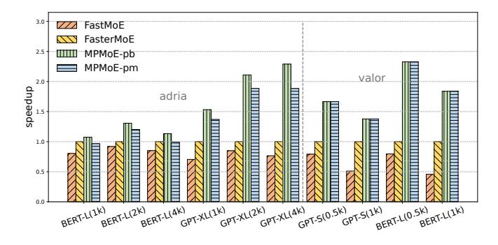
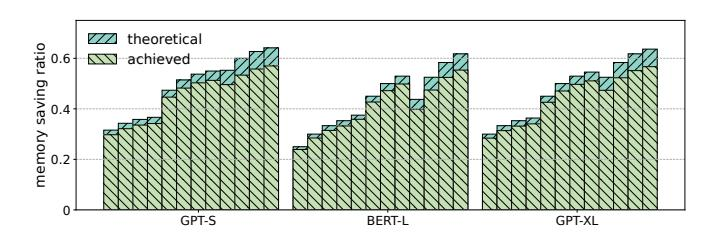
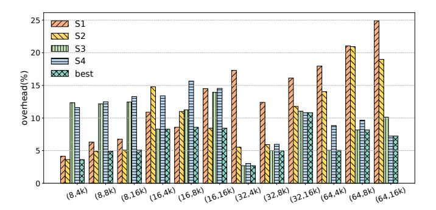
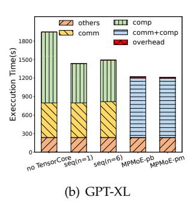

# TABLE 3 Specifications of MoE layers

| Model Name | $d_{model}$ | $d_{hidden}$ | #experts |
|------------|-------------|--------------|----------|
| MoE-GPT-S  | 768         | 3072         | 64/16    |
| MoE-GPT-XL | 2048        | 8192         | 64/16    |
| MoE-BERT-L | 1024        | 4096         | 64/16    |

## **5 EVALUATION**

## 5.1 Experimental Setup

**Software platform:** We implement our approach using PyTorch 1.9, CUDA Toolkit 11.1, NCCL 2.7, and Ubuntu 18.04.

Regarding to **hardware platform**, We evaluate MP-MoE on two representative clusters as follows.

Adira consists of 8 NVIDIA DGX A100 servers. Each node is equipped with 8 A100 40GB GPUs and 200 Gbps HDR InfiniBand. GPUs are connected by the 3-rd generation NVLink within each machine. We regard Adira as a representative of supercomputers.

Valor is a cluster with 16 GPUs on 4 worker nodes. Each node is equipped with 4 GPUs, and each GPU is NVIDIA Tesla V100 with 16GiB HBM. These nodes are connected by 56Gbps HDR Infiniband, and GPUs are connected by the 2-rd generation NVLink within each machine. Valor cluster represents a common class of hardware widely used in Deep Learning training.

## 5.2 Methodology

**Models and configurations** The significant difference in the MoE layer among various models stems from the size of experts, determined by M and H, as well as the number of tokens denoted as B. In this study, our objective is to validate the effectiveness of the proposed methods on different expert sizes and batch sizes. To achieve this, we configure the expert sizes of the feedforward networks in BERT [5] and GPT-3 [8], as outlined in Table 3. Here,  $d_{model}$  denotes the token embedding dimension, and  $d_{hidden}$  represents the hidden dimension of the FFN layer in the respective models. To conduct our experiments, we create a dummy dataset by generating random tokens as input for the different models. For all experiments, we employ the Adam optimizer [32]. The efficiency of the MPMoE (Mixture Proportion MoE) method is evaluated based on the average training time and the peak memory footprint.

To demonstrate the performance gain and memory efficiency, we compare MPMoE against the state-of-art system *FasterMoE* [21], which implements dynamic shadowing and pipeline parallelism in MoE training. We choose *FastMoE* [36] as another competitor, which utilizes primitive expert parallelism without pipeline parallelism.

We implement two versions of MPMoE: MPMoE-pb and MPMoE-pm, which differ in how to joint optimization for pipelining and memory reuse. The former

Fig. 10. The speedup of different methods in MoE training with the same model setting and the number of tokens B. The format of x-axis is "model\_name(B)".

utilizes a profile-based method, while the latter relies on the performance model as described in Section 4.2 to optimize pipelining and memory reuse in a unified manner.

## 5.3 Overall Speedup

Figure 10 presents the speedup achieved by MPMoE-pb and MPMoE-pm compared to FastMoE and FasterMoE in model training. In comparison to FasterMoE, MPMoEpb and MPMoE-pm achieve an average speedup of  $1.66\times$  and  $1.55\times$ , respectively, across various models and batch sizes. When compared to FastMoE, MPMoEpb and MPMoE-pm achieve an average speedup of  $2.34\times$  and  $2.20\times$ , respectively. The superior performance of FasterMoE over FastMoE can be attributed to the utilization of pipeline parallelism and the overlapping of computation and communication. Notably, MPMoEpb and MPMoE-pm can enhance the speedup up to 2.32× when compared to FasterMoE. This significant improvement is largely due to the efficient communication pattern and the adaptive configuration of pipeline granularity employed by MPMoE-pb and MPMoE-pm.

On the Adira cluster, MPMoE-pm exhibits inferior performance compared to MPMoE-pb. This discrepancy can be attributed to the more obvious network fluctuations on the Adira cluster, which consequently degrade the prediction accuracy of the performance model. Conversely, MPMoE-pm demonstrates comparable performance on the Valor cluster.

## 5.4 Memory Footprint Reduction

MPMoE-pb and MPMoE-pm have the same memory footprint when considering the same setting and the same n. Therefore, we do not differentiate between the two and refer to them both as MPMoE here. Additionally, the memory footprint of these approaches is independent of the cluster being used. Therefore, we do not distinguish between the Adira and Valor clusters in this experiment.

Figure 11 illustrates the overall memory footprint of the approaches. The left y-axis represents the memory footprint normalized to that of PMoE, which is a

Fig. 11. The memory footprint reduction by MPMoE. The y-axis shows the ratio of memory footprint normalized to PMoE.

Fig. 12. The MPMoE achieved memory reduction ratios compared to their theoretical results on three model settings with the varying number of partitions n (2,4,8) and batch sizes.

variant of MPMoE without memory reuse strategies. PMoE serves as the baseline for comparing the memory footprint of MPMoE. As indicated by Equation 6, the memory footprint of MPMoE decreases monotonically with an increasing number of pipeline stages, denoted as n. This trend is verified in Figure 11, where MPMoE achieves an average memory footprint reduction of 23%, 34%, and 38% for n values of 2, 4, and 8, respectively. In comparison to FastMoE and FasterMoE, MPMoE achieves a memory footprint reduction of up to 53%.

In Section 3.3, Equation 6 presents the theoretical upper bound for memory savings achieved by MPMoE. To validate the effectiveness of this analysis, we provide the actual memory-saving ratios achieved in comparison to the theoretical bound. Figure 12 illustrates these results. We conducted experiments on three different models, varying the number of partitions n and the batch size of tokens B to cover a wide range of scenarios. The experiments demonstrate that MPMoE achieves approximately 95% of the theoretical bound in terms of memory savings. It is partially because we do not consider extremely small-size tensors, such as routing data generated by gating networks. Additionally, there may be memory fragments during the memory allocation process, leading to a slight discrepancy between the achieved results and the theoretical predictions.

- (a) Micro-benchmarks on adira-
- (b) Micro-benchmarks on valor.

Fig. 13. Micro-benchmarks for comparing communication efficiency between FasterMoE and MPMoE.

Fig. 14. The effects of pipeline parallelism on various pipeline granularity. The dashed line represents the adaptive granularity selected by the profile-based algorithm. The x-axis represents various B values.

## 5.5 Ablation Studies

## 5.5.1 Communication Efficiency

Figure 13(a) and Figure 13(b) provide a comparison of the communication speed between FasterMoE and MPMoE with different pipeline granularities on the adira and valor clusters, respectively. In this experiment, we focus on measuring the execution time of the "dispatch" and "recovery" phases, as depicted in Figure 1. Faster-MoE exhibits poorer performance due to the launch of multiple point-to-point (p2p) communications across nodes separately. On the contrary, MPMoE employs data splitting across batch dimensions. Although there is an increase in the overhead of kernel launches and a decrease in network efficiency as n (pipeline granularity) increases, MPMoE runs faster and is able to exploit more opportunities for pipelining.

#### 5.5.2 Sensitive Analysis of Pipeline Granularity

For the sake of simplicity, we present the effectiveness of the adaptive pipeline granularity configuration of PMoE, which is independent of the memory reuse strategies.

As discussed in Section 4.1, we propose the hypothesis that the value of n monotonically increases as the batch size B increases. To verify this hypothesis, we evaluate the performance of different pipeline granularities and various batch sizes of tokens on the GPT-XL model. The results are illustrated in Figure 14, confirming that the optimal configuration of n depends on the batch size. Specifically, when the batch size is smaller than 8k, n=2

Fig. 15. The overhead of memory reuse strategies and the effectiveness of the strategy selection method in MP-MoE on Adira. The ticks on the x-axis represent different numbers of GPUs N and the batch size of tokens B in format (N,B).

yields the best performance. For batch sizes ranging from 8k to 22k, n=4 ensures optimal performance. Finally, when the batch size exceeds 22k, the optimal configuration becomes n=8. Furthermore, Figure 14 also demonstrates the sensitivity of pipeline effectiveness to the value of n.

## 5.5.3 Overhead of Memory Reuse Strategies

In terms of execution time, MPMoE performs worse than PMoE because MPMoE achieves memory efficiency with some additional overhead. MPMoE features four memory reuse strategies, i.e., S1, S2, S3, and S4 as defined in Table 2, which resort to re-computation/communication and CPU offloading to restore activation tensors in the backward pass. For overhead analysis of the strategies, we conduct experiments with different numbers of GPUs N and various batch sizes of tokens B on adira. Figure 15 presents the results, from which we can observe that:

- *S*1 and *S*2 perform better when *N* is small, e.g., 8, but worse with a larger *N*, e.g., 64. *S*1 and *S*2 introduce additional memory copy operations while *S*2 introduces additional communication operations. With the increasing number of workers, the cost of communication also increases, which results in worse performance for *S*2 due to the competition on the memory bandwidth between memory copy and communication.
- Both S3 and S4 introduce additional computational costs, which perform worse if the workload is computation-bound, i.e., N=8.
- S4 performs better than S2 if N equals 32 or 64, in which communication is the bottleneck because memory copy over PCIe in S2 slows down communication operations.
- There is not much performance variation with the varying batch sizes, indicating that the batch size is not sensitive to the configuration of strategy.

Based on these observations, we can conclude that there does not exist a single memory reuse strategy that can ensure the best performance in all situations.

Fig. 16. Performance breakdown. An example of training MoELayers of BERT-L and GPT-XL with input batch size equals 32 in 10000 steps on valor cluster.

So MPMoE-pb takes profile executions and MPMoE-pm builds a performance model to decide the optimal strategy.

## 5.6 Performance Breakdown and Overhead Analysis

Compared with native MoE, the overheads of MPMoE come from two aspects: 1) data partition cost when using pipelining, 2) the overheads of profiling for finding optimal granularity dynamically. To analyze the overheads and the profits of our designs, we train BERT-L and GPT-XL in five ways as shown in Figure 16(a) and Figure 16(b): 1) *no TensorCore*, in this approach, the usage of the tensor core is disabled manually and the data is not partitioned. 2) seq(n=1), in this approach, the data is not partitioned, and no overlap here. 3) seq(n=6), where data are split into 6 parts but executed in sequence, 4) MPMoE-pb and 5) MPMoE-pm. We select n=6in the second experiment because the average n of MPMoE-pb is around 6. Apart from computation and communication which have the potential to be pipelined, the execution times of others like gating are unaffected by the training methods, so we ignore others in the following analysis.

As shown in Figure 16, The usage of tensor core(seg(n=1)) reduces the computation time by 58% and 44% and introduces 26% and 23% end-to-end performance improvement compared with no TensorCore on BERT-L and GPT-XL respectively. seq(n=6) introduces 12% and 4% additional time on the two models respectively. The model size of GPT-XL is larger than BERT-L and the operations per micro-batch are still able to saturate the hardware resources, resulting in a lower cost than BERT-L. Compared with seq(n=6), MPMoE-pb reduces 30% and 23% communication and computation time with 3% and 2.6% additional profiling overhead for BERT-L and GPT-XL separately, and MPMoE-pm achieves 27% and 22% reduction with no more than 1% additional overhead. Considering the profiling overhead, MPMoE-pm achieves comparable performance with MPMoE-pb. The ideal performance of MP-MoE is  $max\{comm, comp\}$  of seq(n=6). Both MPMoE-pb

Fig. 17. Comparasions of Multi-Node scaling performance on Adira, where N represents the number of nodes and the y-axis shows the throughput normalized to that of N=1. The number annotated above each bar is the percentage of actual scaling relative to ideal scaling.

and *mPMoE-pm* achieve 70% of the maximum theoretical performance. Because we introduce memory copy operations for memory footprint efficiency, the discrepancy in the theoretical performance is reasonable.

## 5.7 Scalability Analysis

As shown in Figure 17, we conduct a scalability analysis of MPMoE on Adira with different numbers of nodes. Each bar denotes the average results across different workloads in Table 3 and batch sizes ranging from 32 to 128. We measured the throughput improvement when running on multiple nodes compared to a single node in Fig. 17. The ideal scaling performance of N nodes is *N* times the single-node throughput. However, network communication overhead inevitably reduces the practical scaling factor. The experiments demonstrate that MPMoE increases throughput by 5.76× (72% of the ideal scaling) when scaling up to 8 nodes, while Faster-MoE only achieves  $5.4\times$ . This highlights the superior scalability of our approach compared to FasterMoE's. With slightly more profiling overhead, MPMoE-pb outperforms MPMoE-pm since the profile-based algorithm can find the optimal pipeline configuration as network bandwidth changes with N. Compared to FastMoE and FasterMoE, our methods consistently perform better, demonstrating MPMoE's stronger adaptability to varying cluster sizes.

## 6 RELATED WORK

#### Mixture-of-Experts (MoE).

Several techniques have been proposed to improve the training efficiency of MoE models. Gating Dropout [19] allows tokens to ignore the gating network and keeps the input at the local machines, reducing crossmachine communication. Different from MPMoE, Gating Dropout alters the routing strategy of MoE models, which can affect model accuracy. DeepSpeed MoE [20] proposes the hierarchical All-to-All and implements custom CUDA kernels to scale expert parallelism out

to many devices as the latency increases linearly with the increase in devices. However, DeepSpeed MoE still uses synchronous communication and does not take pipelines to hide communication latency. Z-code multilingual Multitask MoE model [26] proposes the Zero [25] Redundancy Optimizer to reduce memory footprint. Compared with Zero [25], we reduce not only the memory footprint of model states but also that of activations. In parallel with our work, [22] accelerates DNN training using SPMD parallelism and overlap communication and computation of two micro-batches. Unlike our approach, SPMD uses a fixed pipeline granularity that cannot adapt to various workloads and running environments. Lita [37] accelerates MoE training by computation-communication overlapping and experts packing to reduce the All-to-All transfer size. Smart-MoE [38] concentrates on hybrid parallelism and automating the parallelization process. Compared with Lita and FasterMoE, MPMoE not only improves communication efficiency but also reduces memory footprint to alleviate device memory requirements. FasterMoE [21] designs a congestion-avoiding expert selection strategy that relieves network congestion to achieve lower training latency.

**Data, Model, Pipeline, and Expert Parallelism**. Parallelization is a key strategy for training large models at scale. For a model that fits in the device memory for training, data parallelism (DP) [39]–[41] is used to scale training out to multiple devices. In DP, model parameters are replicated on each device. At each step, mini-batch data is divided evenly across all the data parallel processes, such that each process executes the forward pass and backward pass on a different subset of data samples, and uses averaged gradients across processes to update the model locally. To support training giant models, model parallelism (MP) [42] and pipeline parallelism (PP) [42], [43], Pipedream [34] splits the model among processes in either vertical or horizontal ways. Expert parallelism [14] is another form of model parallelism targeting expert parameters of MoE models. In expert parallelism, different experts are placed on different devices and executed in parallel. When experts reside on different GPU devices, explicit communication using the All-to-All primitive is required.

**Approaches for Memory Footprint Reduction**. In addition to parallelism-based approaches, multiple lines of work target reducing memory overheads of DL training. [27] proposes an algorithm to checkpoint memory by only storing the activations of a subset of layers, rather than those of each layer as usual. The activations that are discarded are recomputed when necessary during the backward pass. [28], [44] exploits the heterogeneous nature of modern hardware by offloading model states to CPU memory through algorithmic design and virtualized memory. Reducing the mini-batch size is effective at reducing the memory footprint during training. However, it adversely affects the runtime of the training process because smaller mini-batch size leads to underutilized GPU [45].

## **7 CONCLUSION**

MoE is a promising technology for improving model quality by scaling the neural network to an extra scale. In this paper, we consider the high performance and memory efficiency of MoE model training in a holistic manner. First, we design a pipeline parallelism method for reducing communication latency by overlapping with the computation operations. Second, we analyze the memory footprint breakdown of MoE training and propose efficient memory reuse strategies to reduce memory requirements by eliminating memory redundancies. Toward this end, we design a profile-based algorithm and a performance model for optimizing pipeline and memory reuse jointly. We implement and integrate these features into MPMoE and perform extensive evaluations. The results show that MPMoE achieves 2.3× speedup and reduces memory footprint by more than 30% compared to FasterMoE.

## **ACKNOWLEDGMENT**

This work was supported by the National Key Research and Development Program of China (2023YFE0205700), National Natural Science Foundation of China (62302348, 62341410), Fundamental Research Funds for the Central Universities (2042023kf0132), General Program of Hubei Provincial Natural Science Foundation of China (2023AFB831), the Young Teachers' Subsidy Project (2042023kf0132), Special Fund of Hubei Luojia Laboratory (220100016) and the Science and Technology Development Fund (FDCT) Macau SAR (File no. 0078/2023/AMJ).

## **REFERENCES**

- [1] W. Xiao, S. Ren, Y. Li, Y. Zhang, P. Hou, Z. Li, Y. Feng, W. Lin, and Y. Jia, "Antman: Dynamic scaling on gpu clusters for deep learning," in *Proc. of USENIX OSDI*, 2020, pp. 533–548.
- [2] D. Cheng, X. Zhou, Z. Ding, Y. Wang, and M. Ji, "Heterogeneity aware workload management in distributed sustainable datacenters," *IEEE Transactions on Parallel and Distributed Systems*, vol. 30, no. 2, pp. 375–387, 2018.
- [3] X. Jia, L. Jiang, A. Wang, W. Xiao, Z. Shi, J. Zhang, X. Li, L. Chen, Y. Li, Z. Zheng *et al.*, "Whale: Efficient giant model training over heterogeneous gpus," in *USENIX Annual Technical Conference*, 2022, pp. 673–688.
- [4] S. Wang, O. J. Gonzalez, X. Zhou, T. Williams, B. D. Friedman, M. Havemann, and T. Woo, "An efficient and non-intrusive gpu scheduling framework for deep learning training systems," in *Proc. IEEE/ACM SC*, 2020.
- [5] J. D. M.-W. C. Kenton and L. K. Toutanova, "Bert: Pre-training of deep bidirectional transformers for language understanding," in *Proceedings of NAACL-HLT*, 2019, pp. 4171–4186.
- [6] C. Raffel, N. Shazeer, A. Roberts, K. Lee, S. Narang, M. Matena, Y. Zhou, W. Li, P. J. Liu *et al.*, "Exploring the limits of transfer learning with a unified text-to-text transformer." *J. Mach. Learn. Res.*, vol. 21, no. 140, pp. 1–67, 2020.
- [7] Y. Liu, M. Ott, N. Goyal, J. Du, M. Joshi, D. Chen, O. Levy, M. Lewis, L. Zettlemoyer, and V. Stoyanov, "Roberta: A robustly optimized bert pretraining approach," *arXiv preprint arXiv:1907.11692*, 2019.

- [8] T. Brown, B. Mann, N. Ryder, M. Subbiah, J. D. Kaplan, P. Dhariwal, A. Neelakantan, P. Shyam, G. Sastry, A. Askell *et al.*, "Language models are few-shot learners," *Advances in neural information processing systems*, vol. 33, pp. 1877–1901, 2020.
- [9] Z. Zhang, L. Ding, D. Cheng, X. Liu, M. Zhang, and D. Tao, "Bliss: Robust sequence-to-sequence learning via self-supervised input representation," *arXiv preprint arXiv:2204.07837*, 2022.
- [10] Q. Zhong, L. Ding, J. Liu, B. Du, and D. Tao, "E2s2: Encodingenhanced sequence-to-sequence pretraining for language understanding and generation," *arXiv preprint arXiv:2205.14912*, 2022.
- [11] Q. Zhong, L. Ding, Y. Zhan, Y. Qiao, Y. Wen, L. Shen, J. Liu, B. Yu, B. Du, Y. Chen *et al.*, "Toward efficient language model pretraining and downstream adaptation via self-evolution: A case study on superglue," *arXiv preprint arXiv:2212.01853*, 2022.
- [12] N. Shazeer, A. Mirhoseini, K. Maziarz, A. Davis, Q. Le, G. Hinton, and J. Dean, "Outrageously large neural networks: The sparselygated mixture-of-experts layer," *arXiv preprint arXiv:1701.06538*, 2017.
- [13] D. Lepikhin, H. Lee, Y. Xu, D. Chen, O. Firat, Y. Huang, M. Krikun, N. Shazeer, and Z. Chen, "Gshard: Scaling giant models with conditional computation and automatic sharding," *arXiv preprint arXiv:2006.16668*, 2020.
- [14] W. Fedus, B. Zoph, and N. Shazeer, "Switch transformers: Scaling to trillion parameter models with simple and efficient sparsity," 2021.
- [15] M. Lewis, S. Bhosale, T. Dettmers, N. Goyal, and L. Zettlemoyer, "Base layers: Simplifying training of large, sparse models," in *Proc. of ICML*. PMLR, 2021, pp. 6265–6274.
- [16] K. S. Khorassani, C.-H. Chu, Q. G. Anthony, H. Subramoni, and D. K. Panda, "Adaptive and hierarchical large message all-to-all communication algorithms for large-scale dense gpu systems," in *2021 IEEE/ACM 21st International Symposium on Cluster, Cloud and Internet Computing (CCGrid)*. IEEE, 2021, pp. 113–122.
- [17] Q. Kang, R. Ross, R. Latham, S. Lee, A. Agrawal, A. Choudhary, and W.-k. Liao, "Improving all-to-many personalized communication in two-phase i/o," in *SC20: International Conference for High Performance Computing, Networking, Storage and Analysis*. IEEE, 2020, pp. 1–13.
- [18] K. Fan, T. Gilray, V. Pascucci, X. Huang, K. Micinski, and S. Kumar, "Optimizing the bruck algorithm for non-uniform all-to-all communication," in *Proceedings of the 31st International Symposium on High-Performance Parallel and Distributed Computing*, 2022, pp. 172–184.
- [19] R. Liu, Y. J. Kim, A. Muzio, and H. Hassan, "Gating dropout: Communication-efficient regularization for sparsely activated transformers," in *Proc. of ICML*. PMLR, 2022, pp. 13 782–13 792.
- [20] S. Rajbhandari, C. Li, Z. Yao, M. Zhang, R. Y. Aminabadi, A. A. Awan, J. Rasley, and Y. He, "Deepspeed-moe: Advancing mixtureof-experts inference and training to power next-generation AI scale," in *Proc. of ICML*, vol. 162, 2022, pp. 18 332–18 346.
- [21] J. He, J. Zhai, T. Antunes, H. Wang, F. Luo, S. Shi, and Q. Li, "Fastermoe: modeling and optimizing training of large-scale dynamic pre-trained models," in *Proc. of ACM PPoPP*, 2022, pp. 120– 134.
- [22] S. Zhang, L. Diao, C. Wu, S. Wang, and W. Lin, "Accelerating large-scale distributed neural network training with spmd parallelism," in *Proceedings of the 13th Symposium on Cloud Computing*, 2022, pp. 403–418.
- [23] S. Wang, A. Pi, and X. Zhou, "Scalable distributed dl training: Batching communication and computation," in *Proceedings of the AAAI Conference on Artificial Intelligence*, 2019.
- [24] NVIDIA, "Optimized primitives for collective multi-gpu communication," https://github.com/NVIDIA/nccl.
- [25] S. Rajbhandari, J. Rasley, O. Ruwase, and Y. He, "Zero: Memory optimizations toward training trillion parameter models," in *Proc. of IEEE/ACM SC*, 2020, pp. 1–16.
- [26] Y. J. Kim, A. A. Awan, A. Muzio, A. F. C. Salinas, L. Lu, A. Hendy, S. Rajbhandari, Y. He, and H. H. Awadalla, "Scalable and efficient moe training for multitask multilingual models," *arXiv preprint arXiv:2109.10465*, 2021.
- [27] T. Chen, B. Xu, C. Zhang, and C. Guestrin, "Training deep nets with sublinear memory cost," *arXiv preprint arXiv:1604.06174*, 2016.
- [28] M. Rhu, N. Gimelshein, J. Clemons, A. Zulfiqar, and S. W. Keckler, "vdnn: Virtualized deep neural networks for scalable, memoryefficient neural network design," in *Proc. of IEEE MICRO*, 2016, pp. 1–13.

- [29] E. Choukse, M. B. Sullivan, M. O'Connor, M. Erez, J. Pool, D. Nellans, and S. W. Keckler, "Buddy compression: Enabling larger memory for deep learning and hpc workloads on gpus," in *Proc. of ACM/IEEE ISCA*, 2020, pp. 926–939.
- [30] Z. Zhang, D. Yang, Y. Xia, L. Ding, D. Tao, X. Zhou, and D. Cheng, "Mpipemoe: Memory efficient moe for pre-trained models with adaptive pipeline parallelism," in *2023 IEEE International Parallel and Distributed Processing Symposium (IPDPS)*. IEEE, 2023, pp. 167–177.
- [31] S. Smith, M. Patwary, B. Norick, P. LeGresley, S. Rajbhandari, J. Casper, Z. Liu, S. Prabhumoye, G. Zerveas, V. Korthikanti *et al.*, "Using deepspeed and megatron to train megatron-turing nlg 530b, a large-scale generative language model," *arXiv preprint arXiv:2201.11990*, 2022.
- [32] D. P. Kingma and J. Ba, "Adam: A method for stochastic optimization," in *Proc. of ICLR*, 2015.
- [33] Y. Huang, Y. Cheng, A. Bapna, O. Firat, D. Chen, M. Chen, H. Lee, J. Ngiam, Q. V. Le, Y. Wu *et al.*, "Gpipe: Efficient training of giant neural networks using pipeline parallelism," *Advances in neural information processing systems*, vol. 32, 2019.
- [34] A. Harlap, D. Narayanan, A. Phanishayee, V. Seshadri, N. Devanur, G. Ganger, and P. Gibbons, "Pipedream: Fast and efficient pipeline parallel dnn training," *arXiv preprint arXiv:1806.03377*, 2018.
- [35] C. Hwang, W. Cui, Y. Xiong, Z. Yang, Z. Liu, H. Hu, Z. Wang, R. Salas, J. Jose, P. Ram *et al.*, "Tutel: Adaptive mixture-of-experts at scale," *arXiv preprint arXiv:2206.03382*, 2022.
- [36] J. He, J. Qiu, A. Zeng, Z. Yang, J. Zhai, and J. Tang, "Fastmoe: A fast mixture-of-expert training system," *arXiv preprint arXiv:2103.13262*, 2021.
- [37] J. Li, Y. Jiang, Y. Zhu, C. Wang, and H. Xu, "Lita: Accelerating distributed training of sparsely activated models," *arXiv preprint arXiv:2210.17223*, 2022.
- [38] M. Zhai, J. He, Z. Ma, Z. Zong, R. Zhang, and J. Zhai, "{SmartMoE}: Efficiently training {Sparsely-Activated} models through combining offline and online parallelization," in *2023 USENIX Annual Technical Conference (USENIX ATC 23)*, 2023, pp. 961–975.
- [39] D. Yang, W. Rang, and D. Cheng, "Mitigating stragglers in the decentralized training on heterogeneous clusters," in *Proceedings of the 21st International Middleware Conference*, 2020, pp. 386–399.
- [40] A. Sergeev and M. Del Balso, "Horovod: fast and easy distributed deep learning in tensorflow," *arXiv preprint arXiv:1802.05799*, 2018.
- [41] J. Dean, G. Corrado, R. Monga, K. Chen, M. Devin, M. Mao, M. Ranzato, A. Senior, P. Tucker, K. Yang *et al.*, "Large scale distributed deep networks," *Advances in neural information processing systems*, vol. 25, 2012.
- [42] N. Shazeer, Y. Cheng, N. Parmar, D. Tran, A. Vaswani, P. Koanantakool, P. Hawkins, H. Lee, M. Hong, C. Young *et al.*, "Meshtensorflow: Deep learning for supercomputers," *Advances in neural information processing systems*, vol. 31, 2018.
- [43] Y. Xia, Z. Zhang, H. Wang, D. Yang, X. Zhou, and D. Cheng, "Redundancy-free high-performance dynamic gnn training with hierarchical pipeline parallelism," in *Proceedings of the 32nd International Symposium on High-Performance Parallel and Distributed Computing*, 2023, pp. 17–30.
- [44] B. Pudipeddi, M. Mesmakhosroshahi, J. Xi, and S. Bharadwaj, "Training large neural networks with constant memory using a new execution algorithm," *arXiv preprint arXiv:2002.05645*, 2020.
- [45] P. Goyal, P. Dollar, R. Girshick, P. Noordhuis, L. Wesolowski, ´ A. Kyrola, A. Tulloch, Y. Jia, and K. He, "Accurate, large minibatch sgd: Training imagenet in 1 hour," *arXiv preprint arXiv:1706.02677*, 2017.

**Zheng Zhang** (zzhang3031@whu.edu.cn) received his B.S degree in Computer Science from School of Computer Science, Wuhan University in 2017. He is currently pursuing his Ph.D in Computer Science at Wuhan University. His research interests are distributed deep learning model training and deployment, DNN network optimization.

**Xiaobo Zhou** (waynexzhou@um.edu.mo) obtained the BS, MS, and PhD degrees in Computer Science from Nanjing University, in 1994, 1997, and 2000, respectively. Currently he is a Distinguished Professor of IOTSC and Department of Computer and Information Sciences, University of Macau. His research lies in Distributed Systems and Cloud Computing. He serves as the Chair of IEEE Technical Community in Distributed Processing. He is a senior member of the IEEE.

**Yaqi Xia** (yaqixia@whu.edu.cn) received his BS and MS degrees in Electrical Engineering from the Xidian University in 2018 and 2021, respectively. He is currently pursuing his Ph.D. in Computer Science at Wuhan University. His research interests are distributed deep learning model training and deployment, and graph neural network (GNN) optimization.

**Dazhao Cheng** (dcheng@whu.edu.cn) received his B.S and M.S degrees in Electrical Engineering from the Hefei University of Technology in 2006 and the University of Science and Technology of China in 2009. He received his Ph.D from the University of Colorado at Colorado Springs in 2016. He was an AP at the University of North Carolina at Charlotte in 2016-2020. He is currently a professor in the School of Computer Science at Wuhan University. His research interests include big data and cloud computing.

**Hulin Wang** (wonghulin@whu.edu.cn) received his B.S degree in Computer Science from School of Computer Science, Wuhan University in 2017. He is currently pursuing his Ph.D in Computer Science at Wuhan University. His research interests are GPU kernel optimization and inference of DNN models.

**Donglin Yang** (dongliny@nvidia.com) received his B.S. degree in Electrical Engineering from Sun Yat-sen University and his Ph.D. in the Computer Science Department at the University of North Carolina at Charlotte in 2022. He is currently a Deep Learning Software Engineer at NVIDIA, working on TensorFlow Core/XLA.

**Chuang Hu** (handc@whu.edu.cn) received his B.S and M.S. degrees in Computer Science from Wuhan University in 2013 and 2016. He received his Ph.D degree from the Hong Kong Polytechnic University in 2019. He is currently an Associate Researcher in the School of Computer Science at Wuhan University. His research interests include edge learning, federated learning/analytics, and distributed computing.