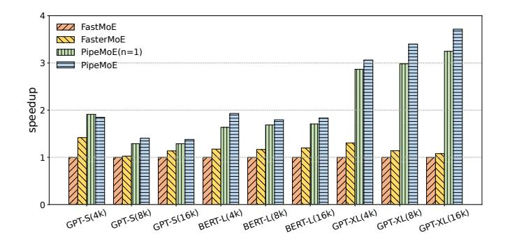

# C. Overall Speedup

Figure 8 shows the speedup of PipeMoE against FastMoE and FasterMoE in model training. Compared with FasterMoE, PipeMoE achieves an average speedup of 2.26× on various models and batch sizes. Compared with FastMoE, PipeMoE

Fig. 8. The speedup of different methods in MoE training with the same model setting and batch size of tokens B. The format of x-axis is "model name(B)".

Fig. 9. The memory footprint reduction by MPipeMoE. The bars and the left y-axis show the ratio of memory footprint compared to FastMoE. The polyline and the right y-axis show the speedup of MPipeMoE compared to FastMoE and FasterMoE, respectively.

achieves up to  $3.7\times$  speedup. FasterMoE outperforms Fast-MoE because of pipeline parallelism and overlapping of computation and communication. PipeMoE can improve the speedup up to  $3.4\times$  against FasterMoE, largely because of the optimization of the pipeline granularity. PipeMoE also takes advantage of Tensor Core of GPUs to accelerate computation.

To validate the effectiveness of pipeline parallelism, we compare PipeMoE against PipeMoE(n=1). In PipeMoE(n=1), the communication and computation are executed in sequence. From the result, we can see that the implementation of pipeline brings benefits to various models with different batch sizes of tokens. The only exception is GPT-S with batch size B = 4k, which is not a computation-intensive workload. The result indicates that the pipeline cannot benefit the training process that is not compute-bound because the additional kernel launch overhead leads to lower GPU utilization.

#### D. Memory Footprint Reduction

Figure 9 presents the overall memory footprint of the approaches, where the left y-axis represents the memory footprint normalized to that of FastMoE. The result shows that MPipeMoE reduces the memory footprint by an average of 23% and up to 40% compared to FastMoE while still can achieve 3.1× speedup in terms of training time. FasterMoE

Fig. 10. The MPipeMoE achieved memory reduction ratios compared to their theoretical results on three model settings with the varying number of partitions n (2,4,8) and batch sizes (ranging from 4k to 32k).

Fig. 11. Overall performance breakdown of MPipeMoE on GPT-XL model.

requires more memory than FastMoE because of the dynamic shadowing and smart scheduling. As a result, MPipeMoE achieves an average memory reduction of 27% and up to 47% compared with FasterMoE. Meanwhile, MpipeMoE achieves a speedup up to  $2.8\times$  in terms of the training time.

In Section III-D, Equation 6 provides the theoretical bound of memory saving of MPipeMoE. To demonstrate the effectiveness of the analysis, we report the actually achieved memory saving ratio with the bound, which is depicted in Figure 10. We conduct experiments on three models. We configure the number of partitions n and the batch size of tokens B to different values to validate a wide range of cases. MPipeMoE achieves about 95% of the theoretical bound. Note that tensors with small sizes such as routing data produced by gating networks are not considered.

