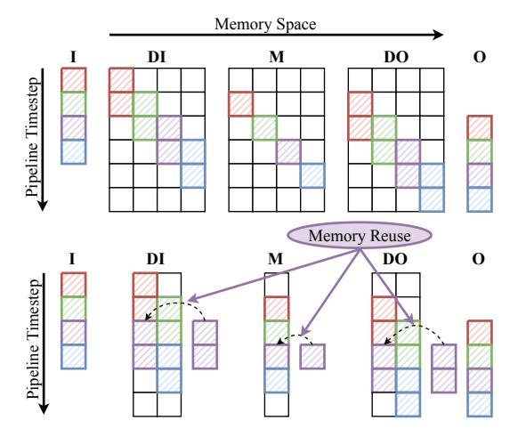

# D. Memory Reusing

Fig. 6. The illustration of memory reusing. The top figure demonstrates "memory bubbles" in pipeline parallelism and the bottom one shows the compressed memory by memory reusing.

Tensors  $T_{DI}$ ,  $T_M$ , and  $T_{DO}$  are split into n partitions in pipeline parallelism. Different partitions of tensors are activated at different times, resulting in "memory bubbles" as shown at the top of Figure 6. The same operation on different partitions is pipelined into a single stream and executed in sequence. We demonstrate that the input or output tensors of these operations can be shared among partitions to reduce memory redundancy. For example, the i-th partition of tensor  $T_M$  is activated for computation at time t and the (i+1)-th partition is activated at time t+1. Thus we just can allocate one buffer memory to store partitions of  $T_M$  in turn. In this way, the required memory is reduced from m to  $\frac{m}{n}$ , where m is the original memory requirement. Similarly for  $T_{DI}$  and  $T_{DO}$ , it requires two buffers for communication and computation as shown at the bottom case of Figure 6.

The memory reusing method is applicable for temporary buffers. The peak memory requirement of temporary buffers equals that of activations in pipeline parallelism, thus we can obtain  $\mathcal{M}_{buf}^{pipe}$  in Equation 4. With memory reusing, the corresponding reduced memory  $\Delta \mathcal{M}_{buf}$  equals  $\Delta \mathcal{M}_{act}$ , which is presented in Equation 5. Finally, we can obtain the memory saving ratio  $\phi$  as formulated in Equation 6.

$$\mathcal{M}_{buf}^{pipe} = \mathcal{M}_{act}^{pipe} = 4 * B * M + B * H \tag{4}$$

$$\Delta \mathcal{M}_{buf} = \Delta \mathcal{M}_{act} = B * (2M * \frac{n-2}{n} + H * \frac{n-1}{n})$$
(5)
$$\phi = \frac{\Delta \mathcal{M}_{act} + \Delta \mathcal{M}_{buf}}{\mathcal{M}_{ms} + \mathcal{M}_{act}^{pipe} + \mathcal{M}_{buf}^{pipe}}$$
(6)

$$\phi = \frac{\Delta \mathcal{M}_{act} + \Delta \mathcal{M}_{buf}}{\mathcal{M}_{ms} + \mathcal{M}_{act}^{pipe} + \mathcal{M}_{buf}^{pipe}}$$
(6)

After eliminating memory redundancy, tensors  $T_{DI}$ ,  $T_M$  are overridden by other partitions. However, these tensors are required for computing the gradients in the backward pass. To restore tensors  $T_{DI}$ ,  $T_M$ , we consider two methods as follows.

Fig. 7. The timeline of pipeline parallelism and memory reusing. H, Drepresent the host-to-device and device-to-host memory copies, respectively.

- Data offloading. Leveraging the fact that modern GPUs support overlapping computations and data transfers, we can swap data back to the CPU while computing. In the backward pass, data can be prefetched to the GPU memory in advance.
- Communication and Re-computation. Tensor  $T_{DI}$  can be transferred again from tensor  $T_I$ . And  $T_M$  can be recomputed from  $T_{DI}$ . Ideally, the additional cost of recomputation can be mitigated if communication is the bottleneck and vice versa.

As a result, we have four memory reusing strategies, i.e., S1, S2, S3, and S4 for MoE training, which are illustrated in Figure 7(b)-7(e). These strategies distinguish in adopting different methods to restore  $T_{DI}$  and  $T_{M}$  in the backward pass. Because there is no dependency among operations of different partitions, we schedule S and R in Figure 4(b) to be executed in an alternative manner for the better locality of memory accesses. Compared with the timeline of the pipeline without a memory reusing strategy as shown in Figure 7(a), S1, S2, and S3 require another CUDA stream to perform memory copy operations in parallel with computation and communication. Specifically, device-to-host and host-to-device memory copy

TABLE II DIFFERENT STRATEGIES FOR MEMORY REUSING

| strategy                     | $T_{DI}$                             | $T_M$                                        | $\mu$                                                         | $\eta$                                 | $\mathcal{Q}_{fw},\mathcal{Q}_{bw}$                                                         |
|------------------------------|--------------------------------------|----------------------------------------------|---------------------------------------------------------------|----------------------------------------|---------------------------------------------------------------------------------------------|
| none S1 S2 S3 S4 | offload comm. offload comm. | offload offload recompute recompute | $\mu_{comp}$ $\mu_{all}$ $\mu_{all}$ $\mu_{all}$ $\mu_{comp}$ | $\eta_{all}$ $\eta_{all}$ $\eta_{all}$ | [2,2,0],[4,2,0] [2,2,5],[4,2,5] [2,2,4],[4,3,4] [2,2,1],[5,2,1] [2,2,0],[5,3,0] |

operations are involved in the forward pass and the backward pass, respectively. In S2 and S4, additional communication operations are introduced to restore  $T_{DI}$  in the backward pass. Additional computation operations are also required to restore  $T_M$  in S3 and S4.

#### E. Performance Model on Memory Reusing Strategies

In Section II-C, we validate the feasibility of pipeline parallelism and denote the speed of computation, communication, and memory copy as  $\sigma_x W_{comp}$ ,  $\mu_x W_{comm}$ , and  $\eta_x W_{mem}$ , in which x refers to the interference stream. For simplicity, we define  $v_0 = [v_{0,comp}, v_{0,comm}, v_{0,mem}]$  as the amount of different type of operations in Equations 7 to 9, where H, M are defined in Table I. Specifically,  $v_{0,comp}$  and  $v_{0,comm}$  are the amount of floating-point operations and All-to-All collective data volumes in MoE, respectively.  $v_{0,mem}$  represents the amount of data volumes produced by moving tensor  $T_{DI}$  between the device and host. Because H = 4\*M in most MoE models, copying tensor  $T_M$  requires four times more data than that of  $v_{0,mem}$ .

To quantify the workload on three streams, we define  $\mathcal{Q}=[q_1,q_2,q_3]$  to represent the actual amount of relative operations. For instance, if not performing any memory reusing strategy, i.e.,  $\mathcal{Q}_{fw}=[2,2,0]$ , there exists two GeMM operations and two All-to-All operations in the forward pass. And similarly, we can obtain  $\mathcal{Q}_{fw}$  and  $\mathcal{Q}_{bw}$  of four memory reusing strategies in Table II.

$$v_{0,comp} = b * H * M \tag{7}$$

$$v_{0,comm} = b * M \tag{8}$$

$$v_{0,mem} = b * M (9)$$

The execution time of a specific stream equals the total amount of operations divided by the processing speed. For instance, the computation time is  $\frac{q_1 v_{0,comp}}{\sigma W_{comp}}$ . Because different CUDA streams execute different tasks in parallel, the execution time of the end-to-end pipeline is determined by the slowest stream. We formulate the overall execution time  $\mathcal{Q}$  in Equation 10, which is determined by  $\mathcal{Q}$ ,  $\mu$ , and  $\eta$ . Because the floating-point operations per second are stable as stated in Section II-C,  $\alpha$  and  $\beta$  are nearly constant.

$$C = max(\frac{q_1v_{0,comp}}{\sigma W_{comp}}, \frac{q_2v_{0,comm}}{\mu W_{comm}}, \frac{q_3v_{0,mem}}{\mu W_{mem}})$$

$$\approx \frac{1}{W_{comp}} max(q_1, q_2\alpha/\mu, q_3\beta/\eta)$$

$$= \frac{1}{W_{comp}} max(\mathcal{Q} \cdot [1, 1/\mu, 1/\eta] \cdot [1, \alpha, \beta])$$
(10)

in which 
$$\alpha = \frac{W_{comp}}{W_{comm}}, \quad \beta = \frac{W_{comp}}{W_{mem}}$$

Table II summarizes the characteristics of four strategies, i.e.,  $\mu$ ,  $\eta$ ,  $\mathcal{Q}_{fw}$ , and  $\mathcal{Q}_{bw}$ . We obtain the cost  $\mathcal{C}$  for all strategies based on Equation 10, from which the one with the lowest cost is chosen as the optimal memory reusing strategy. Generally, strategies S1 and S2 introduce more memory copy operations, which tend to be I/O bound. In contrast, strategies S3 and S4 tend to be compute-bound.

#### IV. IMPLEMENTATION

MPipeMoE is an end-to-end MoE training library implemented on top of torch 1.9.0 with CUDA 11.1 1. A few key components and functionalities are implemented as follows.

#### A. Gating network and Experts

The gating network routes tokens to experts based on top-k algorithm. In this paper, we set k to 1. Increasing k is an equivalence of increasing k in the perspective of system performance. We implement a feed-forward network as the default expert, which is applicable for most transformer models.

