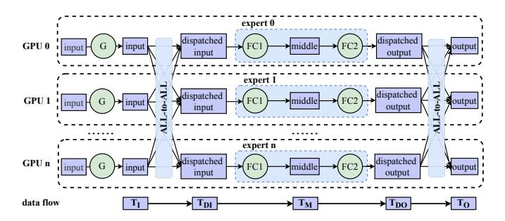
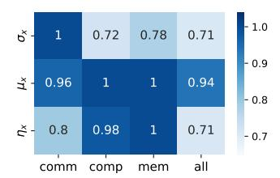
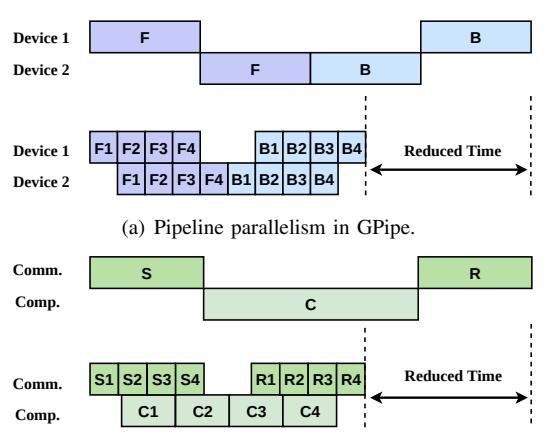
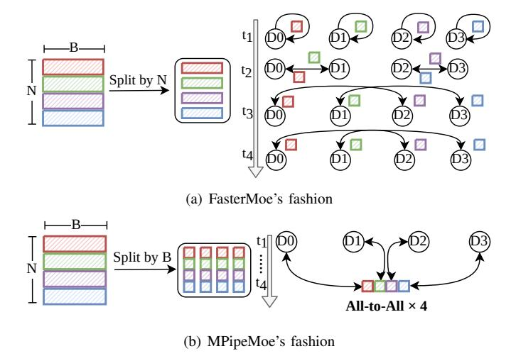

# I. INTRODUCTION

Scaling up the model size of neural networks is one of the promising ways to improving model accuracy in a wide range of applications [1]–[6]. For example, in natural language processing (NLP), large pre-trained language models [7]–[10] have been shown effective in many domains such as language understanding [9], sequence generating [11], [12] and crosslingual downstream transfer [13], [14]. Recently, Mixture-of-Experts (MoE) has been adopted to scale neural networks to an extreme size without introducing a proportional increase in computational cost [15]–[18]. The MoE architecture consists of many sub-models called *experts*. It employs a trainable gating network to intelligently forward the input token to specific experts. The sparse combination of experts makes it practical to save much computation capacity and improve model accuracy compared to dense models with the same computation resources. There are popular MoE-based models in recent years such as Google's Switch Transformer [17] and Meta's BASE Layer [19].

For training a MoE model, different experts are distributed across a large number of GPU servers. The training process requires All-to-All communication primitive operations to dispatch tokens to the desired experts and collect them after processing. This procedure is called expert parallelism [17], which is shown in Figure 1. In a distributed fashion, the main performance bottleneck comes from the communication phase. It is reported in literature [20] that a variant of MoE without All-to-All can achieve a relative improvement of communication cost for more than 90% in extreme cases. Besides, when scaling up model at extra-scale, the limited size of GPU DRAM has been a major challenge for researchers to explore deeper and wider neural networks.

Training a giant MoE model at the trillion scale requires tremendous hardware resources. For example, training a model consisting of 600 billion parameters in GShard [16] takes up to 96 hours on a cluster equipped with 2,048 TPUs. There are system and algorithm optimizations that tackle the intrinsic inefficiency of All-to-All synchronous communication in MoE [16], [20]–[22]. For example, the work [20] proposed a gating dropout algorithm to reduce the traffic of communication. Recently, FasterMoE [22] adopts pipeline parallelism to alleviate the overhead of communication with expert shadowing. It can achieve significant speedup upon the existing systems in training large MoE models. However, the granularity of pipelining is pre-defined and it is fixed throughout the training. In practice, the dynamic nature of communication demands for adaptive pipeline parallelism, because coarse-grained pipelining is sub-optimal in taking advantage of parallelism while very fine-grained pipelining incurs significant overhead because of frequent kernel launches and GPU under-utilization. Furthermore, the existing approaches ignore memory efficiency in MoE training, which is however key to scaling up the model to extra-scale.

In this paper, we propose to address the inefficiency of communication and memory usage of MoE training in a holistic manner. First, to alleviate the overhead of communication, we analyze the system behaviors of communication and computation for the MoE architecture and design adaptive pipeline parallelism for MoE [23], which partitions a batch of tokens into several micro-batches and overlaps the execution of computation and communication. Different from Faster-MoE [22], we partition tokens in a more effective manner and propose an adaptive configuration algorithm to search for the optimal pipeline granularity.

Furthermore, we examine the memory footprint of MoE training, which mainly comes from three components: i) model states of experts, which include parameters, optimizer states and gradients; ii) activations, which need to be stored/stashed in the forward pass so that they can be used later in the backward pass; iii) temporary buffers, which store the gradients of activations during the backward pass that are discarded as soon as they are used. Among the three components, activations are the primary contributor to the memory footprint when the batch size is increased. As shown in Figure 1, expert parallelism [17] is designed to scale up the model size by distributing experts across devices evenly. Similarly to Zero Redundancy Optimizer [24], [25], it partitions parameters, optimizer states, and gradients of the model across devices, alleviating the memory footprint of model states in MoE. However, the memory footprints of activations and temporary buffers have the potential for further reduction.

We propose to reduce the memory footprint of activations and temporary buffers by sharing the same buffer for different partitions of tensors. Specifically, the memory of tensors  $T_{DI}, T_M, T_{DO}$  can be vastly reduced from m to  $\frac{m}{n}$ , in which m refers to the memory requirement and n is the number of partitions that determines the granularity of pipelining. But a new challenge is introduced, as activations are overwritten when different partitions request the same memory address. To deal with this problem, we resort to recomputation/communication [26] and CPU offloading [27], [28] for recovering activations in the backward pass. When the re-computation is enabled, the cost of computation can be overlapped with that of the communication, and vice versa. In addition, leveraging that modern GPUs support overlapping computations and data transfers over PCIe, we can offload data to the CPU in the forward pass and prefetch the data into GPUs accordingly. Specifically,  $T_{DI}$  can be obtained by either communication or CPU offloading while  $T_M$  can be obtained by either re-computation or CPU offloading. We establish a performance model to configure the ideal strategy at runtime.

In summary, we make the following contributions.

We design adaptive pipeline parallelism for MoE by partitioning a batch of tokens into several micro-batches and overlapping the execution of computation and communi-

Fig. 1. The illustration of expert parallelism of MoE and its data flow. The green circles represent sub-modules of the MoE layer, and the purple rectangles represent activation tensors of MoE training. For simplicity, We take  $T_I, T_{DI}, T_M, T_{DO}, T_O$  at the bottom of the figure as abbreviations of input, dispatched input, middle, dispatched output, output tensors, which are in purple color.

- cation to improve the utilization of GPUs and network bandwidth. We present an online search algorithm to configure the optimal pipeline granularity.
- We analyze the memory footprint breakdown of MoE and find that activations and temporary buffers are the primary contributors to the memory footprint. With the pipeline parallelism, we propose to reduce the memory footprint of activations and temporary buffers by sharing the same memory buffer for different partitions.
- We tackle the problem that activations are overwritten when different partitions request the same memory space.
   We leverage re-computation/re-communication and CPU offloading for recovering activations in the backward pass based on performance modeling.
- We implement and integrate the proposed techniques into a library for MoE training, namely MPipeMoE. Experimental results show that MPipeMoE can achieve up to 47% memory footprint reduction and 2.8× speedup over the state-of-the-art system FasterMoE.

The rest of this paper is organized as follows. Section II gives background and motivations for distributed training of MoE models. Sections III and IV describe the system design and implementation of MPipeMoE, respectively. Section V presents the experimental setup and evaluation results. Section VI reviews related works. Section VII concludes the paper.

#### II. BACKGROUND AND MOTIVATION

#### A. Mixture of Experts (MoE)

The transformer architecture was introduced to the NLP community due to its superior performance in sequence-to-sequence tasks, such as neural machine translation. A transformer model consists of a few blocks, each of which is formed by the self-attention, cross-attention, and Feed-Forward-Network (FFN) modules. Ever since, transformer-based models become the top performers in various NLP tasks, such as BERT [7], RoBERTa [8], and GPT-3 [10]. Scaling up the model size results in a significant increase in computational cost for both training and inference. For example, it takes 168 days to train a GPT-3 model with 178 billion parameters using 256 NVIDIA A100 GPUs [29].

TABLE I
NOTATIONS USED IN MEMORY USAGE FORMULATION.

| Notation | Definition               | Notation | Definition                  |
|----------|--------------------------|----------|-----------------------------|
| M        | model dimension          | B        | the batch size of tokens    |
| H        | hidden dimension         | E        | the total number of experts |
| n        | the number of partitions | N        | the number of nodes         |

MoE provides an efficient solution to reducing the cost of training extra-scale models, which incurs only sub-linear compute costs concerning the model size by sparsely activating a subset of the model parameters for given inputs. For example, the cost of training the Switch Transformer [17] with 1.6 trillion parameters are indeed less than the computation budget required to train a dense model with 10 billion parameters. The core component of these MoE models [15], [17], [25] is the MoE layer, which replaces the FFN sub-layer in the original dense transformers.

**Expert Parallelism for MoE**. To train a giant MoE model, expert parallelism [17] is widely applied to reduce the memory footprint by distributing different experts across devices. As shown in Figure 1, a gating network determines the destination device of each token, which is followed by All-to-All communication. After the dispatch All-to-All, each device executes the local expert, which is an FFN layer consisting of two linear layers and one activation function. Then, the second All-to-All communication is conducted to send the processed tokens back to the devices to which these tokens belong.

Inefficient Synchronous Communication. Each expert requires All-to-All communication to send/receive tokens to/from other devices. The communication phase becomes one of the most time-consuming factors in training MoE models [20], [22]. The All-to-All and expert process procedures are synchronous operations, which are blocked for waiting for the desired data.

#### B. Memory Footprint of MoE

1) Where did all the memory go: We first analyze the full spectrum of the memory footprint, including model states, activations, and temporary buffers.

**Model States**. Model states are one of the main contributors to memory consumption during training, which includes parameters, gradients, and optimizer states [24].

**Activations.** Activations are the intermediate tensors in forward computing, accounting for a significant amount of memory usage [26], especially for the large batch size.

**Temporary Buffers**. Temporary buffers are used to store intermediate results for a very short period, which are not required for future computation, i.e., the backward pass.

2) Formulation of Memory Footprint of MoE: To analyze the memory footprint of MoE, we demonstrate the detailed dataflow of the communication and expert computation, which is shown in Figure 1. Starting with the input tensor  $T_I$ , the All-to-All stage slices and dispatches the tensor across devices, which is referred to as  $T_{DI}$ . Every expert takes  $T_{DI}$  as the input and outputs tensors  $T_M$  and  $T_{DO}$  after two linear layers,

Fig. 2. Breakdown of memory footprint ratio within model states, activations, and temporary buffers. The experiments are conducted on three different MoE layers with various batch sizes of tokens ranging from 256 to 16k with exponential factor 2.

i.e., FFNs, in sequence. The activation function is omitted since in-place operations can be applied here. Finally, tensor  $T_O$  is obtained by the collective operations on slices of  $T_{DO}$ .

The memory footprint of model states, activation, and temporary buffers are denoted as  $\mathcal{M}_{ms}$ ,  $\mathcal{M}_{act}$ , and  $\mathcal{M}_{buf}$ , respectively. We summarize other notations in Table I. The structure of an MoE layer consists of a gating network and an expert. As formulated in Equation (1), E\*M equals the number of parameters in the gating network and 2\*H\*M equals that of an expert. Besides, Adam [30] is chosen as the default optimizer, requiring an additional memory footprint for momentum and variance. As a result, it takes 4 times the memory of parameters for storing model states, including parameters, gradients, momentum, and variance.

The memory footprint of activations is summarized in Equation 2, where the shape of tensors  $T_I, T_{Di}, T_{Do}, T_O$  is (B, M) and the shape of tensor  $T_M$  is (B, H). For simplicity, we do not consider small tensors such as the routing data of the gating network, because their sizes are one to two orders of magnitude smaller than other activation tensors.

In the backward pass, the GPU device is required to allocate temporary buffers to store the gradients of activations which will be discarded as soon as they are used. When operations are executed in sequence, only two adjacent tensors are required to be cached in the device. The formulation of memory footprint is presented in Equation 3, which is the peak requirement of temporary buffers.

$$\mathcal{M}_{ms} = 4 * (E * M + 2 * H * M) \tag{1}$$

$$\mathcal{M}_{act} = 4 * B * M + B * H \tag{2}$$

$$\mathcal{M}_{buf} = B * M + B * H \tag{3}$$

To visualize the memory consumption of the three discussed data types, we plot the ratio of memory footprint in different MoE settings, which are shown in Figure 2. It can be seen that activations and temporary buffers account for the major portions of the memory footprint with the increasing number of tokens. We also monitor the GPU utilization for the experiment. We observe that a small batch size leads to GPU under-utilization, especially for the MoE layer in GPT-S. As a

Fig. 3. The interference between different operations. The values in the grid represent the relative speed influenced by operations *GeMM computation*, *communication* and *memory copy*.

result, it is necessary to increase the batch size for higher GPU utilization. Based on the above observations, we motivate the need to reduce the memory footprint of activation tensors and temporary buffers to train the model with the large batch size.

#### C. Feasibility of Parallelism

The speed of the communication, computation, and memory copy is denoted as  $W_{comp}$ ,  $W_{comm}$ , and  $W_{mem}$ , respectively. Ideally, three types of operations do not affect each other when they are being executed in parallel because they request individual hardware resources in principle. However, in a real environment, there exists resource competition when executing multiple operations in parallel CUDA streams. For example, the communication and memory copy race for memory bandwidth. Performance slowdown incurs if running multiple NVIDIA Collective Communication Library (NCCL) kernels concurrently with computation kernels on the same device. To quantify the degree of slowdown, we define the actual speed of communication, computation, and memory copy as  $\mu_x W_{comp}$ ,  $\sigma_x W_{comm}$ , and  $\eta_x W_{mem}$ , in which  $\mu_x$ ,  $\sigma_x$ , and  $\eta_x$ represent their corresponding slowdown factors, respectively. The interference stream, i.e., x, can be any type of streams such as comm, comp, and mem. Specifically, all is regarded as the case that all three types of CUDA streams are executed in parallel. The values of  $\mu$ ,  $\sigma$ , and  $\eta$  indicate the feasibility of parallelism. For example, to take the advantage of overlapping between communication and computation,  $\mu_{comm}$  and  $\sigma_{comp}$ are required to be greater than 0.5, otherwise the execution time of communication or computation would exceed the original end-to-end time, leading to deterioration of the endto-end performance.

To better understand the interference between operations, we run a micro benchmark in our cluster and measure the actual speed of communication, computation, and memory copy in different situations. Results are demonstrated in Figure 3, from which we can learn that:

- Slowdown is introduced in communication if we execute computation with communication in parallel. However, it is feasible to overlap communication and computation as we can make sure that μcomm, σcomp are larger than 0.5.
- Computation is slightly influenced by other operations, which is negligible in terms of end-to-end performance. As a result, we set  $\sigma=1$  by default in this paper.

 There exists a performance slowdown when communication and memory copy streams are executed in parallel, which is because of bandwidth competition.

The observations and analysis above motivate us to design adaptive pipeline parallelism with memory efficiency.

#### III. SYSTEM DESIGN

#### A. Overview

We present the system design of MPipeMoE. First, we design adaptive pipeline parallelism and design an online pipeline granularity configuration algorithm to determine the optimal granularity for accelerating MoE training. Then, we propose the memory reusing component and build a performance model to select the optimal reusing strategy at runtime to reduce the memory footprint.

(b) The proposed pipeline parallelism.

Fig. 4. The illustration of GPipe and micro-batch pipeline parallelism in MPipeMoE. (a) F and B represent forward pass and backward, respectively. (b) S, C, and R represent the first All-to-All, computation of experts, and the second All-to-All. The serial number of every block represents the index of the micro-batch partition.

#### B. Micro-batch Pipelining

As stated previously, the All-to-All operation is the performance bottleneck to scaling out the training of MoE models. Pipeline parallelism, which is firstly introduced in GPipe [31], can reduce the overhead of communication by overlapping the computation and communication. As is shown in Figure 4(a), layers of the model are partitioned into multiple stages, which are mapped to separate devices for performing computation. To deal with the severe under-utilization caused by the sequential dependency of the neural network, GPipe divides the input mini-batch into smaller micro-batches, allowing different accelerators to work on different micro-batches simultaneously. Inspired by GPipe, the micro-batch parallelism can also be applied to the MoE layers to achieve end-toend speedup. Note that pipeline is not a new idea, enabling adaptive pipelining for MoE requires online scheduling and the insight of computation separation because of the complex dependencies. The unique contribution of this paper lies in tackling these specific challenges in a holistic manner.

Fig. 5. Comparison between FasterMoE and our methods.

Micro-batch pipelining for MoE. As shown at the top of Figure 4(b), only one mini-batch is active for computation or communication in the traditional expert parallelism. In this setup, computation and communication are 'idle' most time. With this in mind, we split a mini-batch of tokens into several micro batches and pipeline their execution one after the other as shown at the bottom of Figure 4(b). Upon completing the first All-to-All for a micro-batch, experts asynchronously execute calculation while simultaneously starting to receive another mini-batch. Then, the second All-to-All operation starts as soon as the calculation is finished. Furthermore, there is no dependency among operations of different partitions. Thus, we schedule S and R to be executed in the alternative as shown in Figure 7(a) for the better locality of memory accesses. The workflow "communication  $\rightarrow$  computation  $\rightarrow$ communication" is symmetric in the backward pass.

Comparison with FasterMoE in Pipeline Parallelism. FasterMoE [22] also adopts pipeline parallelism to improve the efficiency of MoE training. Different from FasterMoE, we apply a distinguishing method to split the batch data and propose a new optimization solution for communication. As shown in Figure 5, the shape of tensor  $T_I$  is (N, B), the first dimension is the number of devices while the second is the batch size of tokens. Each row of the tensor is assigned to the device, which is indicated in a different color in the figure. There exist two methods for splitting  $T_I$  into multiple partitions. The first method splits  $T_I$  along the first dimension. The All-to-All operation is partitioned into several point-topoint communications among workers for each partition as shown in Figure 5(a). The second method splits  $T_I$  along the second dimension as shown in Figure 5(b). The original All-to-All is split into a few fine-grained ones, each for one partition. FasterMoE adopts the former method, which has two disadvantages. First, the All-to-All communication is broken down into multiple point-to-point communications, making it infeasible to take advantage of optimizations offered by NCCL. Second, in the phase of communication, if the network bandwidth is heterogeneous among workers, the synchronization procedure causes a waste of resources for those workers with higher bandwidth. As a result, MPipeMoE adopts the latter method for better performance.

