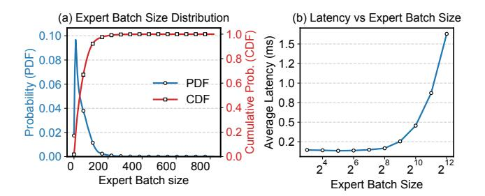

# A.2 Case study II: decoupled deployment mode

AW failure: Fig. 3 (b) shows the failure of a single AW. Upon failure, only the failed AW is restarted and reinitialized. Because the KV cache and frontier state for its requests are lost, the restarted AW must re-run the prefill and decode from the beginning (along with the corresponding EW computation) until it reaches the *same frontier* (layer  $\ell$  of the *i*-th token) as the rest of the pipeline. Meanwhile, EWs must wait at the layer-wise synchronization barrier, stalling the entire inference pipeline until the failed AW catches up. Thus, despite preserving healthy workers, recovery still incurs long stalls and extensive recomputation, closely mirroring the monolithic case. The healthy workers remain running and merely wait at the synchronization barrier, without doing the recomputation.

*EW failure:* An EW failure behaves differently but still introduces an inference stall, as depicted in Fig. 3(c). Since EWs are stateless, an EW failure does not result in discarding previously computed KV caches or decoding progress preserved on the AWs. Thus, the failed EW needs to be restarted. Once the replacement EW is ready, it can recompute the expert output only at the current frontier  $\ell$ . However, the AW that routed tokens to the failed EW must wait at the current *frontier* (layer  $\ell$ ) until the replacement EW is back online. As a result, decoding still experiences a user-visible stall, despite minimal recomputation.

### **B** Expert Batch Size

Sparse expert activation also has a subtle but important side effect: it fragments tokens across many experts and leads to small per-expert batches. In our measurements on Qwen3-MoE, even when the *total* token batch size is 821, the vast

majority of per-expert batches contain fewer than 200 tokens (Fig. 13 (a)). However, on an NVIDIA A100, expert kernels only reach their throughput "knee point" at batch sizes of roughly 256~512 tokens (*i.e.*, an exponential growth of latency in Fig. 13 (b)), so most expert invocations run far below the GPU's efficient operating regime. When attention layers and experts are co-located on the same GPUs, the memory-bound attention computation further constrains batch size, compounding underutilization (also observed in [45]).

Figure 13: (a) Run total batch size of 821 and collect the expert batch size distribution of Qwen3-MoE [39] across different layers. (b) The single expert computation latency of Qwen3-MoE [39] on 8 x Nvidia A100 with different expert batch sizes.

## C Checkpointing Overhead Analysis

Checkpoint overhead is dominated by the size of each incremental KV cache segment, which is:

$$C = 2 \times H_{\text{kv}} \times \frac{N_{\text{hidden\_size}}}{H_{\text{attn}}} \times S_{\text{elem}}$$

where  $N_{\text{hidden\_size}}$  is the hidden size and  $S_{elem}$  is the number of bytes per tensor element.  $H_{\text{kv}}$  and  $H_{\text{attn}}$  are the numbers of KV heads and attention heads, respectively.

In memory-efficient attention mechanisms such as multi-query attention (MQA) and grouped-query attention (GQA) [6, 33],  $H_{kv} \ll H_{attn}$ , substantially reducing checkpointing traffic. By contrast, the per-token, per-layer communication volume between the AW and EW is:

$$V = 2 \times \text{Top}_k \times N_{\text{hidden size}} \times S_{\text{elem}}$$

which is significantly larger (Topk is the number of expert chosen per layer). For example, in Mixtral-8x7B [20], incremental KV cache traffic is only  $\sim$ 12.5% of expert traffic.

