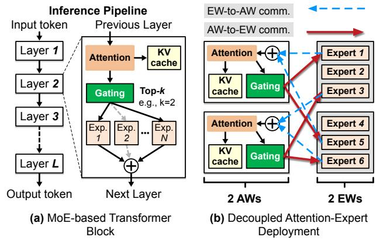
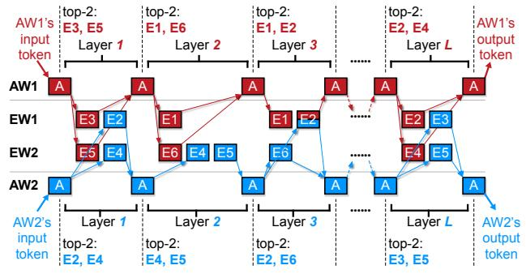
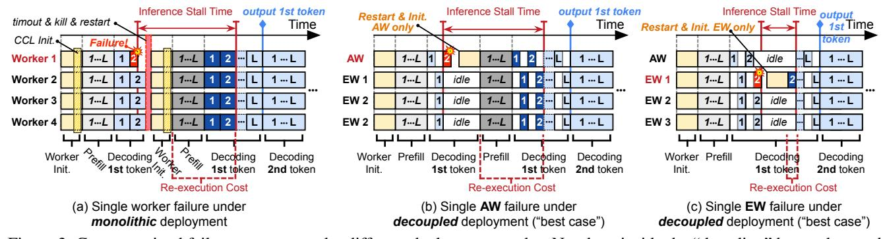
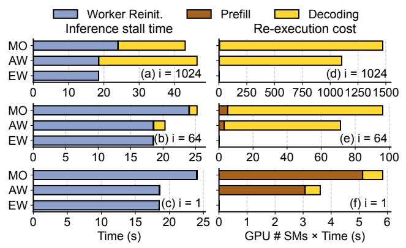
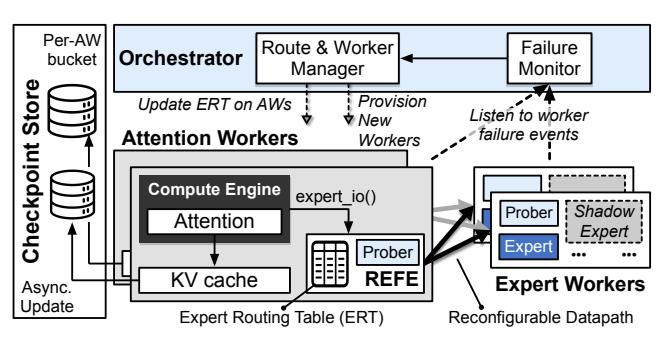
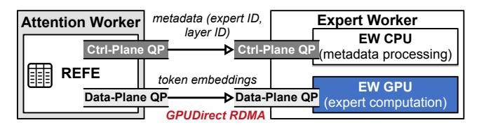

# Alternative: Decoupled attention and expert computation.

A key observation is that MoE inference inherently decomposes the forward pass into two distinct computational roles. *Attention* modules maintain a per-request key-value (KV) cache (initialized during the prefill phase) and append to it

1We will open-source TARRAGON.

over time as decoding generates new tokens; In contrast, *expert* modules implement FFN layers whose execution is stateless and depends only on incoming token embeddings and expert weights (this holds in both prefill and decoding phases). This structural asymmetry suggests a natural way to define finer-grained failure domains: attention-side computation is stateful and benefits from careful checkpointing, while expertside computation is stateless and can be replayed or migrated.

Modern MoE serving systems increasingly decouple attention and expert computation across different workers, rather than running a full transformer stack on each worker. This improves scalability and GPU utilization, as seen in systems such as MegaScale-Infer's Disaggregated Expert Parallelism (DEP) [\[45\]](#page-14-3), DeepServe [\[16\]](#page-12-2), and others with a similar decoupled architecture [\[36,](#page-14-4)[42\]](#page-14-5). We refer to this pattern as *decoupled attention-expert deployment*, with Attention Workers (AWs) hosting attention modules and Expert Workers (EWs) hosting experts. However, despite this structural decoupling, these systems still rely on *tightly synchronized* execution between AWs and EWs. While this synchronous, batched execution achieves high GPU efficiency, it also *globally exacerbates the impact of failures* by stalling the entire inference pipeline.

Our Approach: TARRAGON. Building on these observations, we present TARRAGON, a resilient MoE inference framework that achieves stall-free, fine-grained failure recovery with minimal performance overhead. Rather than treating the entire inference job as a single failure domain, TARRAGON fully exploits the decoupled attention-expert deployment paradigm and separates AWs and EWs into distinct failure domains. The core objective of TARRAGON is: *When a failure occurs,* TARRAGON *confines its impact to the corresponding domain instead of restarting the entire job, allowing the rest of the inference pipeline to keep making forward progress without disruption.*

At a high level, TARRAGON makes two complementary design choices to serve its core objective. First, TARRAGON realizes distinct failure domains through a reconfigurable datapath between AWs and EWs. This datapath is implemented by a Reconfigurable Forwarding Engine (REFE) that mediates all AW-EW communication with an Expert Routing Table (ERT) that dynamically binds each *expert identity* (*i.e.,* the logical expert selected by the gating network) to *expert location* (*i.e.,* the physical EW/GPU hosting that expert). In many existing systems, this binding is static—each logical expert is permanently tied to a specific EW. As a result, when that EW fails, the exper itself becomes unavailable, forcing a pipeline-wide restart. In contrast, TARRAGON eliminates fixed bindings: AWs issue requests only in terms of logical expert IDs; REFE consults the ERT to resolve where each expert currently resides and routes the requests accordingly.

Second, to achieve non-disruptive failover, TARRAGON introduces a self-healing mechanism combined with new worker provisioning in parallel. Both mechanisms critically rely on having a failure domain at the granularity of an individual worker. Upon an AW or EW failure, self-healing keeps the pipeline running by reacting locally within each domain: quickly moving affected requests off failed workers onto healthy ones, so that the inference pipeline does not pause waiting for global recovery. In parallel, the TAR-RAGON's control plane provisions replacement AWs/EWs and integrates them into the ongoing inference pipeline, restoring lost capacity.

Furthermore, to minimize the cost of recovery, TARRAGON tailors its failure resilience strategy to the different roles of AWs and EWs across the prefill and decoding phases. Because EWs are stateless in both phases (as discussed above), EW failures can be handled purely via replay on healthy EWs, accelerated by "shadow experts" that occupy available GPU memory but consume no compute resources. This design simplifies recovery to just reusing GPU-resident expert weights, avoiding costly reloads from storage.

For AWs, however, the cost of failure is phase-dependent. During prefill, recovery requires recomputing the KV cache from the prompt, which incurs extra work but does not disrupt an ongoing interaction. During decoding, by contrast, rebuilding the KV cache by replaying the full token history would introduce prohibitive latency. As we show in [§2.2,](#page-3-0) prefill failures are relatively cheap, while decoding-time failures dominate recovery cost and are therefore our main optimization focus. To avoid this decoding phase penalty, TARRAGON performs *asynchronous, incremental* KV cache checkpointing and per-request restoration. TARRAGON also exploits short idle gaps on the AW-EW datapath to avoid interfering with normal traffic. This enables TARRAGON to resume decoding from the latest emitted token after an AW failure while keeping checkpoint bandwidth and compute overhead modest.

#### Contributions. This paper makes the following contributions:

- We analyze why existing MoE inference systems are brittle under failures ([§2.2\)](#page-3-0), showing how synchronous dependencies between AWs and EWs cause a single worker failure to stall the entire inference pipeline.
- End-to-end, TARRAGON's self-healing combined with new worker provisioning reduces failure-induced stalls from ∼64 s in a MegaScale-like baseline to 0.4 s for AW failures and 0.3 s for EW failures (160–213× improvement; [§7.2\)](#page-9-0).
- Under no failures, TARRAGON closely matches MegaScale-Infer in throughput and token-level latency (within 2.8%; [§7.3\)](#page-9-1); under failures, it achieves the above stall reductions without sacrificing steady-state performance.
- The asynchronous, incremental KV cache checkpointing has negligible overhead (< 3%) in the AW-EW datapath. The per-request restoration is able to reduce AW recovery latency by up to 1800×, recovery traffic by up to 8×, and eliminates any GPU recomputation that would be needed if we were to rebuild the entire KV cache.

Figure 1: (a) MoE-based transformer layer and LLM inference pipeline: example shows top-2 experts selected; (b) decoupled attention-expert deployment.

### 2 Background and Motivation

#### 2.1 Basics of MoE Inference

Transformers form the foundation of modern LLMs, comprising multiple self-attention and feed-forward network (FFN) layers stacked to improve compositional generalization and language modeling performance [31]. In conventional (dense) transformers, every token is processed by all FFNs in each transformer block. This dense activation causes both computation and memory costs to scale linearly with model size, making large models expensive to serve [14].

To address this limitation, recent LLMs adopt MoE-based models, which replace the dense FFN layer with a sparse MoE layer [4, 12, 30, 38, 39]. As shown in Fig. 1(a), an MoE layer consists of multiple FFNs (called *experts*) and a *gating network* that selects only the top-*k* experts for each token, typically with a small expert-selection ratio.2 Each selected expert processes the token independently, and the resulting expert outputs are aggregated via a weighted sum using the gating weights before being passed to the next layer.

By activating a small subset of experts per token, MoE models increase total parameter capacity without proportionally increasing per-token compute cost, making them attractive for *inference* workloads [10,24,45]. In this work, we focus exclusively on MoE-based LLM *inference*; training-specific concerns are beyond the scope of this paper.

**Prefill versus decoding.** Inference naturally decomposes into two phases. During the *prefill* phase, the model consumes an input prompt (often hundreds or thousands of tokens) and builds the internal context state (KV cache). Prefill leverages substantial parallelism because tokens in the input sequence are all independent inputs [5]. During the *decoding* phase, the model generates output tokens sequentially, one token at a time. Each new token depends on all previously generated tokens, forcing decoding to proceed in a strictly sequential

manner at single-token granularity [5]. Despite their distinct execution characteristics, both phases traverse the same stack of transformer layers.

**Stateful attention versus stateless expert.** Transformers exhibit a fundamental asymmetry in how state is managed across attention and expert components. On the attention side, the model maintains a per-request KV cache that stores the key and value projections for all previously processed tokens. This cache is initialized during prefill and incrementally extended during decoding as new tokens are generated. As a result, attention computation is *stateful*: its execution depends on a growing context that persists across layers and across time.

In contrast, experts are stateless FFNs with fixed weights and no per-request persistent state. Given a batch of token embeddings, an expert's output depends only on its input activations and its static parameters. This stateless property holds in both prefill and decoding: expert computation is a pure function that can always be reproduced by replaying the same inputs.

**Deployment patterns for MoE inference.** Early MoE serving systems often adopted a *monolithic* deployment model, where a single worker process (typically bound to one or more GPUs) hosts an entire transformer stack, including both attention and expert modules [23, 44]. Workers communicate via collectives (*e.g.*, NCCL's all-to-all [2]). While simple to implement, this design scales poorly in terms of memory efficiency and GPU utilization [45].

To address these issues, recent production systems [36,45] have shifted to *decoupled attention-expert deployment*, in which attention and expert modules are placed on separate sets of workers (Fig. 1(b)). We refer to these as Attention Workers (AWs) and Expert Workers (EWs). This separation enables independent scaling of AWs and EWs, allowing expert traffic from many AWs to be consolidated onto fewer EWs to improve batching efficiency and GPU utilization.

In practice, AWs are typically scaled out using data parallelism [21,36], with each AW serving a disjoint subset of requests, while EWs form an expert-parallel group that partitions expert FFNs across GPUs. Because AW-EW traffic follows an asymmetric many-to-many pattern rather than a

Figure 2: Example of layer-wise synchronized MoE inference. Here we show two data-parallel AWs, and two EWs, each hosting three expert FFNs (E1-E6), the same as Fig. 1(b).

&lt;sup>2For instance, only 8 of 256 experts are activated in DeepSeek-v3 [26], and 8 of 128 in Qwen3-MoE [39].

Figure 3: Coarse-grained failure recovery under different deployment modes. Numbers inside the "decoding" boxes denote the transformer layer currently being executed. For the decoupled deployment, we analyze a "best-case" recovery scenario, where a single worker failure (AW or EW) results only in the failed worker restarting. However, some existing decoupled systems still restart all workers on failure, thus effectively degenerating to the monolithic case.

fixed symmetric collective, standard CCLs such as NCCL's all-to-all are a poor fit [21, 36]. Recent systems therefore employ custom AW-EW data planes (*e.g.*, MegaScale-Infer's M2N) to support flexible expert routing and elastic scaling [21, 36].

#### 2.2 Anatomy of Coarse-Grained Failures

To motivate the need for fine-grained, failure-resilient MoE inference, we first explain how layer-wise synchronization governs MoE execution, then analyze failure propagation under two representative deployment modes, and finally quantify the resulting recovery overheads.

#### 2.2.1 Layer-wise synchronized execution

As described in §2.1, MoE inference advances layer by layer under a strict synchronization barrier between attention and expert computation. In decoupled deployments, this execution is distributed across AWs and EWs, as illustrated in Fig. 2.

Two important properties follow: (1) For each layer  $\ell$ , every data-parallel AW independently processes its own request, selects a subset of experts, sends token embeddings to the corresponding EWs, and waits until all selected experts return their outputs (a synchronization barrier) before advancing to layer  $\ell+1$ . We refer to the current layer index  $\ell$  of an AW as its frontier; (2) On the EW side, GPUs execute expert FFNs in layer-wise batches: an EW aggregates requests for the same layer  $\ell$  and expert, and executes them as a single large batch, and only then advances to the next layer. This layer-wise batching effectively ties EW progress to the same frontier as the AWs and is crucial for GPU efficiency [45]; naively executing each request immediately upon arrival destroys batching opportunities and severely underutilizes GPUs [45].

This layer-wise synchronization pattern holds across both prefill and decoding, and across both monolithic and decoupled deployments. Further, this layer-wise barrier is not tied to a particular parallelization scheme. Even under tensor or pipeline parallelism, each data-parallel AW group behaves as a logical "mega-AW" with the same layer-wise barrier.

#### 2.2.2 Case studies and quantifying recovery overheads

We now examine how a single worker's failure propagates under two representative MoE deployment modes discussed above.

We consider a failure during *decoding* an *L*-layer MoE model, while generating the *i*-th output token and executing layer  $\ell$  ( $1 \le \ell \le L$ ). This setting captures the worst impact on user-perceived latency, since the request has already gone through prefill and is in the middle of token generation.

Fig. 3(a)–(c) shows how a single worker failure escalates into a coarse-grained disruption. 3 In all three cases, a single worker failure effectively induces a service-wide stall and the recovery incurs two fundamental penalties (highlighted in Fig. 3): (1) *Inference stall time* ( $T_{\text{stall}}$ ), the duration during which the pipeline cannot generate new tokens for the affected request; (2) *Re-execution cost* (G), the amount of wasted GPU time/cycles required to recompute lost work. We now build a cost model to understand, *for a fixed model and deployment configuration*, how the *failure point* (captured by the decoded-token index i and the frontier layer  $\ell$ ) affects recovery cost. For clarity, we assume that workers are perfectly load-balanced and have comparable per-layer performance (thus, we ignore stragglers to keep the model simple).

**Inference stall time.** Let  $T_w$  be the average time to (re)initialize a worker, including process (or container) startup, CUDA context initialization, loading weights, and communication stack initialization [15, 28]. Let  $t_{\text{pre}}$  and  $t_{\text{dec}}$  be the average execution time of one prefill layer and one decoding layer for a single token, respectively. As shown in Fig. 3(a) and (b), the recovery procedure for a monolithic worker and for a decoupled AW has the same structure: the failed worker is restarted, then all workers must replay all prefill and decoding layers up to the failure point  $(i, \ell)$ . In the monolithic deployment, a single worker failure also kills all healthy workers, as the collective communicator (CCL) treats the worker set as a static communication group and aborts when any

&lt;sup>3We provide a detailed analysis of Fig. 3(a)–(c) in Appendix A.

worker is lost [\[46\]](#page-14-9).[4](#page-4-0) Ignoring lower-order effects (*e.g.,* warm caches, overlap), the stall time can thus be approximated as:

$$T_{\rm stall}(\ell,i) \approx T_{\rm w} + L \cdot t_{\rm pre} + \left[ (i-1)L + \ell \right] \cdot t_{\rm dec}$$
 (1)

Worker Reinit. Replay  $L$  Replay decoding up to layer  $\ell$  of the  $i$ -th token

For a decoupled EW failure (Fig. [3\(](#page-3-1)c)), prior prefill and decoding work is preserved on the AWs since EWs are stateless. Recovery only requires reinitializing the EW and re-executing the expert layer at the current frontier:

$$T_{\mathrm{stall}}(\ell, i) \approx T_{w} + t_{\underline{\mathrm{dec}}}$$
 (2)

Worker Reinit. Replay decoding at frontier  $\ell$ 

Re-execution cost (GPU computation overhead). We measure GPU overhead in units of *GPU-time*, defined as the product of execution time and the number of GPUs (SMs) performing that recomputation. Let *g*pre and *g*dec denote the average per-worker GPU-time cost of processing one prefill layer and one decoding layer for a single token, respectively. For a monolithic deployment with *M* workers, all workers must replay the lost computation. Again, the decoupled AW failure follows the same replay pattern. The total GPU computation overhead is therefore:

$$G(\ell,i) \approx M \cdot \begin{bmatrix} L \cdot g_{\text{pre}} \\ \text{Replay } L \\ \text{prefill layers} \end{bmatrix} + \underbrace{\left( (i-1)L + \ell \right) \cdot g_{\text{dec}}}_{\text{layer } \ell \text{ of the } i\text{-th token}}$$
 (3)

For a failed EW, only the expert computation at the current frontier must be repeated on a single replacement EW:

$$G(\ell,i) \approx g_{\text{dec}}$$
 (4)

Experimental Setup for Audit. We validate this cost model using measurements from (1) a monolithic vLLM deployment and (2) a decoupled MegaScale-Infer-like deployment (configurations detailed in [§7.1\)](#page-8-0). Both systems serve the Mixtral-8×7B model (32 layers). The number of workers is 16 (8 AWs & 8 EWs for decoupled deployment). For each configuration, we empirically measure *Tw*, *t*pre, *t*dec, *g*pre, and *g*dec (see Table [1\)](#page-4-1). We then sweep the failed decoded-token index *i* to evaluate recovery overhead across different decoding stages.

Fig. [4](#page-4-2) shows the inference stall time and the re-execution cost, which reveals three observations: (1) For the failure of the monolithic worker and decoupled AW, stall time and wasted computation grow rapidly with the decoded-token index *i*: a failure later during decoding forces replay of a long history even when only one worker fails; (2) Decoding-time failures are the dominant concern: even when only 64 tokens

Table 1: Profiled parameters for the overhead analysis.

| Deployment           | Tw     | tpre    | tdec    | gpre  | gdec   |
|----------------------|--------|---------|---------|-------|--------|
| vLLM [23]            | 24 s   | 1.68 ms | 0.58 ms | 0.010 | 0.0028 |
| MegaScale-Infer [45] | 18.5 s | 2.18 ms | 0.85 ms | 0.006 | 0.0022 |

Figure 4: (a–c) Inference stall time and (d–f) re-execution cost under a single worker failure. MO: monolithic worker.

have been decoded, the recovery cost in decoding already exceeds that of a prefill failure with a 128-token prompt by about 19×, highlighting decoding as the primary target for optimization; (3) Although decoupled deployments limit the EW failure to single-layer re-execution, which introduces only a constant-time stall and the GPU overhead, the worker initialization cost *Tw* still remains on the critical path. Thus, EW failures can still introduce user-visible pauses even though the replay expense is small.

#### 2.2.3 Takeaways

This analysis reveals three fundamental problems with the current failure handling in MoE inference:

- *Overly coarse failure domains.* Regardless of deployment modes, a single worker failure effectively enlarges the failure domain to the level of the full inference service, forcing all participating workers to restart or at least wait.
- *User-visible stalls.* Because the worker(s) must be restarted (*Tw*) and redo prefill and decoding before emitting new output tokens, recovery delays propagate directly to interactive users as broken conversational flows.
- *Wasted computation.* Previously computed KV cache and expert outputs are discarded and recomputed from scratch; the longer a request has been decoding when a failure occurs, the more GPU time is wasted.

Our goal in the rest of this paper is to design a MoE inference system that has (D1) *fine-grained worker-granularity failure domains*, (D2) *minimizes failure-induced stalls*, and (D3) *preserves as much useful computation as possible*.

## 3 Overview of TARRAGON

## 3.1 High-level Approach

TARRAGON achieves three major goals by rethinking how failures interact with the decoupled attention-expert deployment.

(D1): Reconfigurable worker-level failure domains. Although decoupled attention-expert deployments naturally suggest worker-granularity failure domains, existing systems fail

4 In practice, this often manifests as a fatal NCCL/MPI error that terminates the job [\[46\]](#page-14-9).

to realize this because placement and AW-EW routing are statically bound: each expert is pinned to a fixed GPU, and routing is baked into the datapath. TARRAGON breaks this static coupling and realizes **D1** with a *reconfigurable* AW-EW datapath (§4). Each AW dispatches requests through a Reconfigurable Forwarding Engine (REFE) that resolves logical expert IDs to physical EWs via an Expert Routing Table (ERT) (§4.2). Upon failure, the orchestrator updates the ERT to redirect traffic to healthy EWs without restarting AWs or pausing the pipeline. Meanwhile, EWs accept traffic from any AW without joining or recreating a collective group.

(D2): Self-healing and background capacity restoration. While reconfigurable routing prevents global restarts, it does not eliminate stalls ( $T_{\text{stall}}(\ell, i)$  quantified in §2.2.2) caused by worker reinitialization and replay. To minimize such stalls, TARRAGON layers self-healing and background capacity restoration on top of its datapath. Self-healing decouples pipeline progress from worker recovery: when a worker (AW or EW) fails, its requests are immediately replayed on healthy alternatives rather than blocking until the failed worker reboots (§5.1, §5.2). For EWs, failover is further accelerated through shadow experts (§5.3), which are pre-loaded into residual GPU memory, so rerouting avoids costly reloads. In parallel, the orchestrator performs background worker reprovisioning (§5.4) to restore lost capacity without interrupting active inference. Together, these two mechanisms tackle the two dominant contributors to stall time identified in §2.2.2 worker restart delay  $T_w$  and long replay paths.

(D3): Efficient recovery for stateful AWs. Our cost analysis (§2.2.2) shows that late AW failures are especially expensive because KV caches must otherwise be rebuilt through replay (see Eq. (1) and (3)), adding stall time and GPU overhead. During this recovery, the attention module appends a small, fixed-size KV cache (denoted "segment" hereafter) for each token. TARRAGON mitigates this by introducing asynchronous, incremental KV cache checkpointing (§6.1) and request-level KV cache restoration (§6.2). AWs continuously stream newly appended KV cache segments to an external checkpoint store without interfering with the inference pipeline. Upon failure, the orchestrator only restores the affected requests' KV caches on healthy AWs, shrinking recovery to "roughly one decoding layer at the current frontier" instead of replaying full prefill and decoding. This dramatically reduces both stall time ( $T_{\text{stall}}$ ) and GPU recomputation (G).

#### 3.2 TARRAGON Architecture

Fig. 5 summarizes TARRAGON's architecture. Every AW has a Compute Engine (built atop vLLM) that hosts attention modules, manages the per-request KV cache, and interacts with EWs through the REFE, which implements the reconfigurable AW-EW datapath using the ERT. A single cluster gateway distributes user requests to the AWs. EWs host active and

Figure 5: Overview of TARRAGON.

shadow experts. A centralized orchestrator monitors worker liveness for failure detection, includes a manager that updates the ERT on failures and joins, and coordinates background provisioning of new AWs and EWs. A checkpoint store receives incremental KV cache updates from AWs and serves request-level state to replacement AWs during recovery.

#### 3.3 Failure Model

TARRAGON adopts a fail-stop failure model focused on hardware and software crashes. We assume workers (AWs and EWs) may fail due to application or OS crashes, node failures, power outages, and other unplanned interruptions. Of particular concern are CPU and GPU failures or errors requiring either a restart or a repair of the node. In practice, MoE serving clusters are GPU-heavy, so GPU device error is the dominant class of failures we target [9,35]. TARRAGON also treats communication link failures as fail-stop events. Modern GPU clusters frequently experience link-level faults, e.g., fabric-level connectivity loss and intra-node PCIe/NVLink disruption [7, 17, 35], which effectively isolate a worker even if its process is still running. In such cases, TARRAGON considers the affected worker unreachable and handles it similarly to a fail-stop crash. Byzantine failures are explicitly out of scope for this paper. Our detection and recovery mechanisms assume components are not malicious and that all the nodes (AW, EW, orchestrator) have a consistent (even if delayed) view of component failures.

#### 4 Datapath for Fine-grained Failure Domains

The reconfigurable datapath in TARRAGON isolates failures at the worker level. As shown in Fig. 6, its key design aspects include the separation of control metadata from high-volume tensor transfers (§4.1), and the REFE that dynamically reroutes requests to healthy EWs upon failure detection (§4.2). TARRAGON currently implements its datapath using RDMA's Reliable Connection (RC), which provides reliable delivery with hardware-assisted timeouts and retransmission.

#### 4.1 Control and Data Planes

AWs and EWs in TARRAGON exchange both data (token embeddings) and small control messages required for fault

management. To avoid interference, TARRAGON allocates two Queue Pairs (QPs) per AW-EW pair: (1) a *control-plane QP* for liveness probes and self-healing metadata for rerouting and replay ([§5.1–](#page-6-1)[§5.2\)](#page-6-2), and (2) a *data-plane QP* dedicated to bulk token embedding transfers. REFE uses the data-plane QP with GPUDirect RDMA to stream tensors directly into GPU memory, bypassing the CPU, for higher performance.

## 4.2 Reconfigurable Forwarding Engine

The Reconfigurable Forwarding Engine (REFE) is an AWside runtime that coordinates point-to-point communication with EWs and orchestrates routing during inference. It exposes a simple API, *expert\_io(expert\_id, layer\_id, token\_embeddings)*, to abstract the underlying RDMA control and data planes. The compute engine invokes the API after completing its attention computation. Internally, REFE runs a non-blocking, event-driven execution loop that takes output tokens, consults the ERT, and dispatches metadata and token embeddings to the selected EWs.

Beyond request dispatching, REFE manages the reception of expert outputs from EWs and performs AW-side liveness probing. Missing or delayed EW responses are detected through these probes, triggering REFE's self-healing logic ([§5.1\)](#page-6-1), which transparently replays requests to healthy EWs.

TARRAGON's routing operates over point-to-point RDMA connections, giving each AW full flexibility to route individual requests to any EW without the reconfiguration of a collective communicator. This communication pattern resembles the M2N communication used in prior MoE systems [\[16,](#page-12-2) [27,](#page-13-7) [36,](#page-14-4) [45\]](#page-14-3).

Expert Routing Table (ERT): TARRAGON decouples expert identity from expert location through the Expert Routing Table (ERT). The ERT maps each expert to one or more candidate EWs—potentially including shadow experts ([§5.3\)](#page-7-0) allowing immediate rerouting when an EW fails or when additional EWs are provisioned with new expert replicas.

This indirection is the foundation of TARRAGON's selfhealing: routing adaptation becomes a localized remapping operation rather than a system-wide recovery. Each AW maintains its own ERT, updated by the orchestrator as the cluster evolves, ensuring that dynamic routing, fault isolation, and reconfiguration all occur with minimal disruption to ongoing inference.

Figure 6: AW-EW datapath in TARRAGON. AWs dispatch requests to EWs through the REFE, which separates metadata and tensor transfers across two RDMA QPs.

## 5 Worker Failure Management

Lightweight Failure Detection. We build a hybrid liveness detection mechanism in TARRAGON: Tokens exchanged between AWs and EWs over their data-plane QPs serve as *implicit* heartbeat signals. If a data-plane connection remains silent for longer than a configured interval, the worker treats this as a potential indication of a failure and issues an *explicit* probe over the control-plane QP to confirm a peer's liveness. This design avoids unnecessary probing under normal load but provides fast detection when failures occur (see additional implementation details in Appendix [E\)](#page-16-0).

## 5.1 How Does AW Tolerate EW Failures?

After an AW dispatches token embeddings to a selected EW, it waits for a response only for a bounded period. If the EW fails to respond within the timeout, REFE probes the loss of liveness and on detecting a failure, immediately reroutes the request to an alternate EW hosting the same expert (either a healthy primary or a shadow expert, [§5.3\)](#page-7-0).

Because expert computation is stateless and deterministic, replaying the same metadata and token embeddings produces identical results. This design allows REFE to mask EW failures immediately—without waiting for the orchestrator to trigger global recovery—while preserving uninterrupted inference execution. Replayed requests are prioritized at the destination EW to prevent recovering AWs from becoming stragglers. With this *AW-side self-healing*, EW failures no longer manifest as global synchronization barriers, as shown in Fig. [3\(](#page-3-1)c): only AWs that were issuing requests to the failed EW perform local rerouting and replay, while other workers continue to make forward progress.

