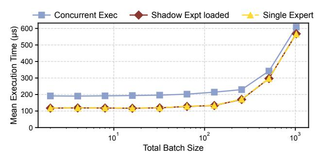

# D Inactive Shadow Experts During Normal Execution

We find that executing two experts concurrently (Concurrent Exec) with two CUDA streams results in significant interference compared with activating only a single expert (Single

Figure 14: Impact of shadow expert on execution latency

Expert), using the same total batch size. As shown in Fig. 14, the computation latency of activating a single expert (Single Expert) is identical to the latency of loading an additional shadow expert, but not activating it (Shadow Expt Loaded). Without failures, the loaded shadow expert consumes GPU memory but does not introduce any computational overhead for the activated expert.

