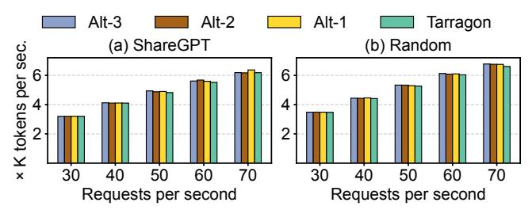

# E Implementation of Lightweight Failure Detection

We implement the explicit probes as "zero-length" RDMA writes, a no-op operation that incurs minimal overhead. To track the status of probes, each worker monitors its RDMA Completion Queue (CQ) to inspect the <code>ibv\_wc\_status</code> of the relevant QP (data-plane QP for the implicit probe and control-plane QP for the explicit probe). If a probe experiences a small number of consecutive timeouts (default value is 3, configured at QP initialization in TARRAGON), the RNIC marks the QP with <code>IBV\_WC\_RETRY\_EXC\_ERR</code> (raises <code>IBV\_WC\_WR\_FLUSH\_ERR</code> for work requests in CQ), and flushes all pending work requests on that QP. TARRAGON interprets these hardware-level signals as a fail-stop event on the corresponding peer (either a worker or link failure) and immediately hands them to the recovery logic to trigger self-healing and worker replacement.

### F Ablation Study

We perform an ablation study on TARRAGON's main resiliency components to understand their individual contribution to overall performance, including: (i) incremental KV cache checkpointing (§6.1) (ii) lightweight failure detection; (iii) the ERT used for dynamic expert remapping (§4.2).

We evaluate three variants of TARRAGON: (Alt-1) disables KV cache checkpointing/restoration; (Alt-2) additionally disables failure detection; (Alt-3) further disables the ERT. We use the same model and workloads as in §7.3 and vary the request arrival rate. In this experiment, we *do not inject failures* so that any performance differences are purely due to the steady-state overheads of these components. We report end-to-end inference throughput in terms of output tokens/sec.

Figure 15: Ablation study of TARRAGON's main resilience components. We evaluate output tokens per second for (a) ShareGPT and (b) Random.

Fig. 15 shows that across all request rates and workloads, the throughput of all alternatives is nearly indistinguishable: the maximum deviation stays within 3%. In particular, TARRAGON with all components enabled matches the no-resiliency baseline (Alt-3, similar to MegaScale-Infer), for this no-failure case.