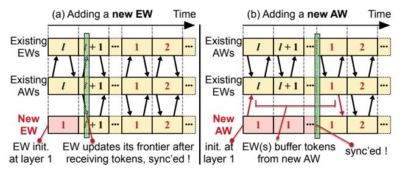
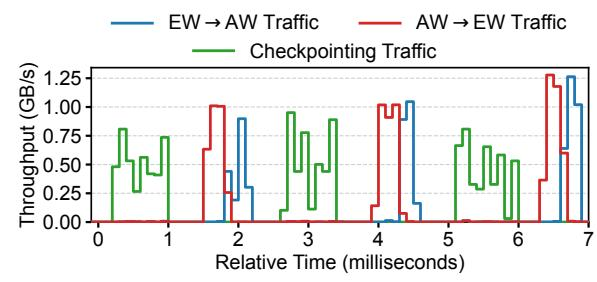
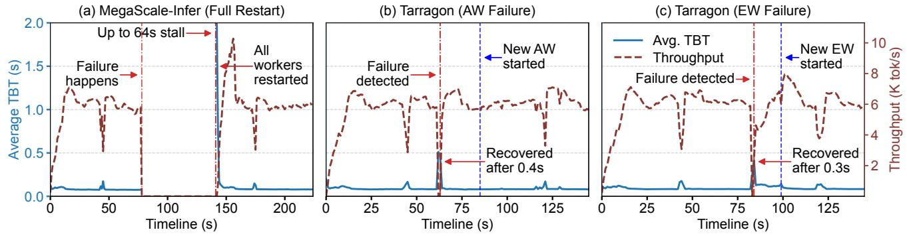
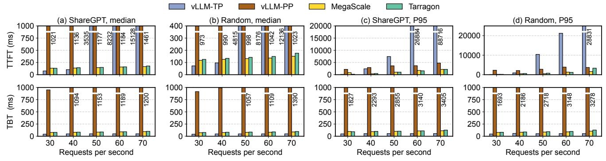
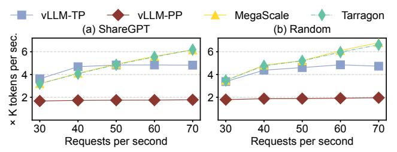
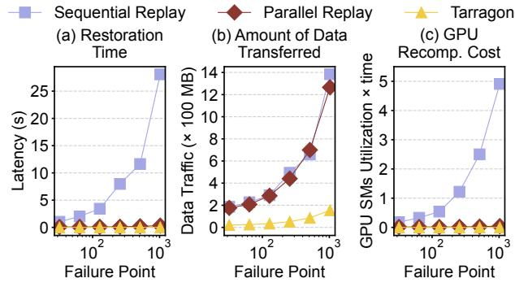

# 5.2 How Does EW Tolerate AW Failures?

In TARRAGON, EWs tolerate AW failures by starting expert computation once a *sufficient subset* of AWs has delivered their tokens, proceeding with partial inputs instead of waiting for all AWs to respond. Concretely, for each expert and layer, an EW buffers incoming tokens and starts the expert computation when either (i) it has received inputs from all AWs that are currently deemed healthy, or (ii) the buffered batch reaches a configured minimum size that preserves GPU efficiency.[5](#page-6-4) For any AW that has not contributed inputs within a short probing window, the EW issues liveness probes; if the AW is still unresponsive, it is treated as having failed for this layer, and its slots are simply omitted from the current batch. This *EW-side self-healing* design removes the implicit global barrier of prior MoE systems, where every EW must wait for inputs from *all* AWs before starting expert computation.

5Expert kernels reach near-optimal GPU efficiency at moderate batch sizes [\[45\]](#page-14-3). As we evaluated in Appendix [B,](#page-15-1) once the expert batch exceeds a modest threshold, GPUs sustain high efficiency. Executing with slightly fewer tokens is thus an acceptable trade-off: it preserves GPU efficiency while avoiding the long tail latency induced by waiting for a failed AW.

#### 5.3 Fast Expert Recovery via Shadow Experts

EW failures reduce the system's expert capacity: when an EW crashes, all experts it hosts become unavailable until a replacement EW is provisioned and expert weights are reloaded, which can take hundreds of milliseconds to seconds [15].

TARRAGON introduces shadow experts that are pre-loaded but are normally *inactive* replicas of experts residing in EWs' GPU memory. A shadow expert contains the same model weights and computation kernel as its primary, and can be activated immediately when the primary becomes unavailable. This allows TARRAGON to restore lost expert capacity almost instantaneously while the orchestrator provisions replacement EWs in parallel. We keep shadow experts inactive in the common case; keeping multiple experts active on the same GPU can cause kernel-level interference [1], increasing the expert's execution latency (refer to Appendix D for additional analysis on the latency of having the shadow experts remain idle vs. executing in parallel).

**GPU memory cost of shadow experts.** Unlike AWs, EWs do not store the KV cache, so their footprint prior to activation is small. The main cost of shadow experts is GPU memory, which could be modest in practice. For example, a single DeepSeek-R1 expert occupies roughly 2.5 GB [11] for its weights, a relatively small proportion of the 40 to 80 GB capacity of GPUs such as an NVIDIA A100. Even with multiple active and shadow experts co-located, typical MoE configurations comfortably fit within device memory.

### 5.4 New Worker Provisioning

Introducing a new worker into the cluster includes: (i) connecting it to the existing AW-EW datapath, and (ii) synchronizing the new worker's frontier (initialized at *layer 1*) with existing workers' without interrupting their progress. A naive solution would let the orchestrator enforce a global frontier update, which is, however, hard to coordinate at sub-millisecond perlayer execution time (0.85 ms in Table 1).

**Adding a new EW.** When a new EW joins, the orchestrator updates all AWs' ERTs. Each AW then sets up the datapath to the new EW. After connecting to all existing AWs, the new EW broadcasts a ready signal. From this point on, AWs may start routing tokens to the new EW whenever its

Figure 7: New (a) EW and (b) AW provisioning. Numbers inside the boxes denote the layer index.

experts are selected. Because existing AWs are already synchronized layer-wise, the first token the EW sees necessarily corresponds to the global frontier. As such, the EW updates its local frontier according to the layer index carried in the first token's metadata (see Fig. 6), and then advances in lock-step with subsequent requests, as shown in Fig. 7(a).

**Adding a new AW.** The principle of adding a new AW is similar. The new AW boots and registers with the orchestrator to update its ERT. It then sets up the datapath to all EWs and it can immediately start serving *new* requests. However, when EWs first receive tokens from this AW, their own frontiers may be at some layer  $\ell \neq 1$  for the current token. To preserve efficient layer-wise batching, EWs treat tokens from the new AW as follows: as shown in Fig. 7(b), they buffer these "early" tokens until they themselves wrap back to layer 1 for the corresponding experts, and then batch the buffered tokens together with layer-1 tokens from other AWs. From that point onward, the new AW is naturally synchronized at layer boundaries with the rest of the cluster.

This design (1) avoids global stalls: healthy workers never stop solely to accommodate a joining worker, unlike the coarse-grained recovery in Fig. 3; (2) preserves EW batching efficiency by letting both new EWs and new AWs join at layer-aligned points (next occurrence of layer 1).

## **6** KV Cache State Management

#### 6.1 KV Cache Checkpointing

Initialization. When an AW starts, its compute engine allocates a contiguous KV cache region in GPU memory. REFE registers this region for RDMA, enabling one-sided remote writes into the checkpoint store. The AW then establishes an RDMA connection to the checkpoint store and sends the layout of its requested KV cache region (base address on the AW side and size). The checkpoint store allocates and registers a dedicated memory bucket for this AW and returns the base address on the checkpoint store side. Because both sides allocate fixed contiguous buffers, the AW can compute the remote write offset for the new KV cache, enabling direct one-sided updates without any receiver-side CPU involvement.

Asynchronous incremental updates. For every layer, the AW incrementally updates one KV segment for each token. When the KV cache segment is updated, the compute engine notifies REFE through a non-blocking async\_update() call, passing the address range of the new segment. REFE then asynchronously issues a one-sided RDMA write that transfers this segment into the AW's bucket in the checkpoint store.

One-sided RDMA writes make checkpointing scalable but do not guarantee that segments arrive in order at the checkpoint store; Later segments may arrive before earlier ones, making the checkpoint unusable for recovery. To enforce ordering, TARRAGON adopts a standard "async log + commit record" design, similar to RDMA-backed write-ahead log-

Figure 8: Traffic pattern with incremental checkpointing.

ging in prior systems [13, 22, 41]. Each update is tagged with a *sequence number* to preserve ordering, implemented as a monotonically increasing RDMA work request ID.

Opportunistic interleaving with AW-EW traffic. The check-pointing mechanism must run without interfering with the AW-EW traffic that drives the inference progress. In practice, we find that AW-EW communication is highly *bursty*, as shown in Fig. 8. This is measured using the Mixtral-8×7B model. Refer to §7.4 for testbed setup. Here we show a trace for a request arrival rate of 10 RPS, but we observe a similar pattern at other rates: the link is heavily used when AWs scatter/gather expert inputs and outputs, but remains largely idle while AWs execute attention computation for the same layer. These recurring idle intervals provide natural windows for incremental KV cache updates, that don't contend with AW-EW traffic. TARRAGON schedules incremental KV cache checkpoints just within these gaps.

#### **6.2** Request-Level KV Cache Restoration

TARRAGON recovers only the affected requests through the per-request KV cache restoration. Upon detecting an AW failure, the orchestrator identifies all active requests on the failed AW by noting the latest committed token stored in the checkpoint store. The orchestrator redistributes these requests to alternate AWs, typically in a round-robin manner to balance the load.

For each reassigned request, recovery proceeds as follows. The checkpoint store sends the alternate AW the request's committed token ID and the size of KV state to restore. The AW allocates a fresh per-request region in its KV cache and returns the offset to the checkpoint store. Using GPUDirect-based one-sided RDMA writes, the checkpoint store then injects the KV cache segments directly into the AW's GPU memory, followed by an HTTP request to confirm completion.

After the KV cache is reconstructed, the alternate AW resumes decoding from the committed token as if the request had been executed locally. Restoration is fully parallelized with the ongoing inference, because each request maintains its own isolated region. As a result, TARRAGON recovers AW failures without global rollback and without disrupting the progress of unrelated requests.

#### 7 Evaluation

Our evaluation is based on measurements of our implementation of TARRAGON running in Google Cloud.

Implementation. We implement TARRAGON (about 16K lines of C++ code and 2K lines of Python). For the AW, we use vLLM [23] as the compute engine for both prefill and decoding, with the REFE implemented as a C++ extension with a Python shim. EW is written from scratch in C++ using libtorch (PyTorch's C++ API) for expert computation and libibverbs for RDMA. The orchestrator is a C++ control plane service exposing HTTP endpoints for configuration and failure monitoring of workers. The checkpoint store is implemented as a separate C++ service using libibverbs. We will open source soon.

We aim to answer the following questions:

- How much can TARRAGON reduce user-visible stalls under worker failures compared to coarse-grained restarts? (§7.2)
- What is the steady-state cost of adding failure resiliency, in terms of throughput and token-level latency, when no failures occur? (§7.3)
- How much overhead do TARRAGON's individual resiliency components introduce by themselves? (§F)
- How effective and lightweight are TARRAGON's KV cache checkpointing and restoration mechanisms? (§7.4)

We compare TARRAGON against two state-of-the-art MoE serving frameworks, (monolithic) vLLM [23] and (decoupled) MegaScale-Infer [45]. Both don't have fine-grained resiliency and have to rely on coarse-grained restarts after failures.

#### 7.1 Experimental Setup

**Testbed:** Unless otherwise noted, our experiments run on three Google Cloud (GCP) A3 Ultra nodes. Each node has 224 vCPUs, 3 TB RAM, eight H200 GPUs (141 GB memory), and eight 400 Gbps ConnectX-7 RDMA NICs with GPUDirect RDMA and intra-node NVLink (3.6 Tbps) enabled. All experiments run Ubuntu 22.04 with Linux 5.15, CUDA 12.8 (driver 580), and PyTorch 2.6.0.

Model and workloads. We evaluate TARRAGON on Mixtral-8×7B [20], a 32-layer MoE transformer with 8 experts per MoE layer and top-2 experts selected. We use two prompt-completion workloads: ShareGPT [3], with naturally varying input prompt lengths that examine both prefill and decode with realistic request heterogeneity; and a synthetic workload with randomly generated fixed-length prompts (10 input to-kens, 128 generated tokens) to emphasize the decoding phase (called "Random"). Request arrivals follow a Poisson process with varying rates to emulate different load levels.

Configuration of Baselines: For MegaScale-Infer, we follow its decoupled design and place 8 AWs on one A3 Ultra node and 8 EWs on the other node, so that all AW-EW traffic traverses inter-node RDMA links. To match MegaScale-Infer's setting, TARRAGON uses the same 16 GPUs (8 AWs + 8 EWs on the first two nodes) and an additional node only for

Figure 9: End-to-end failover behavior in terms of time-between-tokens (TBT) and output tokens per second under a single worker failure. Note that (a) uses a longer time range than (b) and (c) because the MegaScale-style baseline experiences a much longer stall; thus, we run it longer to ensure performance has fully recovered after failover.

the checkpoint store, so it does not benefit from extra GPU capacity. For monolithic vLLM, we adopt the two standard configurations that best exploit its design: vLLM-TP with tensor parallelism degree 16 and vLLM-PP with a 16-stage pipeline. Both vLLM baselines are deployed on two A3 Ultra nodes with a total of 16 GPUs, leveraging intra-node NVLink for fast GPU-GPU communication (the recommended practice for TP/PP-style multi-GPU inference). All systems share the same backend kernels and batching policy for a fair comparison, and disable any optimizations not common to all. TARRAGON does failure probing every 10 ms; the baselines do not have failure detection.

#### 7.2 End-to-End Failover Behavior

**Setup:** We first focus on failover behavior in the decoding phase, during which the model emits tokens under tight latency constraints. We use the "Random" workload, which stresses the decoding phase, and set the request arrival rate to 50 RPS to keep the system under moderate load, so that observed stalls mainly reflect failover behavior rather than overload. We compare TARRAGON against MegaScale-Infer. Our primary metrics are the *time between tokens* (TBT) and inference throughput (output tokens per second). Increased TBT during failures will be perceived by users as the disruption in the stream of responses.

For each run, we start a long-running interactive request stream and let the pipeline reach the steady-state decoding phase. Around 60–80 s after the first request is issued, we inject a fail-stop worker failure by sending SIGINT to one worker process. For TARRAGON, we evaluate two failure scenarios separately: (i) failure of a single AW, and (ii) failure of a single EW. In both cases, TARRAGON's self-healing mechanisms will provision a new worker in the background. **Results:** Fig. 9(a) shows the TBT and throughput timeline for the MegaScale-Infer. When the failure is injected at 78 s, the throughput immediately drops to *zero*. The system kills and restarts all workers, reloads model weights, and reruns both prefill and decoding before it can emit the next token. The stall lasts for roughly 64 s, consistent with our cost model in

§2.2.2, and is visible to the user as a frozen response stream. Figs. 9(b) and (c) show the corresponding behavior under TARRAGON. When an AW fails, TARRAGON's self-healing reroutes the affected request to healthy AWs and replays only the minimal state needed at the current frontier. The resulting stall (and period during which throughput drops) is only about  $0.4 \,\mathrm{s}$ , a  $160 \times$  reduction compared to the baseline. When an EW fails, TARRAGON masks the failure by replaying expert computation to healthy EWs and shadow experts, while a replacement EW is provisioned in the background. While waiting for the replacement EW, the reduced capacity results in a slightly elevated TBT. But, the actual stall in the token stream is substantially reduced, to just about 0.3 s, or 213× shorter than the baseline. In both cases, token generation resumes more quickly compared to the minute-long pause. After the new EW's initialization, it joins the cluster. The TBT returns to its pre-failure level. This behavior is precisely what TARRAGON is designed to achieve: self-healing hides the long worker initialization latency from users, while background provisioning fairly quickly restores the original capacity.

### 7.3 Is There a Cost to Failure Resiliency?

**Setup:** We now compare TARRAGON against three non-resilient baselines: vLLM-TP, vLLM-PP, and MegaScale-Infer, under non-failure conditions. We vary the load from 30 to 70 RPS and report (i) TTFT (time-to-first-token) and TBT (median and P95), (ii) output-token throughput for both ShareGPT and Random workloads.

TTFT (Fig. 10, top row). For prefill, TARRAGON closely tracks MegaScale across loads on both workloads, indicating that TARRAGON's resiliency adds negligible startup latency. But, the two vLLM baselines show different behaviors. At low to moderate load (30-40 RPS), vLLM-TP achieves slightly lower TTFT than the decoupled systems. This is helped by its use of high-bandwidth NVLink for intra-node communication, so prefill completes quickly when the cluster is not saturated. However, as load increases beyond 40 RPS, vLLM-TP's TTFT grows very sharply, reaching multi-second delays. vLLM-PP exhibits consistently worse TTFT than both MegaScale and

Figure 10: Cost of failure resiliency on token-level latency. Top: TTFT. Bottom: TBT. We report medians (a-b) and P95 (c-d) across ShareGPT and Random workloads as load increases (30-70 RPS).

TARRAGON at all loads.

**TBT** (**Fig. 10**, **bottom row**). For decoding, TARRAGON and MegaScale again remain close. The differences among vLLM baselines are mainly driven by how well their parallelism strategies fit autoregressive decoding. vLLM-PP shows substantially larger TBT across all loads. vLLM-TP generally achieves slightly better TBT than the decoupled systems. By splitting each transformer layer across GPUs and using NVLink-backed collectives to gather partial results, vLLM-TP can keep its GPUs busy and hide much of the intra-node communication cost. In contrast, MegaScale and TARRAGON must perform AW-EW scatter/gather over inter-node RDMA links; this additional network hop introduces a small but visible latency penalty per token.

Output-Token Throughput (Fig. 11). TARRAGON essentially matches MegaScale's throughput (with a deviation within 2.8%). vLLM-PP and vLLM-TP deliver consistently lower throughput: pipeline parallelism leaves some GPUs underutilized due to pipeline bubbles and imbalance, while tensor parallelism pays per-layer collective overhead across the GPUs, which limits the effective throughput at high load.

**Takeaway.** These results demonstrate that TARRAGON preserves the performance benefits of decoupled deployment, matching MegaScale-Infer in latency and throughput across various loads and workloads. It outperforms monolithic vLLM-TP/PP in most settings—while adding strong failure resiliency with little or no additional cost in the no-failure common case.

We also conduct an ablation study to quantify the steadystate overhead of incremental KV cache checkpointing,

Figure 11: Cost of failure resiliency on output tokens per second (higher is better) for (a) ShareGPT and (b) Random.

lightweight failure detection, and ERT-based expert remapping, on TARRAGON's end-to-end throughput without injecting failures. The results showed that across all request rates and workloads, the throughput of all alternatives are nearly indistinguishable: the maximum difference is less than 3% (details are in Appendix F).

### 7.4 KV cache Checkpointing and Restoration

We perform this experiment on three GCP A3 Ultra nodes (§7.1), where AWs, EWs, and checkpoint stores run on separate nodes with RDMA NICs interconnecting them.

Overhead of different checkpointing schemes. Our goal here is to understand whether different checkpointing schemes interfere with the inference, in particular whether TAR-RAGON's can preserve inference throughput while providing fine-grained checkpointing. We consider two baselines: (1) No checkpointing, which serves as the upper-bound baseline; (2) Pause-Checkpoint-Resume, which periodically stalls inference to take a global snapshot of all KV cache pages (the training-style approach), and then resumes decoding.

For *Pause-Checkpoint-Resume*, we vary the checkpoint interval by the number of generated tokens: after every *X* decoded tokens, the system pauses, checkpoints the whole KV cache, and then resumes. TARRAGON does not use such periodic intervals. In TARRAGON, once a token's KV segment has been updated, the AW immediately checkpoints it, during which AW-EW traffic is naturally idle (Fig. 8).

We report end-to-end inference throughput in output tokens per second. Without checkpointing, the system achieves 1148 tokens/s. With TARRAGON's asynchronous incremental checkpointing, throughput is 1147 tokens/s, essentially identical to *no checkpointing*. This confirms that opportunistic interleaving is effective: KV cache updates occur during link idle periods and do not measurably interfere with normal AW-EW communication.

In contrast, *Pause-Checkpoint-Resume* incurs significant overhead even at relatively coarse intervals. With a checkpointing interval of once every 8 tokens, throughput drops by  $2.15 \times$  compared to both *no checkpointing* and TARRAGON. The degradation stems from repeated global stalls: each check-

Figure 12: Impact of different restoration strategies at varying failure points.

pointing pauses the entire pipeline, blocking new token generation while KV-state is flushed. Achieving token-level check-pointing with *Pause-Checkpoint-Resume* would require even more frequent stalls and thus be prohibitive for interactive inference.

**AW restoration.** We evaluate how TARRAGON's perrequest KV restoration impacts AW-side self-healing during decoding-time failures. We focus on a single AW failure during the decoding phase (since it dominates user-perceived impact) and compare against two replay-based baselines: (1) Sequential replay: an alternate AW rebuilds the lost KV cache by rerunning prefill and then sequentially decodes all tokens from the beginning up to the failure point, without using any checkpoints. (2) Parallel replay: an alternate AW performs the prefill over the original prompt plus all tokens generated up to the failure point, reconstructing the lost KV cache in parallel rather than token by token.

We vary the *failure point*, which is defined as the index of the token being decoded when the failure occurs. A larger failure point corresponds to a larger number of decoded tokens and a larger KV cache to recover. For each strategy, we measure: (1) the total restoration time, (2) the amount of data transferred (*i.e.*, AW-EW traffic for *sequential replay* and *parallel replay*, and AW-checkpoint-store traffic for TAR-RAGON), and (3) the GPU recomputation cost (GPU-time) incurred by the alternate AW.

Fig. 12(a–c) summarizes the results. As the failure point increases, *sequential replay* has a steep increase in all three metrics: restoration time and GPU-time both grow roughly linearly with the increase of failure point, since the alternate AW must rerun attention for every layer and token, resulting in additional AW-EW traffic. *Parallel replay* still incurs the same amount of AW-EW traffic as *sequential replay*, growing rapidly with the failure point. *Parallel replay* incurs smaller restoration delays than *sequential replay*, but is still roughly an order of magnitude higher than TARRAGON (10×).

It is important to see that TARRAGON's per-request restoration remains nearly constant and efficient across all tested failure points. GPU recomputation cost and total restoration time are both negligible, as no prefill/decoding work is replayed. The amount of data transferred in TARRAGON is roughly 1/8 of that in *sequential replay* and *parallel replay*. Restoring the KV cache for a single request is far cheaper than regenerating it (up to 1800× latency reduction compared to *sequential replay*). As a result, AW-side self-healing under TARRAGON can recover from failures quickly and in an isolated manner, without flooding the network or burning scarce GPU cycles. This complements the end-to-end failover results in §7.2, showing that TARRAGON not only hides failures at the token-processing level but also bounds the system-wide recovery cost.

#### 8 Related Work

Optimizations on MoE serving. Recent work on MoE serving has primarily focused on efficiency—reducing resource usage, improving GPU utilization, and lowering communication overhead [18, 25, 26, 36, 45]. These systems, however, retain static expert placement, fixed communication groups, and tightly synchronized AW-EW execution, causing a single worker failure to trigger coarse-grained restarts with no worker-level failover. TARRAGON complements these efficiency-oriented designs by introducing a reconfigurable datapath and bidirectional self-healing that confine and recover AW and EW failures at worker granularity.

Fault tolerance in LLM serving. Existing resilient serving approaches primarily target predictable events. For instance, SpotServe [29] adapts parallelism during preemption windows on cloud spot instances but does not handle sudden failures nor exploit the structure of decoupled attention-expert deployments. For KV cache durability and scalability, systems such as MoonCake [32] build a distributed KV cache store. TARRAGON is orthogonal to these efforts: it provides fine-grained failover for both AWs and EWs and can optionally integrate such a store to further strengthen KV cache recovery.

**Fault tolerance in LLM training.** Resilient training systems address failures through checkpointing [8], expert replica placement strategies [43], redundant computations [40], and state reconstruction from healthy replicas [19]. These techniques are effective for long-running, globally synchronized training jobs, but operate in a fundamentally different regime from inference, which must recover within tight latency budgets and preserve KV cache state.

## 9 Conclusion

Based on understanding the deficiencies of coarse-grained failover in today's MoE serving frameworks, we developed TARRAGON. TARRAGON confines failure domains to individual workers, maintains forward progress of inference pipelines under failures, and limits the amount of processing required for recovery. Our evaluation shows that TARRAGON cuts failure-induced stalls by up to 160–213× compared to

state-of-the-art MoE serving frameworks, while matching their throughput when no failures occur. We believe these results demonstrate that strong failure resilience and highperformance MoE serving are not at odds, and that TAR-RAGON provides a practical solution for making large-scale LLM inference robust to the routine GPU and node failures seen in production clusters.

## References

- [1] Multi-Process Service. [https://docs.nvidia.com/](https://docs.nvidia.com/deploy/mps/index.html) [deploy/mps/index.html](https://docs.nvidia.com/deploy/mps/index.html), 2025. [ONLINE].
- [2] NCCL: Optimized primitives for collective multi-gpu communication https://github.com/nvidia/nccl, 2025.
- [3] ShareGPT. <https://sharegpt.com/>, 2025. [ON-LINE].
- [4] The Llama 4 herd: The beginning of a new era of natively multimodal AI innovation. [https://ai.meta.](https://ai.meta.com/blog/llama-4-multimodal-intelligence/) [com/blog/llama-4-multimodal-intelligence/](https://ai.meta.com/blog/llama-4-multimodal-intelligence/), 2025. [ONLINE].
- [5] Amey Agrawal, Nitin Kedia, Ashish Panwar, Jayashree Mohan, Nipun Kwatra, Bhargav Gulavani, Alexey Tumanov, and Ramachandran Ramjee. Taming Throughput-Latency tradeoff in LLM inference with Sarathi-Serve. In *18th USENIX Symposium on Operating Systems Design and Implementation (OSDI 24)*, pages 117–134, Santa Clara, CA, July 2024. USENIX Association.
- [6] Joshua Ainslie, James Lee-Thorp, Michiel de Jong, Yury Zemlyanskiy, Federico Lebrón, and Sumit Sanghai. Gqa: Training generalized multi-query transformer models from multi-head checkpoints, 2023.
- [7] Wei An, Xiao Bi, Guanting Chen, Shanhuang Chen, Chengqi Deng, Honghui Ding, Kai Dong, Qiushi Du, Wenjun Gao, Kang Guan, Jianzhong Guo, Yongqiang Guo, Zhe Fu, Ying He, Panpan Huang, Jiashi Li, Wenfeng Liang, Xiaodong Liu, Xin Liu, Yiyuan Liu, Yuxuan Liu, Shanghao Lu, Xuan Lu, Xiaotao Nie, Tian Pei, Junjie Qiu, Hui Qu, Zehui Ren, Zhangli Sha, Xuecheng Su, Xiaowen Sun, Yixuan Tan, Minghui Tang, Shiyu Wang, Yaohui Wang, Yongji Wang, Ziwei Xie, Yiliang Xiong, Yanhong Xu, Shengfeng Ye, Shuiping Yu, Yukun Zha, Liyue Zhang, Haowei Zhang, Mingchuan Zhang, Wentao Zhang, Yichao Zhang, Chenggang Zhao, Yao Zhao, Shangyan Zhou, Shunfeng Zhou, and Yuheng Zou. Fire-flyer ai-hpc: A cost-effective software-hardware co-design for deep learning. In *Proceedings of the International Conference for High Performance Computing, Networking, Storage, and Analysis*, SC '24. IEEE Press, 2024.

- [8] Sanjith Athlur, Nitika Saran, Muthian Sivathanu, Ramachandran Ramjee, and Nipun Kwatra. Varuna: scalable, low-cost training of massive deep learning models. In *Proceedings of the Seventeenth European Conference on Computer Systems*, EuroSys '22, page 472–487, New York, NY, USA, 2022. Association for Computing Machinery.
- [9] Shengkun Cui, Archit Patke, Ziheng Chen, Aditya Ranjan, Hung Nguyen, Phuong Cao, Saurabh Jha, Brett Bode, Gregory Bauer, Chandra Narayanaswami, Daby Sow, Catello Di Martino, Zbigniew T. Kalbarczyk, and Ravishankar K. Iyer. Characterizing gpu resilience and impact on ai/hpc systems, 2025.
- [10] Damai Dai, Chengqi Deng, Chenggang Zhao, R. X. Xu, Huazuo Gao, Deli Chen, Jiashi Li, Wangding Zeng, Xingkai Yu, Y. Wu, Zhenda Xie, Y. K. Li, Panpan Huang, Fuli Luo, Chong Ruan, Zhifang Sui, and Wenfeng Liang. Deepseekmoe: Towards ultimate expert specialization in mixture-of-experts language models, 2024.
- [11] DeepSeek-AI. Deepseek-r1: Incentivizing reasoning capability in llms via reinforcement learning, 2025.
- [12] DeepSeek-AI. Deepseek-v3.2: Pushing the frontier of open large language models, 2025.
- [13] Aleksandar Dragojevic, Dushyanth Narayanan, Miguel ´ Castro, and Orion Hodson. FaRM: Fast remote memory. In *11th USENIX Symposium on Networked Systems Design and Implementation (NSDI 14)*, pages 401–414, Seattle, WA, April 2014. USENIX Association.
- [14] William Fedus, Barret Zoph, and Noam Shazeer. Switch transformers: Scaling to trillion parameter models with simple and efficient sparsity. *Journal of Machine Learning Research*, 23(120):1–39, 2022.
- [15] Yao Fu, Leyang Xue, Yeqi Huang, Andrei-Octavian Brabete, Dmitrii Ustiugov, Yuvraj Patel, and Luo Mai. ServerlessLLM: Low-Latency serverless inference for large language models. In *18th USENIX Symposium on Operating Systems Design and Implementation (OSDI 24)*, pages 135–153, Santa Clara, CA, July 2024. USENIX Association.
- [16] Junhao Hu, Jiang Xu, Zhixia Liu, Yulong He, Yuetao Chen, Hao Xu, Jiang Liu, Jie Meng, Baoquan Zhang, Shining Wan, Gengyuan Dan, Zhiyu Dong, Zhihao Ren, Changhong Liu, Tao Xie, Dayun Lin, Qin Zhang, Yue Yu, Hao Feng, Xusheng Chen, and Yizhou Shan. Deepserve: Serverless large language model serving at scale, 2025.
- [17] Qinghao Hu, Zhisheng Ye, Zerui Wang, Guoteng Wang, Meng Zhang, Qiaoling Chen, Peng Sun, Dahua Lin, Xiaolin Wang, Yingwei Luo, Yonggang Wen, and Tianwei

- Zhang. Characterization of large language model development in the datacenter. In *21st USENIX Symposium on Networked Systems Design and Implementation (NSDI 24)*, pages 709–729, Santa Clara, CA, April 2024. USENIX Association.
- [18] Haiyang Huang, Newsha Ardalani, Anna Sun, Liu Ke, Hsien-Hsin S. Lee, Shruti Bhosale, Carole-Jean Wu, and Benjamin Lee. Toward efficient inference for mixture of experts. In A. Globerson, L. Mackey, D. Belgrave, A. Fan, U. Paquet, J. Tomczak, and C. Zhang, editors, *Advances in Neural Information Processing Systems*, volume 37, pages 84033–84059. Curran Associates, Inc., 2024.
- [19] Insu Jang, Zhenning Yang, Zhen Zhang, Xin Jin, and Mosharaf Chowdhury. Oobleck: Resilient distributed training of large models using pipeline templates. In *Proceedings of the 29th Symposium on Operating Systems Principles*, SOSP '23, page 382–395, New York, NY, USA, 2023. Association for Computing Machinery.
- [20] Albert Q. Jiang, Alexandre Sablayrolles, Antoine Roux, Arthur Mensch, Blanche Savary, Chris Bamford, Devendra Singh Chaplot, Diego de las Casas, Emma Bou Hanna, Florian Bressand, Gianna Lengyel, Guillaume Bour, Guillaume Lample, Lélio Renard Lavaud, Lucile Saulnier, Marie-Anne Lachaux, Pierre Stock, Sandeep Subramanian, Sophia Yang, Szymon Antoniak, Teven Le Scao, Théophile Gervet, Thibaut Lavril, Thomas Wang, Timothée Lacroix, and William El Sayed. Mixtral of experts, 2024.
- [21] Ziheng Jiang, Haibin Lin, Yinmin Zhong, Qi Huang, Yangrui Chen, Zhi Zhang, Yanghua Peng, Xiang Li, Cong Xie, Shibiao Nong, Yulu Jia, Sun He, Hongmin Chen, Zhihao Bai, Qi Hou, Shipeng Yan, Ding Zhou, Yiyao Sheng, Zhuo Jiang, Haohan Xu, Haoran Wei, Zhang Zhang, Pengfei Nie, Leqi Zou, Sida Zhao, Liang Xiang, Zherui Liu, Zhe Li, Xiaoying Jia, Jianxi Ye, Xin Jin, and Xin Liu. MegaScale: Scaling large language model training to more than 10,000 GPUs. In *21st USENIX Symposium on Networked Systems Design and Implementation (NSDI 24)*, pages 745–760, Santa Clara, CA, April 2024. USENIX Association.
- [22] Anuj Kalia, Michael Kaminsky, and David G. Andersen. Using rdma efficiently for key-value services. *SIG-COMM Comput. Commun. Rev.*, 44(4):295–306, August 2014.
- [23] Woosuk Kwon, Zhuohan Li, Siyuan Zhuang, Ying Sheng, Lianmin Zheng, Cody Hao Yu, Joseph Gonzalez, Hao Zhang, and Ion Stoica. Efficient memory management for large language model serving with pagedattention. In *Proceedings of the 29th Symposium on*

- *Operating Systems Principles*, SOSP '23, page 611–626, New York, NY, USA, 2023. Association for Computing Machinery.
- [24] Jiamin Li, Yimin Jiang, Yibo Zhu, Cong Wang, and Hong Xu. Accelerating distributed MoE training and inference with lina. In *2023 USENIX Annual Technical Conference (USENIX ATC 23)*, pages 945–959, Boston, MA, July 2023. USENIX Association.
- [25] Yan Li, Pengfei Zheng, Shuang Chen, Zewei Xu, Yuanhao Lai, Yunfei Du, and Zhengang Wang. Speculative moe: Communication efficient parallel moe inference with speculative token and expert pre-scheduling. *arXiv preprint arXiv:2503.04398*, 2025.
- [26] Aixin Liu, Bei Feng, Bing Xue, Bingxuan Wang, Bochao Wu, Chengda Lu, Chenggang Zhao, Chengqi Deng, Chenyu Zhang, Chong Ruan, et al. Deepseek-v3 technical report. *arXiv preprint arXiv:2412.19437*, 2024.
- [27] Ziming Liu, Boyu Tian, Guoteng Wang, Zhen Jiang, Peng Sun, Zhenhua Han, Tian Tang, Xiaohe Hu, Yanmin Jia, Yan Zhang, He Liu, Mingjun Zhang, Yiqi Zhang, Qiaoling Chen, Shenggan Cheng, Mingyu Gao, Yang You, and Siyuan Feng. Expert-as-a-service: Towards efficient, scalable, and robust large-scale moe serving, 2025.
- [28] Chiheng Lou, Sheng Qi, Chao Jin, Dapeng Nie, Haoran Yang, Yu Ding, Xuanzhe Liu, and Xin Jin. Hydraserve: Minimizing cold start latency for serverless llm serving in public clouds. In *21st USENIX Symposium on Networked Systems Design and Implementation (NSDI 24)*, 2026.
- [29] Xupeng Miao, Chunan Shi, Jiangfei Duan, Xiaoli Xi, Dahua Lin, Bin Cui, and Zhihao Jia. Spotserve: Serving generative large language models on preemptible instances. In *Proceedings of the 29th ACM International Conference on Architectural Support for Programming Languages and Operating Systems, Volume 2*, ASPLOS '24, page 1112–1127, New York, NY, USA, 2024. Association for Computing Machinery.
- [30] OpenAI. gpt-oss-120b & gpt-oss-20b model card, 2025.
- [31] Jackson Petty, Sjoerd Steenkiste, Ishita Dasgupta, Fei Sha, Dan Garrette, and Tal Linzen. The impact of depth on compositional generalization in transformer language models. In Kevin Duh, Helena Gomez, and Steven Bethard, editors, *Proceedings of the 2024 Conference of the North American Chapter of the Association for Computational Linguistics: Human Language Technologies (Volume 1: Long Papers)*, pages 7239–7252, Mexico City, Mexico, June 2024. Association for Computational Linguistics.

- [32] Ruoyu Qin, Zheming Li, Weiran He, Jialei Cui, Feng Ren, Mingxing Zhang, Yongwei Wu, Weimin Zheng, and Xinran Xu. Mooncake: Trading more storage for less computation — a KVCache-centric architecture for serving LLM chatbot. In *23rd USENIX Conference on File and Storage Technologies (FAST 25)*, pages 155–170, Santa Clara, CA, February 2025. USENIX Association.
- [33] Noam Shazeer. Fast transformer decoding: One writehead is all you need, 2019.
- [34] Noam Shazeer, Azalia Mirhoseini, Krzysztof Maziarz, Andy Davis, Quoc Le, Geoffrey Hinton, and Jeff Dean. Outrageously large neural networks: The sparsely-gated mixture-of-experts layer. *arXiv preprint arXiv:1701.06538*, 2017.
- [35] Chenchen Shou, Guyue Liu, Hao Nie, Huaiyu Meng, Yu Zhou, Yimin Jiang, Wenqing Lv, Yelong Xu, Yuanwei Lu, Zhang Chen, Yanbo Yu, Yichen Shen, Yibo Zhu, and Daxin Jiang. Infinitehbd: Building datacenterscale high-bandwidth domain for llm with optical circuit switching transceivers, 2025.
- [36] StepFun. Step-3 is large yet affordable: Model-system co-design for cost-effective decoding, 2025.
- [37] Biao Sun, Ziming Huang, Hanyu Zhao, Wencong Xiao, Xinyi Zhang, Yong Li, and Wei Lin. Llumnix: Dynamic scheduling for large language model serving. In *18th USENIX Symposium on Operating Systems Design and Implementation (OSDI 24)*, pages 173–191, Santa Clara, CA, July 2024. USENIX Association.
- [38] Kimi Team. Kimi k2: Open agentic intelligence, 2025.
- [39] Qwen Team. Qwen3 technical report, 2025.
- [40] John Thorpe, Pengzhan Zhao, Jonathan Eyolfson, Yifan Qiao, Zhihao Jia, Minjia Zhang, Ravi Netravali, and Guoqing Harry Xu. Bamboo: Making preemptible instances resilient for affordable training of large DNNs. In *20th USENIX Symposium on Networked Systems Design and Implementation (NSDI 23)*, pages 497–513, Boston, MA, April 2023. USENIX Association.
- [41] Xingda Wei, Jiaxin Shi, Yanzhe Chen, Rong Chen, and Haibo Chen. Fast in-memory transaction processing using rdma and htm. In *Proceedings of the 25th Symposium on Operating Systems Principles*, SOSP '15, page 87–104, New York, NY, USA, 2015. Association for Computing Machinery.
- [42] Yongji Wu, Xueshen Liu, Shuowei Jin, Ceyu Xu, Feng Qian, Z Morley Mao, Matthew Lentz, Danyang Zhuo, and Ion Stoica. Hetermoe: Efficient training of mixtureof-experts models on heterogeneous gpus. *arXiv preprint arXiv:2504.03871*, 2025.

- [43] Yongji Wu, Wenjie Qu, Tianyang Tao, Zhuang Wang, Wei Bai, Zhuohao Li, Yuan Tian, Jiaheng Zhang, Matthew Lentz, and Danyang Zhuo. Lazarus: Resilient and elastic training of mixture-of-experts models with adaptive expert placement. *arXiv preprint arXiv:2407.04656*, 2024.
- [44] Lianmin Zheng, Liangsheng Yin, Zhiqiang Xie, Chuyue Sun, Jeff Huang, Cody Hao Yu, Shiyi Cao, Christos Kozyrakis, Ion Stoica, Joseph E. Gonzalez, Clark Barrett, and Ying Sheng. Sglang: Efficient execution of structured language model programs, 2024.
- [45] Ruidong Zhu, Ziheng Jiang, Chao Jin, Peng Wu, Cesar A. Stuardo, Dongyang Wang, Xinlei Zhang, Huaping Zhou, Haoran Wei, Yang Cheng, Jianzhe Xiao, Xinyi Zhang, Lingjun Liu, Haibin Lin, Li-Wen Chang, Jianxi Ye, Xiao Yu, Xuanzhe Liu, Xin Jin, and Xin Liu. Megascaleinfer: Efficient mixture-of-experts model serving with disaggregated expert parallelism. In *Proceedings of the ACM SIGCOMM 2025 Conference*, SIGCOMM '25, page 592–608, New York, NY, USA, 2025. Association for Computing Machinery.
- [46] Siyuan Zhuang, Zhuohan Li, Danyang Zhuo, Stephanie Wang, Eric Liang, Robert Nishihara, Philipp Moritz, and Ion Stoica. Hoplite: efficient and fault-tolerant collective communication for task-based distributed systems. In *Proceedings of the 2021 ACM SIGCOMM 2021 Conference*, SIGCOMM '21, page 641–656, New York, NY, USA, 2021. Association for Computing Machinery.

