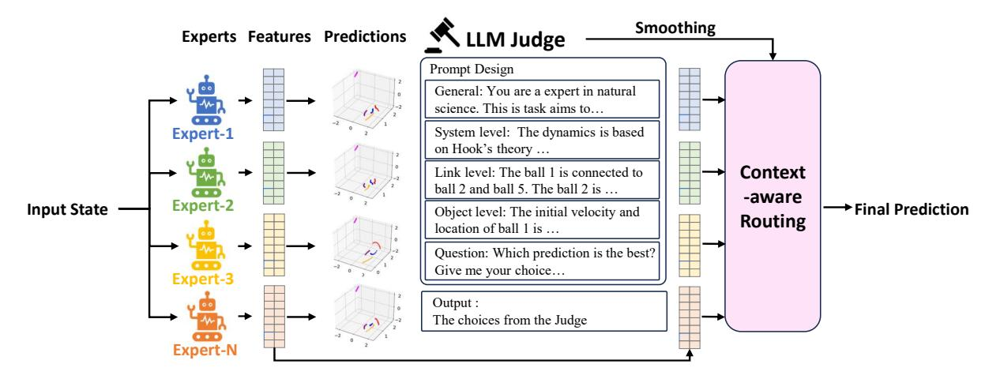
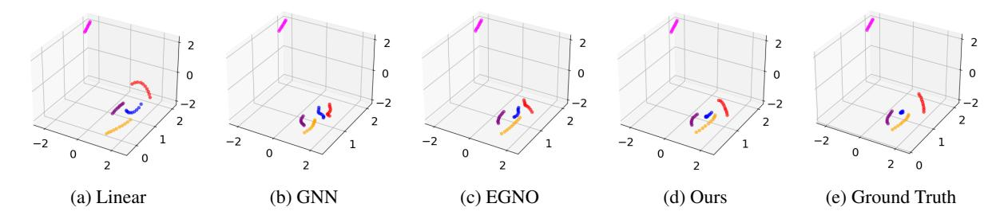

# 2 Related Work

### 2.1 Dynamical System Modeling

In recent years, learning from dynamical systems has become a prominent topic with real-world applications in opinion dynamics [\(Li et al.,](#page-9-14) [2023a;](#page-9-14) [Chuang et al.,](#page-8-6) [2024\)](#page-8-6), physical simulations [\(Pfaff](#page-10-0) [et al.,](#page-10-0) [2021;](#page-10-0) [Rajani et al.,](#page-10-1) [2020\)](#page-10-1), and epidemiology [\(Cury et al.,](#page-8-7) [2021;](#page-8-7) [Mutuvi et al.,](#page-10-10) [2020\)](#page-10-10). Current approaches typically construct geometric graphs and employ message passing neural networks to learn from interactions [\(Kipf and Welling,](#page-9-1) [2017a;](#page-9-1) [Xu et al.,](#page-10-3) [2019;](#page-10-3) [Zheng et al.,](#page-11-2) [2022;](#page-11-2) [Li et al.,](#page-9-2) [2022;](#page-9-2) [He et al.,](#page-9-3) [2022;](#page-9-3) [Zhao et al.,](#page-11-3) [2024\)](#page-11-3). These methods generate predictions for the next timestamp and feed them back as input in an autoregressive manner for long-term forecasting. In addition, recent approaches consider equivalence in graph representation learning [\(Satorras et al.,](#page-10-11) [2022;](#page-10-11) [Xu](#page-10-12) [et al.,](#page-10-12) [2024\)](#page-10-12), which incorporates both node representations and position information during neighborhood aggregation. However, these approaches often heavily rely on training data and struggle with significant performance degradation when it comes to potential environmental changes with distribution shifts [\(Goyal and Bengio,](#page-9-10) [2022\)](#page-9-10). Towards this end, this paper proposes LEGO, which leverages LLMs to understand the environmental context with enhanced generalizability in dynamical system modeling.

### 2.2 Large Language Models

Recent studies have demonstrated the strong capabilities of large language models (LLMs) [\(Achiam](#page-8-3) [et al.,](#page-8-3) [2023;](#page-8-3) [Dubey et al.,](#page-8-4) [2024\)](#page-8-4) with extensive parameters in various tasks such as question answering [\(Kamalloo et al.,](#page-9-15) [2023;](#page-9-15) [Nguyen et al.,](#page-10-13) [2023\)](#page-10-13) and sentiment analysis. Among various LLM approaches, in-context learning [\(Wei et al.,](#page-10-6) [2022;](#page-10-6) [Ma](#page-10-7) [et al.,](#page-10-7) [2023\)](#page-10-7) has become popular for utilizing LLMs in specific tasks, which aims to incorporate key signals in prompts without additional training. Besides in-context learning, reinforcement learning from human feedback and instruction tuning [\(Bai](#page-8-8) [et al.,](#page-8-8) [2022;](#page-8-8) [Akyurek et al.,](#page-8-9) [2023\)](#page-8-9) are another way to adapt LLMs to different scenarios. LLMs have also shown potential in analyzing time series data [\(Gruver et al.,](#page-9-11) [2024;](#page-9-11) [Khadanga et al.,](#page-9-16) [2019;](#page-9-16) [Liu et al.,](#page-9-17) [2024;](#page-9-17) [Yu et al.,](#page-10-14) [2023a\)](#page-10-14), which enjoy excellent zero-shot capabilities for one-dimensional

Figure 1: An overview of our proposed LEGO. Our LEGO feeds the initial state of the system into a mixture-of-expert framework, where each expert is an equivalent graph neural network. Then, we input the hierarchical contexts into an LLM from system, link and object levels. The LLM serves as a routing function with label smoothing to judge which expert is more suitable under the context, outputting the final predictions.

time series. However, the application of LLMs to dynamical systems remains underexplored, which is more complex than 1D time series. To close this gap, our work combines LLMs with dynamical system modeling in a graph mixture-of-expert framework and achieves strong generalizability under environmental changes.

#### 3 Methodology

**Problem Definition.** We are considering a dynamical system consisting of N interacting objects. Denote the interaction graph as  $\mathcal{G} = \{\mathcal{V}, \mathcal{E}\}$  where  $\mathcal{V}$  denotes the node set with |V| = N, and  $\mathcal{E}$  denotes the edge set. Following (Satorras et al., 2022), given the initial state matrix  $\mathbf{X}^{(0)} \in R^{|\mathcal{V}| \times d}$ , where d is the dimension of input features, which is 3 in 3D dynamics, we aim to predict the future state at any given timestamp t > 0, i.e.,  $\mathbf{X}^{(t)} = F_{\theta}(\mathbf{X}^{(0)})$ . Note that dynamic forecasting could be deteriorated by environmental changes resulting from varying system parameters and initial states.

#### 3.1 Framework Overview

In this paper, we introduce a new perspective of marrying LLMs with dynamic forecasting seamlessly and then develop a novel framework named LEGO for dynamic forecasting under environment changes. The core of LEGO is to utilize LLMs as a context-aware routing function for the graph MoE framework. In particular, we first extract hierarchical context into prompts across three levels, i.e., system level, object level, and edge level, which are then fed into pre-trained LLMs. Then, LEGO

utilizes LLMs to select the most suitable experts in the graph MoE framework based on the context, which can mitigate the impact of environmental changes. The whole framework is optimized in an alternative fashion across routing weights and the parameters of graph experts. The overview of LEGO can be found in Figure 1.

#### 3.2 Hierarchical Prompt Engineering

The target of this work is to utilize LLMs to enhance the performance of dynamic forecasting across different environments. To achieve this, the preliminary is to summarize the context information into texts as the input of LLMs, especially those related to environmental changes. Here, we design hierarchical prompts containing context from three views, i.e., system level, object level, and edge level.

In particular, we first introduce the general information. Then, from the system level, we describe the dynamical systems with the basic background and system parameters, which can provide the most environmental information. Detailed explanation is also provided such as "The force on the balls are significant, and forces between them result in strong accelerations". From the object level, we provide the state of each object in a row, including the initial position and velocity vectors. Here, we consider the numerical digit as tokens following (Gruver et al., 2024). From the edge level, we convent edge information into more comprehensive descriptions such as "ball 2 connects ball 0, ball 1, ball 3". An overview of our prompt design can be

found in Figure 1.

However, when requiring LLMs to directly output the predictions in a generative manner, they always output unreliable results or even wrong formats (not matrix style). Our solution is to leverage LLMs as a judge instead of a predictor, which will be introduced as below.

#### 3.3 Graph Mixture-of-expert

To leverage LLMs as a judge, we are required to generate candidate predictions. Towards this end, we introduce a graph mixture-of-expert (MoE) framework (Cai et al., 2024; Wang et al., 2024b) consisting of a range of equivariant graph neural networks (EGNNs) (Satorras et al., 2022) with different weights and their predictions would then be evaluated using LLMs with environmental context.

In detail, each graph expert is an EGNN with the same architecture, which updates node representations using its neighborhood and coordinates in an iterative manner. In formation, given the object representations  $\boldsymbol{h}_i^l$  and coordinates  $\boldsymbol{x}_i^l$  at the l-th layer, we have:

$$e_{ij}^{l} = \phi(\mathbf{h}_{j}^{l-1}, \mathbf{x}_{j}^{l-1}, \mathbf{h}_{i}^{l-1}, \mathbf{x}_{i}^{l-1})$$
 (1)

$$\boldsymbol{h}_{i}^{l} = \text{COM}^{H}(\boldsymbol{h}_{i}^{l-1}, \text{AGG}(\boldsymbol{e}_{ij}^{l}|j \in \mathcal{N}(i)), \quad (2)$$

$$\boldsymbol{x}_{i}^{l} = \text{COM}^{X}(\boldsymbol{x}_{i}^{l-1}, \text{AGG}(\boldsymbol{e}_{ij}^{l}|j \in \mathcal{N}(i))), \quad (3)$$

where  $\mathcal{N}(i)$  denotes the neighbor of the object i and  $\phi$  is a neural network to learn the interaction between two objects.  $\mathrm{AGG}(\cdot)$  is the aggregation operator whereas  $\mathrm{COM}^H$  and  $\mathrm{COM}^X$  are two combination operators. After stacking GNN layers for L layers, we output the final hidden representations  $\mathbf{H} = [\mathbf{h}_1^L, \cdots, \mathbf{h}_{|\mathcal{V}|}^L] = f_{\theta}(\mathcal{G}, \mathbf{X}^{(0)})$ . In our mixture-of-expert framework, we utilize K graph experts with the same architecture but different parameters, i.e.,  $\theta^1, \cdots, \theta^K$ . with the output  $\mathbf{H}^1, \cdots, \mathbf{H}^K$ . For each object, we utilize a MoE routing function followed by a decoder to generate the final output, i.e.,

$$\hat{\boldsymbol{x}}_{i}^{(t)} = \operatorname{Decoder}(\sum_{k=1}^{K} \boldsymbol{\omega}(k) \boldsymbol{h}_{i}^{k}),$$
 (4)

where  $h_i^k$  is the object representation from  $H^k$  and  $\omega(k)$  is the weight for different experts for combination.

#### 3.4 LLM Judge for Context-aware Routing

Traditional MoE framework usually utilizes a learnable routing function (Cai et al., 2024; He et al., 2021), which is a function of the input, i.e.,  $\omega =$  $[\boldsymbol{\omega}(1), \cdots, \boldsymbol{\omega}(K)] = \psi(\mathcal{G}, \boldsymbol{X}^{(0)})$ . However, in our scenarios, different environments (e.g., system coefficients) could generate different trajectories, which are hard to identify from data only. Even worse, potential distribution shifts would further degrade the performance of GNN models (Goval and Bengio, 2022). To incorporate abundant textbased contexts, we propose to utilize an LLM judge for context-aware routing, which first generates the predictions from different experts, and then selects the most reliable one with the reasoning ability. The whole framework can be optimized by updating routing weights from LLMs and the parameters of graph experts in an alternative manner.

In particular, we define the one-hot routing weights, i.e.,  $[1,0,\cdots,0],\cdots,[0,\cdots,0,1]$  for different experts. In other words, the candidate prediction for each expert can be formulated as:

$$\hat{\boldsymbol{x}}_{i}^{(t),k} = \text{Decoder}(\sum_{k'=1}^{K} \boldsymbol{e}^{k}(k')\boldsymbol{h}_{i}^{k'}) \qquad (5)$$

$$= \operatorname{Decoder}(\boldsymbol{h}_{i}^{k}), \tag{6}$$

where  $e^k$  is one-hot vector with the k-th element being 1. Then, we incorporate these predictions into LLMs and require them to select the most possible one. Since we include hierarchical context information in prompts, LLMs can evaluate different experts based on environments automatically. To reduce the potential error accumulation, we utilize the label smoothing strategy (Müller et al., 2019), which assigns smaller weights to unselected experts in our MoE framework. In other words, the weight vector can be written as:

$$\hat{e}^k = \begin{cases} \alpha & \text{if } k \text{ is chosen,} \\ \frac{1-\alpha}{K-1} & \text{if } k \text{ is not chosen,} \end{cases}$$
 (7)

where  $\alpha \in (0,1)$  is a coefficient to control label smoothing. In other words, Eqn. 5 would be updated into:

$$\hat{\boldsymbol{x}}_{i}^{(t),k} = \operatorname{Decoder}(\{\sum_{k'=1}^{K} \hat{\boldsymbol{e}}^{k}(k')\boldsymbol{h}_{i}^{k'}|i \in N(i)\}),$$
(8)

where  $\operatorname{Decoder}(\cdot)$  is implemented by another EGNN layer with different parameters.

**Diversity-enhanced Objective.** To ensure that different experts can explore various dynamics, we introduce a diversity-enhanced objective, which maximizes the similarity of activated representations from the same expert in comparison to the representations from the other experts (Chuang et al., 2020; Mustafa et al., 2022; Luo et al., 2024).

In particular, define the set of activated i-th node representations for the k-th graph expert in the training data as  $\mathcal{S}_i^k$ , and we have  $\mathcal{S}_i = \bigcup_{k=1}^K \mathcal{S}_i^k$ . The loss objective for the i-th graph expert is formulated as follows:

$$\ell_i^k = -\frac{1}{C} \sum_{\boldsymbol{h}_i^k \neq \tilde{\boldsymbol{h}}_i^k \in \mathcal{S}_i^k} \log \frac{\exp(\boldsymbol{h}_i^k \cdot \tilde{\boldsymbol{h}}_i^k / \tau)}{\sum_{\tilde{\boldsymbol{h}}_i^k \in \mathcal{S}_i} \exp(\boldsymbol{h}_i^k \cdot \tilde{\boldsymbol{h}}_i^k / \tau)}$$
(9)

where C is a constant to normalize the loss objective and  $\tau$  is a coefficient. The final diversity-enhanced objective is formulated as:

$$\mathcal{L}_{div} = \frac{1}{KN} * \sum_{k=1}^{K} \sum_{i=1}^{N} \ell_i^k.$$
 (10)

The final loss objective is then summarized as:

$$\mathcal{L} = \mathcal{L}_{mse} + \mathcal{L}_{div}, \tag{11}$$

where  $\mathcal{L}_{mse} = ||\boldsymbol{X}^{(t)} - \hat{\boldsymbol{X}}^{(t)}||$  calculates the mean square error of the predictions and  $\hat{\boldsymbol{X}}^{(t)}$  collects the predicted state at the future timestamp.

Alternative Optimization. To train the model, we update the routing weights generated from LLM as well as the parameters of graph experts. To enhance the efficiency and reduce the cost of accessing LLMs, we utilize an alternative manner, which updates the routing weights every several epochs and then optimizes the parameters of the graph MoE framework. The whole updating algorithm of our LEGO can be found in Algorithm 1. Our model can be built on any basic graph neural network model. We utilize EGNN (Satorras et al., 2022) as our default graph expert model and also try EGNO (Xu et al., 2024) and Radial Field (Köhler et al., 2019) as the basic model in our experiments.

#### 4 Experiment

#### 4.1 Setup

**Datasets.** To evaluate the performance of LEGO, we utilize four dynamic system datasets, i.e., *Spring*, *Charged* (Kipf et al., 2018), *MD17* (Chmiela et al., 2017) and *Motion* (CMU, 2003).

#### Algorithm 1 Learning Algorithm of LEGO

**Input:** The training set, the pre-trained LLM. **Output:** The parameters in our graph MoE framework.

- 1: Initialize the parameters in our model;
- 2: while not convegence do
- 3: Extract hierarchical prompts from three views;
- 4: Generate the predictions of graph experts;
- 5: Feed prompts into the pre-trained LLM;
- 6: Update routing weights from each sample using Eqn. 7:
- 7: **for** epochs =  $1, 2, \cdots$  **do**
- 8: Generate the prediction using Eqn. 8;
- 9: Calculate the loss in Eqn. 11;
- 10: Optimize  $\theta^1, \dots, \theta^K$  using gradient descent;
- 11: end for
- 12: end while

Spring and Charged are both synthetic N-body system datasets, where the positions of particles are governed by simple interaction rules. In Spring, the particle dynamics are determined by the forces exerted by the springs. Each edge represents a spring connecting two nodes. In *Charged*, particles attract or repel each other based on their charges. We are provided with their respective charges. Following recent work (Satorras et al., 2022), we extend the two datasets into three-dimensional space. MD17 (Chmiela et al., 2017) is used to assess the performance of LEGO in capturing molecular dynamics when we transfer from salicylic to naphthalene and they share the same number of nodes in the dataset. Here nodes represent atoms and edges depict bonds between them. We also test our LEGO on *Motion* (CMU, 2003), which tracks human motion movements for 3-dimensional trajectories. In this dataset, joints are represented as edges, while their intersections form the nodes. We first train our model on Subject #35 (Walk) and test the performance on Subject #9 (Run). More details can be found in the Appendix.

**Baselines.** We compare the performance of our LEGO with several baselines, including Linear (Satorras et al., 2022), Dynamics (Satorras et al., 2022), GNN (Kipf and Welling, 2017a), Radial Field (Köhler et al., 2019), EGNN (Satorras et al., 2022), and EGNO (Xu et al., 2024).

Implementation Details. For each trajectory, ini-

|              | Hard   |        |        |                  |        | So     | oft    |                  |        | Tempor | ral Shift |                  |
|--------------|--------|--------|--------|------------------|--------|--------|--------|------------------|--------|--------|-----------|------------------|
| Model        | $q_x$  | $q_y$  | $q_z$  | $\boldsymbol{q}$ | $q_x$  | $q_y$  | $q_z$  | $\boldsymbol{q}$ | $q_x$  | $q_y$  | $q_z$     | $\boldsymbol{q}$ |
| Spring       |        |        |        |                  |        |        |        |                  |        |        |           |                  |
| Dynamic      | 14.665 | 12.658 | 18.497 | 15.273           | 16.771 | 13.333 | 18.064 | 16.057           | 19.348 | 16.664 | 22.151    | 19.388           |
| Linear       | 12.507 | 11.614 | 15.053 | 13.058           | 14.089 | 11.800 | 14.968 | 13.619           | 11.705 | 10.013 | 13.011    | 11.577           |
| GNN          | 0.090  | 0.082  | 0.107  | 0.094            | 0.113  | 0.107  | 0.149  | 0.124            | 0.096  | 0.090  | 0.111     | 0.099            |
| Radial Field | 0.082  | 0.078  | 0.105  | 0.089            | 0.121  | 0.101  | 0.148  | 0.124            | 0.105  | 0.091  | 0.125     | 0.110            |
| EGNN         | 0.110  | 0.103  | 0.110  | 0.112            | 0.117  | 0.095  | 0.141  | 0.118            | 0.116  | 0.107  | 0.109     | 0.115            |
| EGNN + LEGO  | 0.070  | 0.080  | 0.080  | 0.078            | 0.110  | 0.107  | 0.120  | 0.114            | 0.071  | 0.070  | 0.074     | 0.072            |
| EGNO         | 0.080  | 0.080  | 0.100  | 0.089            | 0.110  | 0.091  | 0.129  | 0.111            | 0.107  | 0.094  | 0.105     | 0.102            |
| EGNO + LEGO  | 0.078  | 0.071  | 0.080  | 0.076            | 0.092  | 0.077  | 0.107  | 0.093            | 0.104  | 0.093  | 0.101     | 0.097            |
| Charged      |        |        |        |                  |        |        |        |                  |        |        |           |                  |
| Dynamic      | 8.531  | 8.805  | 8.763  | 8.700            | 9.803  | 9.795  | 8.067  | 9.222            | 9.201  | 10.440 | 12.438    | 10.693           |
| Linear       | 7.484  | 7.404  | 7.692  | 7.527            | 8.134  | 8.248  | 7.471  | 7.951            | 8.193  | 9.585  | 10.774    | 9.518            |
| GNN          | 1.560  | 2.337  | 2.254  | 2.051            | 1.788  | 2.220  | 2.111  | 2.040            | 2.077  | 3.332  | 2.983     | 2.798            |
| Radial Filed | 1.304  | 1.590  | 2.215  | 1.704            | 1.346  | 1.967  | 2.173  | 1.829            | 1.631  | 1.896  | 2.362     | 1.964            |
| EGNN         | 0.644  | 1.292  | 0.989  | 0.976            | 0.787  | 1.269  | 1.315  | 1.124            | 1.039  | 1.134  | 1.644     | 1.273            |
| EGNN + LEGO  | 0.595  | 0.902  | 0.687  | 0.728            | 0.695  | 0.918  | 0.837  | 0.817            | 0.755  | 0.960  | 1.491     | 1.069            |
| EGNO         | 0.510  | 0.626  | 0.710  | 0.615            | 0.632  | 0.618  | 0.681  | 0.644            | 0.816  | 0.986  | 1.214     | 1.005            |
| EGNO + LEGO  | 0.506  | 0.623  | 0.643  | 0.590            | 0.568  | 0.603  | 0.677  | 0.616            | 0.660  | 0.643  | 1.078     | 0.793            |

Table 1: The MSE ( $\times 10^{-2}$ ) of various models on *Spring* and *Charged*.  $q_x$  refers to the x axis,  $q_y$  refers to the y axis and  $q_z$  refers to the z axis. The best results are shown in **boldface**.

Figure 2: Visualization of different methods and ground truth on *Charged*. We utilize different colors to show the trajectories of different balls.

tial physical positions are given with their initial velocities. For Spring and Charged, we follow the experimental settings in (Satorras et al., 2022) by setting the time window to 10 and 3000/2000/2000 for train/validation/test sets. To model the environmental change, our test data are with greater strength marked as 'hard' and are with lower strength marked as 'soft'. To model temporal shift, we use the test data where start and end states are different from those used during the training process. For MD17, we follow the setup in (Xu et al., 2024) and choose the time window as 50. For Motion Capturing dataset, we also follow the setup in (Xu et al., 2024) and choose the time window as 30. We refer to (Satorras et al., 2022) to implement different baselines. For LEGO, we use the 8B version Llama3.1 (Dubey et al., 2024) as the LLM Judge. Note that our LEGO can be built on any model. Here we choose EGNN and EGNO as the basic models on Spring and Charged since

| Model               | $  q_x  $ | $q_y$ | $q_z$ | $\boldsymbol{q}$ | Reduction |
|---------------------|-----------|-------|-------|------------------|-----------|
| Dynamics            | 0.35      | 0.37  | 1.02  | 0.581            | 67.99%    |
| Linear              | 0.35      | 0.37  | 0.93  | 0.549            | 66.12%    |
| GNN                 | 0.21      | 0.48  | 0.33  | 0.371            | 49.86%    |
| EGNN                | 0.18      | 0.60  | 0.38  | 0.320            | 41.88%    |
| EGNO                | 0.18      | 0.66  | 0.33  | 0.388            | 52.06%    |
| Radial Field        | 0.12      | 0.17  | 0.35  | 0.214            | 13.08%    |
| Radial Field + LEGO | 0.15      | 0.15  | 0.26  | 0.186            | -         |

Table 2: The MSE ( $\times 10^{-2}$ ) of different methods under out-of-distribution shift on *MD17*.

they perform the best empirically. In addition, we build our LEGO on Radial Field on *MD17* and *Motion*. We calculate the Mean Square Error (MSE) between the prediction and the ground truth at the target time step.

#### **4.2 Performance Comparison**

The compared results of different approaches on *Springs* and *Charged* are presented in Table 1. From the results, we can have the following obser-

| Model               | $q_x$ | $q_y$  | $q_z$  | q      | Reduction |
|---------------------|-------|--------|--------|--------|-----------|
| Dynamics            | 1.02  | 6.74   | 254.40 | 87.39  | 72.28%    |
| Linear              | 19.20 | 263.93 | 202.52 | 161.88 | 85.03%    |
| GNN                 | 1.00  | 6.08   | 94.88  | 33.98  | 28.72%    |
| EGNN                | 1.26  | 6.42   | 161.28 | 56.32  | 56.99%    |
| EGNO                | 1.68  | 8.42   | 120.22 | 43.44  | 43.73%    |
| Radial Field        | 1.18  | 10.95  | 68.43  | 26.86  | 9.15%     |
| Radial Field + LEGO | 1.99  | 10.2   | 57.84  | 24.22  | -         |

Table 3: The MSE ( $\times 10^{-2}$ ) of different methods under out-of-distribution shift on *Motion*.

vations. Firstly, deep approaches generally perform better than shallow methods, i.e., Dynamic and Linear, validating the strong capacity of deep learning. Secondly, EGNN and EGNO perform much better than the other methods, which indicates that equivalence is an important property for dynamical system modeling in 3D space. *Thirdly*, our LEGO can bring in huge performance increasement for both EGNN and EGNO, which achieve the best performance in all cases. In particular, there is an average performance improvement of 23.70% in terms of MSE reduction on Charged. The huge performance increasement results from two attributes: (1) Introduction of hierarchical prompt engineering, which can make the best of context information to overcome the issue brought by environmental change; (2) Introduction of context-aware routing, which can understand contexts using LLMs to decide the most reliable expert under different environments.

We further conduct performance comparison on *MD17* and *Motion*. The compared results are recorded in Table 2 and Table 3. By combining LEGO with the base model Radial Field, we can achieve a significant performance improvement compared with other baselines. In particular, our LEGO achieves **13.08%** MSE reduction on *MD17*. Note that there are serious distribution shift on these two datasets due to different molecules and motions. Our LEGO still achieves superior performance in challenging tasks, which further validates the strong generalization ability of our LEGO under environmental changes.

#### 4.3 Further Analysis

**Ablation Study.** To emphasize the effectiveness of our hierarchical prompts, we compare three variants of our LEGO: (1) V1, which removes both edge-level and object-level information in the prompts. (2) V2, which removes the object-level information in the prompts. (3) V3 (Our full model), which utilizes the information in all three levels in the prompt design. We show the compared perfor-

|    | s | e | o | $q_x$ | $q_y$ | $q_z$ | $\boldsymbol{q}$ |
|----|---|---|---|-------|-------|-------|------------------|
| V1 | ✓ | X | Х | 0.624 | 0.936 | 0.722 | 0.761            |
| V2 | 1 | 1 | X | 0.602 | 0.898 | 0.703 | 0.735            |
| V3 | ✓ | ✓ | ✓ | 0.595 | 0.902 | 0.687 | 0.728            |

Table 4: Ablation studies of hierarchical prompt engineering for our LEGO. s refers to the system level, e refers to the edge level and o refers to the object level.

| Method          | $q_x$  | $q_y$  | $q_z$  | q      | t     |
|-----------------|--------|--------|--------|--------|-------|
| LLM Forecasting | 5.6321 | 6.9262 | 4.8482 | 6.4201 | 1.270 |
| EGNN + LEGO     | 0.0059 | 0.0090 | 0.0068 | 0.0072 | 0.438 |

Table 5: The MSE of different methods under outof-distribution shift on Motion t refers to the time (s) needed per sample.

mance between different model variants in Table 4. From the results, we have the following observations. *Firstly*, by comparing the performance of V1 and V2, we can observe that the removal of edge information leads to a significant performance drop, which indicates that LLMs can make the best of edge information for enhanced dynamical system modeling. *Secondly*, V3 outperforms V2 in most cases, which validates the importance of object-level information for dynamical system modeling. Overall, our hierarchical prompts can provide the most information with the best performance.

LLM Judge vs LLM Forecasting. In Table 5, we present a performance comparison between our method and LLM forecasting, which directly leverages LLM to generate future state prediction. From the results, we can observe a significant performance gap, demonstrating the limitations of relying solely on LLM predictions. Moreover, LLM forecasting needs more time for generation tasks. This motivates our decision to employ LLM Judge in combination with a graph mixture-of-experts framework, rather than using LLM alone for forecasting future states.

#### Performance with respect to Different Agents.

The performance of our LEGO highly depends on the choice of LLMs. A more powerful LLM will make better decisions, which will lead to a better overall performance. In Figure 3 (a), we present the results of using various LLMs as the judge. The findings demonstrate that a large-scale LLM can present a better performance and a small LLM can still have a fair performance with a faster inference pace.

Parameter Sensitivity. We begin with evaluating

Figure 3: The MSE (×10−2 ) of our proposed LEGO with respect to (a) different LLMs and (b) different numbers of experts.

Figure 4: (a) The MSE (×10−2 ) of our LEGO and (b) choice proportion of five graph experts (A, B, C, D, E) respect to different LLM temperatures.

how the number of experts affects the performance of our LEGO with the basic model EGNO. Here, we fix the other hyperparameters and vary the number of experts in {3,5,10,15,20}. The compared performance Figure [3](#page-7-0) (b). From the results, we can observe that increasing the number of experts generally improves the performance of our LEGO before saturation. However, when the number of experts becomes too large, the current LLM judges struggle to make effective decisions, leading to a decline in performance. Therefore, we set the number of experts to 5. After that, we explore the effect of the temperature coefficient in LLMs. Large temperatures will bring more randomness during both training and inference. Here, we vary the temperature coefficient in {0, 0.25, 0.5, 0.75, 1}. The results are shown in Figure [4](#page-7-1) (a). We can observe that a lower temperature will more likely result in a better performance in the inference stage. The potential reason is that low randomness would generate more stable and reliable experts. Furthermore, Figure [4](#page-7-1) (b) shows the choice preparation of five experts marked by A, B, C, D, and E. From the results, it can be observed that a higher temperature will encourage LLMs to choose the expert with more potential while a lower temperature encourages the LLMs to focus on the expert with better performance.

#### 4.4 Case Study

To deepen our understanding of how LLMs Judge makes its choices, we directly ask LLMs how it analyzes the dynamics system. The complete output is shown in Appendix [F.](#page-13-0) The summarized results can be found in Figure [5.](#page-8-13) From the results, we can see that LLMs are capable of analyzing the dynamics system and predictions from each agent in a step-by-step manner. First, the LLM Judge analyzes the initial conditions of each object and the predictions provided by each expert to gain a comprehensive understanding of the system. Next, based on the given motion rules of the dynamic system, the LLM Judge carefully evaluates the consistency of each prediction by raising the question: "are the objects moving in the expected directions, and are the predictions within a reasonable range?" Finally, after thorough analysis, the LLM Judge selects the most appropriate prediction.

All in all, when it comes to new environments, our LLM judge can reason step by step about the provided environmental context from the system level, object level, and edge level, which can understand the changing environment evidenced by Figure [5.](#page-8-13) In this way, LLM judge adaptively adjusts the weights to the environment, thus enhancing the generalizability. In contrast, previous methods learn the weight based on the training data with poor generalizability.

