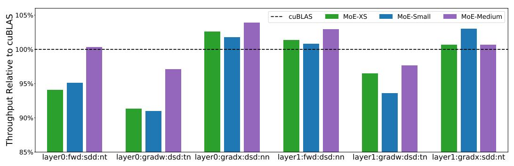

# 5 MEGABLOCKS: A FRAMEWORK FOR EFFICIENT MOE TRAINING

We implemented our techniques in a system called MegaBlocks, which builds on Megatron-LM (Shoeybi et al., 2019) and PyTorch (Paszke et al., 2019). In addition to high-performance dMoE layers, our system supports distributed training of MoEs with both data and expert model parallelism (Fedus et al., 2022).

This section discusses the design of our dMoE implementation, including our block-sparse kernels, and other considerations for building an efficient system. §5.1.1 discusses the limitations of existing block-sparse kernels. §5.1.2 analyzes the effects of the block size on block-sparse product performance. §5.1.3 describes our hybrid *blocked-CSR-COO* sparse matrix format, which enables efficient matrix products with sparse input and output operands. §5.1.4 introduces *transpose indices* as a mechanism for efficient iteration over block-sparse matrices in transposed order. §5.2 discusses efficient routing and permutation for dMoEs. Last, §5.3 discusses our implementations of data and expert model parallelism.

**Preliminaries: Matrix Multiplication on GPUs.** Matrix multiplication kernels on GPUs exploit *tiling*, where the output matrix is broken up into statically sized two-dimensional blocks of values (NVIDIA, 2022c). The computation of these tiles can be parallelized, and the individual tiles can be sized to tradeoff arithmetic intensity and parallelism. The group of threads assigned to a tile is called a *threadblock*.

#### 5.1 Efficient Block-Sparse Kernels for MoEs

To train MoEs with block-sparse kernels we need primitives for the forward and backward passes. Consider an MoE FFN layer where each expert is a 2-layer MLP. For this configuration, the forward pass requires an SDD operation followed by a DSD (Figure 4). For the backward pass, we compute SDDT and DSTD for the second layer data gradient and weight gradient, respectively, followed by DSDT and DDTS for the first layer data gradient and weight gradient, respectively.

#### 5.1.1 Existing Block-Sparse Primitives

We considered two existing libraries for block-sparse matrix multiplication on GPUs: NVIDIA cuSPARSE (NVIDIA, 2022b) and Triton Blocksparse (Tillet et al., 2019). cuS-PARSE supports the blocked-ELL sparse matrix format for DSD. However, as of CUDA 11.8, this operation does not support transposition of the sparse matrix input. cuSPARSE also provides no SDD primitive with a blocked-ELL matrix. In addition to these limitations, the blocked-ELL format requires that all rows in the sparse matrix have the same number of non-zeros, which would defeat our goal of sup-

Figure 5. Matrix Multiplication Throughput with Different Tile Dimensions. Benchmarked on an A100 SXM4 80GB GPU with CUDA 11.5 and all tile dimensions supported by CUTLASS 2.5. We observe that 128x128 tiles perform consistently on-par or better than other configurations.

porting load imbalanced matrices. Blocksparse supports SDD, DSD, and DDS as well as all combinations of transposed and non-transposed inputs. However, these primitives assume that the topology of the sparse matrices does not change between invocations6. The library API takes a bitmask describing the sparse operand and then pre-computes look-up tables and block groupings to accelerate computation. For our use case, the sparse matrix topology varies across every iteration of training and every MoE layer in the model. In order to use Blocksparse, we would have to pay the cost of these preprocessing steps repeatedly.

Based on this analysis, we opted to write our own blocksparse primitives in order to tailor them to MoE expert computation. We implemented SDD, DSD, and DDS operations targeting NVIDIA GPUs. Our kernels support all combinations of transposed and non-transposed inputs. The remainder of this section details the design and implementation of our kernels.

#### 5.1.2 Selecting Block Size for MoEs

In order to efficiently use modern GPUs, we want to use sparse blocks that have sufficient arithmetic intensity to keep matrix multiplication units busy. Large blocks are also desirable to amortize the cost of storing and operating on sparse matrix metadata, since metadata like column indices only need to be kept for each block of non-zeros.

To select our target block size, we studied the performance of dense matrix multiplication kernels from NVIDIA CUT-LASS (NVIDIA, 2022c) with different tile dimensions. We

&lt;sup>6This is likely because they were written for applications like sparse attention where the sparse matrix topology is determined prior to training (Child et al., 2019).

benchmarked mixed-precision (FP16 + FP32 accumulation) matrix multiplication on square matrices with power of two side lengths from 512 to 16384 and every set of tile dimensions supported in CUTLASS. For rectangular tiles, we show only the configurations where the first tile dimension is larger as we found these to slightly outperform the alternative ordering for these problems. We ran all benchmarks on an A100 SXM4 80GB GPU with CUDA 11.5 and CUTLASS 2.5. These benchmarks are shown in Figure [5.](#page-5-0)

Across these benchmarks, we observed that 128x128 tiles consistently perform on par or better than other configurations. Anecdotally, we observe that this same configuration is commonly selected by NVIDIA cuBLAS [\(NVIDIA,](#page-12-0) [2022a\)](#page-12-0) for the dense Transformer models we studied. Based on this analysis, we opted to use 128x128 block sparsity. While the tile dimensions of a block-sparse matrix multiplication and the block size in the sparse matrix do not need to be equal, we found that for 128x128 blocks the highest performing tile dimensions in our workloads were also 128x128.

To implement our kernels, we extended CUTLASS [\(NVIDIA,](#page-12-0) [2022c\)](#page-12-0) to support block-sparse matrices and reused their machinery for high-performance matrix multiplication with different data types and GPU architectures.

## *5.1.3 Computing Sparse Outputs With Hybrid Blocked-CSR-COO*

We use blocked compressed sparse row (BCSR) as our primary sparse matrix format. BCSR makes it simple to iterate across the non-zeros in a row, which is necessary for operations like DSD and DDST . Iterating over blocks also has minimal overhead with BCSR, as identifying a block's position in the matrix only requires a single load of its column index. We discuss our approach for efficiently iterating across the non-zeros in a column with this format in §5.1.4.

One challenge with BCSR sparse matrices is efficiently computing SDD operations in parallel. On kernel launch, each threadblock needs to identify the row and column of its output block so that it knows which rows and columns of the input matrices are needed to compute it. Because BCSR only encodes column indices for each block, identifying the row index of a non-zero block requires a search through the row offsets. One solution to this problem is to launch the maximum number of threadblocks that could be needed to compute each row of the output if it were fully dense. On startup, each threadblock can check whether its column offset is out of range for the number of non-zeros in its row and return if there is no work to do. [Gale et al.](#page-11-0) [\(2020\)](#page-11-0) showed that the overhead introduced by launching extra threadblocks was negligible for moderately sparse matrices (50 - 90% zeros). We experimented with this approach but observed that for MoEs the cost of launching these unused

Figure 6. Block-Sparse Matrix Format used in MegaBlocks. Pane (B) shows the encoding for the sparse matrix in pane (A). Indices and offsets in our encoding are block-wise. We use blocked compressed sparse row (BCSR) as our primary sparse matrix format. We additionally store the row indices of each non-zero block (§5.1.3) and a secondary index of *transpose indices* (§5.1.4).

threadblocks was significant, particularly for models with high expert counts where the level of sparsity in the blocksparse matrices is very high.

To efficiently parallelize SDD, we additionally materialize the row indices for each non-zero block so that threadblocks can trivially look up the coordinates of sparse blocks in the output matrix. The storage required for this additional metadata is negligible since we only need to store one index per 16384 non-zero values in a 128x128 block. Even with this additional metadata, we maintain the row-wise ordering of non-zero blocks so the matrix can be operated on as either BCSR or blocked coordinate format (BCOO). We illustrate this hybrid blocked-CSR-COO encoding in Figure 6.

## *5.1.4 Block-Sparse Transposition With Transpose Indices*

Computing forward and backward passes for model training requires sparse matrix transposition. However, iterating over BCSR matrices in transposed order requires searching through each row to identify if the block in the target column is non-zero [\(Buluç et al.,](#page-11-0) [2009\)](#page-11-0). We could materialize a transposed version of the sparse matrix explicitly, but this would incur runtime and storage costs as all of the non-zero values in the matrix would need to be copied. To enable efficient iteration over BCSR matrices in transposed order, we construct the metadata for the transposed matrix. The transposed metadata is equivalent to a blocked compressed sparse column (BCSC) encoding of the matrix, which includes row indices for each sparse block and column offsets, which encode the offset of each compressed column of nonzero blocks in memory. We already materialize non-zero block row indices for our BCOO encoding, so the column offsets are the only additional metadata needed for this encoding. We do not explicitly transpose the non-zero values. Instead, we construct an array of indices, one for each nonzero block, which are stored in transposed order and contain the offset of each non-zero block in memory. This additional metadata allows efficient iteration through the matrix in transposed order with a layer of indirection, as shown in Figure [6.](#page-6-0)

This idea is similar to a secondary index in a database, which allows efficient access to entries in a different order than the primary index. Similar to our hybrid Blocked-CSR-COO encoding, this technique relies on the fact that storage and computation is many times cheaper for metadata than it is for non-zero values thanks to our large block sizes. In total, the additional memory usage of our encoding metadata is <0.1% thanks to our 128x128 block sizes. We include pseudo-code for our SDD and DSD kernels in Appendix [B.](#page-14-0)

### 5.2 Efficient Routing and Permutation

As currently implemented, our block-sparse matrix multiplication kernels require the number of tokens assigned to each expert to be a multiple of the block size. In order to respect this constraint, we pad each group of tokens with zeros to the nearest multiple of 128 and fuse this operation into custom permutation kernels. We could remove this constraint by supporting partial blocks at the fringes of the problem similar to how matrix multiplication handles matrices that are not divisible by the tile dimensions. However, the performance impact of this feature would be minimal given we expect the number of tokens assigned to each expert to be thousands or tens of thousands.

Once the expert assignments have been computed by the router, we create the metadata for the block-sparse matrix using a custom CUDA kernel. We additionally construct the transposed metadata at this time to amortize the cost over the multiple block-sparse matrix multiplications that use it across forward and backward computation.

### 5.3 Data and Expert Model Parallelism

One common technique for parallelizing MoE training across multiple devices is expert model parallelism, where the MoE layers are partitioned such that each device only stores a subset of the experts [\(Shazeer et al.,](#page-13-0) [2017;](#page-13-0) [Lepikhin](#page-12-0) [et al.,](#page-12-0) [2020;](#page-12-0) [Fedus et al.,](#page-11-0) [2022;](#page-11-0) [Hwang et al.,](#page-11-0) [2022\)](#page-11-0). In this scheme, the permutation and un-permutation steps of MoE layer execution become cross-device operations that are typically implemented with the all-to-all primitive from the MPI standard [\(Message Passing Interface Forum,](#page-12-0) [2021\)](#page-12-0). This approach to training helps reduce memory usage by reducing the number of copies of the large MoE layer weight matrices that need to be stored in limited on-device accelerator memory. Since each device aggregates tokens assigned to its experts from the other expert model-parallel devices,

Table 2. MoE Model Configurations. These models correspond to the Transformer configuration of the same size, but with each FFN layer replaced with a 64-expert MoE layer.

| MoE    | num_experts | top_k | Weights (M) | GFLOPs |
|--------|-------------|-------|-------------|--------|
| XS     | 64          | 1     | 839         | 316    |
| Small  | 64          | 1     | 3,693       | 879    |
| Medium | 64          | 1     | 13,041      | 2487   |

Table 3. Micro Batch Sizes Used for Model Training. We used the largest *micro\_batch\_size* that fit in memory for all experiments.

|             | Model              | micro_batch_size |
|-------------|--------------------|------------------|
|             | Transformer-XS     | 64               |
|             | Transformer-Small  | 32               |
| Megatron-LM | Transformer-Medium | 16               |
|             | Transformer-Large  | 16               |
|             | Transformer-XL     | 8                |
|             | dMoE-XS            | 64               |
| MegaBlocks  | dMoE-Small         | 32               |
|             | dMoE-Medium        | 8                |
|             | dMoE-XS            | 32               |
| Tutel       | dMoE-Small         | 8                |
|             | dMoE-Medium        | 1                |

the expert layers will be computed with batch sizes that are larger by a factor equal to the number of devices the MoE layer is partitioned over. This helps maintain computational throughput on accelerators that require large amounts of arithmetic intensity and parallel work to realize their computational capability.

MegaBlocks supports distributed training of MoEs with both data and expert model parallelism [\(Fedus et al.,](#page-11-0) [2022\)](#page-11-0). Data parallel training for MoE and dMoE layers is the same as standard neural neural network layers and we reuse Megatron-LM's data parallelism implementation.

Our expert model parallelism implementation follows [Fedus](#page-11-0) [et al.](#page-11-0) [\(2022\)](#page-11-0) and [Hwang et al.](#page-11-0) [\(2022\)](#page-11-0), but we first communicate how many tokens will be received by each device to avoid dropping/padding tokens for the all-to-all communication step.

## 6 EXPERIMENTS

This section analyzes the performance of our system compared to state-of-the-art libraries, Microsoft Tutel [\(Hwang](#page-11-0) [et al.,](#page-11-0) [2022\)](#page-11-0) and NVIDIA Megatron-LM [\(Shoeybi et al.,](#page-13-0) [2019\)](#page-13-0), for training Transformer MoEs and standard Transformers respectively. In order to ensure fair comparisons, we extended Megatron-LM to additionally support MoE training using Tutel's MoE layer. All experiments were conducted on NVIDIA A100 SXM4 80GB GPUs with CUDA 11.5, CUTLASS 2.5 and used mixed-precision training [\(Mi](#page-12-0)[cikevicius et al.,](#page-12-0) [2018\)](#page-12-0) as implemented in Megatron-LM.

Our analysis is organized into three components. First,

Figure 7. MegaBlocks dMoEs, Tutel dMoEs and Megatron-LM Transformers Trained on The Pile. MegaBlocks uses blocksparse operation to handle the dynamic and load imbalanced computation in MoEs, which enables 1.38×, 2.0× and 4.35× end-to-end training speedups for MoE-XS, MoE-Small, and MoE-Medium respectively compared to the padding-based approach used by Tutel. The advantage of our approach increases with the size of the model, as the memory requirements of padding expert batches forces Tutel to use smaller micro\_batch\_sizes which decreases hardware efficiency. Compared to dense Transformer language models, MegaBlocks achieves 1.8× - 2.4× end-to-end training speedups for the same validation loss across these models.

§6.1 compares our dMoE method to existing techniques for avoiding token dropping during MoE training. Next, §6.2 studies the performance of our method compared to MoEs with tuned capacity factor. Last, §6.3 compares the performance of our block-sparse matrix multiplication kernels to cuBLAS batched matrix multiplication. As explained in §4.2, the primary difference between dMoE and MoE layers is the use of block-sparse matrix multiplication instead of batched matrix multiplication. Thus, this comparison serves as an ablation demonstrating the difference in performance between dMoE and MoE layers independent of model quality.

Appendices A and C include additional benchmarks against a sequential MoE implementation and a comparison of our block-sparse kernels with Triton Blocksparse.

#### **6.1** MoE Training Without Dropping Tokens

To assess the efficiency of our technique for avoiding token dropping, we compared to the dMoE method proposed by Hwang et al. (2022) where the capacity factor is set dynamically to the minimum value that avoids token dropping.

We trained decoder-only Transformer language models on The Pile (Gao et al., 2020) with the same hyperparameters described in §3. For Transformer MoEs, we trained models scaled from our XS, Small, and Medium models with each FFN layer replaced with 64-expert MoE layers using top-1

Figure 8. MegaBlocks dMoEs, Tutel MoEs and Megatron-LM Transformers Trained on The Pile. Even with the most efficient capacity\_factor for each MoE, MegaBlocks reduces the training time required to reach a given validation loss by 1.38×, 1.37× and 1.18× for MoE-XS, MoE-Small and MoE-Medium respectively. In addition to these speedups, our approach reduces the cost of using MoEs by decreasing the number of hyperparameters that need to be re-tuned for each model and task.

routing. We also trained standard Transformer models from 46M to 1.3B parameters, equivalent to Transformer-Base (Vaswani et al., 2017) up to GPT3-XL (Brown et al., 2020), as a dense baseline. We trained all models on 8 A100 SXM4 80GB GPUs using 8-way expert model parallelism for MoE layers and data parallelism for all other layers. We use gradient accumulation for all models and train with a batch size of 512 sequences and the largest *micro\_batch\_size* that does not run out of memory (Narayanan et al., 2021a). Our model configurations are summarized in Tables 1 and 2. For each model, we report the end-to-end training time and final loss achieved on a validation set in Figure 7.

Compared to the prevalent padding-based approach for avoiding token dropping, our technique for adaptive MoE computation with block sparsity enables end-to-end training speedups of  $1.38\times$ ,  $2.0\times$  and  $4.35\times$  for MoE-XS, MoE-Small, and MoE-Medium, respectively. In addition to computational overhead, the padding-based approach implemented in Tutel significantly increases the amount of memory required to store activations in the MoE layers. This is particularly problematic because MoEs already require many times more storage for their large weight matrices compared to standard Transformers. For these models, we observed this increase in memory usage reduced the maximum *micro* batch size that Tutel could use by  $2\times$ ,  $4\times$ , and 8× compared to MegaBlocks for MoE-XS, MoE-Small, and MoE-Medium, respectively. This in turn increases training time because of reduced hardware efficiency. As a result, we observe that the advantage of MegaBlocks over Tutel grows with model size. The micro batch size used for each model configuration are shown in Table 3.

Figure 9. Block-Sparse Matrix Multiplication Throughput Compared to cuBLAS Batched Matrix Multiplication. Benchmarked for the problem configurations used in training MoE-XS, MoE-Small and MoE-Medium models. For these problems, our block-sparse matrix multiplication kernels realize 98.6% of the throughput achieved by cuBLAS on average with a standard deviation of 4% and a maximum and minimum relative throughput of 104% and 91% respectively.

Compared to dense Transformer models trained with Megatron-LM, dMoEs trained with MegaBlocks reduce the training time required to reach a given validation loss by 1.8× - 2.4×. The variation in this comparison is primarily a result of the increased weight memory usage of MoE models, which forced MegaBlocks to use a 2× smaller *micro\_batch\_size* for MoE-Medium than the analogous Transformer model. These results highlight the importance of reducing memory usage in MoEs as future work.

For these Transformer models, we observed that Megatron-LM sustains between 21% and 48% of the 2.5 petaFLOP peak throughput of this 8-GPU system with efficiency increasing with model size. The speedups achieved by MegaBlocks over this state-of-the-art framework demonstrates the efficiency of our system and the efficacy of MoEs.

#### 6.2 MoE Training With Token Dropping

We additionally compare our dMoE models to token-dropping MoEs trained with Tutel. In order to find the most efficient configurations, we trained MoE-XS, MoE-Small and MoE-Medium models with capacity factors of  $1\times$ ,  $1.5\times$ , and  $2\times$  for a total of 9 additional models. For these configurations, all token-dropping MoE models were able to use the same  $micro\_batch\_size$  as the analogous dMoE without running out of GPU memory. We report the end-to-end training time and validation loss for these models, our dMoEs and dense Transformers in Figure 8. Comparing MoEs and dMoEs for the same accuracy is non-trivial since token dropping degrades model quality. For each dMoE, we estimated the runtime of the MoE that would achieve the same validation loss by comparing to the loss-equivalent point on the MoE Pareto frontier.

Even with the most efficient *capacity\_factor* for each MoE, dMoEs trained with MegaBlocks reduce the training time required to reach a given validation loss by  $1.38 \times$ ,  $1.37 \times$  and  $1.18 \times$  for MoE-XS, MoE-Small and MoE-Medium,

respectively. In addition to significant reductions in endto-end training time, our system reduces the cost of using MoEs by decreasing the number of hyperparameters that need to be re-tuned for each model and task. These computational savings could in turn be applied to exploring other parameters to further improve model quality.

For MoE-Medium, we observe some loss of efficiency in our implementation due to the relatively small *micro\_batch\_size* that could be used while fitting in limited GPU memory. For small batch sizes, smaller tile dimensions (e.g., 64x128 or 64x64) in our block-sparse kernels could improve performance by reducing the amount of wasted computation when the problem dimensions are not divisible by 128. Another direction for increasing efficiency is to reduce the memory usage per device such that larger batch sizes can be used, either through parallelization over more devices or techniques like selective recomputation (Korthikanti et al., 2022).

## 6.3 Block-Sparse Matrix Multiplication Performance

To assess the quality of our block-sparse matrix multiplication kernels, we benchmarked the problem configurations used in training MoE-XS, MoE-Small and MoE-Medium models and compared to cuBLAS batched matrix multiplication. This includes the forward pass, backward weights, and backward data operations for the two layers in each FFN layer. In total, we benchmark 18 problems – 6 problems for each of the 3 models. To allow for comparison with batched matrix multiplication, we benchmarked each problem with a uniform distribution of tokens to experts and the same micro batch size listed in Table 3. For each problem, we averaged throughput over 100 executions. We do not include the time taken to construct the sparse matrix metadata in these benchmarks as these operations amortize over all 6 problems within an FNN layer. The results of these benchmarks are shown in Figure 9. We include benchmark results with Triton Blocksparse in Appendix C.

On these problems, we observe that our block-sparse kernels are able to realize 98.6% of the throughput of cuBLAS with a standard deviation of 4%. The maximum relative throughput was 104% and the minimum was 91%. Overall, our kernels slightly outperformed cuBLAS on half of the problems and slightly underperformed on the other half.

While benchmarking CUTLASS, we observed that altering the order in which tiles of the output matrix are computed can change the throughput of the operation by as much as 10% due to L2 caching effects. We believe that most of the performance discrepancy in these results can be attributed to the re-ordering of computation that occurs with block-sparse matrices, although further investigation is needed.

One case where we note additional overhead is in the DSTD operations used to compute weight gradients. Because we use a secondary index to iterate over the sparse operand in transposed order the access patterns when iterating through this matrix exhibit little spatial locality which in turn reduces the throughput of the overall operation. While this is an interesting problem for further study, the overall impact on model performance is minimal because of the limited opportunity for improvement (<10%) combined with the relatively small amount of end-to-end runtime that these two operations represent.

