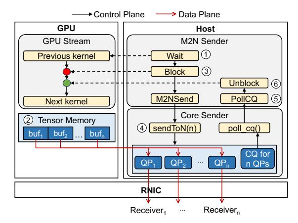
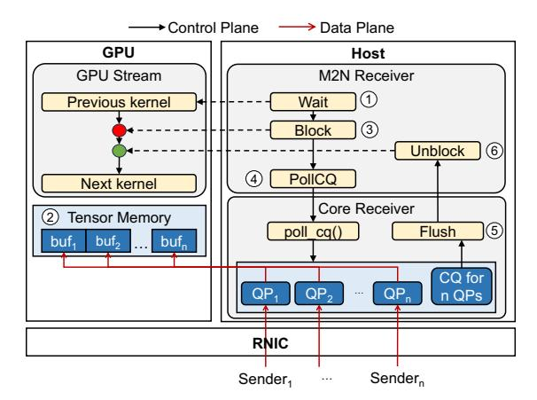
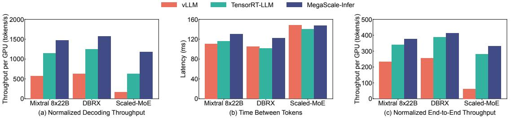
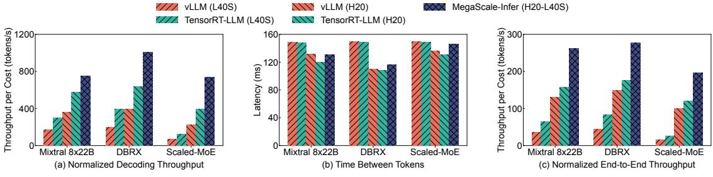
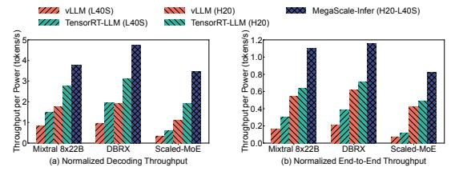
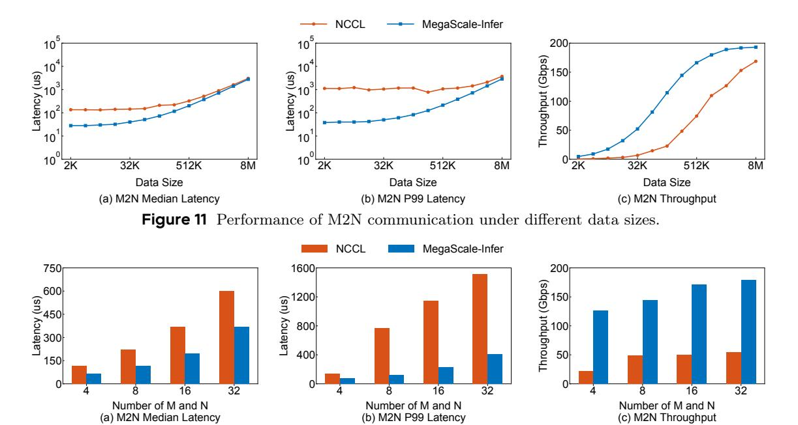
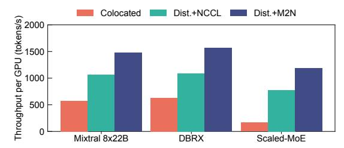
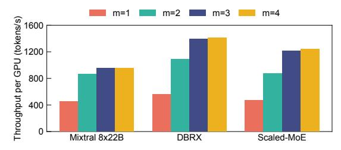
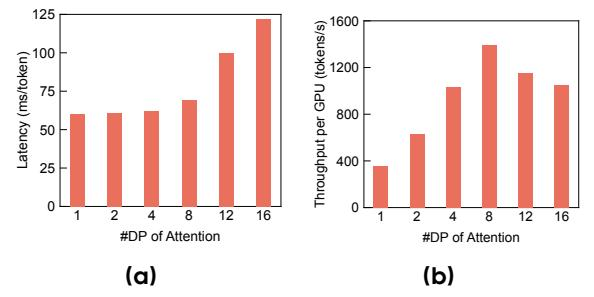
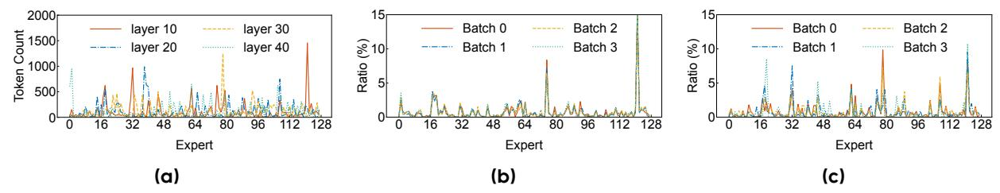

# 5 High-Performance M2N Communication

In MoE inference, token dispatch and aggregation (i.e., communication between attention and FFN modules) rely on peer-to-peer primitives, as the destinations are determined dynamically. To motivate the need for a custom communication library for token dispatch, we start by highlighting the limitations of the existing solution, NCCL [8]. Specifically, we compare NCCL to perftest [20], a networking microbenchmark designed to measure latency and throughput from the perspective of a simple CPU client, with convenient support for GPU memory buffers as both sources and destinations. We use perftest as a baseline to establish the lower bound of achievable latency, with data dynamically dispatched in a manner similar to token routing in MoE inference. Figure 5 presents the observed latency when a single sender transmits 128K bytes to each receiver in N, where |N|  $= \{8, 16, 32\}$ . Based on this experiment, we derive the following observations:

- **High additional overheads.** Figure 5(a) shows the median latency for both alternatives. While the scaling trends appear to follow similar patterns, the latency of NCCL significantly exceeds that of the baseline.
- Instability at higher percentiles. The performance issue highlighted in Figure 5(a) consistently exacerbates at higher percentiles, as shown in Figure 5(b). At the 99th percentile, the baseline experiences only a slight increase in latency, whereas NCCL exhibits a significant surge, particularly when scaling to 32 or more receivers.

The underlying causes of these issues are multifaceted,

Figure 6 M2N Sender components and interactions.

stemming from specific design choices in NCCL that are not well-suited for this particular use case. Regarding overhead, we first note that NCCL networking requires intermediate copies [11] to transfer data from the GPU memory to the CPU proxy, which performs the network operations. While features like user buffer registration [9] aim to reduce these copies, they do not fully eliminate them. Second, peer-to-peer group operations [10] are processed in batches of at most 8 operations, which causes a harmful effect as the number of receivers scales. Third, as a general-purpose collective communication library, NCCL incurs overhead from general group operation setup, including preparing and launching a batch of N send operations, internal handling and verifications, etc. While these steps are essential for ensuring broad applicability, they introduce unnecessary latency and can be optimized, though not entirely eliminated. Regarding stability, this issue is much more complex and can arise from multiple sources, including OS, memory, networking, and GPU thermal differences [26, 39, 43, 66, 69, 78, 81]. Previous studies have highlighted that common sources of instability often arise from GPU synchronization operations and device memory accesses [41, 83], both of which are prevalent in NCCL but absent in the baseline.

Based on these insights, we build our high-performance communication library with the goal of eliminating unnecessary GPU-to-CPU copies, group initialization/handling overhead, and GPU synchronization/memory accesses. Figures 6 and 7 illustrate the sender and receiver architectures and their interactions within our M2N library.

**M2N Sender.** Figure 6 depicts the components of an M2N sender. In order to comply with the stream-oriented programming model, ① M2N senders utilize

Figure 7 M2N Receiver components and interactions.

CUDA events [12] to wait for previous kernels and make sure that the 2 pre-registered tensor to be transmitted is properly populated. Then, to ensure the next kernel in the stream starts after the transmission is complete, M2N senders utilize CUDA driver operations [15] to 3 block the stream. Once the stream is blocked, the data transmission proceeds in two steps: First, @ our in-house CPU communication library (denoted as Core Sender in the figure) transmits the tensor efficiently using RDMA write with immediate [14]. Second, to guarantee proper utilization of the registered tensor, 5 the sender polls completions from the corresponding completion queue [13], confirming that data has been written to the remote buffers. Finally, M2N senders © unblock the stream by updating a shared memory flag, allowing other kernels to continue reusing the registered memory. This design eliminates complex GPU synchronization, GPU-to-CPU copies, and group initialization overhead, all of which contribute to significant latency issues, especially for relatively small tensor sizes, as demonstrated in Figures 11 and 12.

M2N Receiver. Figure 7 illustrates the components of an M2N Receiver. Just like its peer component, M2N receivers also need to adhere to the stream-oriented programming model. Specifically, they ① wait on CUDA events to ensure that the ② pre-registered tensor is no longer in use, and ③ block the stream to guarantee that subsequent kernels do not proceed until the operation is complete. Once the stream is blocked, the data collection proceeds in two steps: First, receivers must verify that data has been successfully transmitted from the corresponding senders, which is efficiently achieved by ④ polling the relevant completion queue. Second, to ensure data consistency at the GPU level, our in-house CPU communication library (denoted as Core Receiver in the

figure) leverages GDRCopy [\[16\]](#page-17-17) and performs a ⑤ flush operation [\[1\]](#page-17-18). Finally, M2N receivers ⑥ unblock the stream by updating a shared memory flag, allowing other kernels to continue utilizing the registered memory. This simpler design eliminates the need for GPU-to-GPU copies and effectively reduces the GPU utilization overhead of receivers.

**Traffic-oriented optimizations.** We also introduce several traffic-oriented optimizations derived from our empirical observations during the scale-testing of our design.

- **High-priority ACKs.** We initially observed latency degradation in bidirectional communication with ping-pong pipeline parallelism. A detailed analysis revealed that ACK packets were often queued or transmitted with low priority (e.g., round-robin scheduling), leading to a large number of QP packets. Therefore, the receiving side experienced delays in responding to ACK packets, causing bottlenecks for M2N senders. To address this issue, we assign ACK packets to high-priority queues, isolating them from data packets, and fine-tuning the associated weight configurations empirically.
- **Congestion control fine-tuning.** We observed substantial latency degradations in unbalanced communication scenarios, where the amount of data to be sent varies significantly per receiver. To address this, we fine-tune our congestion control algorithms to minimize rate-limiting effects and allow faster convergence.

**Comparison with DeepEP.** DeepEP [\[5,](#page-17-19) [35,](#page-18-0) [80\]](#page-23-6) proposed by DeepSeek also optimizes network communication for large-scale expert parallel serving in MoE. The key difference between our approach and DeepEP lies in the communication strategy: we leverage CPUs for inter-node communication, whereas DeepEP employs direct GPU-to-GPU communication without the involvement of CPU proxies [\[2\]](#page-17-20). GPUto-GPU communication approaches consume GPU compute resources on both the sender and receiver sides [\[19\]](#page-17-21). In contrast, our CPU-to-CPU communication avoids the need for GPU compute resource allocation, thereby allowing compute kernels to fully utilize the GPU. Moreover, GPU-to-GPU communication demands careful orchestration to mitigate contention between communication and computation kernels. DeepEP employs custom PTX (assemblylike) instructions [\[18\]](#page-17-22) to minimize L2 cache usage—a resource shared between kernel types. Our design, by comparison, does not require such low-level optimizations. When handling requests within a single

QP, the CPU achieves lower latency in our approach because its higher clock speed allows it to issue doorbells faster than the GPU. However, the GPU offers stronger parallel processing capabilities, with multiple SMs able to independently manage QPs. Consequently, DeepEP's approach can achieve a higher packet transmission rate at the cost of GPU SM resources and may yield better throughput when the packet size is very small. In our scenario, the amount of data transferred between each sender-receiver pair typically reaches several hundred kilobytes ([§7.3\)](#page-12-0). At this scale, a single-threaded CPU is sufficient to saturate the bandwidth. If the number of experts increases further and the per-connection communication volume becomes smaller, leveraging the GPU's superior parallel processing capabilities may offer greater advantages in terms of throughput.

## **6 Implementation**

**Fused kernels.** To further improve efficiency and reduce latency, we implemented two types of fused kernels. The first one is to overlap the communication of TP with the adjacent computation. Although intranode TP typically uses high-speed interconnects like NVLINK for communication, it still introduces nonnegligible overhead. To address this issue, we utilize Flux [\[29\]](#page-17-23) to fuse communication with the adjacent GEMM operation, such as implementing an all-gather and the following GEMM in a single kernel. The second one is to fuse sequential memory-intensive operators. MoE includes several sequences of small memory-intensive operations. For example, attention nodes need to select top-k experts for each token after gating, compute intermediate results such as the number of tokens sent to each expert node and normalized token weights, and then perform data movement to scatter tokens to respective experts. We optimize this process by fusing these steps with the gating computation, reducing both kernel launch and memory access.

**High-performance M2N communication library.** We built our communication library as a Pytorch extension [\[21\]](#page-17-24) in around 4900 and 5000 lines of C/C++ and Python code, respectively. Our library is supported by technologies such as GPUDirect [\[17\]](#page-17-25) and GDRCopy. We also carefully design network monitoring tools to delve into network and traffic-related optimizations.

**Load balance.** In real-world traffic, the load across different experts can vary significantly. To achieve load balancing between hot and cold experts, we

| Model                  | #Layers | Hidden Size | #Experts | top-k | Intermediate Size |
|------------------------|---------|-------------|----------|-------|-------------------|
| Mixtral-8 $\times$ 22B | 56      | 6144        | 8        | 2     | 16384             |
| DBRX                   | 40      | 6144        | 16       | 4     | 10752             |
| Scaled-MoE             | 48      | 8192        | 32       | 4     | 8192              |

**Table 4** Model configurations.

deploy it with on-device redundancy based on expert popularity. Specifically, we address the optimization problem of distributing M experts across N nodes in expert deployments. The objective is to minimize  $\max_{j=1..N} C_j$ , where  $C_j = \sum_{i=1..M} x_{i,j} \cdot \max(a_i, K)$  represents the computational cost that corresponds to latency.  $x_{i,j}$  denotes the allocation fraction, with  $\sum_{j=1..N} x_{i,j} = 1$ .  $a_i$  represents the cost to calculate the active tokens of the expert i, and K represents the lowest cost for the cold experts. The algorithm employs a greedy approximation strategy to solve this optimization problem and generate an expert plan, based on traffic within a previous time period.

### 7 Evaluation

In this section, we first evaluate the end-to-end performance of MegaScale-Infer against state-of-the-art LLM serving systems across various models and hardware configurations, including a heterogeneous environment. Next, we demonstrate the effectiveness of high-performance M2N communication through micro-benchmarks. Additionally, we conduct an ablation study to analyze the impact of disaggregated architecture and M2N optimization on MegaScale-Infer's performance. We also present the effectiveness of ping-pong pipeline parallelism and deployment plans, highlighting the benefits of deployment plan optimization.

### 7.1 Experimental Setup

**Testbed.** We deploy MegaScale-Infer across two distinct clusters. The first cluster consists of eight nodes, each equipped with eight NVIDIA 80GB Ampere GPUs, 128 CPUs, 2 TB of host memory, and eight 200 Gbps Infiniband NICs. GPUs within the same node are interconnected via 400GB/s NVLINK. The second cluster is a heterogeneous setup, comprising two types of GPUs: NVIDIA H20 and L40S. H20 nodes are equipped with 900GB/s NVLINK and four 400 Gbps NICs, while L40S nodes utilize PCIe for intra-node communication and two 400 Gbps NICs for inter-node communication. As shown in Table 3, H20 offers higher memory capacity and bandwidth but has less computational power than L40S.

Models and workload. We evaluate MegaScale-Infer

using Mixtral 8x22B [70], DBRX [71], and a Scaled-MoE, which shares a similar structure but includes more experts. They contain 141B, 132B, and 317B parameters, respectively. The model configurations are detailed in Table 4. For all experiments, the data types for weights, activations, and KV cache are bfloat16. We obtain a dataset from our production and use it as the experimental workload. The median input and output length are 571 and 159 tokens, respectively.

**Baselines.** We compare MegaScale-Infer with two state-of-the-art serving systems: vLLM [51] and TensorRT-LLM [57]. Both systems support popular techniques for LLM serving, including FlashAttention [33], PagedAttention [51], and continuous batching [79]. They primarily rely on tensor parallelism for distributed LLM serving, with TensorRT-LLM additionally supporting expert parallelism for expert layers. For larger models requiring inter-node communication, both systems also support pipeline parallelism. Due to GPU memory limits and large model sizes, serving Mixtral 8x22B and DBRX with these baselines requires a minimum of 8 GPUs, while Scaled-MoE necessitates multi-node deployment. The Attention-FFN disaggregation architecture within MegaScale-Infer naturally adapts to prefill/decoding (P/D) disaggregation, effectively preventing interference between these two phases. Existing baselines are still in the process of supporting or optimizing P/D disaggregation. To ensure a fair comparison and to accurately quantify the performance gains under P/D disaggregation, we evaluate all baselines and MegaScale-Infer by temporally separating their prefill and decoding phases. Specifically, when measuring decoding throughput and time between tokens, we exclude the prefill phase and consider only the iteration time and output tokens of the decoding phase.

Metrics. The primary objective of our work is to improve the efficiency of MoE inference during the decoding phase, which suffers from low GPU utilization due to its memory-bandwidth-bound nature. Enhancing decoding efficiency in MoE inference is the key to reducing overall serving costs. Therefore, we focus on maximizing the cost-normalized decoding throughput, subject to a specified time-betweentokens (TBT) latency constraint. Specifically, for homogeneous deployment, we use per-GPU decoding throughput, i.e., tokens generated per second, excluding the first output token, divided by the number of GPUs, as the primary metric. For heterogeneous deployment, we report per-cost decoding throughput. Following prior work [82], we set the TBT require-

Figure 8 Performance of MegaScale-Infer on NVIDIA Ampere GPUs.

ment to 150 milliseconds. We also report the mean time between tokens corresponding to the throughput results. While our primary contribution lies in improving the efficiency of the decoding phase, we also report end-to-end throughput results that include the generation of the first output token. This offers a more comprehensive evaluation of MegaScale-Infer's performance improvements across both the prefill and decoding phases. Notably, we observe that heterogeneous deployment also yields benefits for the prefill phase. We present the throughput per unit power under heterogeneous deployment. Additionally, we present the median and tail latency and throughput of M2N communication.

## 7.2 End-to-end Experiment

Homogeneous deployment. We first evaluate the performance of MegaScale-Infer with different MoE models on NVIDIA 80GB Ampere GPUs. Both vLLM and TensorRT-LLM serve Mixtral 8x22B and DBRX on a single node and serve Scaled-MoE across two nodes. The results are presented in Figure 8. Since vLLM deploys and serves the model as a whole, the batch size for the expert modules tends to be small, resulting in low GPU utilization. TensorRT-LLM achieves higher throughput than vLLM through custom kernel optimizations, but it also adopts a holistic service approach, which means it cannot avoid the issue of low GPU utilization in the FFN modules. By separating the attention and FFN modules, MegaScale-Infer aggregates batched requests from multiple attention modules, which increases the FFN batch size. This shift helps transition FFN from being memory-intensive to compute-intensive, thereby improving GPU utilization. As a result, MegaScale-Infer achieves 2.56× and 1.28× higher per-GPU decoding throughput than vLLM and TensorRT-LLM, as shown in Figure 8(a). For Scaled-MoE, the expensive inter-node communication overhead, coupled with certain implementation limitations in a multi-node environment, results in even lower GPU utilization for the baselines. In contrast, MegaScale-Infer is deployed across multiple nodes for all models due to its disaggregated deployment, but it overlaps computation and communication through the design of pingpong pipeline parallelism. Consequently, MegaScale-Infer improves the decoding throughput per GPU for Scaled-MoE by  $7.11\times$  and  $1.90\times$  compared to vLLM and TensorRT-LLM, respectively.

Figure 8(b) shows the mean time between tokens of MegaScale-Infer and the baselines corresponding to the decoding throughput in Figure 8(a). Due to the disaggregation of attention and expert modules, MegaScale-Infer introduces cross-node communication at every layer, which affects latency. Ping-pong pipeline parallelism, while overlapping communication with computation across micro-batches, does not reduce the per-token latency for an individual micro-batch. Aiming for full GPU utilization, this approach may even incur additional latency, as indicated by constraint 3. Nevertheless, MegaScale-Infer effectively mitigates the communication overhead by employing a high-performance M2N communication library. As a result, MegaScale-Infer achieves a time between tokens comparable to those of the baseline systems.

Figure 8(c) shows the end-to-end per-GPU throughput including the prefill phase. As the prefill phase is predominantly compute-bound, our approach does not yield performance improvements for this stage under homogeneous deployments. Consequently, when the prefill phase is taken into account, the overall end-to-end performance gain is less pronounced compared to the decoding phase alone. Nevertheless, MegaScale-Infer still achieves up to a  $1.18 \times$  improvement in throughput, demonstrating its effectiveness in end-to-end scenarios.

Heterogeneous deployment. To demonstrate the benefits of MegaScale-Infer under heterogeneous deployment, we build a cluster consisting of NVIDIA H20 and L40S GPUs and conduct experiments on it. Since neither vLLM nor TensorRT-LLM supports heterogeneous deployment, we separately evaluate them on H20 and L40S. To fully leverage the capacity of each

Figure 9 Performance of MegaScale-Infer on NVIDIA H20 and L40S GPUs.

**Figure 10** Throughput per unit power of MegaScale-Infer on NVIDIA H20 and L40S GPUs.

GPU type, MegaScale-Infer assigns H20 for attention modules and L40S for experts. Figure 9(a) presents the performance measured by decoding throughput per unit cost. Here we define cost with the normalized purchase price as shown in Table 3, which can easily be replaced by the rental price for cloud service users. Due to the 48GB memory capacity of L40S, all models in both baselines require a multi-node setup. In addition, the relatively weak intra-node and inter-node communication performance of the L40S leads to low GPU utilization for both vLLM and TensorRT-LLM. In contrast, H20 is more suitable for LLM serving due to its large memory capacity, higher bandwidth, and faster communication. As a result, vLLM and TensorRT-LLM achieve higher decoding throughput on H20. However, the L40S also offers unique advantages, particularly its high compute power per unit cost, making it well-suited for executing compute-intensive tasks. Our heterogeneous deployment simultaneously maximizes the advantages of the high bandwidth of H20 and the cost-effective compute power of L40S. This results in an improvement of up to  $3.24\times$  and  $1.86\times$  on the unit cost decoding throughput compared to vLLM and TensorRT-LLM on H20, respectively.

The latency results corresponding to Figure 9(a) are shown in Figure 9(b). Similar to the homogeneous deployment scenario, the mean time between tokens under heterogeneous deployment remains comparable to those of the baselines. Moreover, when compared to the baselines deployed exclusively on L40S GPUs, our approach achieves slightly improved latency per-

formance.

We further apply heterogeneous deployment to the prefill phase and report the end-to-end throughput results, including prefill computation, in Figure 9(c). While heterogeneous deployment does not enhance resource utilization during the prefill phase, it effectively reduces inference costs by offloading expert computations to the more cost-efficient L40S GPUs. As a result, when evaluating end-to-end performance across both the prefill and decoding phases, MegaScale-Infer achieves up to a  $1.66\times$  improvement in throughput per unit cost compared to the baselines. In summary, MegaScale-Infer is particularly well-suited for heterogeneous deployment, as it significantly lowers inference costs across the entire serving pipeline.

We also evaluate the impact of heterogeneous deployment on power, and the results are presented in Figure 10. Since the H20 and L40S GPUs each offer lower energy consumption per unit of bandwidth and compute, respectively, heterogeneous deployment across these two GPU types can also improve throughput per unit power. This improvement is observed in both the decoding and prefill phases. As shown in Figure 10(a) and (b), our system achieves  $1.80 \times$  and  $1.72 \times$  higher decoding and end-to-end throughput per unit power, respectively, compared to the baseline.

### 7.3 Performance of M2N Communication

We evaluate the performance of M2N communication under varying data sizes and different numbers of senders and receivers. Each sender and receiver is a GPU equipped with a 200Gbps NIC. The data size is defined as the bytes transmitted from one sender to one receiver. In our MoE serving scenarios, data sizes range from hundreds of kilobytes. For instance, serving Mixtral 8x22B with a micro-batch size of 128 and tensor parallelism of 2 for attention nodes requires each attention GPU to send an average of 196,608 bytes to each expert GPU, calcu-

Figure 12 Performance of M2N communication under different number of senders (M) and receivers (N).

lated as  $\#tokens \times topk/\#experts \times hidden\_size \times size of (datatype)/TP = 128 \times 2/8 \times 6144 \times 2/2$ .

Figure 11 illustrates how the latency and throughput of M2N vary with different data sizes. In this experiment, we set the number of senders and receivers to 8. Overall, MegaScale-Infer achieves lower latency and higher throughput than NCCL across all data sizes. NCCL incurs substantial overhead for small data sizes due to additional data copies and group operations. To mitigate these overheads, we design and implement a highly optimized communication library, resulting in up to an 80.8% reduction in median latency, as shown in Figure 11(a). Additionally, NCCL suffers from high tail latency due to its inherent instability. We address this issue by eliminating GPU synchronization and group initialization. As depicted in Figure 11(b), we achieve up to 96.2% reduction in P99 latency compared to NCCL. These optimizations enable MegaScale-Infer to improve throughput by up to 9.9×. For commonly used data sizes in model serving, such as 256KB, MegaScale-Infer achieves improvements of 68.2% in median latency, 92.9% in tail latency, and a  $4.2\times$  increase in throughput.

We also scale the number of senders (M) and receivers (N) while keeping the data size fixed at 256 KB. The results are shown in Figure 12. MegaScale-Infer consistently outperforms NCCL across all configurations. As M and N increase, NCCL experiences greater instability, resulting in higher tail latency. In contrast, our M2N library maintains stable performance through

comprehensive traffic-oriented optimization, particularly congestion control fine-tuning. This stability enables MegaScale-Infer to reduce tail latency by 54.7%-96.9% and improve throughput by  $3.3\times$ - $5.8\times$ .

### 7.4 Ablation Study

Effectiveness of disaggregated expert parallelism and M2N optimization. Figure 13 illustrates the performance gains achieved on Ampere GPUs through disaggregated expert parallelism and M2N communication optimizations. We select vLLM as the baseline, as it colocates attention and expert modules, and its kernel performance—particularly for matrix multiplication and attention operations—is comparable to our implementation. By adopting a disaggregated architecture, requests from multiple attention modules can be aggregated, thereby increasing the effective batch size on the expert side and improving the computational efficiency of expert modules. As a result, even when using NCCL as the backend for M2N communication, the disaggregated approach achieves up to a 4.66× throughput improvement over the colocated baseline. By leveraging our optimized M2N communication library, we further reduce communication overhead, enabling the M2N communication time of a single micro-batch to fall below its computation time (satisfying constraint 2). As a result, communication can be fully overlapped with computation through the use of the ping-pong pipeline, leading to an additional throughput improvement of up to  $1.53 \times$ .

**Figure 13** Effectiveness of disaggregated expert parallelism and M2N optimization.

**Figure 14** Normalized decoding throughput under different numbers of micro-batch.

#### Effectiveness of ping-pong pipeline parallelism.

First, we conduct an ablation study by varying the number of micro-batches (m) while keeping the microbatch size constant. To fully demonstrate the benefits of ping-pong pipeline parallelism, we adopt the optimal deployment plan where the computation times of attention and FFN modules are nearly balanced. Figure 14 presents the evaluation results on Ampere GPUs. When m=1, ping-pong pipeline parallelism is disabled, leading to idle periods for either attention or FFN module while the other is computing. This results in relatively low decoding throughput across all models. Increasing m from 1 to 2 enables both modules to simultaneously process two micro-batches in a ping-pong manner, significantly reducing idle time and improving throughput by  $1.9\times$ . While m=2is ideally sufficient to achieve high GPU utilization, inter-node communication overhead remains a significant factor. By increasing m to 3, we enable the overlapping of communication and computation, resulting in throughput improvements of  $1.10 \times$ ,  $1.28 \times$ , and 1.38× for Mixtral 8x22B, DBRX, and Scaled-MoE, respectively. Larger models require more GPUs for serving, leading to increased communication overhead. Consequently, increasing m provides more significant benefits for larger models. Given the high network bandwidth in our testbed, further increasing m yields only marginal improvements.

**Influence of deployment plan.** We further investigate the impact of the deployment plan using DBRX as a case study by varying the degree of data parallelism (DP), i.e., the number of replicas for the attention

**Figure 15** Performance of DBRX under different DP degree of attention. (a) Per output token latency. (b) Decoding throughput normalized by number of GPUs.

nodes. The number of micro-batches is fixed at 3 to maximize the benefits of ping-pong pipeline parallelism. Figure 15 shows the resulting latency and throughput. With a small DP degree, each expert processes fewer tokens, leading to a shorter computation time for the FFN module compared to the attention. As a result, expert nodes experience significant idle time, even with ping-pong pipeline parallelism employed. As shown in Figure 15a, the latency remains constant as the DP degree increases from 1 to 4, suggesting that the attention module is the bottleneck. Meanwhile, Figure 15b demonstrates linear throughput scaling within this range, further confirming that the bottleneck is in the attention module. When the DP degree reaches 8, the computation times for both attention and FFN become roughly equal, allowing both modules to stay busy during inference. As seen in Figure 15, the latency in this case is similar to that with a lower DP degree, while the normalized decoding throughput reaches its peak. As the DP degree continues to increase, expert nodes are assigned more tokens, causing the bottleneck to shift from attention to experts. This leads to higher latency and reduced normalized throughput, as attention nodes experience significant idle time. This experiment showcases the importance of optimizing the deployment plan. Only certain deployment plans can minimize idle time and maximize GPU utilization.

## 8 Deployment Experience

MegaScale-Infer has been deployed in the company's production inference services and is operating on a cluster with nearly 10,000 GPUs. Under heterogeneous deployment, it reduces the cost of serving the same traffic by  $1.5-2.0\times$ , depending on the workload characteristics.

**Expert balance.** In real-world deployment, we gained additional insights into expert load distribution. Figure 16a illustrates the number of tokens processed

Figure 16 Expert load distribution in real traffic. (a) Received token count of each expert in a batch. (b) Received token ratio of each expert during decoding. (c) Received token ratio of each expert during prefill.

by each expert across four model layers for a single batch. There is a significant imbalance in the load distribution, with some experts being substantially hotter than others. Further analysis of different phases reveals additional patterns. As shown in Figures 16b and 16c, we sample four batches executed within a short time window and measure the load on all experts in a specific layer. During the decoding phase, expert load remains relatively stable across batches, whereas in the prefill phase, it fluctuates more significantly. These observations motivate us to adopt a static or periodic expert load balancing strategy during decoding, while employing more frequent expert plan adjustments in the prefill phase.

Attention balance. We also observe load imbalance on the attention side. Due to variations in sequence lengths, attention nodes can experience significantly different computation times even when processing batches of the same size. Since MegaScale-Infer performs frequent synchronization across all nodes, such imbalances can introduce bubbles and degrade overall system efficiency. To mitigate this issue, we profile the runtime of key operators under varying sequence lengths and batch sizes to estimate the computation time of a given batch. We then compose the batch on each attention node to match a predefined target execution time, thereby balancing the workload across nodes.

### 9 Related Work

LLM serving. Recently, numerous works have been proposed to optimize LLM inference. Orca [79] introduces iteration-level scheduling to improve throughput. vLLM [51] enhances KV cache management through PagedAttention for greater efficiency. Sarathi-Serve [23] addresses the throughput-latency tradeoff by splitting prefill requests into chunks and batching them with ongoing decoding requests. LoongServe [75] leverages elastic sequence parallelism to efficiently serve long-context requests in dynamic workloads. For serving multiple instances, Llum-

nix [68], ServerlessLLM [37], and dLoRA [76] propose request migration techniques to enable load balancing and reduce latency. However, their approaches primarily focus on dense models, often overlooking the distinct challenges introduced by the sparsity of large-scale MoE models.

Resource disaggregation. Disaggregating hardware resources into separate resource pools allows for independent scaling, resulting in more efficient deployments. Several systems [40, 64] adopt this approach. In the context of LLM serving, the distinct characteristics of the prefill and decoding phases make their disaggregation a widely used solution [44, 60, 61, 67, 82]. MegaScale-Infer also employs this approach and further optimizes MoE serving efficiency during decoding by disaggregating attention and FFN modules. FAST-DECODE [42], Lamina [31], and MoE-Lightning [28] offload attention computation to cheaper devices, such as CPU, during decoding. However, offloading results in higher latency, and the challenges posed by MoE's sparsity remain unresolved.

MoE optimization. MoE has gained popularity for its ability to reduce computational complexity [35, 36, 52, 62, 77]. Currently, two primary considerations in optimizing MoE training and inference are load balancing [32, 53] and efficient communication [46, 53, 55, 62]. Serving large-scale MoE with limited resources also demands efficient offloading and preloading [28, 47]. In this work, we focus on large-scale distributed serving, addressing the unique inefficiencies introduced by MoE's sparsity through disaggregation.

Collective communication for ML. Distributed machine learning jobs heavily rely on high-performance collective communications, such as all-reduce and all-to-all, to achieve high throughput and low latency. NVIDIA NCCL [8] is the most popular collective communication library in both industry and academia. SCCL [27], TACCL [63], and TE-CCL [56] propose automatic synthesis of optimal collective communication algorithms tailored to distinct hardware and

topologies. CoCoNET [\[48\]](#page-21-11) and Centauri [\[30\]](#page-17-30) improve performance by overlapping communication with computation in distributed machine learning. The disaggregation of attention and FFN in MoE necessitates a new form of collective communication, i.e., M2N. We identify and eliminate the overhead and instability present in existing solutions.

## **10 Conclusion**

In this paper, we present MegaScale-Infer, a system that disaggregates the attention and FFN modules to enhance the efficiency and cost-effectiveness of large-scale MoE serving. Leveraging this disaggregation architecture, MegaScale-Infer builds the optimal deployment plan with a ping-pong parallelism strategy and a high-performance M2N communication library. The evaluation results across diverse models and hardware demonstrate that MegaScale-Infer achieves up to 1.9× throughput improvement over state-of-the-art systems, highlighting the effectiveness of our design and implementation.

## **References**

- [1] NCCL GDR Flush Operation. [https://github.c](https://github.com/NVIDIA/nccl/issues/683) [om/NVIDIA/nccl/issues/683](https://github.com/NVIDIA/nccl/issues/683), 2022.
- [2] NVIDIA GPUDirect async. [https://developer.nv](https://developer.nvidia.com/blog/improving-network-performance-of-hpc-systems-using-nvidia-magnum-io-nvshmem-and-gpudirect-async/) [idia.com/blog/improving-network-performance](https://developer.nvidia.com/blog/improving-network-performance-of-hpc-systems-using-nvidia-magnum-io-nvshmem-and-gpudirect-async/) [-of-hpc-systems-using-nvidia-magnum-io-nvs](https://developer.nvidia.com/blog/improving-network-performance-of-hpc-systems-using-nvidia-magnum-io-nvshmem-and-gpudirect-async/) [hmem-and-gpudirect-async/](https://developer.nvidia.com/blog/improving-network-performance-of-hpc-systems-using-nvidia-magnum-io-nvshmem-and-gpudirect-async/), 2022.
- [3] Chatgpt. <https://chatgpt.com/>, 2025.
- [4] Cursor. <https://www.cursor.com/>, 2025.
- [5] Deepep: an efficient expert-parallel communication library. <https://github.com/deepseek-ai/DeepEP>, 2025.
- [6] Gemini. <https://gemini.google.com/app>, 2025.
- [7] Github copilot. [https://github.com/features/co](https://github.com/features/copilot) [pilot](https://github.com/features/copilot), 2025.
- [8] NCCL Optimized primitives for inter-GPU communication. <https://github.com/NVIDIA/nccl/>, 2025.
- [9] NCCL User-buffer Registration. [https://docs.n](https://docs.nvidia.com/deeplearning/nccl/user-guide/docs/usage/bufferreg.html) [vidia.com/deeplearning/nccl/user-guide/docs/](https://docs.nvidia.com/deeplearning/nccl/user-guide/docs/usage/bufferreg.html) [usage/bufferreg.html](https://docs.nvidia.com/deeplearning/nccl/user-guide/docs/usage/bufferreg.html), 2025.
- [10] NCCL Group Operations. [https://docs.nvidia.](https://docs.nvidia.com/deeplearning/nccl/user-guide/docs/usage/groups.html) [com/deeplearning/nccl/user-guide/docs/usag](https://docs.nvidia.com/deeplearning/nccl/user-guide/docs/usage/groups.html) [e/groups.html](https://docs.nvidia.com/deeplearning/nccl/user-guide/docs/usage/groups.html), 2025.
- [11] NCCL Data Transfer Between GPU and Proxy. [http](https://github.com/NVIDIA/nccl/issues/852) [s://github.com/NVIDIA/nccl/issues/852](https://github.com/NVIDIA/nccl/issues/852), 2025.
- [12] CUDA runtime API: cudaEventQuery. [https://do](https://docs.nvidia.com/cuda/cuda-runtime-api/group__CUDART__EVENT.html##group__CUDART__EVENT_1g2bf738909b4a059023537eaa29d8a5b7) [cs.nvidia.com/cuda/cuda-runtime-api/group\\_\\_](https://docs.nvidia.com/cuda/cuda-runtime-api/group__CUDART__EVENT.html##group__CUDART__EVENT_1g2bf738909b4a059023537eaa29d8a5b7) [CUDART\\_\\_EVENT.html#group\\_\\_CUDART\\_\\_EVENT\\_1g](https://docs.nvidia.com/cuda/cuda-runtime-api/group__CUDART__EVENT.html##group__CUDART__EVENT_1g2bf738909b4a059023537eaa29d8a5b7) [2bf738909b4a059023537eaa29d8a5b7](https://docs.nvidia.com/cuda/cuda-runtime-api/group__CUDART__EVENT.html##group__CUDART__EVENT_1g2bf738909b4a059023537eaa29d8a5b7), 2025.
- [13] NVIDIA RDMA Key Concepts. [https://docs.nvi](https://docs.nvidia.com/networking/display/rdmaawareprogrammingv17/key+concepts) [dia.com/networking/display/rdmaawareprogra](https://docs.nvidia.com/networking/display/rdmaawareprogrammingv17/key+concepts) [mmingv17/key+concepts](https://docs.nvidia.com/networking/display/rdmaawareprogrammingv17/key+concepts), 2025.
- [14] NVIDIA Available RDMA Operations. [https://do](https://docs.nvidia.com/networking/display/rdmaawareprogrammingv17/available+communication+operations) [cs.nvidia.com/networking/display/rdmaaware](https://docs.nvidia.com/networking/display/rdmaawareprogrammingv17/available+communication+operations) [programmingv17/available+communication+ope](https://docs.nvidia.com/networking/display/rdmaawareprogrammingv17/available+communication+operations) [rations](https://docs.nvidia.com/networking/display/rdmaawareprogrammingv17/available+communication+operations), 2025.
- [15] CUDA driver API: cuStreamWaitValue32. [https:](https://docs.nvidia.com/cuda/cuda-driver-api/group__CUDA__MEMOP.html##group__CUDA__MEMOP_1g629856339de7bc6606047385addbb398) [//docs.nvidia.com/cuda/cuda-driver-api/gro](https://docs.nvidia.com/cuda/cuda-driver-api/group__CUDA__MEMOP.html##group__CUDA__MEMOP_1g629856339de7bc6606047385addbb398) [up\\_\\_CUDA\\_\\_MEMOP.html#group\\_\\_CUDA\\_\\_MEMOP\\_1g](https://docs.nvidia.com/cuda/cuda-driver-api/group__CUDA__MEMOP.html##group__CUDA__MEMOP_1g629856339de7bc6606047385addbb398) [629856339de7bc6606047385addbb398](https://docs.nvidia.com/cuda/cuda-driver-api/group__CUDA__MEMOP.html##group__CUDA__MEMOP_1g629856339de7bc6606047385addbb398), 2025.
- [16] NVIDIA GDR Copy. [https://github.com/NVIDI](https://github.com/NVIDIA/gdrcopy) [A/gdrcopy](https://github.com/NVIDIA/gdrcopy), 2025.
- [17] NVIDIA GPUDirect. [https://developer.nvidia](https://developer.nvidia.com/gpudirect) [.com/gpudirect](https://developer.nvidia.com/gpudirect), 2025.
- [18] NVIDIA PTX. [https://developer.nvidia.com/b](https://developer.nvidia.com/blog/understanding-ptx-the-assembly-language-of-cuda-gpu-computing/) [log/understanding-ptx-the-assembly-languag](https://developer.nvidia.com/blog/understanding-ptx-the-assembly-language-of-cuda-gpu-computing/) [e-of-cuda-gpu-computing/](https://developer.nvidia.com/blog/understanding-ptx-the-assembly-language-of-cuda-gpu-computing/), 2025.

- [19] NVIDIA Streaming multiprocessors. [https://docs](https://docs.nvidia.com/cuda/ampere-tuning-guide/index.html##streaming-multiprocessor) [.nvidia.com/cuda/ampere-tuning-guide/index](https://docs.nvidia.com/cuda/ampere-tuning-guide/index.html##streaming-multiprocessor) [.html#streaming-multiprocessor](https://docs.nvidia.com/cuda/ampere-tuning-guide/index.html##streaming-multiprocessor), 2025.
- [20] OFED Performance Tests. [https://github.com/l](https://github.com/linux-rdma/perftest) [inux-rdma/perftest](https://github.com/linux-rdma/perftest), 2025.
- [21] Torch Custom C++ and CUDA Extensions. [https:](https://pytorch.org/tutorials/advanced/cpp_extension.html) [//pytorch.org/tutorials/advanced/cpp\\_extensi](https://pytorch.org/tutorials/advanced/cpp_extension.html) [on.html](https://pytorch.org/tutorials/advanced/cpp_extension.html), 2025.
- [22] Nvidia triton inference server. [https://developer.](https://developer.nvidia.com/triton-inference-server) [nvidia.com/triton-inference-server](https://developer.nvidia.com/triton-inference-server), 2025.
- [23] Amey Agrawal, Nitin Kedia, Ashish Panwar, Jayashree Mohan, Nipun Kwatra, Bhargav Gulavani, Alexey Tumanov, and Ramachandran Ramjee. Taming Throughput-Latency tradeoff in LLM inference with Sarathi-Serve. In USENIX OSDI, 2024.
- [24] Joshua Ainslie, James Lee-Thorp, Michiel de Jong, Yury Zemlyanskiy, Federico Lebrón, and Sumit Sanghai. Gqa: Training generalized multi-query transformer models from multi-head checkpoints. arXiv preprint arXiv:2305.13245, 2023.
- [25] Anthropic. Introducing the next generation of claude. [https://www.anthropic.com/news/claude-3-fam](https://www.anthropic.com/news/claude-3-family) [ily](https://www.anthropic.com/news/claude-3-family), 2025.
- [26] Pete Beckman, Kamil Iskra, Kazutomo Yoshii, and Susan Coghlan. The influence of operating systems on the performance of collective operations at extreme scale. In IEEE International Conference on Cluster Computing, 2006.
- [27] Zixian Cai, Zhengyang Liu, Saeed Maleki, Madanlal Musuvathi, Todd Mytkowicz, Jacob Nelson, and Olli Saarikivi. Synthesizing optimal collective algorithms. In ACM PPoPP, 2021.
- [28] Shiyi Cao, Shu Liu, Tyler Griggs, Peter Schafhalter, Xiaoxuan Liu, Ying Sheng, Joseph E Gonzalez, Matei Zaharia, and Ion Stoica. Moe-lightning: Highthroughput moe inference on memory-constrained gpus. arXiv preprint arXiv:2411.11217, 2024.
- [29] Li-Wen Chang, Wenlei Bao, Qi Hou, Chengquan Jiang, Ningxin Zheng, Yinmin Zhong, Xuanrun Zhang, Zuquan Song, Chengji Yao, Ziheng Jiang, Haibin Lin, Xin Jin, and Xin Liu. Flux: Fast software-based communication overlap on gpus through kernel fusion. arXiv preprint arXiv:2406.06858, 2024.
- [30] Chang Chen, Xiuhong Li, Qianchao Zhu, Jiangfei Duan, Peng Sun, Xingcheng Zhang, and Chao Yang. Centauri: Enabling efficient scheduling for communication-computation overlap in large model training via communication partitioning. In ACM ASPLOS, 2024.
- [31] Shaoyuan Chen, Yutong Lin, Mingxing Zhang, and Yongwei Wu. Efficient and economic large language

- model inference with attention offloading. arXiv preprint arXiv:2405.01814, 2024.
- [32] Weihao Cui, Zhenhua Han, Lingji Ouyang, Yichuan Wang, Ningxin Zheng, Lingxiao Ma, Yuqing Yang, Fan Yang, Jilong Xue, Lili Qiu, Lidong Zhou, Quan Chen, Haisheng Tan, and Minyi Guo. Optimizing dynamic neural networks with brainstorm. In USENIX OSDI, 2023.
- [33] Tri Dao, Dan Fu, Stefano Ermon, Atri Rudra, and Christopher Ré. Flashattention: Fast and memoryefficient exact attention with io-awareness. Advances in Neural Information Processing Systems, 2022.
- [34] DeepSeek-AI, Aixin Liu, Bei Feng, Bin Wang, Bingxuan Wang, Bo Liu, Chenggang Zhao, Chengqi Dengr, Chong Ruan, Damai Dai, Daya Guo, Dejian Yang, Deli Chen, Dongjie Ji, Erhang Li, Fangyun Lin, Fuli Luo, Guangbo Hao, Guanting Chen, Guowei Li, H. Zhang, Hanwei Xu, Hao Yang, Haowei Zhang, Honghui Ding, Huajian Xin, Huazuo Gao, Hui Li, Hui Qu, J. L. Cai, Jian Liang, Jianzhong Guo, Jiaqi Ni, Jiashi Li, Jin Chen, Jingyang Yuan, Junjie Qiu, Junxiao Song, Kai Dong, Kaige Gao, Kang Guan, Lean Wang, Lecong Zhang, Lei Xu, Leyi Xia, Liang Zhao, Liyue Zhang, Meng Li, Miaojun Wang, Mingchuan Zhang, Minghua Zhang, Minghui Tang, Mingming Li, Ning Tian, Panpan Huang, Peiyi Wang, Peng Zhang, Qihao Zhu, Qinyu Chen, Qiushi Du, R. J. Chen, R. L. Jin, Ruiqi Ge, Ruizhe Pan, Runxin Xu, Ruyi Chen, S. S. Li, Shanghao Lu, Shangyan Zhou, Shanhuang Chen, Shaoqing Wu, Shengfeng Ye, Shirong Ma, Shiyu Wang, Shuang Zhou, Shuiping Yu, Shunfeng Zhou, Size Zheng, T. Wang, Tian Pei, Tian Yuan, Tianyu Sun, W. L. Xiao, Wangding Zeng, Wei An, Wen Liu, Wenfeng Liang, Wenjun Gao, Wentao Zhang, X. Q. Li, Xiangyue Jin, Xianzu Wang, Xiao Bi, Xiaodong Liu, Xiaohan Wang, Xiaojin Shen, Xiaokang Chen, Xiaosha Chen, Xiaotao Nie, Xiaowen Sun, Xiaoxiang Wang, Xin Liu, Xin Xie, Xingkai Yu, Xinnan Song, Xinyi Zhou, Xinyu Yang, Xuan Lu, Xuecheng Su, Y. Wu, Y. K. Li, Y. X. Wei, Y. X. Zhu, Yanhong Xu, Yanping Huang, Yao Li, Yao Zhao, Yaofeng Sun, Yaohui Li, Yaohui Wang, Yi Zheng, Yichao Zhang, Yiliang Xiong, Yilong Zhao, Ying He, Ying Tang, Yishi Piao, Yixin Dong, Yixuan Tan, Yiyuan Liu, Yongji Wang, Yongqiang Guo, Yuchen Zhu, Yuduan Wang, Yuheng Zou, Yukun Zha, Yunxian Ma, Yuting Yan, Yuxiang You, Yuxuan Liu, Z. Z. Ren, Zehui Ren, Zhangli Sha, Zhe Fu, Zhen Huang, Zhen Zhang, Zhenda Xie, Zhewen Hao, Zhihong Shao, Zhiniu Wen, Zhipeng Xu, Zhongyu Zhang, Zhuoshu Li, Zihan Wang, Zihui Gu, Zilin Li, and Ziwei Xie. Deepseek-v2: A strong, economical, and efficient mixture-of-experts language model. arXiv preprint arXiv:2405.04434, 2024.
- [35] DeepSeek-AI, Aixin Liu, Bei Feng, Bing Xue, Bingx-
- uan Wang, Bochao Wu, Chengda Lu, Chenggang Zhao, Chengqi Deng, Chenyu Zhang, Chong Ruan, Damai Dai, Daya Guo, Dejian Yang, Deli Chen, Dongjie Ji, Erhang Li, Fangyun Lin, Fucong Dai, Fuli Luo, Guangbo Hao, Guanting Chen, Guowei Li, H. Zhang, Han Bao, Hanwei Xu, Haocheng Wang, Haowei Zhang, Honghui Ding, Huajian Xin, Huazuo Gao, Hui Li, Hui Qu, J. L. Cai, Jian Liang, Jianzhong Guo, Jiaqi Ni, Jiashi Li, Jiawei Wang, Jin Chen, Jingchang Chen, Jingyang Yuan, Junjie Qiu, Junlong Li, Junxiao Song, Kai Dong, Kai Hu, Kaige Gao, Kang Guan, Kexin Huang, Kuai Yu, Lean Wang, Lecong Zhang, Lei Xu, Leyi Xia, Liang Zhao, Litong Wang, Liyue Zhang, Meng Li, Miaojun Wang, Mingchuan Zhang, Minghua Zhang, Minghui Tang, Mingming Li, Ning Tian, Panpan Huang, Peiyi Wang, Peng Zhang, Qiancheng Wang, Qihao Zhu, Qinyu Chen, Qiushi Du, R. J. Chen, R. L. Jin, Ruiqi Ge, Ruisong Zhang, Ruizhe Pan, Runji Wang, Runxin Xu, Ruoyu Zhang, Ruyi Chen, S. S. Li, Shanghao Lu, Shangyan Zhou, Shanhuang Chen, Shaoqing Wu, Shengfeng Ye, Shengfeng Ye, Shirong Ma, Shiyu Wang, Shuang Zhou, Shuiping Yu, Shunfeng Zhou, Shuting Pan, T. Wang, Tao Yun, Tian Pei, Tianyu Sun, W. L. Xiao, Wangding Zeng, Wanjia Zhao, Wei An, Wen Liu, Wenfeng Liang, Wenjun Gao, Wenqin Yu, Wentao Zhang, X. Q. Li, Xiangyue Jin, Xianzu Wang, Xiao Bi, Xiaodong Liu, Xiaohan Wang, Xiaojin Shen, Xiaokang Chen, Xiaokang Zhang, Xiaosha Chen, Xiaotao Nie, Xiaowen Sun, Xiaoxiang Wang, Xin Cheng, Xin Liu, Xin Xie, Xingchao Liu, Xingkai Yu, Xinnan Song, Xinxia Shan, Xinyi Zhou, Xinyu Yang, Xinyuan Li, Xuecheng Su, Xuheng Lin, Y. K. Li, Y. Q. Wang, Y. X. Wei, Y. X. Zhu, Yang Zhang, Yanhong Xu, Yanhong Xu, Yanping Huang, Yao Li, Yao Zhao, Yaofeng Sun, Yaohui Li, Yaohui Wang, Yi Yu, Yi Zheng, Yichao Zhang, Yifan Shi, Yiliang Xiong, Ying He, Ying Tang, Yishi Piao, Yisong Wang, Yixuan Tan, Yiyang Ma, Yiyuan Liu, Yongqiang Guo, Yu Wu, Yuan Ou, Yuchen Zhu, Yuduan Wang, Yue Gong, Yuheng Zou, Yujia He, Yukun Zha, Yunfan Xiong, Yunxian Ma, Yuting Yan, Yuxiang Luo, Yuxiang You, Yuxuan Liu, Yuyang Zhou, Z. F. Wu, Z. Z. Ren, Zehui Ren, Zhangli Sha, Zhe Fu, Zhean Xu, Zhen Huang, Zhen Zhang, Zhenda Xie, Zhengyan Zhang, Zhewen Hao, Zhibin Gou, Zhicheng Ma, Zhigang Yan, Zhihong Shao, Zhipeng Xu, Zhiyu Wu, Zhongyu Zhang, Zhuoshu Li, Zihui Gu, Zijia Zhu, Zijun Liu, Zilin Li, Ziwei Xie, Ziyang Song, Ziyi Gao, and Zizheng Pan. Deepseek-v3 technical report. arXiv preprint arXiv:2412.19437, 2024.
- [36] William Fedus, Barret Zoph, and Noam Shazeer. Switch transformers: Scaling to trillion parameter models with simple and efficient sparsity. Journal of Machine Learning Research, 2022.
- [37] Yao Fu, Leyang Xue, Yeqi Huang, Andrei-Octavian

Brabete, Dmitrii Ustiugov, Yuvraj Patel, and Luo Mai. ServerlessLLM: Low-Latency serverless inference for large language models. In USENIX OSDI, 2024.

[38] Aaron Grattafiori, Abhimanyu Dubey, Abhinav Jauhri, Abhinav Pandey, Abhishek Kadian, Ahmad Al-Dahle, Aiesha Letman, Akhil Mathur, Alan Schelten, Alex Vaughan, Amy Yang, Angela Fan, Anirudh Goyal, Anthony Hartshorn, Aobo Yang, Archi Mitra, Archie Sravankumar, Artem Korenev, Arthur Hinsvark, Arun Rao, Aston Zhang, Aurelien Rodriguez, Austen Gregerson, Ava Spataru, Baptiste Roziere, Bethany Biron, Binh Tang, Bobbie Chern, Charlotte Caucheteux, Chaya Nayak, Chloe Bi, Chris Marra, Chris McConnell, Christian Keller, Christophe Touret, Chunyang Wu, Corinne Wong, Cristian Canton Ferrer, Cyrus Nikolaidis, Damien Allonsius, Daniel Song, Danielle Pintz, Danny Livshits, Danny Wyatt, David Esiobu, Dhruv Choudhary, Dhruv Mahajan, Diego Garcia-Olano, Diego Perino, Dieuwke Hupkes, Egor Lakomkin, Ehab AlBadawy, Elina Lobanova, Emily Dinan, Eric Michael Smith, Filip Radenovic, Francisco Guzmán, Frank Zhang, Gabriel Synnaeve, Gabrielle Lee, Georgia Lewis Anderson, Govind Thattai, Graeme Nail, Gregoire Mialon, Guan Pang, Guillem Cucurell, Hailey Nguyen, Hannah Korevaar, Hu Xu, Hugo Touvron, Iliyan Zarov, Imanol Arrieta Ibarra, Isabel Kloumann, Ishan Misra, Ivan Evtimov, Jack Zhang, Jade Copet, Jaewon Lee, Jan Geffert, Jana Vranes, Jason Park, Jay Mahadeokar, Jeet Shah, Jelmer van der Linde, Jennifer Billock, Jenny Hong, Jenya Lee, Jeremy Fu, Jianfeng Chi, Jianyu Huang, Jiawen Liu, Jie Wang, Jiecao Yu, Joanna Bitton, Joe Spisak, Jongsoo Park, Joseph Rocca, Joshua Johnstun, Joshua Saxe, Junteng Jia, Kalyan Vasuden Alwala, Karthik Prasad, Kartikeya Upasani, Kate Plawiak, Ke Li, Kenneth Heafield, Kevin Stone, Khalid El-Arini, Krithika Iyer, Kshitiz Malik, Kuenley Chiu, Kunal Bhalla, Kushal Lakhotia, Lauren Rantala-Yeary, Laurens van der Maaten, Lawrence Chen, Liang Tan, Liz Jenkins, Louis Martin, Lovish Madaan, Lubo Malo, Lukas Blecher, Lukas Landzaat, Luke de Oliveira, Madeline Muzzi, Mahesh Pasupuleti, Mannat Singh, Manohar Paluri, Marcin Kardas, Maria Tsimpoukelli, Mathew Oldham, Mathieu Rita, Maya Pavlova, Melanie Kambadur, Mike Lewis, Min Si, Mitesh Kumar Singh, Mona Hassan, Naman Goyal, Narjes Torabi, Nikolay Bashlykov, Nikolay Bogoychev, Niladri Chatterji, Ning Zhang, Olivier Duchenne, Onur Çelebi, Patrick Alrassy, Pengchuan Zhang, Pengwei Li, Petar Vasic, Peter Weng, Prajjwal Bhargava, Pratik Dubal, Praveen Krishnan, Punit Singh Koura, Puxin Xu, Qing He, Qingxiao Dong, Ragavan Srinivasan, Raj Ganapathy, Ramon Calderer, Ricardo Silveira Cabral, Robert Stojnic, Roberta Raileanu, Rohan Maheswari, Rohit Girdhar, Rohit Patel, Romain Sauvestre, Ronnie Polidoro, Roshan Sumbaly, Ross

Taylor, Ruan Silva, Rui Hou, Rui Wang, Saghar Hosseini, Sahana Chennabasappa, Sanjay Singh, Sean Bell, Seohyun Sonia Kim, Sergey Edunov, Shaoliang Nie, Sharan Narang, Sharath Raparthy, Sheng Shen, Shengye Wan, Shruti Bhosale, Shun Zhang, Simon Vandenhende, Soumya Batra, Spencer Whitman, Sten Sootla, Stephane Collot, Suchin Gururangan, Sydney Borodinsky, Tamar Herman, Tara Fowler, Tarek Sheasha, Thomas Georgiou, Thomas Scialom, Tobias Speckbacher, Todor Mihaylov, Tong Xiao, Ujjwal Karn, Vedanuj Goswami, Vibhor Gupta, Vignesh Ramanathan, Viktor Kerkez, Vincent Gonguet, Virginie Do, Vish Vogeti, Vítor Albiero, Vladan Petrovic, Weiwei Chu, Wenhan Xiong, Wenyin Fu, Whitney Meers, Xavier Martinet, Xiaodong Wang, Xiaofang Wang, Xiaoqing Ellen Tan, Xide Xia, Xinfeng Xie, Xuchao Jia, Xuewei Wang, Yaelle Goldschlag, Yashesh Gaur, Yasmine Babaei, Yi Wen, Yiwen Song, Yuchen Zhang, Yue Li, Yuning Mao, Zacharie Delpierre Coudert, Zheng Yan, Zhengxing Chen, Zoe Papakipos, Aaditya Singh, Aayushi Srivastava, Abha Jain, Adam Kelsey, Adam Shajnfeld, Adithya Gangidi, Adolfo Victoria, Ahuva Goldstand, Ajay Menon, Ajay Sharma, Alex Boesenberg, Alexei Baevski, Allie Feinstein, Amanda Kallet, Amit Sangani, Amos Teo, Anam Yunus, Andrei Lupu, Andres Alvarado, Andrew Caples, Andrew Gu, Andrew Ho, Andrew Poulton, Andrew Ryan, Ankit Ramchandani, Annie Dong, Annie Franco, Anuj Goyal, Aparajita Saraf, Arkabandhu Chowdhury, Ashley Gabriel, Ashwin Bharambe, Assaf Eisenman, Azadeh Yazdan, Beau James, Ben Maurer, Benjamin Leonhardi, Bernie Huang, Beth Loyd, Beto De Paola, Bhargavi Paranjape, Bing Liu, Bo Wu, Boyu Ni, Braden Hancock, Bram Wasti, Brandon Spence, Brani Stojkovic, Brian Gamido, Britt Montalvo, Carl Parker, Carly Burton, Catalina Mejia, Ce Liu, Changhan Wang, Changkyu Kim, Chao Zhou, Chester Hu, Ching-Hsiang Chu, Chris Cai, Chris Tindal, Christoph Feichtenhofer, Cynthia Gao, Damon Civin, Dana Beaty, Daniel Kreymer, Daniel Li, David Adkins, David Xu, Davide Testuggine, Delia David, Devi Parikh, Diana Liskovich, Didem Foss, Dingkang Wang, Duc Le, Dustin Holland, Edward Dowling, Eissa Jamil, Elaine Montgomery, Eleonora Presani, Emily Hahn, Emily Wood, Eric-Tuan Le, Erik Brinkman, Esteban Arcaute, Evan Dunbar, Evan Smothers, Fei Sun, Felix Kreuk, Feng Tian, Filippos Kokkinos, Firat Ozgenel, Francesco Caggioni, Frank Kanayet, Frank Seide, Gabriela Medina Florez, Gabriella Schwarz, Gada Badeer, Georgia Swee, Gil Halpern, Grant Herman, Grigory Sizov, Guangyi, Zhang, Guna Lakshminarayanan, Hakan Inan, Hamid Shojanazeri, Han Zou, Hannah Wang, Hanwen Zha, Haroun Habeeb, Harrison Rudolph, Helen Suk, Henry Aspegren, Hunter Goldman, Hongyuan Zhan, Ibrahim Damlaj, Igor Molybog, Igor Tufanov, Ilias Leontiadis, Irina-Elena Veliche, Itai Gat, Jake Weissman, James

Geboski, James Kohli, Janice Lam, Japhet Asher, Jean-Baptiste Gaya, Jeff Marcus, Jeff Tang, Jennifer Chan, Jenny Zhen, Jeremy Reizenstein, Jeremy Teboul, Jessica Zhong, Jian Jin, Jingyi Yang, Joe Cummings, Jon Carvill, Jon Shepard, Jonathan McPhie, Jonathan Torres, Josh Ginsburg, Junjie Wang, Kai Wu, Kam Hou U, Karan Saxena, Kartikay Khandelwal, Katayoun Zand, Kathy Matosich, Kaushik Veeraraghavan, Kelly Michelena, Keqian Li, Kiran Jagadeesh, Kun Huang, Kunal Chawla, Kyle Huang, Lailin Chen, Lakshya Garg, Lavender A, Leandro Silva, Lee Bell, Lei Zhang, Liangpeng Guo, Licheng Yu, Liron Moshkovich, Luca Wehrstedt, Madian Khabsa, Manav Avalani, Manish Bhatt, Martynas Mankus, Matan Hasson, Matthew Lennie, Matthias Reso, Maxim Groshev, Maxim Naumov, Maya Lathi, Meghan Keneally, Miao Liu, Michael L. Seltzer, Michal Valko, Michelle Restrepo, Mihir Patel, Mik Vyatskov, Mikayel Samvelyan, Mike Clark, Mike Macey, Mike Wang, Miquel Jubert Hermoso, Mo Metanat, Mohammad Rastegari, Munish Bansal, Nandhini Santhanam, Natascha Parks, Natasha White, Navyata Bawa, Nayan Singhal, Nick Egebo, Nicolas Usunier, Nikhil Mehta, Nikolay Pavlovich Laptev, Ning Dong, Norman Cheng, Oleg Chernoguz, Olivia Hart, Omkar Salpekar, Ozlem Kalinli, Parkin Kent, Parth Parekh, Paul Saab, Pavan Balaji, Pedro Rittner, Philip Bontrager, Pierre Roux, Piotr Dollar, Polina Zvyagina, Prashant Ratanchandani, Pritish Yuvraj, Qian Liang, Rachad Alao, Rachel Rodriguez, Rafi Ayub, Raghotham Murthy, Raghu Nayani, Rahul Mitra, Rangaprabhu Parthasarathy, Raymond Li, Rebekkah Hogan, Robin Battey, Rocky Wang, Russ Howes, Ruty Rinott, Sachin Mehta, Sachin Siby, Sai Jayesh Bondu, Samyak Datta, Sara Chugh, Sara Hunt, Sargun Dhillon, Sasha Sidorov, Satadru Pan, Saurabh Mahajan, Saurabh Verma, Seiji Yamamoto, Sharadh Ramaswamy, Shaun Lindsay, Shaun Lindsay, Sheng Feng, Shenghao Lin, Shengxin Cindy Zha, Shishir Patil, Shiva Shankar, Shuqiang Zhang, Shuqiang Zhang, Sinong Wang, Sneha Agarwal, Soji Sajuyigbe, Soumith Chintala, Stephanie Max, Stephen Chen, Steve Kehoe, Steve Satterfield, Sudarshan Govindaprasad, Sumit Gupta, Summer Deng, Sungmin Cho, Sunny Virk, Suraj Subramanian, Sy Choudhury, Sydney Goldman, Tal Remez, Tamar Glaser, Tamara Best, Thilo Koehler, Thomas Robinson, Tianhe Li, Tianjun Zhang, Tim Matthews, Timothy Chou, Tzook Shaked, Varun Vontimitta, Victoria Ajayi, Victoria Montanez, Vijai Mohan, Vinay Satish Kumar, Vishal Mangla, Vlad Ionescu, Vlad Poenaru, Vlad Tiberiu Mihailescu, Vladimir Ivanov, Wei Li, Wenchen Wang, Wenwen Jiang, Wes Bouaziz, Will Constable, Xiaocheng Tang, Xiaojian Wu, Xiaolan Wang, Xilun Wu, Xinbo Gao, Yaniv Kleinman, Yanjun Chen, Ye Hu, Ye Jia, Ye Qi, Yenda Li, Yilin Zhang, Ying Zhang, Yossi Adi, Youngjin Nam, Yu, Wang, Yu Zhao, Yuchen Hao,

- Yundi Qian, Yunlu Li, Yuzi He, Zach Rait, Zachary DeVito, Zef Rosnbrick, Zhaoduo Wen, Zhenyu Yang, Zhiwei Zhao, and Zhiyu Ma. The llama 3 herd of models. arXiv preprint arXiv:2407.21783, 2024.
- [39] Haryadi S. Gunawi, Riza O. Suminto, Russell Sears, Casey Golliher, Swaminathan Sundararaman, Xing Lin, Tim Emami, Weiguang Sheng, Nematollah Bidokhti, Caitie McCaffrey, Gary Grider, Parks M. Fields, Kevin Harms, Robert B. Ross, Andree Jacobson, Robert Ricci, Kirk Webb, Peter Alvaro, H. Birali Runesha, Mingzhe Hao, and Huaicheng Li. Fail-slow at scale: Evidence of hardware performance faults in large production systems. In USENIX Conference on File and Storage Technologies, 2018.
- [40] Zhiyuan Guo, Zijian He, and Yiying Zhang. Mira: A program-behavior-guided far memory system. In ACM SOSP, 2023.
- [41] Yueming Hao, Nikhil Jain, Rob F. Van der Wijngaart, Nirmal R. Saxena, Yuanbo Fan, and Xu Liu. Drgpu: A top-down profiler for gpu applications. In ACM/SPEC International Conference on Performance Engineering, 2023.
- [42] Jiaao He and Jidong Zhai. Fastdecode: Highthroughput gpu-efficient llm serving using heterogeneous pipelines. arXiv preprint arXiv:2403.11421, 2024.
- [43] Torsten Hoefler, Timo Schneider, and Andrew Lumsdaine. Characterizing the influence of system noise on large-scale applications by simulation. In The International Conference for High Performance Computing, Networking, Storage, and Analysis, 2010.
- [44] Cunchen Hu, Heyang Huang, Liangliang Xu, Xusheng Chen, Jiang Xu, Shuang Chen, Hao Feng, Chenxi Wang, Sa Wang, Yungang Bao, Ninghui Sun, and Yizhou Shan. Inference without interference: Disaggregate llm inference for mixed downstream workloads. arXiv preprint arXiv:2401.11181, 2024.
- [45] Yanping Huang, Youlong Cheng, Ankur Bapna, Orhan Firat, Mia Xu Chen, Dehao Chen, HyoukJoong Lee, Jiquan Ngiam, Quoc V. Le, Yonghui Wu, and Zhifeng Chen. Gpipe: Efficient training of giant neural networks using pipeline parallelism. Neural Information Processing Systems, 2019.
- [46] Changho Hwang, Wei Cui, Yifan Xiong, Ziyue Yang, Ze Liu, Han Hu, Zilong Wang, Rafael Salas, Jithin Jose, Prabhat Ram, Joe Chau, Peng Cheng, Fan Yang, Mao Yang, and Yongqiang Xiong. Tutel: Adaptive mixture-of-experts at scale. Conference on Machine Learning and Systems, 2023.
- [47] Ranggi Hwang, Jianyu Wei, Shijie Cao, Changho Hwang, Xiaohu Tang, Ting Cao, and Mao Yang. Pre-gated moe: An algorithm-system co-design for

- fast and scalable mixture-of-expert inference. In ACM/IEEE ISCA, 2024.
- [48] Abhinav Jangda, Jun Huang, Guodong Liu, Amir Hossein Nodehi Sabet, Saeed Maleki, Youshan Miao, Madanlal Musuvathi, Todd Mytkowicz, and Olli Saarikivi. Breaking the computation and communication abstraction barrier in distributed machine learning workloads. In ACM ASPLOS, 2022.
- [49] Ziheng Jiang, Haibin Lin, Yinmin Zhong, Qi Huang, Yangrui Chen, Zhi Zhang, Yanghua Peng, Xiang Li, Cong Xie, Shibiao Nong, Yulu Jia, Sun He, Hongmin Chen, Zhihao Bai, Qi Hou, Shipeng Yan, Ding Zhou, Yiyao Sheng, Zhuo Jiang, Haohan Xu, Haoran Wei, Zhang Zhang, Pengfei Nie, Leqi Zou, Sida Zhao, Liang Xiang, Zherui Liu, Zhe Li, Xiaoying Jia, Jianxi Ye, Xin Jin, and Xin Liu. MegaScale: Scaling large language model training to more than 10,000 GPUs. In USENIX NSDI, 2024.
- [50] Jared Kaplan, Sam McCandlish, Tom Henighan, Tom B Brown, Benjamin Chess, Rewon Child, Scott Gray, Alec Radford, Jeffrey Wu, and Dario Amodei. Scaling laws for neural language models. arXiv preprint arXiv:2001.08361, 2020.
- [51] Woosuk Kwon, Zhuohan Li, Siyuan Zhuang, Ying Sheng, Lianmin Zheng, Cody Hao Yu, Joseph Gonzalez, Hao Zhang, and Ion Stoica. Efficient memory management for large language model serving with pagedattention. In ACM SOSP, 2023.
- [52] Dmitry Lepikhin, HyoukJoong Lee, Yuanzhong Xu, Dehao Chen, Orhan Firat, Yanping Huang, Maxim Krikun, Noam Shazeer, and Zhifeng Chen. Gshard: Scaling giant models with conditional computation and automatic sharding. arXiv preprint arXiv:2006.16668, 2020.
- [53] Jiamin Li, Yimin Jiang, Yibo Zhu, Cong Wang, and Hong Xu. Accelerating distributed MoE training and inference with lina. In USENIX ATC, 2023.
- [54] Bin Lin, Chen Zhang, Tao Peng, Hanyu Zhao, Wencong Xiao, Minmin Sun, Anmin Liu, Zhipeng Zhang, Lanbo Li, Xiafei Qiu, Shen Li, Zhigang Ji, Tao Xie, Yong Li, and Wei Lin. Infinite-llm: Efficient llm service for long context with distattention and distributed kvcache. arXiv preprint arXiv:2401.02669, 2024.
- [55] Juncai Liu, Jessie Hui Wang, and Yimin Jiang. Janus: A unified distributed training framework for sparse mixture-of-experts models. In ACM SIGCOMM, 2023.
- [56] Xuting Liu, Behnaz Arzani, Siva Kesava Reddy Kakarla, Liangyu Zhao, Vincent Liu, Miguel Castro, Srikanth Kandula, and Luke Marshall. Rethinking machine learning collective communication as a

- multi-commodity flow problem. In ACM SIGCOMM, 2024.
- [57] NVIDIA. Nvidia tensorrt-llm. [https://docs.nvidi](https://docs.nvidia.com/tensorrt-llm/index.html) [a.com/tensorrt-llm/index.html](https://docs.nvidia.com/tensorrt-llm/index.html), 2024.
- [58] OpenAI. Introducing chatgpt search. [https://op](https://openai.com/index/introducing-chatgpt-search) [enai.com/index/introducing-chatgpt-search](https://openai.com/index/introducing-chatgpt-search), 2025.
- [59] OpenAI, Josh Achiam, Steven Adler, Sandhini Agarwal, Lama Ahmad, Ilge Akkaya, Florencia Leoni Aleman, Diogo Almeida, Janko Altenschmidt, Sam Altman, Shyamal Anadkat, Red Avila, Igor Babuschkin, Suchir Balaji, Valerie Balcom, Paul Baltescu, Haiming Bao, Mohammad Bavarian, Jeff Belgum, Irwan Bello, Jake Berdine, Gabriel Bernadett-Shapiro, Christopher Berner, Lenny Bogdonoff, Oleg Boiko, Madelaine Boyd, Anna-Luisa Brakman, Greg Brockman, Tim Brooks, Miles Brundage, Kevin Button, Trevor Cai, Rosie Campbell, Andrew Cann, Brittany Carey, Chelsea Carlson, Rory Carmichael, Brooke Chan, Che Chang, Fotis Chantzis, Derek Chen, Sully Chen, Ruby Chen, Jason Chen, Mark Chen, Ben Chess, Chester Cho, Casey Chu, Hyung Won Chung, Dave Cummings, Jeremiah Currier, Yunxing Dai, Cory Decareaux, Thomas Degry, Noah Deutsch, Damien Deville, Arka Dhar, David Dohan, Steve Dowling, Sheila Dunning, Adrien Ecoffet, Atty Eleti, Tyna Eloundou, David Farhi, Liam Fedus, Niko Felix, Simón Posada Fishman, Juston Forte, Isabella Fulford, Leo Gao, Elie Georges, Christian Gibson, Vik Goel, Tarun Gogineni, Gabriel Goh, Rapha Gontijo-Lopes, Jonathan Gordon, Morgan Grafstein, Scott Gray, Ryan Greene, Joshua Gross, Shixiang Shane Gu, Yufei Guo, Chris Hallacy, Jesse Han, Jeff Harris, Yuchen He, Mike Heaton, Johannes Heidecke, Chris Hesse, Alan Hickey, Wade Hickey, Peter Hoeschele, Brandon Houghton, Kenny Hsu, Shengli Hu, Xin Hu, Joost Huizinga, Shantanu Jain, Shawn Jain, Joanne Jang, Angela Jiang, Roger Jiang, Haozhun Jin, Denny Jin, Shino Jomoto, Billie Jonn, Heewoo Jun, Tomer Kaftan, Łukasz Kaiser, Ali Kamali, Ingmar Kanitscheider, Nitish Shirish Keskar, Tabarak Khan, Logan Kilpatrick, Jong Wook Kim, Christina Kim, Yongjik Kim, Jan Hendrik Kirchner, Jamie Kiros, Matt Knight, Daniel Kokotajlo, Łukasz Kondraciuk, Andrew Kondrich, Aris Konstantinidis, Kyle Kosic, Gretchen Krueger, Vishal Kuo, Michael Lampe, Ikai Lan, Teddy Lee, Jan Leike, Jade Leung, Daniel Levy, Chak Ming Li, Rachel Lim, Molly Lin, Stephanie Lin, Mateusz Litwin, Theresa Lopez, Ryan Lowe, Patricia Lue, Anna Makanju, Kim Malfacini, Sam Manning, Todor Markov, Yaniv Markovski, Bianca Martin, Katie Mayer, Andrew Mayne, Bob McGrew, Scott Mayer McKinney, Christine McLeavey, Paul McMillan, Jake McNeil, David Medina, Aalok Mehta, Jacob Menick, Luke Metz, Andrey Mishchenko, Pamela Mishkin, Vinnie Monaco, Evan Morikawa, Daniel Mossing, Tong Mu, Mira

Murati, Oleg Murk, David Mély, Ashvin Nair, Reiichiro Nakano, Rajeev Nayak, Arvind Neelakantan, Richard Ngo, Hyeonwoo Noh, Long Ouyang, Cullen O'Keefe, Jakub Pachocki, Alex Paino, Joe Palermo, Ashley Pantuliano, Giambattista Parascandolo, Joel Parish, Emy Parparita, Alex Passos, Mikhail Pavlov, Andrew Peng, Adam Perelman, Filipe de Avila Belbute Peres, Michael Petrov, Henrique Ponde de Oliveira Pinto, Michael, Pokorny, Michelle Pokrass, Vitchyr H. Pong, Tolly Powell, Alethea Power, Boris Power, Elizabeth Proehl, Raul Puri, Alec Radford, Jack Rae, Aditya Ramesh, Cameron Raymond, Francis Real, Kendra Rimbach, Carl Ross, Bob Rotsted, Henri Roussez, Nick Ryder, Mario Saltarelli, Ted Sanders, Shibani Santurkar, Girish Sastry, Heather Schmidt, David Schnurr, John Schulman, Daniel Selsam, Kyla Sheppard, Toki Sherbakov, Jessica Shieh, Sarah Shoker, Pranav Shyam, Szymon Sidor, Eric Sigler, Maddie Simens, Jordan Sitkin, Katarina Slama, Ian Sohl, Benjamin Sokolowsky, Yang Song, Natalie Staudacher, Felipe Petroski Such, Natalie Summers, Ilya Sutskever, Jie Tang, Nikolas Tezak, Madeleine B. Thompson, Phil Tillet, Amin Tootoonchian, Elizabeth Tseng, Preston Tuggle, Nick Turley, Jerry Tworek, Juan Felipe Cerón Uribe, Andrea Vallone, Arun Vijayvergiya, Chelsea Voss, Carroll Wainwright, Justin Jay Wang, Alvin Wang, Ben Wang, Jonathan Ward, Jason Wei, CJ Weinmann, Akila Welihinda, Peter Welinder, Jiayi Weng, Lilian Weng, Matt Wiethoff, Dave Willner, Clemens Winter, Samuel Wolrich, Hannah Wong, Lauren Workman, Sherwin Wu, Jeff Wu, Michael Wu, Kai Xiao, Tao Xu, Sarah Yoo, Kevin Yu, Qiming Yuan, Wojciech Zaremba, Rowan Zellers, Chong Zhang, Marvin Zhang, Shengjia Zhao, Tianhao Zheng, Juntang Zhuang, William Zhuk, and Barret Zoph. Gpt-4 technical report. arXiv preprint arXiv:2303.08774, 2023.

- [60] Pratyush Patel, Esha Choukse, Chaojie Zhang, Aashaka Shah, Íñigo Goiri, Saeed Maleki, and Ricardo Bianchini. Splitwise: Efficient generative llm inference using phase splitting. In ACM/IEEE ISCA, 2024.
- [61] Ruoyu Qin, Zheming Li, Weiran He, Mingxing Zhang, Yongwei Wu, Weimin Zheng, and Xinran Xu. Mooncake: Kimi's kvcache-centric architecture for llm serving. arXiv preprint arXiv:2407.00079, 2024.
- [62] Samyam Rajbhandari, Conglong Li, Zhewei Yao, Minjia Zhang, Reza Yazdani Aminabadi, Ammar Ahmad Awan, Jeff Rasley, and Yuxiong He. Deepspeedmoe: Advancing mixture-of-experts inference and training to power next-generation ai scale. arXiv preprint arXiv:2201.05596, 2022.
- [63] Aashaka Shah, Vijay Chidambaram, Meghan Cowan, Saeed Maleki, Madan Musuvathi, Todd Mytkow-

- icz, Jacob Nelson, Olli Saarikivi, and Rachee Singh. TACCL: Guiding collective algorithm synthesis using communication sketches. In USENIX NSDI, 2023.
- [64] Yizhou Shan, Yutong Huang, Yilun Chen, and Yiying Zhang. LegoOS: A disseminated, distributed OS for hardware resource disaggregation. In USENIX OSDI, 2018.
- [65] Mohammad Shoeybi, Mostofa Patwary, Raul Puri, Patrick LeGresley, Jared Casper, and Bryan Catanzaro. Megatron-lm: Training multi-billion parameter language models using model parallelism. arXiv preprint arXiv:1909.08053, 2019.
- [66] Prasoon Sinha, Akhil Guliani, Rutwik Jain, Brandon Tran, Matthew D. Sinclair, and Shivaram Venkataraman. Not all gpus are created equal: Characterizing variability in large-scale, accelerator-rich systems. In The International Conference for High Performance Computing, Networking, Storage, and Analysis, 2022.
- [67] Foteini Strati, Sara McAllister, Amar Phanishayee, Jakub Tarnawski, and Ana Klimovic. Déjàvu: Kvcache streaming for fast, fault-tolerant generative llm serving. In International Conference on Machine Learning (ICML), 2024.
- [68] Biao Sun, Ziming Huang, Hanyu Zhao, Wencong Xiao, Xinyi Zhang, Yong Li, and Wei Lin. Llumnix: Dynamic scheduling for large language model serving. In USENIX OSDI, 2024.
- [69] Xiongchao Tang, Jidong Zhai, Xuehai Qian, Bingsheng He, Wei Xue, and Wenguang Chen. Vsensor: leveraging fixed-workload snippets of programs for performance variance detection. In ACM PPoPP, 2018.
- [70] Mistral AI team. Mixtral 8x22b. [https://mistral.](https://mistral.ai/news/mixtral-8x22b) [ai/news/mixtral-8x22b](https://mistral.ai/news/mixtral-8x22b), 2024.
- [71] Mosaic Research Team. Introducing dbrx: A new state-of-the-art open llm. [https://www.databricks](https://www.databricks.com/blog/introducing-dbrx-new-state-art-open-llm) [.com/blog/introducing-dbrx-new-state-art-o](https://www.databricks.com/blog/introducing-dbrx-new-state-art-open-llm) [pen-llm](https://www.databricks.com/blog/introducing-dbrx-new-state-art-open-llm), 2024.
- [72] Hugo Touvron, Thibaut Lavril, Gautier Izacard, Xavier Martinet, Marie-Anne Lachaux, Timothée Lacroix, Baptiste Rozière, Naman Goyal, Eric Hambro, Faisal Azhar, Aurelien Rodriguez, Armand Joulin, Edouard Grave, and Guillaume Lample. Llama: Open and efficient foundation language models. arXiv preprint arXiv:2302.13971, 2023.
- [73] Hugo Touvron, Louis Martin, Kevin Stone, Peter Albert, Amjad Almahairi, Yasmine Babaei, Nikolay Bashlykov, Soumya Batra, Prajjwal Bhargava, Shruti Bhosale, Dan Bikel, Lukas Blecher, Cristian Canton Ferrer, Moya Chen, Guillem Cucurull, David Esiobu, Jude Fernandes, Jeremy Fu, Wenyin Fu, Brian Fuller, Cynthia Gao, Vedanuj Goswami,

Naman Goyal, Anthony Hartshorn, Saghar Hosseini, Rui Hou, Hakan Inan, Marcin Kardas, Viktor Kerkez, Madian Khabsa, Isabel Kloumann, Artem Korenev, Punit Singh Koura, Marie-Anne Lachaux, Thibaut Lavril, Jenya Lee, Diana Liskovich, Yinghai Lu, Yuning Mao, Xavier Martinet, Todor Mihaylov, Pushkar Mishra, Igor Molybog, Yixin Nie, Andrew Poulton, Jeremy Reizenstein, Rashi Rungta, Kalyan Saladi, Alan Schelten, Ruan Silva, Eric Michael Smith, Ranjan Subramanian, Xiaoqing Ellen Tan, Binh Tang, Ross Taylor, Adina Williams, Jian Xiang Kuan, Puxin Xu, Zheng Yan, Iliyan Zarov, Yuchen Zhang, Angela Fan, Melanie Kambadur, Sharan Narang, Aurelien Rodriguez, Robert Stojnic, Sergey Edunov, and Thomas Scialom. Llama 2: Open foundation and fine-tuned chat models. arXiv preprint arXiv:2307.09288, 2023.

- [74] Samuel Williams, Andrew Waterman, and David Patterson. Roofline: an insightful visual performance model for multicore architectures. Communications of the ACM, 2009.
- [75] Bingyang Wu, Shengyu Liu, Yinmin Zhong, Peng Sun, Xuanzhe Liu, and Xin Jin. Loongserve: Efficiently serving long-context large language models with elastic sequence parallelism. In ACM SOSP, 2024.
- [76] Bingyang Wu, Ruidong Zhu, Zili Zhang, Peng Sun, Xuanzhe Liu, and Xin Jin. dLoRA: Dynamically orchestrating requests and adapters for LoRA LLM serving. In USENIX OSDI, 2024.
- [77] Yuanzhong Xu, HyoukJoong Lee, Dehao Chen, Blake Hechtman, Yanping Huang, Rahul Joshi, Maxim Krikun, Dmitry Lepikhin, Andy Ly, Marcello Maggioni, Ruoming Pang, Noam Shazeer, Shibo Wang, Tao Wang, Yonghui Wu, and Zhifeng Chen. Gspmd: general and scalable parallelization for ml computation graphs. arXiv preprint arXiv:2105.04663, 2021.
- [78] Xin You, Zhibo Xuan, Hailong Yang, Zhongzhi Luan, Yi Liu, and Depei Qian. Gvarp: Detecting performance variance on large-scale heterogeneous systems. In The International Conference for High Performance Computing, Networking, Storage, and Analysis, 2024.
- [79] Gyeong-In Yu, Joo Seong Jeong, Geon-Woo Kim, Soojeong Kim, and Byung-Gon Chun. Orca: A distributed serving system for Transformer-Based generative models. In USENIX OSDI, 2022.
- [80] Chenggang Zhao, Chengqi Deng, Chong Ruan, Damai Dai, Huazuo Gao, Jiashi Li, Liyue Zhang, Panpan Huang, Shangyan Zhou, Shirong Ma, Wenfeng Liang, Ying He, Yuqing Wang, Yuxuan Liu, and Y. X. Wei. Insights into deepseek-v3: Scaling challenges and reflections on hardware for ai architectures. arXiv preprint arXiv:2505.09343, 2025.

- [81] Liyan Zheng, Jidong Zhai, Xiongchao Tang, Haojie Wang, Teng Yu, Yuyang Jin, Shuaiwen Leon Song, and Wenguang Chen. Vapro: performance variance detection and diagnosis for production-run parallel applications. In ACM PPoPP, 2022.
- [82] Yinmin Zhong, Shengyu Liu, Junda Chen, Jianbo Hu, Yibo Zhu, Xuanzhe Liu, Xin Jin, and Hao Zhang. DistServe: Disaggregating prefill and decoding for goodput-optimized large language model serving. In USENIX OSDI, 2024.
- [83] Keren Zhou, Xiaozhu Meng, Ryuichi Sai, and John Mellor-Crummey. Gpa: A gpu performance advisor based on instruction sampling. In IEEE/ACM International Symposium on Code Generation and Optimization, 2021.