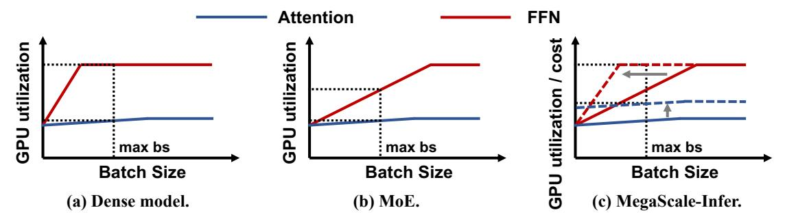
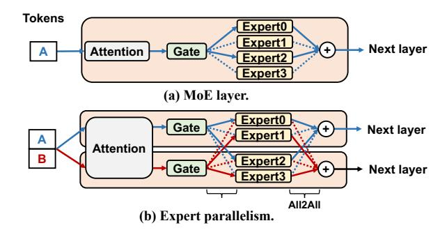
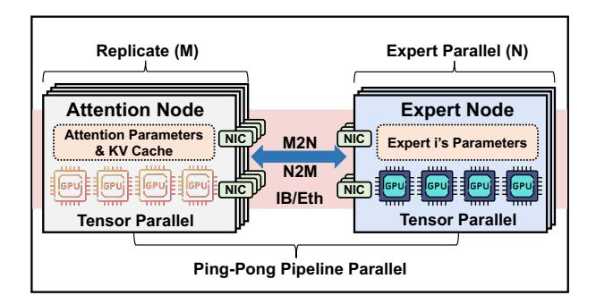
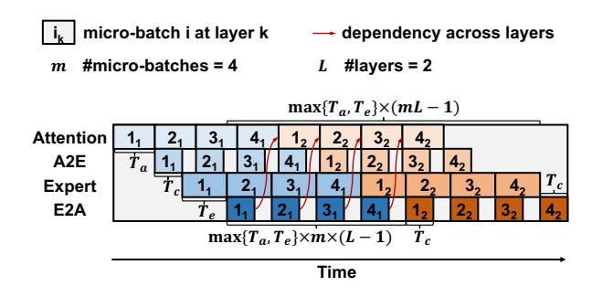
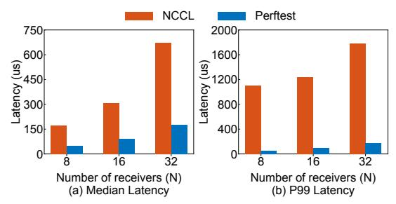

# **MegaScale-Infer: Serving Mixture-of-Experts at Scale with Disaggregated Expert Parallelism**

**Ruidong Zhu**<sup>1</sup>,2,◦,<sup>∗</sup> , **Ziheng Jiang**<sup>1</sup>,◦ , **Chao Jin**<sup>1</sup>,2,◦,<sup>∗</sup> , **Peng Wu**<sup>1</sup> , **Cesar A. Stuardo**<sup>1</sup> , **Dongyang Wang**<sup>1</sup> , **Xinlei Zhang**<sup>1</sup> , **Huaping Zhou**<sup>1</sup> , **Haoran Wei**<sup>1</sup> , **Yang Cheng**<sup>1</sup> , **Jianzhe Xiao**<sup>1</sup> , **Xinyi Zhang**<sup>1</sup> , **Lingjun Liu**<sup>1</sup> , **Haibin Lin**<sup>1</sup> , **Li-Wen Chang**<sup>1</sup> , **Jianxi Ye**<sup>1</sup> , **Xiao Yu**<sup>1</sup> , **Xuanzhe Liu**<sup>2</sup>,† , **Xin Jin**<sup>2</sup>,† , **Xin Liu**<sup>1</sup>,†

> <sup>1</sup>ByteDance Seed, <sup>2</sup>Peking University

◦Equal Contribution, <sup>∗</sup>Work done at ByteDance Seed, †Corresponding authors

## **Abstract**

Mixture-of-Experts (MoE) showcases tremendous potential to scale large language models (LLMs) with enhanced performance and reduced computational complexity. However, its sparsely activated architecture shifts feed-forward networks (FFNs) from being compute-intensive to memory-intensive during inference, leading to substantially lower GPU utilization and increased operational costs. We present MegaScale-Infer, an efficient and cost-effective system for serving large-scale MoE models. MegaScale-Infer disaggregates attention and FFN modules within each model layer, enabling independent scaling, tailored parallelism strategies, and heterogeneous deployment for both modules. To fully exploit disaggregation in the presence of MoE's sparsity, MegaScale-Infer introduces ping-pong pipeline parallelism, which partitions a request batch into micro-batches and shuttles them between attention and FFNs for inference. Combined with distinct model parallelism for each module, MegaScale-Infer effectively hides communication overhead and maximizes GPU utilization. To adapt to disaggregated attention and FFN modules and minimize data transmission overhead (e.g., token dispatch), MegaScale-Infer provides a high-performance M2N communication library that eliminates unnecessary GPU-to-CPU data copies, group initialization overhead, and GPU synchronization. Experimental results indicate that MegaScale-Infer achieves up to 1.90× higher per-GPU throughput than state-of-the-art solutions.

**Correspondence:** Xuanzhe Liu, Xin Jin, Xin Liu

## **1 Introduction**

Large language models (LLMs), such as GPT-4 [\[59\]](#page-21-0), Claude [\[25\]](#page-17-0), and Llama [\[38,](#page-19-0) [72,](#page-22-0) [73\]](#page-22-1), have revolutionized the field of artificial intelligence, demonstrating remarkable proficiency in numerous domains. These models have not only enhanced existing technologies like search engines [\[58\]](#page-21-1) but have also paved the way for innovative applications in areas like universal chatbots [\[3,](#page-17-1) [6\]](#page-17-2) and programming assistants [\[4,](#page-17-3) [7\]](#page-17-4).

As the effectiveness of LLMs increasingly depends on the escalation of model parameters, there is a growing imperative to scale up these models [\[35,](#page-18-0) [49\]](#page-21-2). Due to the sparse activation architecture, mixture-ofexperts (MoE) models [\[52,](#page-21-3) [62\]](#page-22-2) are a practical choice for scaling. MoE dynamically routes input tokens to a subset of feed-forward networks (FFNs), which are known as experts, rather than engaging all FFNs (i.e., all parameters). This design enables sub-linear scaling of required FLOPs as the number of experts and model size increases, significantly reducing com-

<span id="page-1-0"></span>

**Figure 1** GPU utilization of Attention and FFN vs. batch size in dense model, MoE, and MegaScale-Infer during decoding.

putational complexity without compromising model quality.

Unfortunately, reduced computational complexity does not necessarily translate into lower computational costs in practical serving scenarios. This discrepancy arises from the mismatch between the characteristics of LLM inference and the compute capabilities of GPUs, a problem that becomes increasingly pronounced with growing MoE sparsity. Figure [1](#page-1-0) demonstrates this issue. Specifically, an LLM consists of multiple layers of attention and FFN modules. During the decoding phase, which dominates the LLM inference process [\[51\]](#page-21-4), the GPU utilization of attention modules remains low because they must access the intermediate states (i.e., key-value cache) of all previous tokens. Conversely, FFN modules achieve high GPU utilization as the number of tokens increases.

However, GPU memory limitations and response latency constraints impose an upper bound on the number of tokens that can be processed simultaneously (i.e., batch size). For dense models, which contain one FFN module per layer, this maximum batch size allows the FFN to fully utilize the GPUs' compute capabilities. In MoE models, however, larger model sizes are often accompanied by more experts and higher sparsity, meaning that fewer tokens—less than a quarter, or even an order of magnitude less—are assigned to each expert within the same batch size. As depicted in Figure [1\(](#page-1-0)b), the increased sparsity lowers the GPU utilization of FFN modules, rendering them no longer compute-intensive, and resulting in unnecessary computational costs.

A natural solution is to disaggregate attention from the LLM inference process and replicate attention modules to increase the decoding batch size for FFN modules. This approach is adopted by Infinite-LLM [\[54\]](#page-21-5), which focuses on optimizing dense model inference in long-context scenarios. In such cases,

GPU memory capacity, rather than sparsity, is the primary constraint, and the communication pattern is relatively simple compared to the top-k selection in MoE. Consequently, its solution is less effective in addressing the unique challenges of MoE inference.

We present MegaScale-Infer, an efficient and costeffective system designed for large-scale MoE serving. MegaScale-Infer disaggregates the attention and expert modules, assigning them to separate GPUs a strategy we term disaggregated expert parallelism. Our approach offers two major benefits. First, it enables independent scaling of each module with customized model parallelism strategies. Specifically, attention modules are replicated using data parallelism, while FFN modules are scaled with expert parallelism. By consolidating requests from multiple attention replicas, the GPU utilization of each expert increases significantly as the batch size per attention replica grows. Second, it enables the deployment of attention and FFN modules on heterogeneous GPUs to fully leverage their different capabilities and achieve lower costs. For example, attention modules can be deployed on GPUs with more cost-effective memory capacity and bandwidth, while FFN modules can utilize GPUs with more affordable compute capability. As shown in Figure [1\(](#page-1-0)c), FFN can easily become compute-intensive in MegaScale-Infer, while attention achieves higher GPU utilization per unit cost under heterogeneous deployment.

Disaggregated expert parallelism introduces two new technical challenges. First, the disaggregation architecture causes the attention and FFN modules to be idle for a batch when the other is computing or when they are waiting for tokens. We design a ping-pong pipeline parallelism strategy that splits a batch of requests into multiple micro-batches to keep the attention and FFN busy and hide the communication overhead. Furthermore, the effectiveness of the ping-pong pipeline parallelism strategy depends

on certain conditions, such as similar computation time for attention and FFN. To fill the pipeline and maintain high GPU utilization, MegaScale-Infer optimizes the model parallelism strategy for each module based on a performance model specifically designed for disaggregated MoE serving.

Second, the arbitrary parallelism configuration of the attention and FFN modules transforms the original All2All communication between them for token routing into M2N communication, where M and N represent the number of senders and receivers, respectively. Based on our observations about the performance shortcomings of popular communication libraries [\[8\]](#page-17-5) in the context of this specific communication pattern, we develop a high-performance M2N communication library with a focus on reducing operational overhead and improving communication stability.

We implement MegaScale-Infer and evaluate it using MoE models with sizes ranging from 132 to 317 billion parameters. The experimental results show that MegaScale-Infer outperforms state-of-theart LLM serving systems by up to 1.9× in per-GPU decoding throughput. We also conduct experiments on a heterogeneous cluster, where MegaScale-Infer achieves 1.7× higher throughput per unit cost. Compared to NCCL [\[8\]](#page-17-5), a widely-used communication library, MegaScale-Infer's M2N communication achieves 4.2× higher throughput and 68.2% lower latency. MegaScale-Infer has already been deployed in the company's inference services and reduces the serving cost by 1.5–2.0×.

In summary, we make the following contributions.

- We present MegaScale-Infer, a system for efficiently serving large-scale MoE-based LLMs. Leveraging insights into the characteristics of Transformer and MoE, we employ a disaggregated approach for the attention and FFN modules. This approach offers dual advantages: it enables tailored parallelism strategies and independent hardware selection, thereby optimizing system efficiency and cost-effectiveness.
- In order to support the disaggregated serving architecture at scale, we present a ping-pong pipeline parallelism strategy to utilize GPU compute capabilities and hide communication, and develop a high-performance M2N communication library to enhance network performance.
- Our experiments demonstrate significant improvements in throughput and cost-effectiveness with our system's unique capabilities. MegaScale-Infer

achieves up to 1.90× and 1.86× per-cost decoding throughput against state-of-the-art LLM serving systems on homogeneous and heterogeneous clusters, respectively.

This work does not raise any ethical issues.

## **2 Background and Motivation**

### <span id="page-2-0"></span>**2.1 LLM Inference Characteristics**

A Transformer-based LLM typically consists of multiple layers, with each layer containing an attention module and an FFN module. Unlike traditional DNN inference, LLM inference follows an autoregressive pattern. It takes a sequence of input tokens, known as a prompt, as input and goes through the attention and FFN modules for multiple iterations to generate output tokens. In the prefill phase or the first iteration, the model computes the attention between each pair of tokens in the prompt to produce the first output token. During this iteration, intermediate representations, or key-value (KV) cache, are stored for each token. These cached representations are then used in the subsequent iterations to calculate the attention. In the following decoding iterations, the LLM generates the next token by computing the attention between the newly generated token and all previous tokens.

The autoregressive generation pattern makes the attention module compute-intensive during the prefill phase and memory-intensive during the decoding phase. Even with request batching [\[22,](#page-17-6) [79\]](#page-23-0), a widelyused optimization in efficient LLM serving, attention during the decoding phase remains the same memory access intensity. This is because each request has its own KV cache of input and previously generated tokens, which is different from each other. In the decoding iteration, each request must access its respective KV cache. In contrast, the computation of FFN only requires loading the corresponding model weights from GPU memory to SRAM, which can be shared across all tokens from different requests. Consequently, as presented in Figure [1\(](#page-1-0)a), batching is only efficient for FFNs to reuse model parameters and improve GPU utilization.

## **2.2 LLM Serving at Scale**

The scaling law [\[50\]](#page-21-6) highlights the significance of model size as a key determinant of the model capability. To achieve state-of-the-art model capability, many efforts [\[35,](#page-18-0) [49\]](#page-21-2) have been invested in scaling LLMs to hundreds of billions of parameters. Due to

<span id="page-3-0"></span>

Figure 2 MoE and expert parallelism.

the large model size, serving these models necessitates both algorithmic and system optimizations.

Mixture of experts. From an algorithmic perspective, mixture-of-experts (MoE) models show significant potential in enhancing the performance of LLMs with sub-linear scaling computational complexity and are gaining popularity in large-scale model implementations [34–36, 52]. We focus on MoE in Transformer-based LLMs in this work.

MoE models replace the feed-forward network (FFN) layer with an MoE layer, which consists of multiple FFNs acting as experts, as shown in Figure 2(a). A gating network within the MoE layer routes input tokens to a subset of these experts, i.e., top-k experts, based on matrix multiplication between each token's embedding vector and the gating network's trainable parameters. The final output of the MoE layer is a weighted sum of the selected experts' outputs. The sparse nature of MoE allows for scaling the model size by increasing the number of experts without linearly raising computational costs. For instance, Mixtral 8x22B [70] has around 141B parameters, but its active parameters for each token are only approximately 39B with top-2 expert selection.

Model parallelism. From a systems perspective, serving large-scale LLMs requires a distributed approach due to the limited memory and compute capacity of a single device. Model parallelism distributes model parameters across multiple devices to improve efficiency. Tensor parallelism [65] (TP) partitions compute-intensive operators like matrix multiplications to accelerate computation, but it introduces substantial communication overhead. Thus, tensor parallelism is usually confined to a single node with multiple GPUs, where intra-node NVLink bandwidth is typically much higher than inter-node network bandwidth. Pipeline parallelism [45] divides model layers into stages, each running on a device to form

a pipeline. This method slightly increases inference time due to inter-stage communication but scales serving throughput linearly with each additional stage.

A parallelism strategy specialized for MoE named expert parallelism (EP) is also widely applied in MoE serving [62]. As shown in Figure 2(b), each device only contains some of the experts in expert parallelism. Consequently, the forward pass of an MoE layer requires two all-to-all communications: one to send input tokens to the experts selected by the gating network, and the other to send the processed tokens back. In EP, the computation of each expert involves complete matrix multiplication, which is more conducive to GPU computation compared to TP, where a single matrix multiplication is split across multiple GPUs. The potential issue of EP is load imbalance between experts and the increased communication volume as the number of top-k experts grows. Therefore, whether TP or EP benefits FFN more depends highly on the structure of MoE models and the real-time workload.

## 2.3 Problems in Large-scale MoE Serving

As demonstrated in §2.1, the memory-intensive attention operation during the decoding phase leads to low GPU utilization, while FFNs can achieve high efficiency through request batching. However, the sparsity of MoE alters this situation. Although the sparsity enables sub-linear scaling of computational complexity, it significantly decreases the inference efficiency. Figure 1(b) presents a schematic diagram of the impact. Given a request batch during the decoding phase, each expert processes only a portion of them, resulting in a smaller batch size for FFNs, thereby lowering the GPU utilization.

Take Mixtral 8x22B as a more concrete example. Assume that we use NVIDIA A100-SXM-80GB GPUs, which have a computational power of 312 TFLOPS and memory bandwidth of 2 TB/s, to serve this model with the bfloat16 datatype. The floating point operations required for a  $b \times h$  to  $h \times n$  GEMM (General Matrix to Matrix Multiplication) are 2bhn, where b and h represent the decoding batch size and the model's hidden dimension size, respectively. The number of parameters this GEMM needs to access is hn, and the data volume is 2hn for bfloat 16. Let the GPU's floating point compute capability be F and the memory bandwidth be B. According to the roofline model [74], a GPU requires that  $\frac{2bhn}{F} \geq \frac{2hn}{B}$ , i.e.,  $b \geq \frac{F}{B}$ , to fully utilize its matrix multiplication capability. For an A100 GPU, the batch size at least needs to be 156 tokens  $(\frac{312TFLOPS}{2TB/s})$ . How-

<span id="page-4-0"></span>

**Figure 3** MegaScale-Infer runtime instance architecture.

ever, given a batch size of 156, the average number of decoding tokens dispatched to each expert is 156 × topk/#expert = 156 × 2/8 = 39, with the theoretical Model Flops Utilization (MFU) for FFN modules of 2/8 = 25%. Formally, the theoretical relationship between batch size and FFN's GPU utilization for dense models is util = min( B F b, 1), but for MoE, it is util = min( topk #expert B F b, 1).

Ideally, we can enhance the inference efficiency by increasing the batch size, but in practice, there are many factors that constrain the batch size. For instance, a larger batch size may compromise the requirement of low latency in online model serving. Additionally, the GPU memory constraint for KV cache limits the batch size growth. Especially for large-scale MoE, the GPU memory becomes more scarce, resulting in a smaller maximum batch size. Although enlarging the model parallelism with more GPUs may allow a larger batch size, it also introduces more communication overhead.

## **2.4 Opportunities and Challenges**

To address the inefficiency caused by MoE sparsity, we find that disaggregating the attention modules and FFN modules naturally provides two key advantages:

- **Independent scaling.** This allows us to scale serving instances with attention modules independently, aggregating decoding requests for each FFN module. This makes the FFN module computeintensive and achieves optimal GPU utilization.
- **Heterogeneous deployment.** The disaggregated architecture naturally separates the deployment for attention and FFN modules, allowing for the use of the most cost-effective GPUs for each. It also opens up opportunities to use specialized hardware and software to separately accelerate attention and FFN computation.

There are two main technical challenges to realize

efficient disaggregation of attention and FFN. First, since each token must repeatedly and sequentially pass through the attention and FFN modules, disaggregating these two components introduces idle periods. Specifically, the attention modules remain idle while the FFN modules are performing computations, and vice versa. Both modules can also experience idle time while waiting for outputs to be transmitted over the network. Therefore, a ping-pong pipeline must be established between the attention and FFN modules to ensure continuous utilization. Furthermore, this pipeline should be meticulously codesigned with the model parallelism strategies of each module to maximize GPU utilization while adhering to latency requirements.

Second, the independent scaling enabled by disaggregation requires M2N and N2M communication between M attention GPUs and N expert GPUs, replacing the traditional All-to-All communication used in each MoE layer. However, directly leveraging peer-to-peer communication primitives from existing libraries results in significant performance degradation, highlighting the need for a specialized communication library tailored to the M2N pattern.

## **3 MegaScale-Infer Overview**

In this work, we present MegaScale-Infer, a system designed for efficiently serving MoE-based LLM at scale. Following prior work [\[60,](#page-22-5) [82\]](#page-23-2), MegaScale-Infer decouples prefill and decoding into separate clusters to eliminate their interference and meet their respective latency requirements. In this paper, we focus on the decoding phase, aiming to address its inefficiency. Figure [3](#page-4-0) illustrates the overall architecture of a MegaScale-Infer runtime instance serving a single model replica during the decoding phase. By disaggregating the attention and FFN modules onto separate attention and expert nodes, respectively, MegaScale-Infer allows for independent scaling and heterogeneous deployment of attention and FFN, significantly enhancing system efficiency and reducing serving costs.

**Disaggregated expert parallelism.** To facilitate largescale MoE serving, MegaScale-Infer employs a hybrid parallelism strategy called disaggregated expert parallelism. Each expert node typically consists of 1- 8 GPUs within a single physical server and stores the parameters of one expert. All expert nodes together form an expert parallelism group. The parameters of the attention module (e.g., weight matrices for QKV and output projection) are replicated on each atten-

<span id="page-5-0"></span>

| Symbol         | Description                                   |
|----------------|-----------------------------------------------|
| $\overline{B}$ | Global batch size per instance                |
| m              | #micro-batches                                |
| $b_a, b_e$     | Micro-batch size per node                     |
| h              | Hidden size of the LLM                        |
| h'             | Intermediate dimension size of FFN            |
| g              | Number of query heads per group in GQA        |
| L              | #layers of the LLM                            |
| s              | Average sequence length in a batch            |
| K              | number of selected experts for each token     |
| E              | #experts / #expert nodes per instance         |
| $n_a$          | #attention nodes per instance                 |
| $tp_a, tp_e$   | TP size for attention and expert nodes        |
| $N_m$          | #micro-batches limit per instance             |
| $M_a, M_e$     | #GPUs per node limit for attention and expert |
| $C_a, C_e$     | GPU memory capacity for attention and expert  |
| $P_a, P_e$     | Parameter size of attention and one expert    |
| $T_a, T_e$     | Computation time of one micro-batch           |
| $T_c$          | Communication time of one micro-batch         |
| tpuc           | throughput per unit cost                      |

Table 1 Key notations.

tion node, where the key-value caches are also stored. Tensor parallelism is employed within each attention/expert node to leverage high-bandwidth connectivity between GPUs (e.g., NVLink). MegaScale-Infer also designs a ping-pong pipeline parallelism strategy tailored to the disaggregated architecture, feeding microbatches of requests into attention and expert nodes to keep them busy during communication or while awaiting results from other nodes. MegaScale-Infer determines the detailed deployment plan based on a performance model designed for the disaggregated expert parallelism.

High-performance M2N communication. MegaScale-Infer employs a customized M2N communication library to transfer the intermediate outputs between each pair of attention nodes and expert nodes. To achieve efficient and stable data transmission, the library removes unnecessary GPU-to-CPU data copies, group initialization overhead, and GPU synchronization. It also proposes traffic-oriented optimizations specific to this scenario.

## 4 Disaggregated Expert Parallelism

In this section, we present the design of ping-pong pipeline parallelism and the approach to generating the deployment plan of MegaScale-Infer. Given the MoE model, workload characteristics (e.g., sequence lengths), available hardware, and latency requirements, MegaScale-Infer determines the deployment plan by specifying (i) the respective parallelism strategies for attention and experts, (ii) the number of micro-batches for the ping-pong pipeline, (iii) the maximum batch size, and (iv) the hardware setup

<span id="page-5-1"></span>

Figure 4 Illustration of ping-pong pipeline parallelism.

for deployment. Our goal is to identify the deployment plan that maximizes throughput per unit cost (e.g., dollar). Table 1 lists the key notations in our discussion. We assume the model uses grouped-query attention (GQA) [24], which is the most popular method for attention.

## 4.1 Ping-Pong Pipeline Parallelism

As we decouple the FFN modules from the attention modules, using a single batch of requests would result in idle time for both the attention nodes and the expert nodes when the other module is busy. GPUs also remain idle during the inter-node communication. To address this problem, as illustrated in Figure 4, we split a batch of requests into m micro-batches, creating a ping-pong pipeline between the attention nodes and expert nodes. These nodes perform the forward pass of the micro-batches and exchange intermediate results twice in each MoE layer. This setup allows the forward computation to cover the communication overhead, thereby achieving higher GPU utilization.

Let  $T_a$  and  $T_e$  represent the computation time of a micro-batch on an attention node and an expert node, respectively. We define  $T_f = \max\{T_a, T_e\}$  as the maximum of these two values.  $T_c$  denotes both the communication time from attention nodes to expert nodes and vice versa, as the two bi-directional communications share the same network configuration. Our objective is to overlap communication with computation, keeping the GPUs fully utilized. The necessary conditions to achieve this are

<span id="page-5-2"></span>
$$T_a \approx T_e,$$
 (1)

<span id="page-5-4"></span><span id="page-5-3"></span>
$$T_c < T_f, (2)$$

$$m \times T_f \ge 2 \times (T_f + T_c).$$
 (3)

Constraint 1 aims to minimize the GPU idle time caused by computation dependencies across MoE layers. Constraint 2 and constraint 3 describe methods for hiding communication overhead. Specifically, the

<span id="page-6-0"></span>**Algorithm 1** Deployment Plan Search for Decoding Phase

```
Input: MoE model G, C_a, C_e, N_m, M_a, M_e
Output: the optimal deployment plan plan^*
 1: plan^* \leftarrow \emptyset
    for tp_e \in \{1, 2, ..., M_e\} do
         for tp_a \in \{1, 2, ..., M_a\} do
 3:
             if tp_a \times C_a > P_a and tp_e \times C_e > P_e then
 4:
                  n_a \leftarrow \text{BALANCE}(G, tp_a, tp_e)
 5:
                  for m \in \{3, 4, ..., N_m\} do
 6:
                      plan \leftarrow \{(tp_e, E), (tp_a, n_a), m\}
 7:
                      B, tpuc \leftarrow
 8:
     SIMULATE(G, plan, SLO)
                      plan \leftarrow plan \cup \{B, tpuc\}
 9:
                      if plan^*.tpuc < plan.tpuc then
10:
                           plan^* \leftarrow plan
11:
```

communication time for a single micro-batch must be shorter than the forward computation time of attention and experts, and the forward time of one MoE layer for the global batch on each node must be sufficient to cover the time required for a single micro-batch to pass through the layer. We can then obtain the minimum number of micro-batches needed using formula  $m \geq 2 \times (1 + \frac{T_c}{T_f})$ , where  $0 < \frac{T_c}{T_f} < 1$ . For deployments with fast communication  $(T_c < \frac{1}{2}T_f)$ , at least 3 micro-batches are required. For those with relatively slower communication, at least 4 micro-batches are required.

Let the number of MoE layers be L. As illustrated in Figure 4, considering the imbalanced computation between attention nodes and expert nodes, the decoding iteration latency of one micro-batch can be estimated as

$$(T_a + T_e + 2T_c) + mT_f(L - 1) \le T_{iter} \le mT_fL.$$
(4)

The total iteration latency of the global batch is

$$T_{total} = (T_a + T_e + 2T_c) + T_f(mL - 1).$$
 (5)

### 4.2 Deployment Plan Search

Considering ping-pong pipeline parallelism, the search space of MegaScale-Infer deployment plan includes the tensor parallelism sizes for attention nodes  $(tp_a)$  and expert nodes  $(tp_e)$ , the number of attention nodes  $(n_a)$ , the number of micro-batches, and the global batch size (B). Our objective is to minimize the throughput per unit cost while adhering to the SLO constraint. Algorithm 1 shows the pseudo-code

<span id="page-6-1"></span>

| GEMM Name   | Shape of Input   | Shape of Param.      |
|-------------|------------------|----------------------|
| QKV Project | $(b_a,h)$        | $(h, h(1+2/g)/tp_a)$ |
| Attn Output | $(b_a, h/tp_a)$  | $(h/tp_a,h)$         |
| FFN Input   | $(b_e, h)$       | $(h, h'/tp_e)$       |
| FFN Output  | $(b_e, h'/tp_e)$ | $(h'/tp_e, h)$       |

**Table 2** GEMMs used in MoE inference.

for searching the optimal deployment plan given hardware setup and model configurations. It enumerates the feasible  $tp_a$  and  $tp_e$ , subject to GPU memory capacity limit. For each pair of  $tp_a$  and  $tp_e$ , it calculates the number of attention nodes to balance the computation time as closely as possible according to constraint 1. The algorithm then compares the throughput per unit cost among deployment plans with varying numbers of micro-batches. Using the SIMULATE function, it determines the maximum global batch size that meets the SLO through binary search and obtains the optimal plan.

The complexity of Algorithm 1 is  $O(M^2N_m)$ , with M as the GPU limit per server and  $N_m$  as the maximum number of micro-batches. Typically, M has four choices (e.g.,  $\{1,2,4,8\}$ ) in modern clusters. We set  $N_m$  to four because splitting into too many micro-batches reduces GEMM efficiency in expert nodes and thus increases the latency. Consequently, the search space remains manageable.

**Performance simulation.** We then dive into the MoE layers to analyze the simulation of  $T_a$ ,  $T_e$ , and  $T_c$ .  $T_a$ includes two GEMMs: QKV Project and Attn Output, while  $T_e$  includes another two GEMMs: FFN Input and FFN Output. Their input and parameter shapes are shown in Table 2. The arithmetic intensity of attention GEMMs and FFN GEMMs are  $O(b_a)$  and  $O(b_e)$ , respectively, with the relationship  $b_a \times m \times n_a = b_e \times m \times E/K = B$ . The attention module is memory-intensive since it needs to access the KV cache of all tokens in the batch. Let the average sequence length be s, the KV cache access time is nearly proportional to  $b_a s$ . The tensor parallelism synchronization time is  $O(b_a h(tp_a - 1)/tp_a)$ . Thus, we can model  $T_a$  as  $k_1b_a + k_2$  and model  $T_e$ as  $k_3b_e + k_4$  similarly, where  $k_i$  values can be obtained through profiling and interpolation as prior work does [82]. Consequently,  $n_a = (b_e E)/(b_a K)$  can be set as  $(k_1E)/(k_3K)$  to balance  $T_a$  and  $T_e$ .

As for  $T_c$ , it equals the maximum time between sending and receiving. We profile the relationship between network bandwidth utilization and message size to

<span id="page-7-1"></span>

| Accelerator | Price | Cap. | Bw.    | Comp.    | Performance per Cost |                 |        |
|-------------|-------|------|--------|----------|----------------------|-----------------|--------|
|             |       | (GB) | (GB/s) | (TFLOPS) | GB                   | $\mathrm{GB/s}$ | TFLOPS |
| L20         | 1.00  | 48   | 864    | 119.5    | 48                   | 864             | 119.5  |
| H800        | 5.28  | 80   | 3430.4 | 989      | 15.2                 | 649.7           | 187.3  |
| A800        | 2.26  | 80   | 2039   | 312      | 35.4                 | 902.2           | 138.1  |
| H20         | 1.85  | 96   | 4096   | 148      | 51.9                 | 2214.1          | 80.0   |
| L40S        | 1.08  | 48   | 864    | 362      | 44.4                 | 800.0           | 335.2  |

**Table 3** Performance specifications and cost-effectiveness of different hardware. Prices are normalized by L20.

estimate  $T_c$ . Specifically,

$$T_c = \max\{\frac{b_a h K/t p_a}{W_a \times Util(b_a h K/t p_a)}, \frac{b_e h/t p_e}{W_e \times Util(b_e h/t p_e)}\},$$
(6)

where  $W_a$  and  $W_e$  represent the network bandwidth per GPU on attention and expert nodes, respectively.

In addition to constraint 1, 2, and 3, there are two constraints in the search process:

$$T_{iter} \le SLO,$$
 (7)

$$4mb_a shL/g + 2P_a < tp_a C_a. \tag{8}$$

Constraint 8 represents the GPU memory capacity limit for bfloat 16 KV cache size. And the throughput per unit cost is  $\frac{B/T_{total}}{tp_an_aCost_a+tp_eECost_e}$ .

### 4.3 Heterogeneous Deployment

MegaScale-Infer supports a heterogeneous hardware setup for attention nodes and expert nodes. Specifically, we use GPUs with higher per-cost memory bandwidth and larger per-cost memory capacity for attention nodes, as these nodes are memory-intensive, spending most of their time on memory access and requiring significant storage for the KV cache. Similarly, for expert nodes, which are compute-intensive, we use GPUs with higher cost-effectiveness in compute capability.

Table 3 lists the performance specifications, prices, and corresponding ratios for a selection of NVIDIA GPUs. We enumerate the scenarios of using each type of GPU as the hardware for attention or expert nodes to determine the optimal deployment plan. Intuitively, H20 is more suitable for attention due to its large memory capacity and high memory bandwidth per unit cost. Meanwhile, the L40S GPU is more cost-effective for experts.

Heterogeneous deployment can also reduce energy consumption by utilizing hardware with lower energy consumption per unit of compute or bandwidth. For example, the H20 and L40S GPUs have maximum power consumptions of 500W and 350W, respectively. Under the same power consumption, the L40S offers

<span id="page-7-2"></span>

**Figure 5** One-to-N latency: a single sender sends 128K bytes to each receiver in N, where  $|N| = \{8, 16, 32\}$ .

higher compute performance, while the H20 provides higher bandwidth. We demonstrate the improvements in both cost and energy efficiency achieved through heterogeneous deployment in §7.2.

