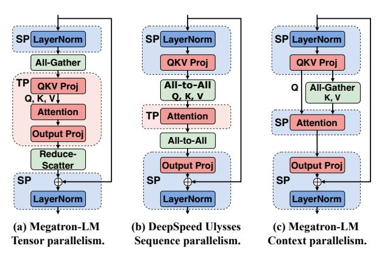

# 2.1 Mixture-of-Experts for Transformer

The Mixture of Experts (MoE) mechanism is an advanced approach designed to boost the performance of Transformer [\[51\]](#page-15-5) models, which are increasingly pivotal in the realm of LLMs [\[2,](#page-13-0) [7,](#page-14-0) [18,](#page-14-1) [27\]](#page-14-5). It extends the Transformer architecture by integrating multiple expert networks within the feed-forward network (FFN) component. As illustrated in Figure [2,](#page-2-1) MoE models dynamically route input tokens to the most relevant experts based on their characteristics. This routing is managed by a trainable gating mechanism that selects the best-suited experts for each token. This architectural innovation enables MoE models to scale in capacity without a proportional increase in inference costs, as only a subset of experts is activated for each input.

#### 2.2 Large-scale LLM Training

Training large language models at scale on tens of thousands of GPUs is a complex system engineering challenge that requires multiple systems techniques. To distribute the training workload, a combination of parallelism strategies such as data, tensor, and pipeline parallelism is necessary [\[19,](#page-14-2) [43,](#page-15-6) [48\]](#page-15-4), as each approach has limitations that prevent relying on a single method for effective scaling.

Data parallelism uniformly distributes the training data across all devices, with each device replicating the model parameters and optimizer states. To synchronize the parameters after each training iteration, data parallelism performs an all-reduce communication operation. Zero Redundancy Optimizer (ZeRO) [\[41\]](#page-15-7) improves over data parallelism by distributing model states across all participating devices. ZeRO unfolds across three progressive stages, each designed to increasingly conserve memory, though this comes with the trade-off of elevated communication.

Tensor parallelism distributes compute-intensive tensor operations over multiple devices, enabling parallel computation and significantly accelerating the training process. The specific partitioning strategy and the dependencies among operators within the model dictate that tensor parallelism may necessitate gathering split inputs (all-gather) or merging outputs (reduce-scatter). In LLM training, operators like

Figure 3. Different parallelism strategies for self-attention. "TP" denotes partitioning along the dimension of hidden size, while "SP" denotes partitioning along the dimension of sequence length.

LayerNorm and Dropout, though less compute-intensive, require substantial activation memory. To tackle this problem, a variant of tensor parallelism known as sequence parallelism [\[20\]](#page-14-7) is proposed, which partitions these operators along the dimension of sequence length. For long-context training, several works [\[1,](#page-13-2) [16,](#page-14-8) [48\]](#page-15-4) apply sequence parallelism or tensor parallelism to different operators in self-attention. Figure [3](#page-2-2) illustrates the mainstream parallelism strategies for attention, namely tensor, sequence, and context parallelism (TP, SP, and CP), which we analyze in [§3.1.](#page-3-0)

Pipeline parallelism enhances efficiency by dividing model layers into stages that are processed on different devices, enabling pipelined execution. Each batch is split into several micro-batches for this purpose. To minimize pipeline bubbles, various scheduling strategies have been developed, e.g., GPipe [\[14\]](#page-14-9), PipeDream 1F1B [\[33\]](#page-14-10) and Interleaved 1F1B [\[34\]](#page-14-11), etc. Megatron-LM adopts Interleaved 1F1B pipeline scheduling, further dividing each stage on one device into multiple virtual stages to reduce the pipeline bubble rate.

Expert parallelism is tailored for training MoE models by distributing experts across multiple devices, alleviating memory pressure and enabling parallel processing. To efficiently assign tokens to the appropriate experts and retrieve their outputs, all-to-all communication is typically employed.

