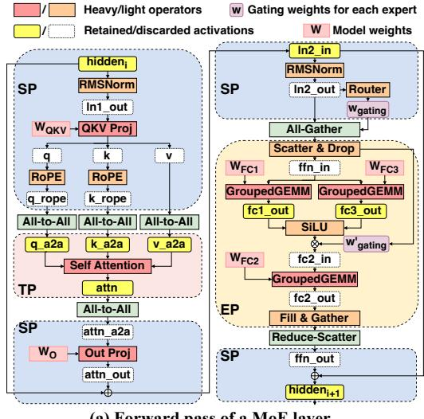
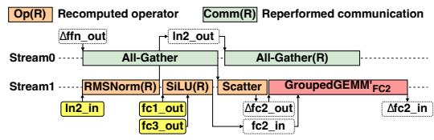

# 3.2 Expert Parallelism for Feed-forward Network

In the choice of parallelism strategies for the feed-forward network component, expert parallelism (EP) consistently outperforms tensor parallelism. TP partitions the hidden dimension of each expert, reducing GEMM efficiency, whereas EP maintains full expert computation on each device. Theoretically, the communication cost for EP is

$$2k/n \times bsh(n-1)/n, \tag{3}$$

while for TP it is

$$2bsh(n-1)/n. (4)$$

Although their relative efficiency depends on the ratio k/n, we design an adaptive communication strategy for different top-k values to minimize the communication volume of EP.

**Efficient communication pattern.** Figure 6 compares the typical EP implementation with MegaScale-MoE's approach. The standard EP implementation requires two all-to-all communications for token dispatch and aggregation. Additionally, a scatter operation may be required before sending and after receiving tokens to ensure that tokens assigned to the same expert reside in a contiguous memory space.

When the top-k value exceeds n, we replace traditional all-to-all communication with all-gather and reduce-scatter. First, an all-gather operation collects tokens from all workers. Then, a local scatter operation discards unneeded tokens, retaining only those required by the experts on the current worker. After expert computation, the tokens are assembled into a complete tensor. This approach enables a gather operation before communication, followed by a reduce-scatter to produce the final result, ensuring that EP's communication overhead remains equal to or lower than TP's.

In practical training, all-to-all communication is less efficient than all-gather and reduce-scatter, as it requires

(a) Forward pass of a MoE layer.

(b) Backward pass snippet with activation rematerialization.

Figure 8. Selective activation rematerialization.

each worker to communicate with all others, whereas all-gather and reduce-scatter follow a ring-based communication pattern with only neighboring workers. As shown in Figure 7, the communication time for these three operations in Mixtral-8×7B reveals that when top-k > 6, the all-gather-based EP implementation is more efficient.

Efficient operators. Instead of using torch. scatter\_add and torch. gather for tensor scattering and gathering like Megatron-LM, we develop efficient scatter and gather operators directly using CUDA. Based on the token routing results, we pre-calculate the mapping from each row of the input tensor (representing a token) to the corresponding row in the output tensor. The scatter and gather operators then perform data transfers efficiently according to this mapping.

Load balance. A well-known challenge in MoE model training is load balancing across experts [22, 26]. To address this, we use auxiliary loss and token dropping to balance the workload across GPUs within each node. Similar to DeepSeek-V2 [26], we treat the experts placed on the same GPU as a group and calculate the balance loss and computational capacity for each device rather than for each individual expert.

