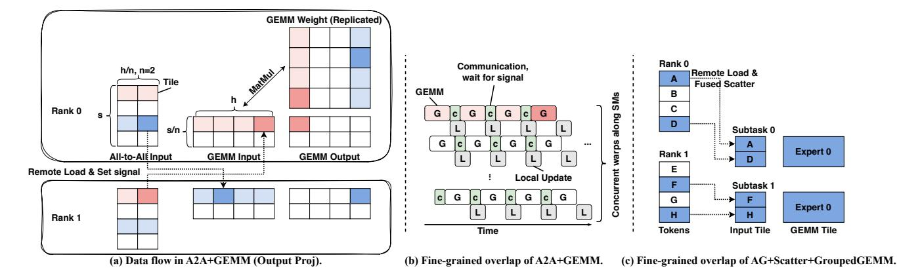

# 4.1 Inter-operator Overlap

We overlap communication operators with independent computation operators by executing them asynchronously on different CUDA streams. To achieve optimal performance during the training process, we adopt a specifically hand-tailored, holistic scheduling strategy.

Holistic scheduling. From the caller's perspective, we implement a unified macro module to execute the entire MoE layer's forward and backward passes, thereby expanding our scheduling flexibility. For instance, during the backward pass, various communication operators can be overlapped with dependency-free computations, such as activation recomputation, to improve efficiency. From the runtime perspective, a key challenge is efficiently managing concurrent communication tasks by resolving resource conflicts to prevent blocking and maximize throughput. This requires careful coordination, such as determining the number of SMs allocated to each communication operator, to minimize interference and optimize overall throughput.

**Selective activation rematerialization.** The holistic scheduling strategy also helps reduce memory usage without compromising training speed. Compared to dense models with equivalent computational requirements, MoE models exert significantly higher memory pressure during training due to

Figure 10. Fine-grained intra-operator communication-computation overlap.

their parameter count being several times larger. In addition to employing ZeRO optimizations [41] to eliminate redundant optimizer states across DP groups, we further optimize memory usage through selective activation rematerialization. This approach reduces activation memory requirements by re-performing computation and communication operators that can be overlapped with other necessary operators.

Figure 8a illustrates the forward pass of a Mixtral [18] MoE layer and highlights key activations produced during this process. MegaScale-MoE strategically retains activations that are computationally expensive to recompute, while recalculating others generated by memory-intensive operations or communication operations. This minimizes dependencies on backward computation, enabling rematerialization operations to overlap with other computations and communications, avoiding delays in the critical path. For example, as shown in Figure 8b, the backward pass of the GroupedGEMM operator for FC2 requires the activation fc2\_in and the gradient of fc2\_out (denoted as Δfc2\_out) as inputs. MegaScale-MoE recomputes fc2\_in and overlaps this operator with gradient communication (i.e., all-gather for Δffn\_out). Similarly, ffn\_in is obtained through re-performing RMSNorm and allgather, with these operators hidden within the preceding communication and the FC2 GroupedGEMM, respectively. MegaScale-MoE also places the weighted sum of ffn\_out immediately after the SwiGLU [45] activation function to eliminate the need to store ffn\_out. This reordering ensures computational consistency by avoiding operators that cross non-linear boundaries.

Figure 9 illustrates the shapes of the key activations produced during forward propagation, with the highlighted activations retained for backward propagation. Let the model parallelism size within one MoE layer be n and the intermediate hidden size of one expert be fh. The total activation of a single MoE layer is

$$(2n + 2k + 3kf + 12 + 5/m)bsh/n$$
,

which we have reduced to

$$(2kf + 4 + 2/m)bsh/n$$
.

MegaScale-MoE reduces the activation memory by  $\sim 50\%$  while maintaining the same training speed.

