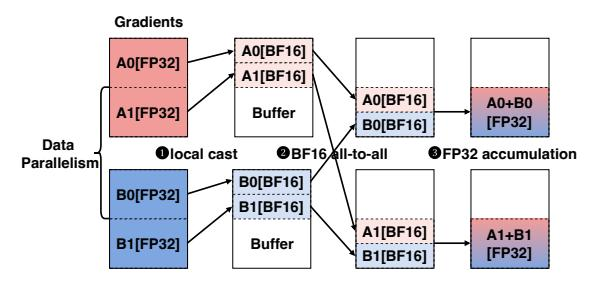

# 4.2 Intra-operator Overlap

Although inter-operator overlap effectively hides communication latency, squeezing all bubbles in the execution timeline remains non-trivial—especially in the forward pass, where no rematerialization or gradient computation operators exist to overlap with communication. Some forward operators directly depend on communication, such as token dispatch for expert computation, making overlap impossible unless another micro-batch is introduced, which increases memory pressure.

A widely adopted solution [19, 50, 52] is to decompose operators into smaller parallel ones to enable pipelining by executing them on separate CUDA streams. However, this approach introduces non-negligible overhead: (*i*) complex stream control, involving host interference and causing random bubbles due to the non-deterministic feature of CPU control; (*ii*) imperfect tail computation, increasing overall computation latency.

To address the above issues, we adopt intra-operator overlap to parallelize communication and computation operators with direct dependencies. The core idea is to fuse these operators and break down the workloads into tiles. Following prior work [5, 17, 53, 56], we implement barriers in device memory between communication and computation operators. These barriers enable fine-grained tile-level notifications and remove the need for host interference, further improving training performance. We implement two types of kernels, overlapping with GEMMs and overlapping with MoE GroupedGEMMs, for the attention and FFN modules, respectively.

Overlapping with GEMMs. We first introduce the intraoperator communication-computation overlap for GEMM kernels. Specifically, we implement all-to-all(A2A)+GEMM and GEMM+A2A kernels for Output and QKV Projections in SP attention, respectively, where X+Y means Y executed after X. Figure [10](#page-6-0) shows the data flow and overlapping pattern in A2A+GEMM. The GEMM on local data and communication for remote data starts simultaneously. We leverage dedicated GPU copy engines for data transfer, ensuring that all SMs (streaming multiprocessors) are fully utilized for computation. Once a remote data tile arrives at local memory, a signal notifies the GEMM kernel to continue its computation on the arrived tile. For GEMM+A2A, the all-to-all operation is fused into the GEMM kernel. Each tile of GEMM computation ends with a remote data transfer that writes the output data tile to remote ranks. We also implement all-gather+GEMM and GEMM+reduce-scatter kernels for tensor parallelism, which are similar to A2A+GEMM and GEMM+A2A.

For A2A+GEMM and GEMM+A2A, we allocate a small number of SMs for communication as all-to-all is more complex than all-gather and reduce-scatter. The number of SMs for communication is tuned to make communication and computation exhibit similar latency. Moreover, multiple ranks may simultaneously read from or write to the same device, potentially causing contention in NVLink. To mitigate this, we apply swizzling [\[5,](#page-13-4) [53,](#page-15-11) [56\]](#page-15-12) to reorder tile communication and computation so that the arrival of communication tiles aligns with the pace of computation tiles.

Overlapping with GroupedGEMMs For expert parallelism with token dispatch and combine, we aim to overlap communication with GroupedGEMMs. We implement two types of overlapping kernels: all-gather+scatter+GroupedGEMM and GroupedGEMM+gather+reduce-scatter. Unlike the overlapping techniques for GEMM kernels, MoE GroupedGEMMs require token shuffling (scatter/gather). As a result, each computation tile may depend on tokens from multiple ranks. To effectively overlap computation with communication, we sort the token order to minimize the number of dependent ranks for each computation tile. Additionally, since each tile has its own dependencies, the signal control for each tile varies depending on the MoE routing, which is determined dynamically.

In detail, for AG+scatter+GroupedGEMM, we reorder tokens along the sequence dimension based on their routed expert index. Then, for each expert, we sort the routed tokens according to their source rank index. Finally, we slice the sorted sequence into blocks and perform GroupedGEMM using a sequence of computation tiles. Specifically, as shown in Figure [10c](#page-6-0), we fuse the local scatter into the kernel by selecting rows of input data based on the index mapping. The GroupedGEMM computation for each expert is divided into tiles, with each tile depending on only a subset or even a single source rank. This reduces the overall waiting time for

Figure 11. DP communication compression.

each computation block, avoids redundant loading of expert parameters, and improves the overlap between computation and communication tiles.

