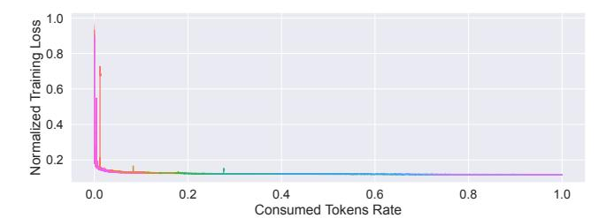

# 7 Experience

In this section, we describe our deployment and operational experience of MegaScale-MoE.

Deployment experience. MegaScale-MoE has been deployed in our production environment and is responsible for the majority of large-scale MoE training tasks within our company. It enables the training of models with trillions of parameters, supports single training jobs scaling beyond 10,000 GPUs, with individual training tasks running for several months. By combining the aforementioned techniques, MegaScale-MoE minimizes idle communication time and optimizes memory usage in MoE training without compromising model performance, ultimately saving millions of GPU hours in large-scale MoE training. Figure 20 shows the model convergence from a real production job, which trains a proprietary MoE model with 200B parameters, 20B activated for each token. This job uses over 10,000 GPUs and lasts for months. The loss continues to converge with a stable training process.

**Figure 20.** The normalized training loss curve of a real production job on more than 10,000 GPUs for months, training a MoE model with 20B activated and 200B total parameters on multi-trillion tokens. Different colors indicate training restarts.

**FP8 training.** We have made extensive efforts to maintain the convergence stability of FP8 training. For example, we observe that the SwiGLU operator significantly expands the numerical range. To address this, we replace per-tensor quantization with higher-precision per-token quantization  $(1 \times h)$ . Additionally, since multiplying SwiGLU with the gating weight further amplifies the dynamic numerical range, we shift the gating weight multiplication back to after the FC2 output, reducing quantization errors.

Beyond ensuring training convergence, we introduce additional engineering optimizations. Existing FP8 training implementations [25, 50] store model parameters in BF16, requiring frequent FP8 conversion for GEMM computations, adding casting and transpose overhead. To address this, we use a multi-precision optimizer to store model parameters directly in FP8, while keeping main parameters in FP32 with separate buffers for different data types. This lowers memory consumption and halves parameter all-gather communication in data parallelism.

Scale up. When training MoE models, an intriguing engineering question arises: can we indefinitely scale the training size by increasing model parameters without raising computational load? This approach is impractical in tensor parallelism, as scaling up the model necessitates a higher TP degree to accommodate additional parameters. While increased TP reduces per-GPU computation, the communication overhead remains constant, as shown in Formula 1 and 4, leading to progressively longer communication times and reduced training efficiency. In other words, TP has inherent scalability limitations and often relies on high-speed intra-node links to mitigate communication delays.

In contrast, when scaling training with SP and EP, the communication volume decreases as the parallel size n increases, as shown in Formula 2 and 3. This implies that, in theory, this parallelism strategy can scale to significantly larger sizes. However, in practical hierarchical infrastructures, a critical challenge emerges: can this approach maintain training efficiency when scaling beyond the NVLink domain, where bandwidth drops to RDMA levels?

Formally, for a SwiGLU structure incorporating a MoE mechanism, the ratio between computation time and communication time is defined as:

$$comm\_time = \frac{2k \times bsh(n-1)/n/n}{bandwidth},$$
 (5)

comp\_time = 
$$\frac{3k \times bsh \times h_{ffn}/n}{peak}$$
. (6)

$$R = \frac{\text{comp\_time}}{\text{comm\_time}} \tag{7}$$

$$= 3/2 \times h_{ffn} \times \frac{bandwidth}{peak} \times n/(n-1)$$
 (8)

$$\approx 3/2 \times h_{ffn} \times \frac{bandwidth}{peak} \tag{9}$$

To sustain training efficiency, the FFN's computation time must exceed the communication time, ensuring effective overlap of communication overhead. Therefore, our goal is to maintain > 1, leading to two key insights:

- The value of is independent of the number of experts, top-, hidden dimension, parallelism size, or input size, providing flexibility in selecting algorithm parameters.
- is solely determined by the expert's intermediate dimension, computational peak, and communication bandwidth. Consequently, on fixed hardware, as long as the expert dimension is sufficiently large, the MoE model can be scaled while maintaining training efficiency from an engineering perspective.

Holistic vs. automatic. We have invested substantial engineering efforts in inter-operator communicationcomputation overlap, including determining operator execution order, concurrency of communication and computation, and SM allocation for communication. These manual interventions provide deeper insights into training dynamics, enabling targeted optimizations. As training progresses and experience accumulates, we seek to automate operator scheduling within the search space to optimize the training process at a fine-grained level and achieve optimal performance. We leave automatic optimization for future work.

MoE vs. dense model training. In our continued efforts to optimize MoE model training, we have identified several critical distinctions from the training of dense models. In a dense Transformer layer, optimization efforts are concentrated on self-attention and GEMMs. The former is often accelerated by techniques like FlashAttention [\[8\]](#page-14-18), while the latter, as a dense computation, generally achieves high utilization on the GPU's parallel processing units. In contrast, as shown in Figure [13a](#page-9-2), the combined runtime of attention and GroupedGEMM accounts for only about one-third of a layer's execution time. The remainder is consumed by communication and other operators. While MegaScale-MoE effectively addresses the communication overhead, we observe that the computational operators in MoE models, which are

inherently more complex than their dense counterparts, also introduce performance degradation. Specifically, they are a primary source of stragglers for three main reasons:

First, the intermediate dimension of each expert is smaller than the FFN layer in a dense model. To efficiently process computations for multiple experts concurrently, GroupedGEMM employs a single CUDA kernel for numerous small matrix multiplications. The resource usage of this kernel—including shared memory, L1 cache, and number of threads—is finely controlled via cuFuncSetAttribute. This granular control, however, can introduce synchronization delays. Second, due to the imbalanced number of tokens routed to each expert, the inputs and outputs for GroupedGEMM are dynamically shaped tensors. The frequent allocation and deallocation of these tensors exacerbate GPU memory fragmentation. Third, the MoE gating mechanism involves a multitude of small operators for tasks like calculating routing scores and communicating routing decisions. Jitter in CPU performance can delay the launch of these kernels to the point where the launch latency exceeds their actual execution time on the GPU, creating pipeline bubbles.

