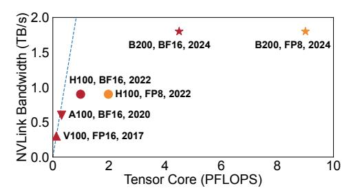
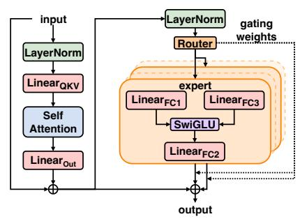

# MegaScale-MoE: Large-Scale Communication-Efficient Training of Mixture-of-Experts Models in Production

Chao Jin\*§, Ziheng Jiang\*†, Zhihao Bai†, Zheng Zhong†, Juncai Liu†, Xiang Li†, Ningxin Zheng†, Xi Wang†, Cong Xie†, Qi Huang†, Wen Heng†, Yiyuan Ma†, Wenlei Bao†, Size Zheng†, Yanghua Peng†, Haibin Lin†, Xuanzhe Liu§, Xin Jin§, Xin Liu†

§School of Computer Science, Peking University †ByteDance Seed

#### **Abstract**

We present MegaScale-MoE, a production system tailored for the efficient training of large-scale mixture-of-experts (MoE) models. MoE emerges as a promising architecture to scale large language models (LLMs) to unprecedented sizes, thereby enhancing model performance. However, existing MoE training systems experience a degradation in training efficiency, exacerbated by the escalating scale of MoE models and the continuous evolution of hardware.

Recognizing the pivotal role of efficient communication in enhancing MoE training, MegaScale-MoE customizes communication-efficient parallelism strategies for attention and FFNs in each MoE layer and adopts a holistic approach to overlap communication with computation at both inter- and intra-operator levels. Additionally, MegaScale-MoE applies communication compression with adjusted communication patterns to lower precision, further improving training efficiency. When training a 352B MoE model on 1,440 NVIDIA Hopper GPUs, MegaScale-MoE achieves a training throughput of 1.41M tokens/s, improving the efficiency by 1.88× compared to Megatron-LM. We share our operational experience in accelerating MoE training and hope that by offering our insights in system design, this work will motivate future research in MoE systems.

CCS Concepts: • Computer systems organization  $\rightarrow$  Cloud computing; • Computing methodologies  $\rightarrow$  Machine learning; • Networks  $\rightarrow$  Data center networks.

*Keywords:* Mixture-of-experts, distributed training, computation-communication overlap

Permission to make digital or hard copies of all or part of this work for personal or classroom use is granted without fee provided that copies are not made or distributed for profit or commercial advantage and that copies bear this notice and the full citation on the first page. Copyrights for components of this work owned by others than the author(s) must be honored. Abstracting with credit is permitted. To copy otherwise, or republish, to post on servers or to redistribute to lists, requires prior specific permission and/or a fee. Request permissions from permissions@acm.org. EUROSYS '26, April 27–30, 2026, Edinburgh, Scotland Uk

@ 2026 Copyright held by the owner/author(s). Publication rights licensed to ACM.

ACM ISBN 979-8-4007-2212-7/26/04...\$15.00 https://doi.org/10.1145/3767295.3769325

#### **ACM Reference Format:**

Chao Jin, Ziheng Jiang, Zhihao Bai, Zheng Zhong, Juncai Liu, Xiang Li, Ningxin Zheng, Xi Wang, Cong Xie, Qi Huang, Wen Heng, Yiyuan Ma, Wenlei Bao, Size Zheng, Yanghua Peng, Haibin Lin, Xuanzhe Liu, Xin Jin, Xin Liu. 2025. MegaScale-MoE: Large-Scale Communication-Efficient Training of Mixture-of-Experts Models in Production. In *EuroSys '26, April 27–30, 2026, Edinburgh, UK*. In ACM, New York, NY, USA, 17 pages. https://doi.org/10.1145/3767295.3769325

#### 1 Introduction

As the size of Large Language Models (LLMs) [7, 18, 49] grow, so does the scale of their training regimes. The escalation in training scale has made efficiency improvements not just desirable but crucial [19]. As a company building AI products for billions of users, we remain committed to training LLMs with hundreds of billions of parameters on thousands of GPUs. Consequently, even marginal gains in training efficiency can significantly reduce computational resource consumption and training time, directly influencing the feasibility and sustainability of developing state-of-the-art LLMs.

Within the landscape of LLM architectures, Mixture-of-Experts (MoE) models stand out for their sparse activation [7, 10, 18, 46], which dynamically routes input tokens to a selected set of specialized network components, known as *experts*, rather than to all parameters. This design leads to sub-linear scaling of FLOPs required as the model size increases, thereby significantly reducing the computational cost. Recent industrial advancements [2, 3, 9, 27, 40] have demonstrated the potential of MoE models, achieving an order-of-magnitude reduction in training cost compared to dense models with equivalent model quality.

Despite the lower training costs of MoE models, we observe a critical performance bottleneck during training from a systems perspective—communication. For instance, when training an internal model on NVIDIA Hopper GPUs, communication accounts for 43.6% of the total time during the forward pass and 32% over the entire training process. Two primary factors contribute to this bottleneck. First, MoE models inherently introduce more communication overhead.

\*Equal contribution.

Figure 1. Evolution of NVIDIA GPUs.

Compared to dense model training, MoE model training requires distribution across more GPUs for model parallelism due to its larger parameter size. Second, enabling sparse computation requires two extra all-to-all communications in both the forward and backward passes to dispatch and aggregate tokens, respectively, which hinders ongoing computation.

Moreover, as hardware advances, the imbalance between computation and communication becomes increasingly pronounced, with communication overhead growing more dominant. Alongside improvements in model architectures, hardware capabilities have evolved rapidly, with GPUs achieving significantly higher processing speeds (Figure 1). Concurrently, reductions in training precision have been adopted to enhance efficient and cost-effective training [27, 38]. These trends lead to a scenario where the raw computation time decreases, making the relative impact of communication overhead a more critical bottleneck. For instance, simply extending existing tensor parallelism to multi-node setups has been observed to push communication overhead beyond 50% in certain cases. As a result, optimizing communication is essential for sustaining and improving the scalability of MoE model training, particularly in distributed environments where frequent data synchronization across multiple GPUs is required.

In this paper, we present the design, implementation, and operational experience of MegaScale-MoE, a production system optimized for efficient large-scale MoE training. By meticulously addressing the communication bottleneck, MegaScale-MoE strives to push the boundaries of MoE training, achieving significant improvements in performance and efficiency. Based on the insight that the key architectural distinctions between MoE and dense models are intra-layer, which is the primary source of the communication overhead, MegaScale-MoE confines each MoE layer to within a single node, utilizing high-bandwidth NVLink. Our analysis (§3) and evaluation (§6) show that despite the cross-node expert parallelism common in existing systems [15, 27], our approach effectively scales MoE training to models of several hundred billion parameters on thousands of GPUs.

Specifically, MegaScale-MoE addresses the communication problem in MoE training from three key aspects. First, MegaScale-MoE reduces the communication volume by customizing parallelism strategies for the attention and FFN modules in each MoE layer. We compare the parallelism

strategies in existing LLM training frameworks, comprehensively considering their impact on large-scale training, including the communication volume and whether communication can be effectively overlapped (i.e., whether it lies on the critical path). Based on this analysis, we select the optimal combination of parallelism strategies for MoE training.

Second, MegaScale-MoE fully overlaps communication with computation at the operator level. MegaScale-MoE partitions the forward and backward passes of each MoE layer into distinct computation and communication operators. For inter-operator overlap, MegaScale-MoE employs a holistic scheduling strategy that carefully reorders communication and computation operators during both forward and backward propagation, hiding communication within independent computations. This approach also optimizes GPU memory usage. MegaScale-MoE utilizes selective activation rematerialization, retaining only a subset of activations in GPU memory during the forward pass, and recomputing or recommunicating to obtain the required activations during the backward pass. With this holistic scheduling, MegaScale-MoE effectively hides the rematerialization overhead, achieving comparable performance while storing only half of the activations.

To overlap communication on the critical paths, MegaScale-MoE employs a fine-grained approach that splits communication into tiles and aligns with the GPU compute pattern, fusing these tile-level communications into the compute kernels. For MoE models with token dispatch, MegaScale-MoE fuses an efficient local scatter operation into the kernel and reorganizes the computation tasks along the scattered dimension to mitigate communication bottlenecks from multiple data sources. This fine-grained overlap occurs within each node, leveraging the high-bandwidth connectivity between GPUs.

Third, MegaScale-MoE leverages communication compression to further enhance MoE training efficiency. Specifically, for widely-used BF16 mixed-precision training, MegaScale-MoE reduces the inter-node parameter synchronization precision from FP32 to BF16, halving the associated overhead. In FP8 training, MegaScale-MoE replaces BF16 reduce-scatter with FP8 communication, incorporating tailored quantization strategies and FP32 reduction to decrease communication volume while preserving convergence stability.

MegaScale-MoE is deployed in our datacenters to train MoE models for our products. Compared to the state-of-the-art open-source LLM training framework, Megatron-LM [48], MegaScale-MoE achieves up to 1.88× higher MFU (Model FLOPs Utilization) when training a 352B MoE model on 1,440 NVIDIA Hopper GPUs. With comprehensive communication optimizations, MegaScale-MoE powers large-scale training in our production, efficiently scaling to trillions of parameters and thousands of GPUs while saving millions of GPU hours.

Figure 2. Mixture-of-Experts (MoE) layer.

