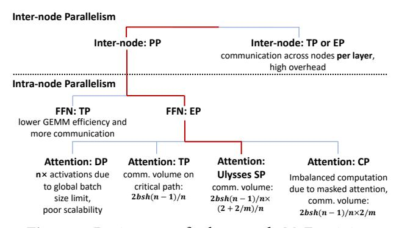
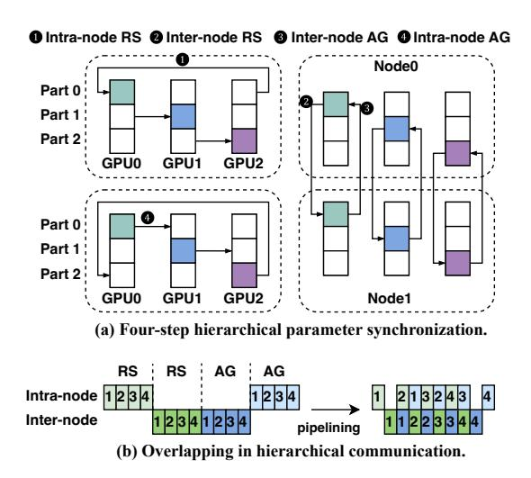
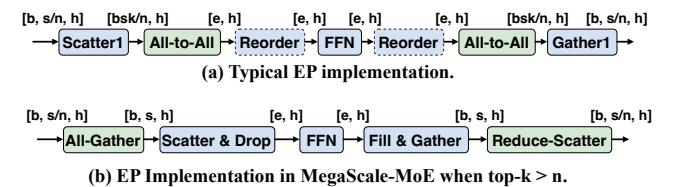
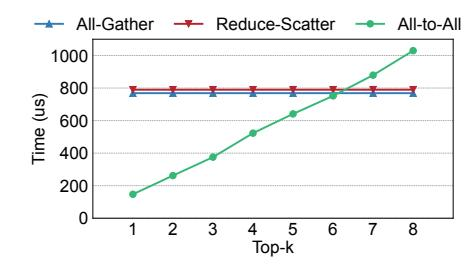

# 3 Communication-Efficient Parallelism

With the rise of MoE models and the evolution of hardware compute capabilities, communication overhead has become increasingly critical in MoE training in production. In this section, we delve into the parallelism strategies employed to reduce communication volume and meet other training requirements, such as high GEMM (General Matrix Multiplication) efficiency.

Figure [4](#page-3-1) shows the design space of parallelism strategies for large-scale MoE training, excluding the outermost data

**Figure 4.** Design space for large-scale MoE training.

parallelism. We start with inter-node parallelism. Expert parallelism alleviates memory pressure from MoE models' large parameter size by distributing experts across nodes but incurs per-layer cross-node communication, harming training efficiency. Similarly, tensor parallelism's high communication overhead makes it more efficient to limit TP to a single node. Following prior work [19], we adopt pipeline parallelism to distribute model parameters, reduce communication, and overlap communication of different micro-batches.

Prior large-scale MoE training systems, such as Megatron-LM [48] and DeepSpeed-MoE [40], incorporate tensor parallelism to scale up training by partitioning the model parameters within the node. However, in our practice, we observe two issues with this approach: (1) TP partitions the expert dimension, which negatively impacts GEMM efficiency; and (2) TP introduces significant communication overhead, which remains constant as the parallelism size increases, eventually causing communication to exceed computation on modern hardware.

To address these issues, we tailor parallelism strategies for MoE model components. For feed-forward networks (i.e., experts), we replace tensor parallelism with expert parallelism and use custom communication modes optimized for varying top-k and expert sizes, ensuring communication overhead stays lower than tensor parallelism. For other components, we apply sequence parallelism, partitioning along the sequence dimension instead of the batch dimension, allowing scaling without increasing global batch size. This also reduces communication on critical paths compared to tensor parallelism. The additional memory and DP communication overhead remain manageable due to the parameter asymmetry across components. We detail the rationale and analysis of this intra-node parallelism strategy in the following sections. Table 1 lists the key symbols.

#### 3.1 Sequence Parallelism for Attention

Due to the inherent parallelizability of the expert components in MoE models, most prior work on MoE training [22, 40] focuses on optimizing expert parallelism, while data parallelism (DP) is typically applied to the non-MoE components such as attention. However, when scaling up

| Symbol         | Description                                                                |
|----------------|----------------------------------------------------------------------------|
| $\overline{b}$ | micro-batch size                                                           |
| S              | sequence length                                                            |
| h              | hidden dimension size                                                      |
| n              | model parallelism (TP, SP, or EP) size                                     |
| m              | the ratio between the number of query heads and that of key-value heads |
| k              | number of experts that each token is routed to                             |

**Table 1.** Description of symbols.

MoE training, this approach proves insufficient due to the  $n\times$  activation memory consumption. This issue arises because DP splits the batch dimension both across and within nodes. Compared to other intra-node parallelism strategies shown in Figure 4, applying DP to attention forces each GPU within a node to process one micro-batch simultaneously, increasing the activation size by  $8\times$ , which often results in out-of-memory issues.

To enable scalable MoE training, implementing intra-node parallelism for the attention module is crucial. Tensor parallelism (TP) is commonly employed to parallelize attention operations within nodes. However, it introduces inevitable communication costs due to all-gathering and reduce-scattering activations along the critical path. With the increasing gap between computational FLOPs and communication bandwidth, we find that the TP communication overhead can even surpass the computation time of self-attention. This communication-dominated bottleneck limits the ability to overlap communication and computation, ultimately reducing training efficiency.

We adopt sequence parallelism (SP), as proposed in DeepSpeed-Ulysses [16], to scale MoE training and effectively reduce communication along the critical path. SP is commonly used in long-context training to address memory challenges associated with long inputs. We find it also works well in large-scale MoE training. First, it significantly reduces communication overhead compared to TP, especially when using grouped-query attention [4]. Second, while it introduces some parameter redundancy and increased communication overhead during parameter synchronization, the unique characteristics of MoE models make these trade-offs manageable and acceptable.

**Communication efficiency.** When utilizing TP, the communication volume in attention is

$$2bsh(n-1)/n. (1)$$

With SP, the communication volume decreases to

$$2bsh(n-1)/n \times (2+2/m)/n,$$
 (2)

where *m* represents the ratio between the number of query heads and that of key-value heads. Assuming the model is trained on an NVIDIA Hopper GPU workstation with an NVLink domain of size 8, the communication latency for sequence parallel attention can be reduced to about one-fourth of that required by tensor-parallel attention.

**Figure 5.** Hierarchical communication for parameter synchronization in SP attention.

**Data communication & memory overhead.** A notable difference between SP and TP attention is how parameters are distributed across devices: TP shards the attention weights, while SP replicates them. This raises the concern about the potential increase in communication overhead for synchronizing gradients and parameters. Counterintuitively, given the intra- and inter-node bandwidth asymmetry and the adoption of hierarchical communication operations in modern communication libraries [35] as shown in Figure 5 and analyzed in Appendix A.1, although SP attention requires synchronization of  $n \times$  more parameters compared to TP attention, the difference in communication overhead is minimal in practical scenarios.

On the other hand, the additional GPU memory consumption introduced by SP attention is minimal in MoE training. For large-scale MoE models with tens to hundreds of experts, the majority of GPU memory is consumed by the expert parameters. Our experiments, detailed in §6.2, confirm that the extra parameter synchronization and memory overhead of SP attention remain manageable.

Balanced vs. imbalanced. In addition to the Ulysses-style SP attention, we also explored other forms, including context parallelism (CP) [1], which partitions all activations along the sequence dimension. CP attention, however, faces workload imbalance due to causal masking in attention, as each token only attends to previous tokens. To mitigate this, we attempted the zigzag strategy by grouping the head and tail partitions of the sequence on the same GPU, although achieving perfect balance remains challenging. Consequently, in large-scale training, the entire training process is often constrained by the most imbalanced data batch. Moreover, this imbalance disturbs the training pipeline, thereby reducing overall training efficiency.

**Figure 6.** Communication-efficient expert parallelism. *e* represents the number of tokens routed to the worker.

**Figure 7.** Comparison of AG, RS, and A2A for token dispatch.

