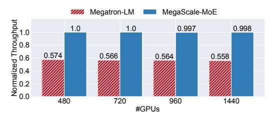
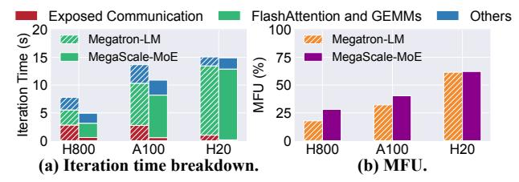
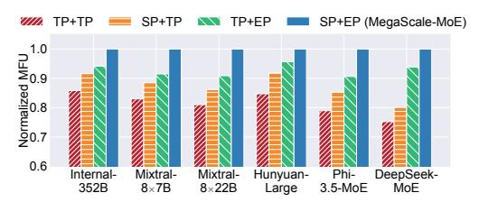
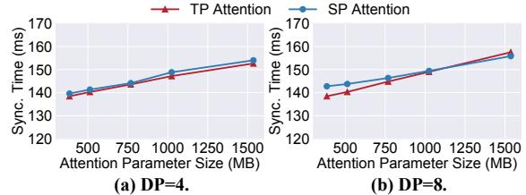
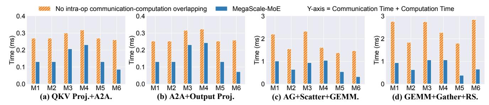
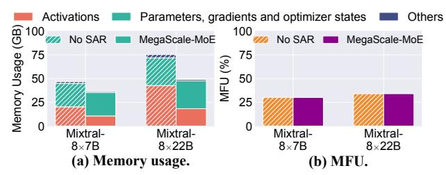
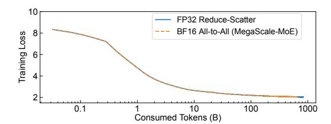
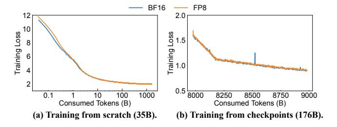

# **6.1** Training Performance

MegaScale-MoE is built on top of Megatron-LM [48], a state-of-the-art open-source LLM training system that supports 3D parallelism strategies and is continuously updated to incorporate the latest optimizations from the community. Our evaluation uses the Megatron-LM on GitHub [32] with commit hash f1f03922, selected for its stability at the commencement of our experiments months ago. For fair comparison, we use the same global batch size for Megatron-LM

|               | #GPUs | Iteration | Throughput               | Training Time for |  |
|---------------|-------|-----------|--------------------------|-------------------|--|
| System        |       | Time (s)  | (tokens/s)               | 1T Tokens (days)  |  |
|               | 240   | 39.94     | 151.1k                   | 76.61             |  |
|               | 480   | 19.56     | 301.1k                   | 38.38             |  |
| Megatron-LM   | 720   | 13.70     | 430.5k                   | 26.88             |  |
|               | 960   | 10.82     | 550.2k                   | 21.23             |  |
|               | 1440  | 7.90      | 746.6k                   | 15.50             |  |
|               | 240   | 21.61     | 272.9k ( <b>1.81</b> ×)  | 42.41             |  |
|               | 480   | 11.83     | 498.6k ( <b>1.65</b> ×)  | 23.21             |  |
| MegaScale-MoE | 720   | 7.97      | 740.1k ( <b>1.72</b> ×)  | 15.64             |  |
|               | 960   | 6.12      | 963.8k ( <b>1.77</b> ×)  | 12.01             |  |
|               | 1440  | 4.19      | 1407.7k ( <b>1.88</b> ×) | 8.22              |  |

**Table 3.** Strong-scaling training performance for the 352B MoE model with NVIDIA H800 GPUs. The number in parentheses in the throughput column represents the speedup of MegaScale-MoE compared to Megatron-LM.

**Figure 12.** Weak-scaling training performance for the 352B MoE model with NVIDIA H800 GPUs.

and MegaScale-MoE and choose the optimal parallelism configurations for the two systems, respectively. Specifically, MegaScale-MoE employs SP attention and EP within each node, while Megatron-LM adopts TP within each node, with both systems configured with a PP size of 15. We tune the configuration of Megatron-LM to meet its requirement of a uniform TP size across all components. As discussed in §3.1, for Megatron-LM, a TP size of 1 leads to a prohibitive 8× activation memory (addressable only with slow recomputation via gradient checkpointing), while a TP size of 8 forces EP to operate across nodes, incurring more communication costs than PP. Notably, both systems in the evaluation enable the communication-computation overlap techniques from MegaScale [19] for data and pipeline parallelism. Therefore, the communication overhead mainly comes from intra-node model parallelism, e.g. TP, SP and EP. Sequence length is 8,192 and vocabulary size is 65,536.

Scalability. Table 3 compares the strong-scaling training performance of Megatron-LM and MegaScale-MoE on the 352B MoE model. We scale the number of GPUs while keeping the global batch size fixed at 720. Across all settings, MegaScale-MoE achieves 1.65–1.88× speedups over Megatron-LM. As the number of GPUs increases, the MFU (Model FLOPs Utilization) of MegaScale-MoE declines from 32.48% to 27.89%. This is expected, as the batch size is fixed and the number of micro-batches for each pipeline decreases with more GPUs, leading to more bubbles.

Figure 12 presents the weak-scaling training performance of Megatron-LM and MegaScale-MoE on the same model.

**Figure 13.** Performance breakdown of training Mixtral-8×7B on different GPUs.

| GPU  | Compute Cap-     | Memory Spec. |            | NVLink     |
|------|------------------|--------------|------------|------------|
| GFU  | ability (TFLOPS) | Cap. (GB)    | Bw. (TB/s) | Bw. (GB/s) |
| H800 | 989              | 80           | 3.4        | 400        |
| A100 | 312              | 80           | 2.0        | 600        |
| H20  | 148              | 96           | 4.0        | 900        |

**Table 4.** Specifications of different NVIDIA GPUs.

We scale the global batch size from 360 to 1,080 in proportion to the number of GPUs (from 480 to 1,440). MegaScale-MoE achieves a 1.74-1.79× training throughput compared to Megatron-LM. As the scale increases, Megatron-LM's throughput degrades by 2.74% due to increased communication overhead. In contrast, MegaScale-MoE exhibits near-linear scalability, with its throughput declining by only 0.2%, benefiting from comprehensive communication-computation overlap.

Performance breakdown on different GPUs. We conduct a deep dive into MegaScale-MoE to further understand the performance of training a MoE model in production environments. We train Mixtral-8×7B on 32 NVIDIA H800, H20, and A100 GPUs, respectively. The specifications of GPUs we used are listed in Table 4. We set the DP size as four, the TP size as eight for Megatron-LM, and the SP and EP size as eight for MegaScale-MoE. As shown in Figure 13b, across the four kinds of GPUs, MegaScale-MoE consistently outperforms Megatron-LM by up to 1.58× in MFU. Figure 13a demonstrates the iteration time breakdown of Megatron-LM and MegaScale-MoE. Exposed communication time represents the communication time that is not overlapped with computation operations. FlashAttention and GEMMs are the operations we count when calculating MFU. The performance gain primarily results from MegaScale-MoE's communicationefficient parallelism strategies and fine-grained overlapped communication.

Note that the MFU value decreases as GPU compute capability increases. This is because, unlike dense models, MoE models involve many memory-intensive operations like routing, local scatter, and gather, which remain time-consuming since memory bandwidth does not scale as quickly as compute capabilities. Additionally, GEMM efficiency declines with increasing compute capability, as it also relies on memory loading, constrained by memory bandwidth.

| Idx | Method                          | Normalized Throughput | Δ    |
|-----|---------------------------------|--------------------------|------|
| 1   | baseline                        | 1                        |      |
| 2   | (1) with SP+EP                  | 1.13                     | +13% |
| 3   | (2) with inter-operator overlap | 1.22                     | +9%  |
| 4   | (3) with intra-operator overlap | 1.28                     | +6%  |

**Table 5.** Throughput improvement breakdown when training the 352B MoE model with 240 NVIDIA H800 GPUs and batch size is 720.

Figure 14. Parallelism efficiency for different models.

**Figure 15.** Parameter synchronization time under SP and TP attention.

#### 6.2 Ablation Study

We evaluate the effectiveness of the optimization techniques of MegaScale-MoE. First, we conduct an experiment about systematic breakdown by incrementally enabling each technique to isolate its contribution to the overall performance. Table 5 shows the throughput improvement breakdown with different optimizations when training the 352B MoE model on 240 GPUs with a global batch size of 720. The baseline is a version of MegaScale-MoE that adopts TP for both attention and FFNs and disables communication-computation overlap. First, by applying communication-efficient strategies-namely, SP for attention and EP for experts-we achieve an initial 13% throughput improvement over this baseline. We then target the primary bottleneck in large-scale MoE training: communication overhead. Our inter-operator and intra-operator overlap methods effectively hide these costs, further accelerating training by an additional 9% and 6%, respectively.

Following the systematic breakdown, we perform ablation studies on each component, varying a single setting at a time while keeping all others constant, to gain deeper insights into its behavior.

**Parallelism strategy.** We compare the training efficiency under various intra-node parallelism strategies using a single

**Figure 16.** Overlapped communication-computation time vs. non-overlapped time of each layer. M1-M6 represent the six models listed from top to bottom in Table 2; A2A, AG, and RS refer to all-to-all, all-gather, and reduce-scatter, respectively.

**Figure 17.** Ablation study of selective activation rematerialization (SAR).

node with eight NVIDIA H800-SXM GPUs. We denote parallelism strategies as X+Y, where X represents the parallelism strategy for attention, and Y corresponds to that for experts. The available parallelism strategies for attention include TP and our SP, whereas for experts, the choices are TP and EP. To isolate the performance benefits of optimized parallelism, we disable other system optimizations.

We measure the training MFU of one internal and five open-source MoE models with diverse model configurations as listed in Table 2. The global batch size is set to 32, and we adjust the number of layers for each model to fit within the GPU memory. Figure 14 shows that MegaScale-MoE's parallelism strategy, SP+EP, consistently outperforms the other three parallelism strategies, achieving 14.9%-32.9% higher MFU compared to TP+TP. The performance gains are attributed to two main factors. First, as discussed in §3, SP and EP effectively reduce the communication volume compared to TP, thereby decreasing communication overhead. Second, TP partitions the FFN module along the intermediate size dimension, which results in lower GEMM efficiency.

To provide a more comprehensive evaluation of the parallelism strategy, we also report the additional overhead introduced by the replicated attention parameters in SP. In terms of memory usage, SP incurs a 1.2%–5.4% higher memory footprint compared to TP, requiring 1.7%–8.1% more memory to store parameters, gradients, and optimizer states across all seven models. This overhead is manageable considering the significant performance gains achieved by SP.

For the parameter synchronization time, we follow largescale training setups and set the size of the TP or SP to 8, effectively parallelizing each layer within a single node. The

**Figure 18.** The training loss curve of MegaScale-MoE with DP communication compression.

attention parameter size on each GPU is varied from 384 MB to 1536 MB, while the FFN parameter size is fixed at 10 GB per GPU, reflecting typical real-world training setups. We run MegaScale-MoE with SP and TP attention, using 4 and 8 DP groups, which correspond to a total of 32 and 64 GPUs, respectively. Figure 15 shows that the synchronization times for SP and TP attention are consistently comparable, differing by only 0.3%–3.1%. This aligns with our hypothesis that SP and TP would exhibit similar performance characteristics in DP communication latency.

Intra-operator commmunication overlap. We then measure the duration of four key communication and the corresponding computation operators in the forward pass: (i) QKV Projection paired with all-to-all, (ii) all-to-all with Output Projection, (iii) all-gather with scatter and GroupedGEMM, and (iv) GroupedGEMM with gather and reduce-scatter, as depicted in Figure 8. Figure 16 demonstrates that across all six models, MegaScale-MoE achieves a 1.2–4.7× reduction in the combined time of communication and computation operators compared to the baseline lacking fine-grained overlap. And MegaScale-MoE reduces the training iteration time by 7.1%-12.9% due to intra-operator communication-computation overlap.

Selective activation rematerailization. We compare MegaScale-MoE to a baseline that disables selective activation rematerialization (No SAR), which stores all activations in GPU memory during training. We evaluate both methods by training Mixtral-8×7B and Mixtral-8×2B on 128 NVIDIA H800 GPUs. Figure 17 shows the memory usage breakdown and the training MFU. Compared to No SAR, MegaScale-MoE reduces activation memory consumption by 45.5% and 57.2% for the two models, respectively, resulting in overall

**Figure 19.** The loss curve of MegaScale-MoE in FP8 and BF16.

memory reductions of 21.3% and 35%, while maintaining the training performance difference within 0.5%.

Data parallelism communication compression. We validate the effectiveness of our communication compression technique by training a 7B MoE model using BF16 all-to-all DP communication and FP32 reduce-scatter communication, as described in §5. Figure 18 illustrates the training loss curves, which are nearly identical. This optimization compresses only the accumulated gradients of the batch and performs conversions between BF16 and FP32 exclusively during communication, introducing minimal risk.

