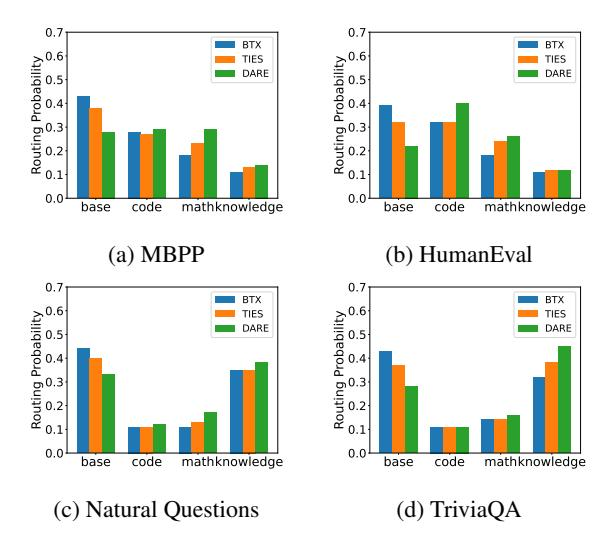
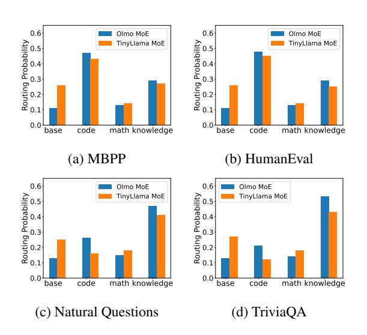
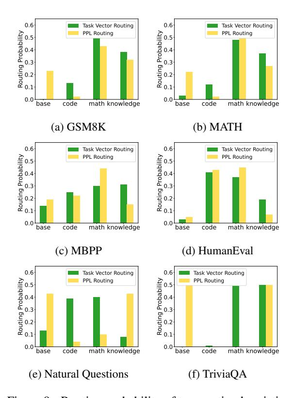

# 7 Limitation

One of the limitations of the proposed merging methods with heterogeneous experts is that the merged MoE model has more parameters when the BTX merging, since we do not merge the attention layers. For example, for our 4 × 1B Expert MoE, the total parameter number is about 3.7 billion due to the non-FFNs layer merging but the total parameter number of the MoE after the heterogeneous merging method is near 4 billion. More parameters represent more costly fine-tuning and inference.

For our homogeneous merging method, we replace simple averaging with a more advanced merging method: Dare and Ties and fine-tune MoE models. There are still other merging methods, such as fisher merging [\(Matena and Raffel,](#page-10-8) [2022\)](#page-10-8) or Regmean [\(Jin et al.,](#page-9-6) [2022\)](#page-9-6) methods. However, in the Ties and Dare paper [\(Yadav et al.,](#page-11-2) [2024;](#page-11-2) [Yu et al.,](#page-11-1) [2024\)](#page-11-1), they have demonstrated the superiority of proposed merging methods over Regmean and finisher merging, so we leave the exploration of other merging methods to future work.

Moreover, using routing heuristics to process the input sequence introduces additional inference costs, as we first need to use the expert model to calculate the perplexity (PPL) or gradient. However, our routing heuristic requires only one additional forward pass, and considering the multiple forward passes during inference (forward pass number = the generate token number), the computational overhead for our method to enhance MoE performance without fine-tuning is minimal.

For all MoE fine-tuning, we utilize only the cross-entropy loss to do the auto-regression on the training data. Previous works showed that the loadbalancing loss [\(Fedus et al.,](#page-9-7) [2022;](#page-9-7) [Sukhbaatar et al.,](#page-10-6) [2024\)](#page-10-6) may be beneficial to resolve the "dead" experts. From our routing analysis for the merged MoEs, we observe that merging with homogeneous experts gets the desirable patterns, where most tokens in one specific domain are gated to the corresponding expert. However, for heterogeneous experts, due to the different architecture and tokenizer of the math expert, the math expert does not get the highest routing probability in evaluating on GSM8K and MATH datasets. For the next step, we may need to add the load balancing loss for the fine-tuning of MoE with heterogeneous experts to develop more robust models [\(Zhou et al.,](#page-11-8) [2024a\)](#page-11-8) and observe whether the routing patterns are more efficient.

Due to limitations of computation resources, we only experimented with three domains and 1b LLMs. Incorporating larger models and more domains, such as legal, medical, or multilingual, can benefit future studies. Furthermore, our method can be extended to multimodal MoE by incorporating vision audio or graph experts [\(Wang et al.,](#page-10-18) [2024b](#page-10-18)[,a;](#page-10-19) [Li et al.,](#page-10-20) [2024a;](#page-10-20) [Zhu et al.,](#page-11-9) [2024\)](#page-11-9).

In addition to directly merging models with different architectures with additional projectors, there is another direction to first distill the knowledge of experts to student models with the same architecture [\(Wan et al.,](#page-10-10) [2024;](#page-10-10) [Zhou and Ai,](#page-11-10) [2024;](#page-11-10) [Li et al.,](#page-10-21) [2025;](#page-10-21) [Zhou et al.,](#page-11-11) [2023,](#page-11-11) [2024b\)](#page-11-12) and merge student models together to an MoE. We leave the exploration of this direction to future work.

### Acknowledgments

We would like to thank the anonymous reviewers as well as Saleh Soltan, He Xie, Venkatesh Elango, Wael Hamza, Paiheng Xu, and Xiyao Wang for providing helpful comments and suggestions.

## References

- Jacob Austin, Augustus Odena, Maxwell Nye, Maarten Bosma, Henryk Michalewski, David Dohan, Ellen Jiang, Carrie Cai, Michael Terry, Quoc Le, et al. 2021. Program synthesis with large language models. *arXiv preprint arXiv:2108.07732*.
- Tom Brown, Benjamin Mann, Nick Ryder, Melanie Subbiah, Jared D Kaplan, Prafulla Dhariwal, Arvind Neelakantan, Pranav Shyam, Girish Sastry, Amanda Askell, et al. 2020. Language models are few-shot learners. *Advances in neural information processing systems*, 33:1877–1901.
- Mark Chen, Jerry Tworek, Heewoo Jun, Qiming Yuan, Henrique Ponde De Oliveira Pinto, Jared Kaplan, Harri Edwards, Yuri Burda, Nicholas Joseph, Greg Brockman, et al. 2021. Evaluating large language models trained on code. *arXiv preprint arXiv:2107.03374*.
- Karl Cobbe, Vineet Kosaraju, Mohammad Bavarian, Mark Chen, Heewoo Jun, Lukasz Kaiser, Matthias Plappert, Jerry Tworek, Jacob Hilton, Reiichiro Nakano, et al. 2021. Training verifiers to solve math word problems. *arXiv preprint arXiv:2110.14168*.
- Jiaxi Cui, Zongjian Li, Yang Yan, Bohua Chen, and Li Yuan. 2023. Chatlaw: Open-source legal large language model with integrated external knowledge bases. *arXiv preprint arXiv:2306.16092*.
- Damai Dai, Chengqi Deng, Chenggang Zhao, RX Xu, Huazuo Gao, Deli Chen, Jiashi Li, Wangding Zeng, Xingkai Yu, Y Wu, et al. 2024. Deepseekmoe: Towards ultimate expert specialization in mixture-of-experts language models. *arXiv preprint arXiv:2401.06066*.
- Shihan Dou, Enyu Zhou, Yan Liu, Songyang Gao, Wei Shen, Limao Xiong, Yuhao Zhou, Xiao Wang, Zhiheng Xi, Xiaoran Fan, et al. 2024. Loramoe: Alleviating world knowledge forgetting in large language models via moe-style plugin. In *Proceedings of the 62nd Annual Meeting of the Association for Computational Linguistics (Volume 1: Long Papers)*, pages 1932–1945.
- William Fedus, Barret Zoph, and Noam Shazeer. 2022. Switch transformers: Scaling to trillion parameter models with simple and efficient sparsity. *Journal of Machine Learning Research*, 23(120):1–39.
- Charles Goddard, Shamane Siriwardhana, Malikeh Ehghaghi, Luke Meyers, Vlad Karpukhin, Brian Benedict, Mark McQuade, and Jacob Solawetz. 2024. Arcee's mergekit: A toolkit for merging large language models. *arXiv preprint arXiv:2403.13257*.

- Dirk Groeneveld, Iz Beltagy, Pete Walsh, Akshita Bhagia, Rodney Kinney, Oyvind Tafjord, Ananya Harsh Jha, Hamish Ivison, Ian Magnusson, Yizhong Wang, et al. 2024. Olmo: Accelerating the science of language models. *arXiv preprint arXiv:2402.00838*.
- Suchin Gururangan, Margaret Li, Mike Lewis, Weijia Shi, Tim Althoff, Noah A Smith, and Luke Zettlemoyer. 2023. Scaling expert language models with unsupervised domain discovery. *arXiv preprint arXiv:2303.14177*.
- Dan Hendrycks, Collin Burns, Saurav Kadavath, Akul Arora, Steven Basart, Eric Tang, Dawn Song, and Jacob Steinhardt. 2021. Measuring mathematical problem solving with the math dataset. *arXiv preprint arXiv:2103.03874*.
- Edward J Hu, Yelong Shen, Phillip Wallis, Zeyuan Allen-Zhu, Yuanzhi Li, Shean Wang, Lu Wang, and Weizhu Chen. 2021. Lora: Low-rank adaptation of large language models. *arXiv preprint arXiv:2106.09685*.
- Gabriel Ilharco, Marco Tulio Ribeiro, Mitchell Wortsman, Suchin Gururangan, Ludwig Schmidt, Hannaneh Hajishirzi, and Ali Farhadi. 2022. Editing models with task arithmetic. *arXiv preprint arXiv:2212.04089*.
- Fred Jelinek, Robert L Mercer, Lalit R Bahl, and James K Baker. 1977. Perplexity—a measure of the difficulty of speech recognition tasks. *The Journal of the Acoustical Society of America*, 62(S1):S63–S63.
- Albert Q Jiang, Alexandre Sablayrolles, Antoine Roux, Arthur Mensch, Blanche Savary, Chris Bamford, Devendra Singh Chaplot, Diego de las Casas, Emma Bou Hanna, Florian Bressand, et al. 2024. Mixtral of experts. *arXiv preprint arXiv:2401.04088*.
- Xisen Jin, Xiang Ren, Daniel Preotiuc-Pietro, and Pengxiang Cheng. 2022. Dataless knowledge fusion by merging weights of language models. *arXiv preprint arXiv:2212.09849*.
- Mandar Joshi, Eunsol Choi, Daniel S Weld, and Luke Zettlemoyer. 2017. Triviaqa: A large scale distantly supervised challenge dataset for reading comprehension. *arXiv preprint arXiv:1705.03551*.
- Junmo Kang, Leonid Karlinsky, Hongyin Luo, Zhen Wang, Jacob Hansen, James Glass, David Cox, Rameswar Panda, Rogerio Feris, and Alan Ritter. 2024. Self-moe: Towards compositional large language models with self-specialized experts. *arXiv preprint arXiv:2406.12034*.
- Aran Komatsuzaki, Joan Puigcerver, James Lee-Thorp, Carlos Riquelme Ruiz, Basil Mustafa, Joshua Ainslie, Yi Tay, Mostafa Dehghani, and Neil Houlsby. 2022. Sparse upcycling: Training mixture-ofexperts from dense checkpoints. *arXiv preprint arXiv:2212.05055*.

- Tom Kwiatkowski, Jennimaria Palomaki, Olivia Redfield, Michael Collins, Ankur Parikh, Chris Alberti, Danielle Epstein, Illia Polosukhin, Jacob Devlin, Kenton Lee, et al. 2019. Natural questions: a benchmark for question answering research. *Transactions of the Association for Computational Linguistics*, 7:453– 466.
- Margaret Li, Suchin Gururangan, Tim Dettmers, Mike Lewis, Tim Althoff, Noah A Smith, and Luke Zettlemoyer. 2022. Branch-train-merge: Embarrassingly parallel training of expert language models. *arXiv preprint arXiv:2208.03306*.
- Yunxin Li, Shenyuan Jiang, Baotian Hu, Longyue Wang, Wanqi Zhong, Wenhan Luo, Lin Ma, and Min Zhang. 2024a. Uni-moe: Scaling unified multimodal llms with mixture of experts. *arXiv preprint arXiv:2405.11273*.
- Zongxia Li, Ishani Mondal, Huy Nghiem, Yijun Liang, and Jordan Lee Boyd-Graber. 2024b. [PEDANTS:](https://doi.org/10.18653/v1/2024.findings-emnlp.548) [Cheap but effective and interpretable answer equiva](https://doi.org/10.18653/v1/2024.findings-emnlp.548)[lence.](https://doi.org/10.18653/v1/2024.findings-emnlp.548) In *Findings of the Association for Computational Linguistics: EMNLP 2024*, pages 9373–9398, Miami, Florida, USA. Association for Computational Linguistics.
- Zongxia Li, Xiyang Wu, Hongyang Du, Huy Nghiem, and Guangyao Shi. 2025. [Benchmark evaluations,](http://arxiv.org/abs/2501.02189) [applications, and challenges of large vision language](http://arxiv.org/abs/2501.02189) [models: A survey.](http://arxiv.org/abs/2501.02189)
- Xiaoyu Liu, Paiheng Xu, Junda Wu, Jiaxin Yuan, Yifan Yang, Yuhang Zhou, Fuxiao Liu, Tianrui Guan, Haoliang Wang, Tong Yu, et al. 2024a. Large language models and causal inference in collaboration: A comprehensive survey. *arXiv preprint arXiv:2403.09606*.
- Xiaoyu Liu, Jiaxin Yuan, Yuhang Zhou, Jingling Li, Furong Huang, and Wei Ai. 2024b. Csrec: Rethinking sequential recommendation from a causal perspective. *arXiv preprint arXiv:2409.05872*.
- Yun Luo, Zhen Yang, Fandong Meng, Yafu Li, Jie Zhou, and Yue Zhang. 2023. An empirical study of catastrophic forgetting in large language models during continual fine-tuning. *arXiv preprint arXiv:2308.08747*.
- Michael S Matena and Colin A Raffel. 2022. Merging models with fisher-weighted averaging. *Advances in Neural Information Processing Systems*, 35:17703– 17716.
- OpenAI. 2023. [Gpt-4 technical report.](http://arxiv.org/abs/2303.08774)
- Keiran Paster, Marco Dos Santos, Zhangir Azerbayev, and Jimmy Ba. 2023. Openwebmath: An open dataset of high-quality mathematical web text. *arXiv preprint arXiv:2310.06786*.
- Nicholas Roberts, Samuel Guo, Zhiqi Gao, Satya Sai Srinath Namburi GNVV, Sonia Cromp, Chengjun Wu, Chengyu Duan, and Frederic Sala. 2024. Pretrained hybrids with mad skills. *arXiv preprint arXiv:2406.00894*.

- Baptiste Roziere, Jonas Gehring, Fabian Gloeckle, Sten Sootla, Itai Gat, Xiaoqing Ellen Tan, Yossi Adi, Jingyu Liu, Tal Remez, Jérémy Rapin, et al. 2023. Code llama: Open foundation models for code. *arXiv preprint arXiv:2308.12950*.
- Yijia Shao, Yucheng Jiang, Theodore A Kanell, Peter Xu, Omar Khattab, and Monica S Lam. 2024. Assisting in writing wikipedia-like articles from scratch with large language models. *arXiv preprint arXiv:2402.14207*.
- Noam Shazeer, Azalia Mirhoseini, Krzysztof Maziarz, Andy Davis, Quoc Le, Geoffrey Hinton, and Jeff Dean. 2017. Outrageously large neural networks: The sparsely-gated mixture-of-experts layer. *arXiv preprint arXiv:1701.06538*.
- Sainbayar Sukhbaatar, Olga Golovneva, Vasu Sharma, Hu Xu, Xi Victoria Lin, Baptiste Rozière, Jacob Kahn, Daniel Li, Wen tau Yih, Jason Weston, and Xian Li. 2024. [Branch-train-mix: Mixing expert llms](http://arxiv.org/abs/2403.07816) [into a mixture-of-experts llm.](http://arxiv.org/abs/2403.07816)
- Together Computer. 2023. [Redpajama: an open dataset](https://github.com/togethercomputer/RedPajama-Data) [for training large language models.](https://github.com/togethercomputer/RedPajama-Data)
- Hugo Touvron, Thibaut Lavril, Gautier Izacard, Xavier Martinet, Marie-Anne Lachaux, Timothée Lacroix, Baptiste Rozière, Naman Goyal, Eric Hambro, Faisal Azhar, et al. 2023. Llama: Open and efficient foundation language models. *arXiv preprint arXiv:2302.13971*.
- Fanqi Wan, Xinting Huang, Deng Cai, Xiaojun Quan, Wei Bi, and Shuming Shi. 2024. Knowledge fusion of large language models. *arXiv preprint arXiv:2401.10491*.
- Xiyao Wang, Jiuhai Chen, Zhaoyang Wang, Yuhang Zhou, Yiyang Zhou, Huaxiu Yao, Tianyi Zhou, Tom Goldstein, Parminder Bhatia, Furong Huang, and Cao Xiao. 2024a. [Enhancing visual-language modality](http://arxiv.org/abs/2405.15973) [alignment in large vision language models via self](http://arxiv.org/abs/2405.15973)[improvement.](http://arxiv.org/abs/2405.15973)
- Xiyao Wang, Yuhang Zhou, Xiaoyu Liu, Hongjin Lu, Yuancheng Xu, Feihong He, Jaehong Yoon, Taixi Lu, Gedas Bertasius, Mohit Bansal, et al. 2024b. Mementos: A comprehensive benchmark for multimodal large language model reasoning over image sequences. *arXiv preprint arXiv:2401.10529*.
- Mitchell Wortsman, Gabriel Ilharco, Samir Ya Gadre, Rebecca Roelofs, Raphael Gontijo-Lopes, Ari S Morcos, Hongseok Namkoong, Ali Farhadi, Yair Carmon, Simon Kornblith, et al. 2022. Model soups: averaging weights of multiple fine-tuned models improves accuracy without increasing inference time. In *International conference on machine learning*, pages 23965–23998. PMLR.
- Chengyue Wu, Yukang Gan, Yixiao Ge, Zeyu Lu, Jiahao Wang, Ye Feng, Ping Luo, and Ying Shan. 2024. Llama pro: Progressive llama with block expansion. *arXiv preprint arXiv:2401.02415*.

Prateek Yadav, Derek Tam, Leshem Choshen, Colin A Raffel, and Mohit Bansal. 2024. Ties-merging: Resolving interference when merging models. *Advances in Neural Information Processing Systems*, 36.

Le Yu, Bowen Yu, Haiyang Yu, Fei Huang, and Yongbin Li. 2024. Language models are super mario: Absorbing abilities from homologous models as a free lunch. In Forty-first International Conference on Machine Learning.

Longhui Yu, Weisen Jiang, Han Shi, Jincheng Yu, Zhengying Liu, Yu Zhang, James T Kwok, Zhenguo Li, Adrian Weller, and Weiyang Liu. 2023. Metamath: Bootstrap your own mathematical questions for large language models. *arXiv preprint* arXiv:2309.12284.

Peiyuan Zhang, Guangtao Zeng, Tianduo Wang, and Wei Lu. 2024. Tinyllama: An open-source small language model. *arXiv preprint arXiv:2401.02385*.

Xiaofeng Zhang, Yikang Shen, Zeyu Huang, Jie Zhou, Wenge Rong, and Zhang Xiong. 2022. Mixture of attention heads: Selecting attention heads per token.

Yuhang Zhou and Wei Ai. 2024. Teaching-assistant-in-the-loop: Improving knowledge distillation from imperfect teacher models in low-budget scenarios. *arXiv preprint arXiv:2406.05322*.

Yuhang Zhou, Suraj Maharjan, and Beiye Liu. 2023. Scalable prompt generation for semi-supervised learning with language models. *arXiv preprint arXiv*:2302.09236.

Yuhang Zhou, Paiheng Xu, Xiaoyu Liu, Bang An, Wei Ai, and Furong Huang. 2024a. Explore spurious correlations at the concept level in language models for text classification.

Yuhang Zhou, Jing Zhu, Paiheng Xu, Xiaoyu Liu, Xiyao Wang, Danai Koutra, Wei Ai, and Furong Huang. 2024b. Multi-stage balanced distillation: Addressing long-tail challenges in sequence-level knowledge distillation. *arXiv preprint arXiv:2406.13114*.

Jing Zhu, Yuhang Zhou, Shengyi Qian, Zhongmou He, Tong Zhao, Neil Shah, and Danai Koutra. 2024. Multimodal graph benchmark. *arXiv preprint* arXiv:2406.16321.

#### **A** Implementation Details

For our Base-1B models, we utilize the Llama-2 architecture (Wu et al., 2024) with layer number 24 and hidden dimension 2048. The open-source TinyLlama-1.1B model contains 22 layers and the hidden dimension is 2048. For the open-source Olmo-1B model, it has 16 layers and the hiddn dimension is 2048.

In our experiments, we use top-2 routing for MoE models. For Dare-merging and Ties merging

(both dense and MoE), we set the scaling term  $\lambda$  to  $\frac{1}{3}$  and the retain ratio p of the model parameters of two methods are set to 80% to gain the optimal performance, according to our preliminary exploration. For inference, we set the temperature to 0.0 for greedy decoding, and the maximal number of generated tokens is 512. For CPT and fine-tuning of MoE and dense models, we set the learning rate to 1e-5 and the weight decay is 0.01.

#### **B** Data mixture

In Table 5, we present the data ratios to CPT or fine-tune the dense or MoE models. For fine-tuning the MoE model, we sample datasets that are used to train all experts and the base model with the same probabilities as described in Sukhbaatar et al. (2024).

|               | Base   | Math   | Code   | Knowledge | Finetune MoE |
|---------------|--------|--------|--------|-----------|--------------|
| Wiki1         | 0.85%  | 0.17%  | 0.17%  | 8.00%     | 1.11%        |
| Wiki2         | 0.00%  | 0.00%  | 0.00%  | 8.00%     | 0.82%        |
| Arxiv         | 9.37%  | 1.87%  | 1.87%  | 7.94%     | 3.94%        |
| CommonCrawl   | 27.92% | 5.58%  | 5.58%  | 23.65%    | 11.74%       |
| C4            | 54.60% | 10.93% | 10.93% | 46.26%    | 22.97%       |
| StackExchange | 7.26%  | 1.45%  | 1.45%  | 6.15%     | 3.05%        |
| Open Web Math | 0.00%  | 80.00% | 0.00%  | 0.00%     | 24.13%       |
| GitHub        | 0.00%  | 0.00%  | 80.00% | 0.00%     | 32.25%       |
|               |        |        |        |           |              |

Table 5: Data source and weights for CPT or fine-tune MoE or dense models. Wiki1 represents the first half of Wikipedia data for pretraining the base model and Wiki2 represents the second half of Wikipedia data for CPT the knowledge expert.

#### C Task Vector Routing Heuristic

Our second approach is to identify the input domain and assign the input to experts trained in that domain. The core idea is that an expert's task vector, defined as the difference between its parameters and the base model, represents the cumulative gradient of the base model on the expert's training data. For a given input, we first compute the base model's gradient on that input and compare it to the task vectors of each expert. A higher similarity between the gradient and a task vector suggests the input is closer to the expert's training data.

With the task vectors  $\tau_1, \tau_2, \ldots, \tau_l$  for l experts and inference input  $x_{inf}$ , the loss function  $\mathcal{L}$  and the base model parameters  $\theta_b$ , we first compute the gradient  $(g_{inf})$  of the loss function with respect to the base model parameters as:  $g_{inf} = \nabla_{\theta_b} \mathcal{L}(x_{inf})$ .

The routing heuristic decides the experts and

Figure 7: Routing probability of experts on MBPP, HumanEval, Natural Questions and TriviaQA for different merging methods.

Figure 8: Routing probability of experts on MBPP, HuamnEval, Natural Questions and TriviaQA for the MoE w/ Olmo and MoE w/ TinyLlama.

weights with the cosine similarity (Sim) as below:

$$\alpha = \text{SoftMax}(\text{top-K}(\text{Sim}(g_{inf}, \tau_1), \dots, \text{Sim}(g_{inf}, \tau_l)))$$

#### **D** Supplementary Results

In this section, we present the supplementary analysis of the routing probability for each research question.

For the calculation of training cost for each method, we will use the product of the number of model parameters and the number of training tokens as a metric for training cost. We present the training costs for each method featured in Tables 1, 3, and 4.

Figure 9: Routing probability of tow routing heuristics for each dataset.

Figure 10: Performance with varied fine-tuning token numbers across different datasets.

| Method             | Training Cost (# B parameters $\times$ # B tokens) |  |  |  |
|--------------------|----------------------------------------------------|--|--|--|
| Base-1B            | 0                                                  |  |  |  |
| Code Expert        | 100                                                |  |  |  |
| Math Expert        | 100                                                |  |  |  |
| Knowledge Expert   | 100                                                |  |  |  |
| Random Routing     | 300                                                |  |  |  |
| Router Fine-Tuning | 300                                                |  |  |  |
| BTX Merging        | $448 (3 \times 100 + 3.7 \times 40)$               |  |  |  |
| Ties Merging       | 448                                                |  |  |  |
| Dare Merging       | 448                                                |  |  |  |
| Model Upcycling    | $1258 (3.7 \times 340)$                            |  |  |  |

Table 6: Training cost of methods in Table 1

| Method             | Training Cost (# B parameters × # B tokens) |
|--------------------|---------------------------------------------|
| Dare               | 100                                         |
| Ties               | 100                                         |
| Merge Attention    | 100                                         |
| Separate Attention | 100                                         |

Table 7: Training cost of methods in Table 3

| Method                       | Training Cost (# B parameters $\times$ # B tokens) |
|------------------------------|----------------------------------------------------|
| Base-1B                      | 0                                                  |
| Base TinyLlama               | 0                                                  |
| Base Olmo                    | 0                                                  |
| Code Expert                  | 100                                                |
| Math TinyLlama               | 100                                                |
| Math Olmo                    | 100                                                |
| Knowledge Expert             | 100                                                |
| 3-expert MoE                 | $312 (2 \times 100 + 2.8 \times 40)$               |
| (Ours) MoE w/ Math Olmo      | 448                                                |
| (Ours) MoE w/ Math TinyLlama | 448                                                |

Table 8: Training cost of methods in Table 4