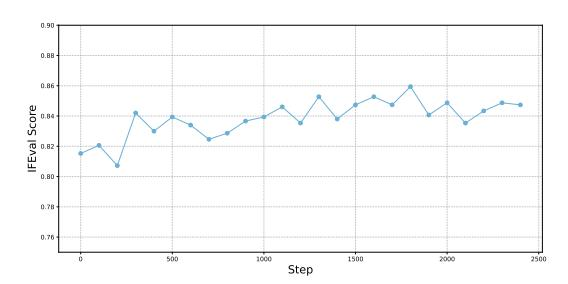

# C EXPERIMENTAL DETAILS AND ADDITIONAL EXPERIMENTS

### C.1 MODEL CONFIGURATIONS

In Table [6,](#page-14-1) we list their parameter size, the number of layers, the number of routed experts, the number of activated routed experts per token and whether they apply the shared experts architecture.

### C.2 HYPER-PARAMETER CONFIGURATIONS

We describe the hyper parameters in the comparative experiments. For the MergeMoE, when computing the compression matrix T1 with the least square method, we conduct the computation in the GPU memory, and therefore the number of input samples used in the merging algorithm is limited.

Table 6: Configurations for three used models in the evaluations.

| Model             | Size | Layers | Experts | Activated Experts | Shared Experts |
|-------------------|------|--------|---------|-------------------|----------------|
| Qwen3-30B-A3B     | 14B  | 48     | 128     | 8                 | No             |
| Qwen1.5-MoE-A2.7B | 14B  | 24     | 60      | 4                 | Yes            |
| DeepSeekMoE       | 16B  | 28     | 64      | 6                 | Yes            |

Figure 5: Evaluation on the IFEval benchmark.

Besides, lengths of texts in different datasets may change, and therefore the batch size is also not fixed. In the comparative experiments we try to use large batch size for each dataset. We will ensure that, the batch size is the same for all merging algorithms applied to the same model and dataset combination.

**Comparative experiments on the Qwen3 model.** For all merging algorithms, we merges the layers 28 to 47, reducing the number of experts in each layers from 128 to 64. For the number of input samples, we use 16 for ARC chanllenge, HellaSwag, PIQA, SQuAD, and 40 for the rest tasks.

Comparative experiments on the Qwen1.5 model. For all merging algorithms, we merges the layers 10 to 23, reducing the number of experts in each layers from 60 to 30. For the number of input samples, we use 32 for PIQA and SQuAD, and 64 for the rest tasks.

**Comparative experiments on the DeepSeekMoE model.** For all merging algorithms, we merges the layers 16 to 27, reducing the number of experts in each layers from 64 to 28. For the number of input samples, we use 128 for WinoGrande and MRPC, 64 for ARC easy, ARC challenge and Hellaswag, and 40 for the rest tasks.

#### C.3 EVALUATION ON IFEVAL

We further evaluate our algorithm on the IFEval benchmark. The evaluation is conducted on the Qwen3-30B-A3B, and we use the same compression configuration as in Appendix C.2, which reduces the number of model parameters from 30B to 25B. We additionally incorporat ShareGPT for knowledge distillation, aiming to explore whether instruction-following ability could be further enhanced. As shown in Figure 5, without any distillation, the compressed model achieves a score of 0.8153. With knowledge distillation, its performance is further boosted to around 0.85. This demonstrates two key findings: our merging algorithm yields solid results even in its compressed form, and knowledge distillation can serve as an effective means to further enhance performance on generative tasks.