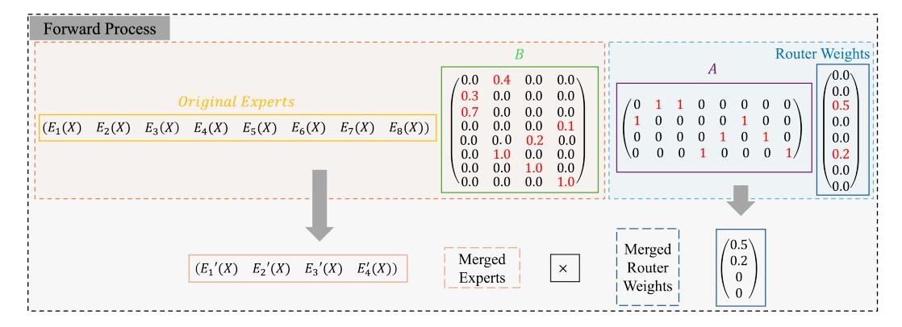
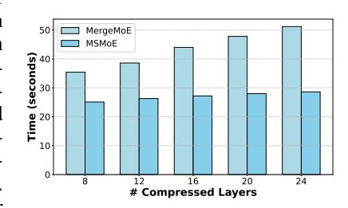
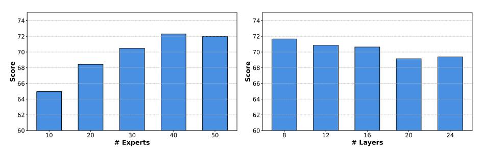
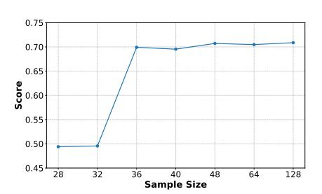

# 3 BACKGROUND AND THEORETICAL INSIGHTS

In this section, we first provide a brief overview of the MoE architecture. We then present theoretical insights into expert merging, which recast the merging process as introducing additional matrices in the forward computation and framing it as an optimization problem. Finally, we revisit prior expertmerging algorithm and show how they can be interpreted within our theoretical framework, thereby clarifying their limitations.

### 3.1 PRELIMINARY

We begin by introducing the MoE architecture. Let N be the number of experts and K be the number of activated experts per token. The MLP module consists of a router and N experts, where the router has weight matrix Wr. Given an input X, the router computes sof tmax(WrX) and selects top-K experts according to the highest scores. We denote the i th expert as Ei , which follows the SwiGLU design and contains three weight matrices WD, WU and WG and a non-linear activation function σ.

Figure 1: An overview of how the merging algorithm changes the forward process of the MoE module. It shows the transition from an initial 8-expert configuration (top-2 activation per token) to 4 experts after compression.

With a slight abuse of notation, we use  $E_i(X)$  to denote its output on input X, which is given by:

$$E_i(X) = W_D(\sigma(W_G X) \odot (W_U X)),$$

where  $\odot$  denotes the Hadamard product. After the selected K experts compute their outputs, the final result is obtained as a weighted average of these outputs, with weights given by the corresponding top-K entries of  $softmax(W_rX)$ . Formally, the forward computation can be written as

$$[E_1(X) \quad E_2(X) \quad \dots \quad E_N(X)] \cdot mask\_top\_K(softmax(W_rX))^{\top}$$

Let

$$Y = [E_1(X) \quad E_2(X) \quad \dots \quad E_N(X)],$$

then the formula above can be simplified as

$$Y \cdot mask\_top\_K(softmax(W_rX))^{\top}$$
 (1)

Here  $mask\_top\_K(\cdot)$  denotes the operator that sets all but the top-K entries to zero. We emphasize that Eq 1 describes an equivalent computational view; in practice, masked experts are skipped and do not contribute to computation.

#### 3.2 Insights for Expert Merging

We next consider merging experts within a single MoE layer, reducing the number of experts from N to M. To achieve this, the experts are first clustered into M groups, and the experts within each group are then merged to form a new expert. Traditionally, model pruning have focused on the parameter space. In this view, experts that are considered "similar" are grouped and merged by averaging or weighted averaging their parameters, under the intuition that combining similar parameters reduces approximation error. Routing weights for the merged experts are then computed as the sum of the original experts' routing weights. In contrast, we argue that experts merging should focus on merging the experts' outputs.

As shown in Figure 1, summing the routing weights of the merged experts is equivalent to multiplying by a summation matrix A, defined as:

$$A_{ij} = \begin{cases} 1, & \text{the original } j^{th} \text{ expert is classified into } i^{th} \text{ cluster} \\ 0, & \text{otherwise} \end{cases} \tag{2}$$

In Figure 1, the clustered groups are  $(E_2, E_3)$ ,  $(E_1, E_6)$ ,  $(E_5, E_7)$ ,  $(E_4, E_8)$ . Given original routing weights  $(0, 0, 0.5, 0, 0, 0.2, 0, 0)^{\top}$ , the weights after merging become  $(0.5, 0.2, 0, 0)^{\top}$ . Motivated by this observation, we shift the target of weighted averaging from experts' parameters to their outputs, which can be expressed as multiplication by a matrix B:

$$B_{ij} = \begin{cases} w_{ij}, & \text{if the original } i^{th} \text{ expert is assigned to the } j^{th} \text{ cluster with weight } w_{ij} \\ 0, & \text{otherwise} \end{cases}$$

Consequently, the forward pass can be rewritten as

$$Y \cdot B \cdot A \cdot mask\_top\_K(softmax(W_rX))^{\top}$$

This allows us to move from a previously qualitative view of parameters merging to a quantitative one, by formulating it as a linear optimization problem, where the objective is to choose A and B such that the merged forward output approximates the original MoE forward computation in Equation 1.

The remaining challenge is how to set the parameters of the merged experts such that their outputs approximate a linear combination of the original experts' outputs. Let  $E'_i$  denote the  $i^{th}$  merged expert. It should approximately satisfy

$$E_i'(X) = \sum_j B_{ji} E_j(X), \forall X.$$

For example, in Figure 1, the first group consists of the  $2^{nd}$  and  $3^{rd}$  experts, with weights 0.3 and 0.7, respectively. Then the merged expert  $E_1'$  should approximately satisfy  $E_1'(X) = 0.3E_2(X) + 0.7E_3(X), \forall X$ .

We find that

$$E'_{i}(X) = \sum_{j} B_{ji} E_{j}(X) = \sum_{j} B_{ji} W_{Dj} (\sigma(W_{Gj}X) \odot (W_{Uj}X))$$

$$= [B_{1i}W_{D1}, B_{2i}W_{D2}, \cdots, B_{Ni}W_{DN}] (\sigma(\begin{bmatrix} W_{G1} \\ W_{G2} \\ \vdots \\ W_{GN} \end{bmatrix} X) \odot (\begin{bmatrix} W_{U1} \\ W_{U2} \\ \vdots \\ W_{UN} \end{bmatrix} X))$$

If we set the parameters of merged experts as

$$W'_{Di} = [B_{1i}W_{D1}, B_{2i}W_{D2}, \cdots, B_{Ni}W_{DN}], W'_{Gi} = \begin{bmatrix} W_{G1} \\ W_{G2} \\ \vdots \\ W_{GN} \end{bmatrix}, W'_{Ui} = \begin{bmatrix} W_{U1} \\ W_{U2} \\ \vdots \\ W_{UN} \end{bmatrix},$$

then the merged experts  $E_i'(X) = W_{Di}'(\sigma(W_{Gi}'X) \odot (W_{Ui}'X))$  can satisfy the requirement without incurring any approximation error. However, this construction only works because we allow the intermediate dimensions to grow with the number of merged experts. As a result, both the parameter size and the computational cost remain unchanged. To ensure that each merged expert has the same parameter scale as a standard expert, we need to reduce the intermediate dimensionality. We then introduce dimension reduction matrices  $T_1, T_2, T_3$  and express the merged expert as

$$E_i'(X) = W_{Di}' T_1(\sigma(T_2 W_{Gi}' X) \odot (T_3 W_{Ui}' X)), \tag{3}$$

which transforms the problem into finding suitable  $T_1, T_2, T_3$  to reduce the approximation error.

#### 3.3 M-SMoE under Our Output-Merging View

The prior work on expert merging, M-SMoE, adapts the traditional view of merging parameter. M-SMoE merges experts in the same cluster by weighted averaging the parameters of each weight matrices, with usage frequencies as the weights. Under our output-merging view, it is equivalent to set  $T_1, T_2, T_3$  as follows.

$$T_{1} = \begin{bmatrix} I, \\ I, \\ \vdots \\ I \end{bmatrix}, T_{2} = [B_{1i}I, B_{2i}I, \cdots B_{Ni}I], T_{3} = [B_{1i}I, B_{2i}I, \cdots B_{Ni}I]. \tag{4}$$

The  $T_1, T_2, T_3$  settings are not derived from quantitative optimization, and thus there remains room for further improvement.

### 4 METHODOLOGY

Finding the optimal  $T_1, T_2, T_3$  that minimize the approximation error is challenging, because it contains a non-linear activation function and a Hadamard product. We propose a strategy that decouples the optimization of  $T_1$  and  $T_2, T_3$ .

We first assume the  $T_2$  and  $T_3$  are fixed and focus on the  $T_1$  alone. Given a sampled inputs  $\hat{X}$ , according to Equation 3, the  $T_1$  should approximately satisfy

$$T_1(\sigma(T_2W'_{G_i}\hat{X}) \odot (T_3W'_{U_i}\hat{X})) = \sigma(W'_{G_i}\hat{X}) \odot (W'_{U_i}\hat{X})$$

$$\tag{5}$$

Because  $T_2, T_3$  and input samples  $\hat{X}$  are given, we can compute  $P = (\sigma(T_2W'_{Gi}\hat{X}) \odot (T_3W'_{Ui}\hat{X}))$  and  $Q = \sigma(W'_{Gi}\hat{X}) \odot (W'_{Ui}\hat{X})$  and reduces the problem to a linear system  $T_1P = Q$ . Since this forms a linear least squares problem,  $T_1$  admits a closed-form solution

$$T_1 = QP^{\dagger},\tag{6}$$

where  $P^{\dagger}$  denotes the Moore-Penrose pseudoinverse of P.

The  $T_2$  and  $T_3$  are closely associated with the non-linear activation function and the Hadamard product. This tight integration introduces intrinsic non-linearities that prevent the objective function from being reformulated as a linear optimization problem, thereby precluding the existence of a closed-form solution for their joint optimization. Therefore we let  $T_2$  and  $T_3$  represent weighted averages within clusters and set them according to Equation 4. To reduce the error caused by weighted average, when clustering the experts, we employ the similarity of the concatenated results of the matrix  $W_U$  and the matrix  $W_G$  of experts as the metric to measure the distance between two experts. Then weighted average is performed among experts with similar  $W_U$  and  $W_G$ , and the approximation error can be reduced.

Once the clustering method is determined, the matrix A is also uniquely fixed according to Equation 2. We use the relative usage frequency of the experts as the weight for the weighted average within the cluster. It is noticeable that M-SMoE also applies relative usage frequency as the weight. However, it selects this scheme primarily based on experimental performance, while we provide theoretical proof for its optimality.

Our aim is to minimize the error between the compressed output and the original output, which is the Frobenius norm of

$$(YBA - Y) \cdot mask\_top\_K(softmax(W_rX))^{\top}$$

We define a "Quasi-Frobenius" norm QF(Y):

$$QF(Y) = [||E_1(X)||_F^2, ||E_2(X)||_F^2, ..., ||E_N(X)||_F^2] \in \mathbb{R}^N$$

We suppose that the router logits and the output of experts are independent. Consider taking a large number of samples, if the distribution of the frequency of expert usage is already known, explicitly, let the expected number of times the i-th expert is used be  $f_i$ , and denote  $Y_0 = \mathbb{E}_{X \sim \pi} Y$ , where  $\pi$  is the distribution of the input X. Then the function  $mask\_top\_K$  can be unpacked as an expected value, which leading to an simplified lower bound for the above equation:

$$\mathbb{E}_{X \sim \pi}[||(YBA - Y)mask\_top\_K(softmax(W_rX))^\top||_F^2]$$

$$= \mathbb{E}_{X \sim \pi}[(Y(BA - I_N))QF \cdot mask\_top\_K(softmax(W_rX))^\top]$$

$$= \mathbb{E}_{X \sim \pi}[Y((BA - I_N)QF)] \times \mathbb{E}_{X \sim \pi}[mask\_top\_K(softmax(W_rX))^\top]$$

$$\geq Y_0((BA - I_N)QF) \times [f_1, f_2, ..., f_N]^\top$$

where  $I_N$  denotes the identity matrix in  $\mathbb{R}^{N \times N}$ .

For a given clustering approach, each pre-merger expert should correspond to exactly one post-merger expert. Also, a post-merger expert is the weighted sum of its corresponding pre-merger ones. This is equivalent to each row of A having exactly one 1 and the rest are 0, and each row of B having non-zero values only at the indices of its cluster.

**Theorem 1.** Given  $A \in \mathbb{R}^{M \times N}$ ,  $Y_0 \in \mathbb{R}^{K \times N}$ , each column of A has exactly one 1 and the rest are 0. Let  $B \in \mathbb{R}^{N \times M}$ ,  $v_1, v_2, ..., v_M$  be the columns of B. Let  $C_i$  be the indices corresponding to

the non-zero values of the i-th column of A. For i = 1, 2, ..., M,  $v_i$  has non-zero values only at the indices in  $C_i$ . Then:

$$v_i[j] = \begin{cases} \frac{f_j}{\sum\limits_{k \in C_i} f_k}, & if j \in C_i \\ 0, & otherwise \end{cases}$$

is a minimal point of the function:

$$Y_0((BA - I_N)QF) \times [f_1, f_2, ..., f_N]^{\top}$$

For a detailed proof of the theorem, please refer to Appendix A.

**Summary of the algorithm design.** We have explained all the design choices in our algorithm. Our algorithm is summarized as follows.

- 1. Clustering. Experts with top-M usage frequencies are selected as the clustering center, and the other experts are classified according to their distance from the experts in the clustering centers. We uses the similarity of the concatenated results of the matrix  $W_U$  and the matrix  $W_G$  as the metric for the distance between two experts.
- 2. Merging the experts within the same cluster. Within the cluster, we use the relative usage frequency of each expert as the weight. We set the compression matrix  $T_2, T_3$  according to Equation 4, which represent the weighted average. Then we utilize input samples  $\hat{X}$  and apply the least squares method according to Equation 6 to compute the closed form result of  $T_1$ . Finally  $W'_DT_1, T_2W'_G, T_3W'_U$  will be outputted as the weight matrices of the merged expert.

It is noticeable that our technique can also be applied to those MoE models with shared experts. In models with shared experts, the shared experts and routed experts are usually independent during the forward pass. Therefore, the routed experts can be directly compressed according to our algorithm.

#### 5 EVALUATION

#### 5.1 SETUP

**Models and Datasets.** We used three open-source MoE models for evaluation: DeepSeekMoE (Rajbhandari et al., 2022a), Qwen1.5-MoE-A2.7B (Team, 2024), and Qwen3-30B-A3B (Yang et al., 2025). We summarize the configurations of the three models in Appendix C.1. The experiments are conducted on seven NLP datasets: MRPC (Dolan & Brockett, 2005) for paraphrase identification, WinoGrande (Sakaguchi et al., 2021) for coreference resolution, SQuAD (Rajpurkar et al., 2016) for extractive QA, Hellaswag (Zellers et al., 2019) for commonsense reasoning, PIQA (Bisk et al., 2020) for physical interaction reasoning, ARC easy and ARC challenge (Clark et al., 2018) for scientific reasoning. In Appendix C.3 we further evaluate the performance of MergeMoE on the instruction following benchmark IFEval (Zhou et al., 2023).

**Evaluation Details.** The merging algorithms are conducted on a single NVIDIA H20 with 96GB memory, and the evaluation is conducted on two NVIDIA H20. We use DCLM (Li et al., 2024) to evaluate the performance of models in downstream tasks. We use M-SMoE Li et al. (2023) as the main baseline for the comparative experiments. Considering the lack of work on experts merging, we also uses the baselines in the experiments of the M-SMoE, which adapt Average (Choshen et al., 2022) and ZipIt (Stoica et al., 2023) in the expert merging scenarios. In the comparative experiments, we ensure that both our solution and the baselines merge the same set of layers, and the compression ratios are also the same. For the M-SMoE, although it describes a way to adjust the compression ratios of each layer, we found in our evaluations that it may lead to much worse results. Therefore, we simply fix the compression ratios for all layers to be consistent, and we believe it is still a fair setting.

### 5.2 Performance of MergeMoE

We compare the performance of MergeMoE with baseline algorithms on three MoE models. For the evaluation on the Qwen3-30B-A3B model, we additionally use Qwen3-4B as a dense baseline,

Table 1: Performance evaluation of MergeMoE and the baselines on the Qwen3 model.

| Strategies | Model Size | WinoGrande | ARC easy | ARC challenge | Hellaswag | PIQA  | SQuAD | MRPC  |
|------------|------------|------------|----------|---------------|-----------|-------|-------|-------|
| Full       | 30B        | 74.27      | 84.89    | 67.49         | 76.38     | 81.72 | 66.61 | 72.55 |
| Dense      | 4B         | 67.96      | 81.31    | 60.07         | 68.21     | 77.37 | 64.22 | 75.74 |
| Average    | 25B        | 73.24      | 82.74    | 51.96         | 71.36     | 74.65 | 63.94 | 72.55 |
| ZipIt      | 25B        | 72.77      | 77.78    | 56.40         | 72.61     | 76.50 | 63.81 | 72.55 |
| M-SMoE     | 25B        | 73.95      | 82.87    | 61.77         | 74.12     | 80.79 | 64.28 | 72.30 |
| MergeMoE   | 25B        | 73.72      | 83.04    | 63.48         | 74.93     | 81.34 | 64.56 | 72.55 |

Table 2: Performance evaluation of MergeMoE and the baselines on the Qwen1.5 model.

| Strategies | Model Size | WinoGrande | ARC easy | ARC challenge | Hellaswag | PIQA  | SQuAD | MRPC  |
|------------|------------|------------|----------|---------------|-----------|-------|-------|-------|
| Full       | 14B        | 72.30      | 76.98    | 50.60         | 77.14     | 80.79 | 60.36 | 72.06 |
| Dense      | 4B         | 66.85      | 72.55    | 42.75         | 70.00     | 77.97 | 60.54 | 62.99 |
| Dense      | 1.8B       | 61.25      | 65.07    | 35.49         | 60.14     | 74.32 | 49.53 | 68.87 |
| Average    | 10B        | 68.11      | 69.28    | 41.30         | 67.92     | 78.94 | 53.85 | 72.30 |
| ZipIt      | 10B        | 69.14      | 69.53    | 41.81         | 68.06     | 77.80 | 55.75 | 72.06 |
| M-SMoE     | 10B        | 68.98      | 71.00    | 41.55         | 68.87     | 79.27 | 54.99 | 72.30 |
| MergeMoE   | 10B        | 70.48      | 71.25    | 42.06         | 71.58     | 79.27 | 56.40 | 74.75 |

since among the Qwen-3 series it has the closest number of activated parameters to Qwen3-30B-A3B. For the evaluation on the Qwen1.5-MoE-A2.7B, we use Qwen1.5-1.8B and Qwen1.5-4B as dense baselines. For each model, we select a set of layers and a compression ratio; for each selected layer, the number of experts is reduced according to this ratio. All merging algorithms then merge the experts for these layers and evaluate the resulting performance. We also ensure the number of input samples is the same for all merging algorithms applied to the same model and dataset combination. The detailed hyper-parameter configurations, including the merging layers, compression ratios, and the number of input samples are described in [C.2.](#page-13-1) For clarity, the highest-performing scheme is highlighted in blue, and the second-highest in yellow.

Comparison on the Qwen3. The experiment results are shown in Table [1.](#page-6-0) First, MergeMoE achieves the best performance on all tasks except the WinoGrande. On the WinoGrande task, the performance of MergeMoE is the second-highest, with only a 0.23 gap from the best score. Second, the performance gap between MergeMoE and the full model is minimal. On the WinoGrande, PIQA and MRPC tasks, the performance drop compared to the full model is even less than 0.6. Third, our solution significantly outperforms the dense model on most tasks. Notably, while the compressed model uses only 3B active parameters compared to 4B in the dense model, it still achieves superior performance, demonstrating the efficiency and effectiveness of our approach.

Comparison on the Qwen1.5. The experiment results are shown in Table [2.](#page-6-1) MergeMoE achieves the best performance on all tasks. Compared with the SOTA solution, M-SMoE, MergeMoE improves 1.5 on the WinoGrande task, 2.71 on the PIQA task, 1.41 on the SQuAD task, and 2.45 on the MRPC task. We also find that, MergeMoE significantly outperforms the Qwen1.5-1.8B dense model. Compared with Qwen1.5-4B dense model, it achieves better performance on WinoGrande, Hellaswag, PIQA, and MRPC tasks, and comparable performance on the others. As the compressed model has 2.7B active parameters, we believe our solution is efficient on the Qwen1.5 model.

Comparison on the DeepSeekMoE. The experiment results are shown in Table [3.](#page-7-0) Overall, MergeMoE achieves the best performance compared with baselines. Compared to M-SMoE, our approach achieves an improvement of 1.13 on ARC easy and 1.16 on Hellaswag. Compared to Average, MergeMoE achieves an improvement of 1.31 on ARC easy and 1.2 on ARC chanllenge. Compared to ZipIt, MergeMoE achieves an improvement of 2.71 on Hellaswag. Besides, compared with the full model, the performance drop is negligible on most tasks.

Summary. We obtain the following observations from the experiment results. First, MergeMoE generally achieves the best performance among all the baseline algorithms. On all the three models, MergeMoE attains a improvement for most tasks. Second, the performance drop caused by compression is negligible in most cases. Third, MergeMoE outperforms the dense model with a

Table 3: Performance evaluation of MergeMoE and the baselines on the DeepSeekMoE model.

| Strategies | Model Size | WinoGrande | ARC easy | ARC challenge | Hellaswag | PIQA   SQuAD   MRPC                |
|------------|------------|------------|----------|---------------|-----------|------------------------------------|
| Full       | 16B        | 74.59      | 78.17    | 50.26         | 77.10     | 80.30   53.87   60.05              |
| Average    | 12B        | 73.48      | 74.53    | 45.90         | 75.53     | 79.81 54.17 60.54                  |
| ZipIt      | 12B        | 73.09      | 75.55    | 47.53         | 72.61     | 79.00   <mark>54.65</mark>   60.54 |
| M-SMoE     | 12B        | 73.32      | 74.71    | 47.27         | 74.16     | 79.05   55.11   60.29              |
| MergeMoE   | 12B        | 73.64      | 75.84    | 47.10         | 75.32     | 79.87   54.27   60.78              |

Table 4: Evaluation of the cross-dataset generalization abilities for MergeMoE on the Qwen1.5 model. "Self-Sourced Samples" indicates using corresponding samples for each tasks, which follows the same setting in Table 2. The rest three rows use WinoGrande/ARC easy/Hellaswag for merging and evaluate on all tasks. To ensure fairness, we set the total number of sample tokens to be identical to  $16 \mathrm{K}$ .

| Source of Input Samples | WinoGrande | ARC easy | ARC challenge | Hellaswag | PIQA   SQuAD  |
|-------------------------|------------|----------|---------------|-----------|---------------|
| Self-Sourced Samples    | 70.48      | 71.25    | 42.06         | 71.58     | 79.27   56.40 |
| WinoGrande              | 70.40      | 67.72    | 43.69         | 70.11     | 77.86   54.33 |
| ARC easy                | 68.58      | 72.47    | 42.32         | 67.94     | 76.99 	 54.60 |
| Hellaswag               | 69.14      | 70.41    | 43.09         | 71.56     | 78.56 	 54.29 |

comparable number of active parameters. The results show that, MergeMoE effectively mitigates performance degradation from MoE model compression and demonstrates superior effectiveness.

#### 5.3 EXTRA EXPERIMENTS

Experiments on time cost. We compare the time costs of MergeMoE and M-SMoE during the merging process, with results reported in Figure 3. Experiments are conducted on the WinoGrande task using the Qwen 1.5 model. In our setting, MergeMoE is run with a batch size of 128 input samples, and for each layer the number of experts is reduced from 60 to 30. Although MergeMoE is slower than M-SMoE, which is an expected outcome given its more complex operations, both methods complete within a minute. This makes the overall cost negligible. Moreover, since our merging algorithm runs efficiently on a single GPU, Merge-MoE imposes relatively low resource requirements.

Figure 3: Comparison of the time cost

**Experiments on different compression ratios.** We evaluate how different compression ratios affect the performance of models merged by our algorithm. The experiment is conducted on the WinoGrande task with Qwen 1.5 model. Two factors determine the compression ratio: (1) the number of layers involved in the merging process, and (2) the reduced number of experts in each merged layer. In Figure 2a we fix the number of compressed layers to 14 and vary the number of

(a) Impacts of the number of reduced experts. (b) Impacts of the number of compressed layers.

Figure 2: Experiments on the effects of different compression ratios.

| Table 5: Ablation experiments on the compression errors. |  |  |
|----------------------------------------------------------|--|--|
|                                                          |  |  |

| Strategies         | WinoGrande | ARC easy | ARC challenge | Hellaswag | PIQA  |
|--------------------|------------|----------|---------------|-----------|-------|
| Full               | 72.30      | 76.98    | 50.60         | 77.14     | 80.79 |
| w/o merging errors | 71.27      | 73.11    | 43.69         | 72.91     | 79.60 |
| w/ merging errors  | 70.48      | 71.25    | 42.06         | 71.58     | 79.27 |

reduced experts. In Figure [2b](#page-7-2) we instead fix the number of reduced experts to 30 and vary the number of compressed layers. Experimental results indicate that the model accuracy gradually decreases as the compression ratio increases. Furthermore, comparing the impacts of reducing expert count versus increasing compressed layers, we find the former has a more significant effect. This suggests that when implementing the compression algorithm, we should avoid excessive compression of the number of experts in a single layer and instead expand the number of compressed layers.

### Experiments on the number of input samples.

MergeMoE relies on input samples to apply least-squares method for computing an accurate compression matrix T1, and its performance is directly affected by the number of such samples. We evaluate this effect using the Qwen 1.5 model on the WinoGrande task, and the configuration of the compression layers and the compression ratios are the same with the experiment in Table [2.](#page-6-1) As shown in Figure [4,](#page-8-0) MergeMoE fails completely when the sample size falls below a critical threshold (32 in our experiment). Since WinoGrande is a binary-choice dataset, scores around 50% correspond to random guessing. In contrast, once the sample size exceeds the threshold (36), performance improves rapidly and then continues to in-

Figure 4: Evaluation on the impact of the number of sample size.

crease more gradually with additional samples. The results indicate that, MergeMoE is sensitive to sample size. Our algorithm achieves reliable performance only when the number of input samples exceeds this critical threshold. Moreover, increasing the number of samples beyond the threshold consistently leads to further performance gains.

Cross-dataset generalization. We explore the ability for the MergeMoE to generalize across different datasets. Specifically, we apply MergeMoE using input samples sourced from a single dataset, then evaluate the resulting compressed model across all tasks. As shown in Table [4,](#page-7-3) the model merged from a single source dataset achieves scores only slightly lower than those from models merged with self-sourced samples (i.e., samples taken from each respective benchmark). This indicates that our algorithm has cross-dataset generalization capability.

Ablation on the compression errors. As analyzed in [3.2,](#page-2-3) compression errors stem from clustering (A, B) and expert merging (T1, T2, T3). To isolate their effects, we conduct an ablation experiment where clustering is retained but expert outputs are directly merged, thereby removing merging errors. As shown in Table [5,](#page-8-1) this variant outperforms the standard merging scheme, which is consistent with our analysis. The small performance gap further demonstrates the effectiveness of our least-squares method in mitigating merging errors.

