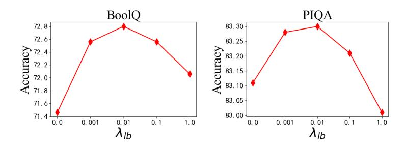

# 4.4 Main results

Single-task setup. In this setup, We compare MiLoRA with baseline PEFT methods by employ-

1 <https://platform.openai.com/docs/models>

|                      | Tunable   | Activated | ARC-e | ARC-c | BoolQ | OBQA  | PIQA  | AQuA  | GSM8k |      |
|----------------------|-----------|-----------|-------|-------|-------|-------|-------|-------|-------|------|
| Method               | Params    | Params    | (acc) | (acc) | (acc) | (acc) | (acc) | (acc) | (acc) | Avg. |
|                      | Baselines |           |       |       |       |       |       |       |       |      |
| Parallel-Adapter     | 83.9M     | 83.9M     | 67.1  | 54.2  | 65.2  | 76.3  | 69.8  | 15.6  | 26.4  | 53.5 |
| Learned-Adapter      | 81.8M     | 81.8M     | 69.3  | 54.4  | 64.9  | 78.4  | 75.6  | 18.3  | 28.9  | 55.7 |
| P-tuning v2          | 84.5M     | 84.5M     | 63.5  | 51.3  | 61.2  | 76.1  | 66.2  | 9.63  | 21.1  | 49.9 |
| IAPT                 | 83.9M     | 83.9M     | 66.3  | 54.7  | 67.8  | 79.2  | 77.3  | 13.6  | 25.8  | 55.0 |
| BitFit               | 87.0M     | 87.0M     | 65.9  | 54.1  | 66.4  | 77.2  | 76.6  | 11.8  | 21.7  | 53.4 |
| (IA)3                | 78.6M     | 78.6M     | 68.1  | 54.6  | 67.2  | 78.1  | 75.4  | 13.2  | 23.4  | 54.3 |
| SSP                  | 80.6M     | 80.6M     | 71.6  | 57.6  | 69.6  | 79.5  | 79.7  | 15.9  | 31.8  | 58.0 |
| LoRA                 | 80.0M     | 80.0M     | 73.4  | 57.2  | 68.8  | 80.1  | 81.4  | 16.6  | 31.1  | 58.4 |
| AdaLoRA              | 80.0M     | 80.0M     | 73.8  | 57.9  | 69.2  | 80.4  | 82.1  | 17.6  | 31.7  | 59.0 |
| MOELoRA              | 87.3M     | 30.1M     | 76.8  | 60.2  | 72.0  | 81.1  | 82.7  | 18.3  | 32.3  | 60.4 |
| DoRA                 | 80.0M     | 80.0M     | 76.5  | 59.8  | 71.7  | 80.6  | 82.7  | 17.9  | 32.6  | 60.3 |
| Our proposed methods |           |           |       |       |       |       |       |       |       |      |
| MiLoRA (ours)        | 80.9M     | 25.2M     | 77.8  | 61.2  | 72.8  | 81.7  | 83.3  | 19.9  | 33.9  | 61.5 |
| MiDoRA (ours)        | 80.9M     | 25.8M     | 77.5  | 61.3  | 72.9  | 81.3  | 83.1  | 19.3  | 34.1  | 61.3 |

Table 1: The Overall comparison of different PEFT methods for single-task learning. The backbone model is LlaMA-2 7B. We report the median accuracy over five random seeds. Bold and Underline indicate the best and the second-best results.

ing these methods for fine-tuning a single task. The experimental results on the five commonsense reasoning tasks and two math reasoning tasks are presented in Table [1.](#page-5-0) We present the number of tunable parameters in the second column and the average activated parameters in the third column. Table [1](#page-5-0) reveals that our MiLoRA method outperforms the baseline methods across all seven tasks, with comparable tunable parameters and much fewer activated parameters. In particular, MiLoRA outperforms the previous SOTA LoRA style baselines like AdaLoRA, DoRA, and MOELoRA with comparable parameters. These results demonstrate that our method is good at downstream task adaptation of large language models.

Multi-task setup. Table [2](#page-6-1) presents the results of LoRA, DoRA, MOELORA, and MiLoRA with LLaMA2-7B in multi-task learning. In contrast to the single-task setup in Table [1,](#page-5-0) during multitask learning, we mixed training data from ARC, BoolQ, OBQA, and PIQA to train the model, followed by separate evaluations to investigate the generalization ability of each method. The results indicate that (a) compared to single-task learning, LoRA and DoRA exhibit degradation in average accuracy in multi-task learning (LoRA: -2.0%, DoRA: -2.25%). At the same time, MOELORA and MiLoRA maintain nearly the same average accuracy. MiLoRA presents nearly no performance loss regarding the average score.

### Results for general-purpose instruction tuning.

After the LlaMA-2 7B is fine-tuned on the Alpaca [\(Taori et al.,](#page-11-12) [2023\)](#page-11-12) dataset with our MiLoRA method or the MOELoRA methods, we utilize the challenging benchmarks, MT-Bench [\(Zheng et al.,](#page-12-20) [2023\)](#page-12-20), MMLU [\(Hendrycks et al.,](#page-9-18) [2020\)](#page-9-18), and BBH [\(Suzgun et al.,](#page-11-11) [2022\)](#page-11-11), for evaluation. We report the average GPT-4 score (gpt4-score) on the MT-Bench. Table [3](#page-6-2) presents the results. Consistent with the previous experiments (Table [1](#page-5-0) and [2\)](#page-6-1), our MiLoRA method outperforms the MOELoRA methods on the three benchmarks, demonstrating that MiLoRA is superior in enhancing the instruction tuning quality of large language models.

#### 4.5 Ablation studies and further analysis

Analysis of the inference efficiency To demonstrate the inference efficiency of our MiLoRA method, we now compare the GPU memory and decoding speed of MiLoRA, DoRA, and MOELoRA under beam search with different beam sizes. In this experiment, LoRA parameters are not merged to the backbone to mimic the single-LLM multitenant setting [\(Chen et al.,](#page-9-5) [2023\)](#page-9-5). We present two metrics for measuring efficiency: (a) peak memory cost (in MiB). (b) tokens generated per second (tps). The results are presented in Table [4.](#page-6-0)

From Table [4,](#page-6-0) under beam sizes 1 and 3, the MiLoRA method has a comparable memory cost with MOELoRA and DoRA. However, its generation speed in terms of tps is significantly higher. With beam size 1, MiLoRA is 21.7% faster than MOELoRA and 19.7% faster than DoRA.

| Method        | Activated Params | ST/MT | ARC-e (acc)       | ARC-c (acc)       | BoolQ (acc)       | OBQA (acc)                 | PIQA (acc)        | Avg.                       |
|---------------|---------------------|-------|----------------------|----------------------|----------------------|----------------------------|----------------------|----------------------------|
| LoRA          | 80.0M               | ST    | 73.4                 | 57.2                 | 68.8                 | 80.1                       | 81.4                 | 72.2                       |
| LOKA          | 00.0W               | MT    | 67.2 ( <b>-6.2</b> ) | 55.1 ( <b>-2.1</b> ) | 69.1 ( <b>+0.3</b> ) | 80.9 ( +0.8 )              | 78.6 ( <b>-2.8</b> ) | 70.2 ( <mark>-2.0</mark> ) |
| MOELoRA       | 17.3M               | ST    | 76.8                 | 60.2                 | 72.0                 | 81.1                       | 82.7                 | 74.6                       |
| MOELOKA       | 17.31 <b>v</b> 1    | MT    | 76.1 ( <b>-0.7</b> ) | 59.3 ( <b>-0.9</b> ) | 71.5 ( <b>+0.1</b> ) | 80.7 ( <mark>-0.4</mark> ) | 82.1 ( <b>-0.3</b> ) | 73.9 ( <b>-0.5</b> )       |
| DoRA 80.0M    | ST                  | 76.5  | 59.8                 | 71.7                 | 80.6                 | 82.7                       | 74.3                 |                            |
|               | 00.0M               | MT    | 74.1 ( <b>-2.4</b> ) | 59.6 ( <b>-0.2</b> ) | 67.4 ( -4.3 )        | 79.2 ( -1.4 )              | 80.4 ( -2.3 )        | 72.1 ( <mark>-2.2</mark> ) |
| Mil -DA ()    | 12.1M               | ST    | 77.8                 | 61.2                 | 72.8                 | 81.7                       | 83.3                 | 75.4                       |
| MiLoRA (ours) | 12.3M               | MT    | 77.4 ( <b>-0.4</b> ) | 61.5 ( +0.3 )        | 72.3 ( -0.3 )        | 81.3 ( -0.4 )              | 83.5 (+0.3)          | 75.2 ( <b>-0.1</b> )       |

Table 2: The Overall comparison of different PEFT methods for multi-task learning. The backbone model is LlaMA-2 7B. ST refers to the single-task setup, while MT refers to the multi-task setup. We report the average accuracy scores over five different runs, with the difference between MT and ST in red font in the brackets.

| Method  | MT-Bench       | MMLU | BBH acc |  |
|---------|----------------|------|------------|--|
| Methou  | gpt4-score (†) | acc  |            |  |
| MOELoRA | 7.08           | 48.2 | 36.8       |  |
| MiLoRA  | 7.21           | 49.7 | 37.3       |  |

Table 3: Performance of general-purpose instruction tuning using the MiLoRA and MOELoRA methods. The backbone model is LlaMA-2 7B. ↑ means the metric is higher the better.

| Method   | Beam size | Speed (tps) | Memory cost (MiB) |
|----------|-----------|-------------|----------------------|
| DoRA     | 1         | 36.5        | 13784                |
| DOKA     | 3         | 29.6        | 15292                |
| MOEL -DA | 1         | 35.9        | 13788                |
| MOELoRA  | 3         | 28.4        | 15352                |
| MI -DA   | 1         | 43.7        | 13784                |
| MiLoRA   | 3         | 33.5        | 15300                |

Table 4: The memory and speed of LlaMA-2 7B for generating responses given input instructions, with different PEFT methods.

With beam size 3, MiLoRA is 17.9% faster than MOELoRA and 13.2% faster than DoRA. The speed advantages of MiLoRA come from the following factors: (a) our method only calls the LoRA router at each Transformer layer when the input prompt goes through the LLM for the first time and right before generating the first new token. In contrast, MOELoRA and almost all the existing MOE-based LoRA variants require one to call multiple routers per layer when generating every new token. (b) our method significantly reduces the number of LoRA modules activated to modify the LLM backbone at each decoding step, making generating new tokens more efficient.

**Distributions of activated LoRA experts** We now compare the distribution of LoRA experts across all Transformer layers on the MT-Bench,

Figure 2: Distribution of LoRA experts across Transformer layers.

BoolQ, and PIQA tasks, in Figure 2. We can observe that: (a) Different Transformer layers choose to activate different LoRA experts via their corresponding routers, and the maximum proportion a LoRA expert can achieve is less than 30%. The results are intuitive since Transformer layers of different depths represent different knowledge, requiring different LoRA experts to express. (b) the LoRA distributions on different tasks are different. For example, a few layers activate LoRA Q or LoRA K on the MT-Bench and BoolQ tasks, while these two LoRA experts are frequently selected for the PIQA task.

Ablation study of MiLoRA framework We now consider the following variants of MiLoRA: (a) MiLoRA-1 substitutes the self-attention pooling to average pooling. (b) MiLoRA-2 substitutes the self-attention pooling to the last-token pooling. (c) MiLoRA-3 uses the GeLU activation function g for the LoRA router. (d) MiLoRA-4 uses ReLU for the first 16 layers' LoRA routers and GeLU for the deeper 16 layers'. (e) MiLoRA-5 uses GeLU for the first 16 layers' LoRA routers and ReLU for

Figure 3: Performances under different proportion of activated experts.

| Method   | BoolQ (acc) | PIQA (acc) | MMLU (acc) |
|----------|----------------|---------------|---------------|
| MiLoRA   | 72.8           | 83.3          | 49.7          |
| MiLoRA-1 | 72.5           | 83.1          | 49.5          |
| MiLoRA-2 | 72.4           | 82.9          | 49.6          |
| MiLoRA-3 | 72.3           | 82.8          | 49.3          |
| MiLoRA-4 | 71.5           | 82.0          | 48.7          |
| MiLoRA-5 | 72.4           | 82.9          | 49.4          |

Table 5: The comparison of MiLoRA's variants on the BoolQ, PIQA, and MMLU tasks. The backbone model is LlaMA-2 7B.

the deeper 16 layers'. The experimental results on the BoolQ, PIQA, and MMLU tasks are reported in Table [5.](#page-7-0)

The results show that MiLoRA under the default settings (as in Table [1\)](#page-5-0) outperforms the five variants. In addition, (a) comparing MiLoRA-1 and MiLoRA-2 to MiLoRA shows that the selfattention poolers provide high-quality information aggregation, leading to proper LoRA expert selection. (b) Comparing MiLoRA-5 to MiLoRA-3 and MiLoRA-4 demonstrates that using different activation functions for different layers' routers leads to a performance boost. (c) However, MiLoRA outperforms MiLoRA-3, MiLoRA-4, and MiLoRA-5, demonstrating that learnable activation functions can fit a proper activation function for each LoRA router and enhance downstream adaptation capability.

Effects of k. In Table [1](#page-5-0) and [2,](#page-6-1) we set the number of activated LoRA experts, k, to 3. Now, we alter k to {1, 2, 4, 5, 6, 7}, altering the proportion of activated LoRA experts. As a comparison, we also alter the proportion of activated experts in MOELoRA. The results of the BoolQ and PIQA tasks are presented in Figures [3\(a\)](#page-7-1) and [3\(b\),](#page-7-2) respectively. The results show that: (a) With the increased number of activated experts, the performance of the two methods first increases and then decreases. When the proportion of activated experts becomes 1, the two methods reduce to the vanilla LoRA. (b) Our MiLoRA consistently performs superior to the MOELoRA method, demonstrating our method's effectiveness in locating the Transformer modules that need LoRA modules the most.

Effects of the coefficient λlb In Table [1,](#page-5-0) we set router loss coefficient, λlb, to 1e-2. Now, we alter λlb to {0.0, 1e-3, 1e-1, 1e0}, and conduct experiments on the BoolQ and PIQA tasks. The results are reported in Figure [4\(a\)](#page-8-0) and [4\(b\).](#page-8-1) Results show that: (a) MiLoRA achieves the highest average accuracy with the coefficient 1e-2. (b) Disabling router loss or using a higher coefficient results in lower average accuracy. These results suggest that a reasonable router loss coefficient can help address the imbalance problem of experts, while a higher coefficient can impede model convergence during fine-tuning.

Comparisons under different budgets of tunable parameters We vary the budget of tunable parameters for MiLoRA by modifying the values of m = 32 to {8, 16, 64, 128, 256}. We also vary the MOELoRA method's tunable parameter numbers. The experimental results on the BoolQ and PIQA tasks are presented in Figure [5\(a\)](#page-8-2) and [5\(b\).](#page-8-3) The results show that under different tunable parameter budgets, our MiLoRA method (a) can consistently outperform the LoRA and LPT methods, and (b) is more robust to decreases in tunable parameter numbers.

Ablation on the pretrained backbones Our main experiments are conducted on the LlaMA-2 7B model. To demonstrate the broad applicability of our method, we now conduct experiments on LlaMA-2 13B and Gemma 2B. The results are reported in Table [7](#page-15-0) of Appendix [E.](#page-15-1) We can see that our MiLoRA method can also outperform the baseline methods on these two backbones.

Figure 4: Performances under different coefficient λlb.

Figure 5: Performances under different numbers of tunable parameters.

