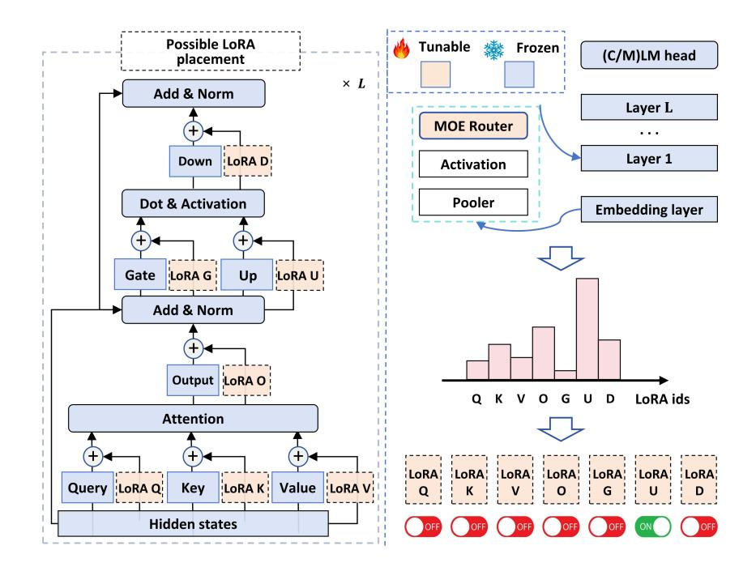

# MiLoRA: Efficient Mixture of Low-Rank Adaptation for Large Language Models Fine-tuning

Jingfan Zhang1∗ Yi Zhao2∗ Dan Chen3† Xing Tian4 Huanran Zheng5 Wei Zhu5† 1 iFLYTEK Co., Ltd, China 2 University of Pennsylvania, USA, [zhaoyi3@seas.upenn.edu](mailto:zhaoyi3@seas.upenn.edu) 3 Lenovo Connect Co., Ltd, China 4 Niuxin Network Technology Co., Ltd, China 5 East China Normal University, China

### Abstract

Low-rank adaptation (LoRA) and its mixtureof-experts (MOE) variants are highly effective parameter-efficient fine-tuning (PEFT) methods. However, they introduce significant latency in multi-tenant settings due to the LoRA modules and MOE routers added to multiple linear modules in the Transformer layer. To address this issue, we propose Mixture of Low-Rank Adaptation (MiLoRA), a novel and efficient LoRA variant. MiLoRA differs from previous MOE-style LoRA methods by considering each LoRA module as an expert and employing a prompt-aware routing mechanism. This mechanism calculates expert routing results once before generating the first new token and reuses these results for subsequent tokens, reducing latency. Extensive experiments and analysis on commonsense reasoning tasks, math reasoning tasks, and widely used LLM evaluation benchmarks demonstrate that MiLoRA consistently outperforms strong PEFT baselines with comparable tunable parameter budgets. Additionally, MiLoRA significantly reduces latency in multi-tenant settings compared to previous LoRA-based methods.

### 1 Introduction

Large language models (LLMs) have been achieving state-of-the-art (SOTA) results not only in various natural language processing tasks [\(Qin](#page-10-0) [et al.,](#page-10-0) [2023;](#page-10-0) [Zhu et al.,](#page-13-0) [2023;](#page-13-0) [Zhu et al.,](#page-12-0) [2023a](#page-12-0)[,b,](#page-12-1) [2021a;](#page-12-2) [Li et al.,](#page-10-1) [2023b;](#page-10-1) [Zhu et al.,](#page-13-1) [2023c;](#page-13-1) [Zhang](#page-12-3) [et al.,](#page-12-3) [2023a;](#page-12-3) [Zhu et al.,](#page-13-2) [2023e;](#page-13-2) [Guo et al.,](#page-9-0) [2021;](#page-9-0) [Zhu et al.,](#page-12-4) [2021b;](#page-12-4) [Zheng et al.,](#page-12-5) [2023;](#page-12-5) [Sun et al.,](#page-11-0) [2020;](#page-11-0) [Zhang et al.,](#page-12-6) [2023c,](#page-12-6)[d;](#page-12-7) [Wang et al.,](#page-11-1) [2023;](#page-11-1) [Zhu](#page-13-3) [et al.,](#page-13-3) [2019a;](#page-13-3) [Zhu,](#page-12-8) [2021c;](#page-12-8) [Zhang et al.,](#page-12-9) [2021;](#page-12-9) [Wang](#page-11-2) [et al.,](#page-11-2) [2020\)](#page-11-2), but also many challenging evaluation tasks [\(Huang et al.,](#page-9-1) [2023;](#page-9-1) [Li et al.,](#page-10-2) [2023a;](#page-10-2) [Cui et al.,](#page-9-2) [2023;](#page-9-2) [Wang et al.,](#page-11-3) [2024;](#page-11-3) [Wenjing Yue and Wang,](#page-11-4) [2023\)](#page-11-4) but also in numerous challenging evaluation tasks [\(Huang et al.,](#page-9-1) [2023;](#page-9-1) [Li et al.,](#page-10-2) [2023a\)](#page-10-2), such as question answering, reasoning, math, safety, and instruction following. Although LLMs are evolving into general task solvers, fine-tuning remains essential for efficient LLM inference and for controlling the style of the generated content [\(Xin et al.,](#page-11-5) [2024;](#page-11-5) [Ding et al.,](#page-9-3) [2022\)](#page-9-3). Full-parameter fine-tuning of such large models is impractical due to the significant GPU memory and computational resources required. Consequently, parameter-efficient finetuning (PEFT) [\(Zhang et al.,](#page-12-10) [2023e;](#page-12-10) [Zhao et al.,](#page-12-11) [2023\)](#page-12-11) has garnered considerable attention in the research community, as it typically involves tuning less than 1% of the LLMs' parameters, thereby substantially reducing computational costs.

Among many PEFT methods, the reparameterization-based method low-rank adaptation (LoRA) [\(Hu et al.,](#page-9-4) [2021\)](#page-9-4) is considered one of the most effective methods for LLMs [\(Xu](#page-11-6) [et al.,](#page-11-6) [2023;](#page-11-6) [Ding et al.,](#page-9-3) [2022;](#page-9-3) [Xin et al.,](#page-11-5) [2024\)](#page-11-5). Although LoRA is effective and can bring stable performance with the original setting in [Hu et al.](#page-9-4) [\(2021\)](#page-9-4), it still brings inconvenience under the multi-tenant setting [\(Chen et al.,](#page-9-5) [2023\)](#page-9-5): it has to add LoRA modules to multiple weights of the Transformer layer and introducing significant additional latency in every generation steps under the multi-tenant setting. Recently, the Mixture-of-Experts (MOE) style LoRA methods [\(Chen et al.,](#page-9-6) [2024;](#page-9-6) [Yang et al.,](#page-12-12) [2024;](#page-12-12) [Liu et al.,](#page-10-3) [2023;](#page-10-3) [Dou et al.,](#page-9-7) [2023;](#page-9-7) [Gou et al.,](#page-9-8) [2023\)](#page-9-8) have surged, further pushing the performance ceilings of LoRA fine-tuning. However, they introduce the calculation of MOE routers, further increasing inference latency. Thus, it is essential to develop a novel variant of the LoRA method that introduces minimum latency during generation and still can perform competitively in downstream tasks.

In this work, we propose a novel PEFT method called Mixture of Low-Rank Adaptation

∗Equal contributions.

†Corresponding author. For any inquiries, please contact: michaelwzhu91@gmail.com;

Figure 1: Schematic illustration of our MiLoRA method. Left: The architecture of a Transformer layer as in LlaMA-2 [\(Touvron et al.,](#page-11-7) [2023\)](#page-11-7). There are seven linear modules and seven positions to add LoRA modules. Right: Upon receiving an input prompt, the LoRA router before each Transformer layer will take the input prompt's hidden states as input features and go through a pooler, an activation function, and the MOE router network to determine which LoRA module is activated (or used) (e.g., LoRA U in the figure). This routing decision is repeatedly used when generating subsequent tokens.

(MiLoRA). Our MiLoRA method differs from the previous literature on MOE-style LoRA methods in the following two aspects. First, in MiLoRA, an entire LoRA module is considered a LoRA expert, and the LoRA router is responsible for determining which LoRA expert to activate. Second, we propose the prompt-aware routing mechanism instead of calculating the expert routing results for every new token. Given an input prompt, the expert routing results are calculated once, right before the generation of the first new token. The subsequent generation steps will reuse the expert routing results. Under the prompt-aware routing mechanism, our LoRA router consists of a pooler operation, a learnable activation function [\(Molina et al.,](#page-10-4) [2019\)](#page-10-4), and a sparse MOE router.

We conduct extensive experiments and analysis on various challenging tasks, including five commonsense reasoning tasks, two math reasoning tasks, and three widely used LLM evaluation benchmarks. Our method can consistently outperform strong PEFT baselines with comparable tunable parameter budgets, especially the recent LoRA variants. In addition, our MiLoRA method has significantly lower latency under the multi-tenant setting [\(Chen et al.,](#page-9-5) [2023\)](#page-9-5) than the previous LoRA-based

methods with comparable tunable parameters. Our contributions are summarized as follows:

- we propose a novel LoRA variant, MiLoRA, which combines the MOE mechanism with LoRA in an efficient way.
- In MiLoRA, we treat each LoRA module as an expert.
- We propose a prompt-aware routing mechanism to avoid token-wise router calculations.
- We have conducted extensive experiments and analysis showing that our MiLoRA framework is (a) practical and outperforms the baselines under comparable parameter budgets. (b) efficient during inference for LLMs.

### 2 Related works

In the era of large language models, among the existing PEFT methods like Adapter [\(Zhang et al.,](#page-12-10) [2023e;](#page-12-10) [Houlsby et al.,](#page-9-9) [2019\)](#page-9-9), Prompt tuning [\(Zhu](#page-13-4) [et al.,](#page-13-4) [2024;](#page-13-4) [Zhu and Tan,](#page-13-5) [2023\)](#page-13-5) or (IA)3 [\(Liu](#page-10-5) [et al.,](#page-10-5) [2022a;](#page-10-5) [Xie et al.,](#page-11-8) [2024\)](#page-11-8) have been outperformed by LoRA [\(Liu et al.,](#page-10-6) [2024b;](#page-10-6) [Hu et al.,](#page-9-4) [2021\)](#page-9-4). Since LoRA is the most popular PEFT method

in the era of large language models (Cui et al., 2023; Zheng et al., 2024; Zhu et al., 2023d; Gao et al., 2023; Zuo et al., 2022; Zhang et al., 2022; Sun et al., 2022; Zhu et al., 2021d; Zhu, 2021d; Li et al., 2019; Zhu et al., 2019c,b; Zhou et al., 2019), many works are devoted to improving upon LoRA. AdaLoRA (Zhang et al., 2023b) looks into the parameter allocation of LoRA modules. VERA (Kopiczko et al., 2023) investigate whether one could freeze the randomly initialized LoRA matrices and only learn a set of scaling vectors. Recently, a series of works has been looking into combining Mixture-of-Experts (MoE) (Shazeer et al., 2017; Jacobs et al., 1991) and LoRA. LLaVA-MoLE (Chen et al., 2024) effectively routes tokens to domainspecific LoRA experts, mitigating data conflicts and achieving consistent performance gains over the original LoRA method. MOELoRA (Liu et al., 2023) proves that fine-tuning LoRA modules with a MOE router enables the LLMs to perform well in a multi-task learning setting. MoRAL (Yang et al., 2024) addresses the challenge of adapting LLMs to new domains/tasks and enabling them to be efficient lifelong learners using the MOE techniques. LoRAMoE (Dou et al., 2023) integrates LoRAs using a router network to alleviate world knowledge forgetting after instruction tuning. MoCLE (Gou et al., 2023) proposes a MoE architecture to activate task-customized model parameters based on instruction clusters.

Although performing well in fine-tuning, these methods introduce high additional latency since (a) these methods do not reduce the number of LoRA modules in the Transformer backbone. (b) the routers and LoRA modules must be called when generating each new token. Our MiLoRA method addresses this efficiency issue by (a) only calling the LoRA routers when encoding the input prompt and before generating the first new token. (b) only activate one LoRA module per Transformer layer.

#### 3 Methods

In this section, we first introduce the foundational concepts of LoRA and MoEs and then elaborate on the architectural design of MiLoRA.

#### 3.1 Preliminaries

**Transformer model** As depicted in Figure 1, each Transformer layer of a LLM such as LlaMA-2 (Touvron et al., 2023) consists of a multi-head self-attention (MHA) sub-layer and a fully connected

feed-forward (FFN) sub-layer. MHA contains four linear modules, which are the Query (Q), Key (K), Value (V), and Output (O) modules. FFN contains three linear modules: Gate (G), Up (U), and Down (D). For notation convenience, we will refer to the number of modules in a Transformer block as  $N_{mod}$ . Thus, in LlaMA-2,  $N_{mod} = 7$ .

**LoRA** For any Transformer module  $m \in \{Q, K, V, O, G, U, D\}$ , the LoRA method adds a pair of low-rank matrices to reparameterize its weights. Formally, the forward calculation of module m with LoRA is:

$$x' = xW_m + xW_m^A W_m^B + b_m, (1)$$

where  $W_m \in \mathbf{R}^{d_1 \times d_2}$  is the weight matrix of module m,  $b_m$  is its bias term.  $W_m^A \in \mathbb{R}^{d_1 \times r}$  and  $W_m^B \in \mathbb{R}^{r \times d_2}$  are the low-rank matrices for the LoRA module, and  $r \ll \min(d_1, d_2)$ . r is the rank of the two matrices and will also be referred to as the rank of the LoRA module.

#### 3.2 Motivation

As demonstrated later in Table 4, the existing works on MOE style LoRA significantly slow down the LLM backbone during inference, reducing tokens per second (tps) by around 20%. Each LoRA module is decomposed into multiple experts in these works, and a router should be called to determine which experts are activated. The calculations of multiple LoRA modules and multiple routers per layer are executed when generating every new token, resulting in latency that is not negligible. In order to improve the efficiency of such MOE LoRA methods, we need to investigate the following research questions:

RQ1. Can we treat a LoRA module as an expert so that each Transformer layer has only one LoRA router and activate only one such expert per layer? RQ2. Can the LoRA router be called once for an input prompt?

#### 3.3 Prompt-aware LoRA router

Trying to investigate *RQ1* and *RQ2*, we now try to propose the details of our MiLoRA method. The core of MiLoRA is the prompt-aware routing mechanism. Under this mechanism, the LoRA router takes the input prompt's hidden states as input and outputs the activated LoRA experts for the current layer. Different from the previous works (Chen et al., 2024; Yang et al., 2024; Liu et al., 2023; Dou et al., 2023; Gou et al., 2023), our work: (a) only

calculates the LoRA routers once when the input prompt is fed through the Transformer backbone for the first time and right before generating the first new token. The routers' activation decisions will be repeatedly used in the subsequent generation steps. (b) determine the activated LoRA experts at the Transformer's layer level, selecting which Transformer module is modified by its corresponding LoRA module.

As shown in Figure 1, to generate a response, the input prompt has to go through the LLM backbone to obtain the hidden representations. Denote the hidden state of the input prompt with length  $n_p$  right before Transformer layer l as  $\mathbf{H}^l \in \mathbf{R}^{n_p \times d}$ . Then a pooling operation Pooler() aggregates the semantic information in  $\mathbf{H}^l$  and transforms it to  $\mathbf{h}^l \in \mathbf{R}^{1 \times d}$ :

$$\mathbf{h}^l = \text{Pooler}(\mathbf{H}^l). \tag{2}$$

Here, according to (Zhu, 2021b,a), the Pooler operation can be one of the following: (a) last-token pooling, which is to use the vector representation of the last token in the prompt as  $\mathbf{h}^l$ . This pooler is widely used when decoder-based models perform sentence classification tasks. (b) average pooling. (c) max pooling. (d) self-attention-based pooling, whose detail is introduced in Appendix C.

Then,  $\mathbf{h}^l$  will go through an activation function g and then the LoRA router  $R^l$  right before layer l.  $R^l$  assigns the current input prompt to the most suitable LoRA expert. This router contains (a) a linear layer that computes the probability of  $\mathbf{h}^l$  being routed to each LoRA expert LoRAm, (b) a softmax function to model a probability distribution over the LoRA experts, and finally, (c) a Top-k function that choose the top k>0 experts with the highest probability masses. Formally,

$$R^{l}(\mathbf{h}^{l}) = \text{Top-k}(\text{Softmax}(q(\mathbf{h}^{l})W_{r}^{l})), \quad (3)$$

where  $W_r^l \in \mathbf{R}^{d \times N_{mod}}$  is the router's weight. The LoRA router dynamically selects the best k experts for each input prompt during inference. Note that the router is only called once before a new token is generated. The activated LoRA experts are used throughout the whole generation process.

Following Fedus et al. (2022), we add a load balancing loss to the training loss function. Consider a training batch B with  $N_B$  samples, let  $f_i^l$  represent the proportion of prompts assigned to the i-th LoRA expert in layer l,

$$f_i^l = \frac{1}{N_B} \sum_{x \in B} \mathbf{1} \{\arg \max_j p_j^l(x) = i\},$$
 (4)

where  $p_j^l$  is the probability of expert j, output by the router l. Let  $\hat{p}_i^l$  be the average of probability masses received by the i-th expert,  $\hat{p}_i^l = \frac{1}{N_B} \sum_{x \in B} p_i^l(x)$ . Then, the load balancing loss is given by:

$$\mathcal{L}_{lb} = N_{mod} \sum_{i=1}^{N_{mod}} f_i^l \cdot \hat{p}_i^l.$$
 (5)

The  $\mathcal{L}_{lb}$  loss term is added to the cross entropy loss with a coefficient  $\lambda_{lb} \geq 0$ .

#### 3.4 Learned activation functions

The previous PEFT literature usually set the activation functions in a PEFT module to be ReLU (Mahabadi et al., 2021; Pfeiffer et al., 2021; Liu et al., 2022b) and does not discuss whether this setting is optimal. In addition, the PEFT modules' activation functions in different Transformer layers are usually set to be identical. As will be presented later in Table 5, it is beneficial for LoRA routers of different depths to have different activation functions. Thus, how can we find an optimal setting for the LoRA routers' activation functions? Exhaustive hyper-parameter search is time and GPU-consuming. Thus, we are motivated to set the activation function to be learnable during training.

We resort to rational activation functions (Molina et al., 2019), which are learnable and can approximate common activation functions and learn new ones. The rational activation function R(x) of order m, n is defined as follows:

$$Ra(x) = \frac{\sum_{j=0}^{m} a_j x^j}{1 + \|\sum_{i=1}^{n} b_i x^i\|},$$
 (6)

where  $a_j$  and  $b_i$  are learnable parameters. The rational activation functions are successfully applied in image classification (Molina et al., 2019) and sequence modeling (Delfosse et al., 2021).

Inspired by the above literature, we propose learning the activation functions in LoRA routers via the rational activation functions when finetuning a downstream task. Denote the set of parameters in the learnable activations as  $\Theta$  and the other parameters in the LoRA routers and LoRA experts as  $\Omega$ . Following DARTS (Liu et al., 2019), we consider  $\Theta$  as architectural parameters and optimize them along with  $\Omega$  via bi-level optimization. Due to limited length, we introduce bi-level optimization in Appendix A.

### 4 Experiments

In this section, we conduct a series of experiments and analysis to evaluate our MiLoRA method.

#### 4.1 Datasets and evaluation metrics

We compare our approach to the baselines on a collection of challenging tasks: (a) five benchmark common-sense question-answering tasks, ARC-e and ARC-c [\(Clark et al.,](#page-9-13) [2018\)](#page-9-13), OBQA [\(Mihaylov](#page-10-15) [et al.,](#page-10-15) [2018\)](#page-10-15), PIQA [\(Bisk et al.,](#page-9-14) [2020\)](#page-9-14), BoolQ [\(Clark et al.,](#page-9-15) [2019\)](#page-9-15). (b) two math reasoning tasks, AQuA [\(Ling et al.,](#page-10-16) [2017\)](#page-10-16) and GSM8k [\(Cobbe et al.,](#page-9-16) [2021\)](#page-9-16). We utilize the chain-of-thought (COT) rationales for these samples provided by [Hu et al.](#page-9-17) [\(2023\)](#page-9-17) for training on these math tasks. All rationales are generated through zero-shot CoT [\(Wei et al.,](#page-11-10) [2022;](#page-11-10) [Kojima et al.,](#page-10-17) [2022\)](#page-10-17) on GPT-3.5[1](#page-4-0) , but without undergoing any error filtering. (c) MT-Bench [\(Zheng](#page-12-20) [et al.,](#page-12-20) [2023\)](#page-12-20), MMLU [\(Hendrycks et al.,](#page-9-18) [2020\)](#page-9-18), and BBH [\(Suzgun et al.,](#page-11-11) [2022\)](#page-11-11). Since these tasks provide no training data, we utilize the Alpaca [\(Taori](#page-11-12) [et al.,](#page-11-12) [2023\)](#page-11-12) dataset for instruction tuning. The detailed statistics, and evaluation metrics can be found in Appendix [B.](#page-13-12)

#### 4.2 Baselines

We compare our MiLoRA framework with the current SOTA PEFT baseline methods.

LoRA and its variants we consider the following LoRA variants as baselines: (a) the original LoRA [\(Hu et al.,](#page-9-4) [2021\)](#page-9-4); (b) AdaLoRA [\(Zhang](#page-12-17) [et al.,](#page-12-17) [2023b\)](#page-12-17), which adaptively adjust the LoRA parameters among different Transformer modules. (c) MOELoRA [\(Liu et al.,](#page-10-3) [2023\)](#page-10-3), which considers each LoRA module as a mixture of single-rank LoRA experts. (d) DoRA [\(Liu et al.,](#page-10-18) [2024a\)](#page-10-18), one of the most recent variants of LoRA that decomposes the pre-trained weights into two components, magnitude, and direction, for fine-tuning, specifically employing LoRA for directional updates.

Other PEFT methods We also consider the most recent PEFT methods: (a) Parallel-Adapter proposed by [He et al.](#page-9-19) [\(2021\)](#page-9-19); (b) Learned-Adapter [\(Zhang et al.,](#page-12-10) [2023e\)](#page-12-10). (c) P-tuning v2 [\(Liu et al.,](#page-10-19) [2021\)](#page-10-19). (d) IAPT [\(Zhu et al.,](#page-13-4) [2024\)](#page-13-4). (e) BitFit [\(Ben-](#page-9-20)[Zaken et al.,](#page-9-20) [2021\)](#page-9-20). (f) (IA)3 [\(Liu et al.,](#page-10-5) [2022a\)](#page-10-5), which multiplies learnable vectors to the hidden states in different modules of the Transformer layer. (g) SSP [\(Hu et al.,](#page-9-21) [2022\)](#page-9-21), which is a representative work on combining different PEFT methods, including LoRA and BitFit.

The baselines are implemented using their open-sourced codes. We only adjust the hyperparameters related to tunable parameter numbers to fairly compare the baseline methods and our MiLoRA method.

