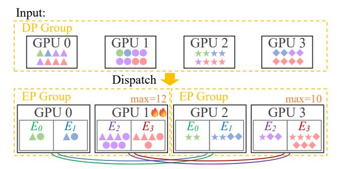
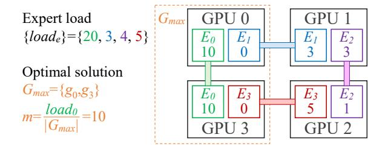

# 2.2 Expert Parallelism and Expert Data Parallelism

The increasing scale of deep learning models has necessitated the development of various parallelization strategies for dis-

<span id="page-2-0"></span>

(c) An MoE transformer layer with expert parallelism.

Figure 1: An example of transformer, MoE, and expert parallelism.

tributed training across multiple computational devices. We introduce some of them as follows.

Data parallelism (DP) is a fundamental parallelization strategy that partitions input data across devices to enhance training throughput. In the forward pass, each DP rank (e.g., a device) maintains a complete copy of the model parameters while processing distinct *micro-batches* of data independently. In the backward pass, all devices in a DP group aggregate their gradients for parameter synchronization. Recent advances, such as ZeRO [45], have further optimized DP's memory efficiency by eliminating memory redundancies across devices.

Tensor parallelism (TP) addresses per-device memory constraints by partitioning model parameter tensors across devices. Each TP rank processes complete inputs using its allocated slice of model parameters, with results aggregated within the TP group to complete the computation.

Pipeline parallelism (PP) addresses memory constraints by partitioning model layers [20, 34]. While PP introduces lower communication overhead compared with TP, it wastes some computational resources due to pipeline bubbles [20, 40].

Expert parallelism (EP) is a widely employed technique in distributed MoE systems [11]. EP is a specialized hybrid parallelization strategy combining elements of DP and TP. By exploiting the inherent sparsity of MoE, EP benefits from both DP's training efficiency and TP's memory efficiency. As shown in Figure 1c, EP partitions the FFN layer by distributing distinct experts across multiple devices. At runtime, the attention layer and the gate network utilize conventional DP to process different tokens on separate devices. Next, devices within the EP group perform an all-to-all communication operation to dispatch tokens towards their designated expert devices. Then, each device processes its received tokens with its local experts. Finally, the devices perform another all-to-all operation to return tokens to their original devices.

Expert data parallelism (EDP) is a specialized form of

<span id="page-2-1"></span>

Figure 2: Expert load distribution of GPT 32×1.3B layer 20 in some training iterations.

DP emerging from EP. In configurations where the DP degree (number of DP ranks) exceeds the EP degree, systems must employ EDP across multiple EP groups within a DP group. Each EDP group consists of devices sharing the same EP rank across different EP groups. Devices within an EDP group maintain replicated instances of identical experts while processing distinct tokens from different EP groups. The synchronization of parameters and gradients among these expert replicas follows conventional DP mechanisms, ensuring consistency across the distributed system.

#### 2.3 Load Imbalances in MoE

The dynamic token-to-expert assignment in MoE systems inherently results in significant load imbalances across experts, presenting a critical performance bottleneck for distributed training. We conduct an experiment to trace the expert load distribution in a training process. As illustrated in the left part of Figure 2, the expert load distribution exhibits substantial variability and skewness, particularly during the initial training iterations.

The imbalance issue severely impacts resource utilization and training throughput in MoE systems with EP. In current MoE implementations, the FFN computation time of a GPU is approximately proportional to the total number of tokens assigned to the experts on this GPU [13]. Since GPUs within an EP group must synchronize through all-to-all communication both before and after FFN computation, all GPUs must wait until the slowest GPU completes computation before proceeding. Consequently, the system's overall throughput is bottlenecked by the most heavily loaded device, namely the *straggler*. This strict synchronization requirement emphasizes the necessity of effective load balancing strategies to optimize MoE training efficiency.

Moreover, the straggler effect continuously degrades training efficiency in *every micro-batch*. As shown in the right part of Figure 2, **expert load distribution fluctuates significantly between consecutive micro-batches**. This dynamic nature of load imbalances necessitates fine-grained load balancing at the micro-batch level to maintain optimal training efficiency.

<span id="page-3-0"></span>

(a) Vanilla EP. The DP degree is 4, and the EP degree is 2.


(b) Merging two EP groups. Afterward, GPU loads within EDP groups  $\{0,2\}$  and  $\{1,3\}$  are equal.


(c) FineEP, shuffling expert placement and scheduling replica loads. Afterward, all GPU loads are equal.

Figure 3: Converting EP to FineEP. The shape and color of a symbol indicate the source GPU and the assigned expert of a token. The bottom curves indicate EDP groups.

#### 3 Challenges in Token Scheduling

We aim to achieve fine-grained load balancing for MoE systems through *token scheduling* within every micro-batch. However, this approach poses two fundamental challenges:

**Challenge 1:** Vanilla EP restricts token dispatching within each EP group, providing no space for scheduling.

To perform token scheduling for load balancing, we must first determine the *scheduling space*. Specifically, when a token is assigned to an expert, we must be able to compute it on one of *multiple* GPUs.

Unfortunately, such scheduling space is unattainable in the vanilla EP paradigm. As shown in Figure 3a, vanilla EP restricts token dispatching within the scope of an EP group, where each EP group contains exactly one replica of each expert's parameters. When a token is assigned to an expert, it must be computed on the GPU hosting that expert's replica in its EP group. Consequently, the token-to-GPU mapping is fixed by the token-to-expert mapping, eliminating any space for computation scheduling.

**Solution 1:** Our key observation is that we can find scheduling space through **expert data parallelism**. We call the set of

<span id="page-3-2"></span>

Figure 4: FineMoE architecture.

GPUs that host replicas of expert *e* as the EDP group of expert *e*. Since all replicas of an expert maintain identical parameters, a token can be computed equivalently with any replica in its designated expert's EDP group. This observation inspires us to merge multiple EP groups and schedule tokens across their experts' EDP groups, as shown in Figure 3b.

**Challenge 2:** *Identical expert placement across EP groups results in constrained scheduling space.* 

While this approach improves token distribution, it falls short of optimal load balancing. The fundamental limitation lies in the restricted scheduling space—load balancing occurs only within individual EDP groups. In the current EP paradigm, each EP group maintains identical expert placement. Consequently, the EDP groups of different experts are either completely disjoint or identical (e.g., in Figure 3b, the EDP groups of expert 0,1 are both GPU {0,2}, while the EDP groups of expert 2,3 are both GPU {1,3}). This constraint indicates that we can at most equalize workloads within each EDP group, while significant load imbalances may persist across different EDP groups.

**Solution 2:** To expand the scheduling space, we **shuffle** the expert placement within the merged EP groups. This operation creates intersecting EDP groups across different experts, substantially enlarging the scheduling space. As illustrated in Figure 3c, this approach can potentially achieve complete load balance across all GPUs.

#### <span id="page-3-1"></span>4 FineMoE Overview

We introduce a novel expert parallelism strategy, namely FineEP. FineEP optimizes load balancing across GPUs within *every micro-batch* through *token scheduling* across *EDP groups*.

Based on FineEP, we propose FineMoE, an efficient distributed MoE training system. Figure 4 illustrates the architecture of FineMoE. Following PP, each device hosts multiple model layers. Each MoE layer consists of a *token dispatcher* and multiple local expert replicas. Expert replica placement is coordinated by a global *placement manager* residing on device 0. We briefly illustrate the workflow of FineMoE as

follows.

**Prerequisites.** FineEP obtains scheduling space from intersecting EDP groups, which require two conditions: the DP degree must exceed the EP degree, and each GPU must host multiple expert replicas. We find that these requirements are satisfied in many open-sourced MoE models [9,52]. For example, DeepSeek-V3's pre-training configuration employs 64-way EP and 128-way DP, with each GPU hosting 8 experts [9].

**Configuration.** FineEP introduces an integer parameter d, where  $1 < d \le \frac{\mathrm{DP\_degree}}{\mathrm{EP\_degree}}$ . FineEP merges every d EP groups into a FineEP group. In the following sections, we consider the simplest case where  $d = \frac{\mathrm{DP\_degree}}{\mathrm{EP\_degree}}$ , i.e., the entire DP group forms a single FineEP group.

**Initialization.** During model initialization, the placement manager generates expert placements within all FineEP groups and broadcasts the placements to all devices. The placement strategies are detailed in §6.

**Runtime.** During model training, FineEP balances GPU workloads by scheduling tokens within the FineEP group. Specifically, after the gate networks assign tokens to specific experts, the dispatchers route tokens to particular expert replicas within their respective EDP groups. The scheduling algorithm is detailed in §5.

After scheduling, the dispatchers initiate an all-to-all (dispatch) operation within the FineEP group, sending tokens to their routed expert replicas. Then, each GPU executes FFN computation to process received tokens using its local expert replicas. Afterward, a second all-to-all (combine) operation returns processed tokens to their source GPUs. These operations follow the same patterns as vanilla EP, but occur in a communication group d times larger.

An example. Surprisingly, FineEP can almost always achieve complete load balance among GPUs, unless the expert load distribution is extremely skewed (as shown in §7.3). We can intuitively learn how FineEP achieves such good performance from the example in Figure 3c. Since expert 3 is heavily loaded, it places 8 tokens on GPU 3, preventing expert 0 from placing any token on the same GPU. Fortunately, expert 0 can place all its 4 tokens on GPU 0. Similarly, expert 2 also "shifts" some load from GPU 2 to GPU 1, while expert 1 shifts some load from GPU 1 to GPU 0. Consequently, the computational burden of heavily loaded experts is effectively distributed across the entire FineEP group.

#### <span id="page-4-1"></span>5 Token Scheduling

Token scheduling is the core of FineEP for fine-grained load balancing. The scheduling algorithm runs in two steps: The first step is to distribute expert loads among their replicas, balancing GPU loads (§5.1). The second step is to route tokens to specific expert replicas, enforcing the calculated replica loads (§5.2). Then, we discuss where and when to

Table 1: List of Symbols and Notations.

| Symbol              | Description                                            |
|---------------------|--------------------------------------------------------|
| E                   | set of all experts                                     |
| $G_{FineEP}$        | set of GPUs in the concerned FineEP group              |
| d                   | a parameter = $\frac{ G_{FineEP} }{\text{EP\_degree}}$ |
| $G_{EDP}^{e}$       | EDP group of expert <i>e</i>                           |
| load <sub>e</sub>   | total load of expert e                                 |
| $x_e^g$             | replica load of expert e on GPU g                      |
| in put <sub>e</sub> | input load of expert e from GPU g                      |
| m                   | optimal objective value of LPP 1                       |

launch the scheduling in §5.3 and §5.4. Finally, we discuss some additional scheduling optimizations in Appendix A.

#### <span id="page-4-0"></span>5.1 Determining Replica Loads

We aim to balance GPU loads through optimal distribution of expert loads among their replicas. We formulate the load balancing problem as an optimization problem.

- *Notations*. Let E represent the set of all experts,  $G_{FineEP}$  represent the set of GPUs in the concerned FineEP group, and  $G_{EDP}^e$  represent the set of GPUs in the EDP group of expert e. Since we currently focus on a single FineEP group, we assume that  $G_{EDP}^e \subseteq G_{FineEP}, \forall e \in E$ .
- *Variables*. The variables are  $\{x_e^g: e \in E, g \in G_{EDP}^e\}$ , where  $x_e^g$  is the replica load of expert e on GPU g.
- Constraints. Let  $load_e(e \in E)$  denote the total load (number of tokens) of expert e in the concerned FineEP group. A valid distribution must ensure that each expert distributes its total load across its replicas.
- *Objective*. Due to synchronization requirements for all-to-all communication before and after expert computation, the GPU with the highest load becomes the performance bottleneck. Therefore, we should minimize the maximum GPU load across the FineEP group.

We formulate the optimization problem as follows.

<span id="page-4-2"></span>
$$\begin{aligned} & \text{minimize} \max_{g \in G_{FineEP}} \left\{ \sum_{e \in E: g \in G_{EDP}^e} x_e^g \right\}, \\ & \text{subject to} \sum_{g \in G_{EDP}^e} x_e^g = load_e, \quad \forall e \in E, \\ & x_e^g \geq 0, \quad \forall e \in E, g \in G_{EDP}^e. \end{aligned}$$

Problem 1 is a *linear programming problem* (LPP), which can be efficiently solved in polynomial time relative to the number of GPUs and experts. The number of variables is O(|E|d), and the number of constraints is  $O(|E| + |G_{FineEP}|)$ . Given its modest scale, we solve this LPP using a single CPU

thread with the HiGHs solver [21]. GPU acceleration or multithreading would not yield significant performance benefits for this scale of optimization.

Notably, across different micro-batches, while the constraint matrix (determined by expert placement  $G_{EDP}^{e}$ ) remains the same, only the constraint bounds ( $load_{e}$ ) vary. This property enables the *warm-start* of the LPP solving by reusing the immediate states of the previous solution, significantly reducing optimization overhead.

## <span id="page-5-0"></span>5.2 Routing Tokens to Replicas

Our next step is routing tokens to specific expert replicas, enforcing the calculated replica loads  $(x_e^g)$ . Specifically, we determine this *token-to-replica* mapping using a sequential routing strategy: First, we arrange tokens assigned to expert e from all GPUs in sequence, along with an ordered list of expert e's replicas. Then, we iterate through these tokens, routing each to the first replica that has not yet reached its allocated load  $x_e^g$ .

To enhance efficiency, we can manipulate token ranges rather than individual tokens. Let  $input_e^g$  denote the input load of expert e from GPU g, i.e., the number of tokens on GPU g assigned to expert e ( $\sum_{g \in G_{FineEP}} input_e^g = load_e$ ). The pseudo code of token routing is shown in Algorithm 1, Lines 10-16. **Locality-aware routing.** Previous research has underscored that all-to-all communication introduces significant overhead to MoE systems [18, 22, 27]. To reduce the all-to-all communication volume, we can leverage data locality during token routing. Specifically, when GPU g holds a replica of expert e, we prioritize routing tokens from GPU g to its local expert replica before considering remote replicas. The pseudo code is shown in Algorithm 1, Lines 4-9.

Communication-aware scheduling. Furthermore, we can consider communication overhead during scheduling. Specifically, we can reformulate the optimization problem to minimize the overall maximum execution time, incorporating both computation and communication. Moreover, we can model the heterogeneity between intra-node and inter-node communication. Due to space limits, the modified optimization problem is detailed in Appendix A.1.

#### <span id="page-5-2"></span>**5.3** Distributed Scheduling across Devices

As described in §5.1 and §5.2, the scheduling algorithm requires global load information ( $input_e^g$ ) across the entire FineEP group to generate a token dispatching plan. This raises the question of where to place the scheduler.

We consider two candidate locations for the scheduler: *centralized* on one device or *distributed* across all devices. A centralized scheduler needs to gather load information from all devices, perform the scheduling, and scatter the results. Alternatively, distributed schedulers require all devices to perform an all-gather operation to collect global load information

Algorithm 1: Routing tokens to expert replicas.

```
Input: \{input_e^g\}, \{x_e^g\}
 1 \{remain\_input_e^g\} = \{input_e^g\}
   \{remain\_x_e^g\} = \{x_e^g\}
3 for e \in E do
       // First, route local tokens to local replicas.
5
        for g \in G_{EDP}^e do
            y = \min(remain\_input_e^g, remain\_x_e^g)
 6
             route the next y tokens of expert e from GPU g
 7
              to the replica on GPU g
             remain\_input_e^g \leftarrow remain\_input_e^g - y
 8
            remain x_e^g \leftarrow remain x_e^g - y
 9
        // Then, route global tokens to global replicas.
10
        for g ∈ G_{FineEP} do
11
            for g' \in G_{EDP}^e do
12
                 y = \min(remain\_input_e^g, remain\_x_e^{g'})
13
                 route the next y tokens of expert e from
14
                  GPU g to the replica on GPU g'
                 remain\_input_e^g \leftarrow remain\_input_e^g - y
15
                 remain x_e^{g'} \leftarrow remain x_e^{g'} - y
```

and execute the scheduling algorithm independently. <sup>1</sup>

We choose the distributed approach for better scalability because it requires only one communication operation compared to two operations in the centralized approach. Since the load information is small, the primary performance factor is latency rather than throughput, making fewer communication operations advantageous.

#### <span id="page-5-1"></span>5.4 Overlapping Scheduling to Hide Latency

Since we need to execute token scheduling in every microbatch, minimizing the scheduling overhead is significant for system efficiency. Therefore, we reduce the scheduling overhead by *overlapping* scheduling with other operations.

As described in §4, the scheduling executes immediately after the gate network and before the all-to-all communication. We observe that existing distributed training frameworks usually perform some operations during this period. For instance, Megatron-LM [50] executes a token permutation operation to replicate tokens by top-K times and sort tokens by expert indices before all-to-all dispatching. Therefore, we can overlap the scheduling on CPUs with the permutation on GPUs. For frameworks without suitable overlapping operations, we propose a *pipelining* mechanism to hide scheduling latency, which is detailed in Appendix A.2.

<span id="page-5-4"></span><sup>&</sup>lt;sup>1</sup>The distributed scheduling approach maintains consistency because FineEP's scheduling algorithm is deterministic.

<span id="page-6-3"></span>

Figure 5: The graph abstraction of an example expert placement. Color bars indicate edges (experts) between vertices (GPUs).  $G_{max}$  contains GPU 0, 3. Expert 0 is entirely in  $G_{max}$ . Experts 1,3 partially intersect with  $G_{max}$  and cannot distribute any load within  $G_{max}$ .

### <span id="page-6-2"></span>6 Expert Placement

Expert placement is fundamental to the load balancing performance of token scheduling in FineEP. Figure 6a shows the relationship between expert placement and token scheduling in MicroMoE. Specifically, according to LPP 1, the expert placement determines the EDP groups ( $G_{EDP}^e$ ), which are the key components of the constraint matrix and thus significantly affect the optimization result. Although our experiments demonstrate that some simple placement methods, such as random shuffling, usually provide acceptable results (§7.3), identifying optimal placement strategies is still crucial for maximizing system performance. In the following sections, we first analyze "What is an optimal expert placement?" in §6.1 and then discuss "How to construct an optimal expert placement?" in §6.2 and §6.3. Finally, we propose an adaptive replacement mechanism in §6.4.

#### <span id="page-6-0"></span>6.1 Analysis of Optimal Expert Placement

**Analysis of the LPP solution.** Since the optimal expert placement should minimize the objective value of LPP 1, we begin by analyzing the solution of this problem. Let *m* denote the optimal objective value of LPP 1, which represents the minimized maximum load across all GPUs.

*Lemma*. There exists an optimal solution to LPP 1 that satisfies: Let  $G_{max}$  denote the set of GPUs with load m in this solution. An expert distributes no load within  $G_{max}$  unless its EDP group is entirely in  $G_{max}$ .

*Proof.* Among all optimal solutions, we choose the solution with the minimal  $|G_{max}|$  (number of GPUs with load m). Consider experts whose EDP groups partially intersect with  $G_{max}$ . Suppose that the EDP group of expert e consists of two GPUs  $g_0 \in G_{max}$  and  $g_1 \notin G_{max}$ . If expert e did distribute any load on GPU  $g_0$ , it could move a tiny amount of load from  $g_0$  to  $g_1$ . Afterward, the loads of both  $g_0$  and  $g_1$  would be less than m, yielding a new optimal solution with smaller  $|G_{max}|$ . The new solution would contradict our choice of the solution with the minimal  $|G_{max}|$ . Therefore, expert e cannot distribute any

load on GPU  $g_0$ .

Figure 5 shows an example of the above lemma. From this lemma, we can derive an equation by calculating the total loads within  $G_{max}$  in two ways:

<span id="page-6-4"></span>
$$m \cdot |G_{max}| = \sum_{e \in E: G_{EDP}^e \subseteq G_{max}} load_e \tag{2}$$

From Equation 2, we can derive an equation to calculate m by enumerating every possible  $G_{max}^2$ :

<span id="page-6-6"></span>
$$m = \max_{G_{max} \subseteq G_{FineEP}} \left\{ \frac{1}{|G_{max}|} \sum_{e \in E: G_{FDP}^e \subseteq G_{max}} load_e \right\}$$
(3)

Equation 3 provides a mathematical approach to determine the optimal objective value of LPP 1 without actually executing the LPP solving.

**Graph abstraction of expert placement.** Furthermore, we formulate expert placement with graph theory. Let each GPU  $g \in G_{FineEP}$  represent a vertex, and each expert  $e \in E$  represent a hyperedge connecting all GPUs in  $G_{EDP}^e$ . Hence, an expert placement can be represented by an undirected hypergraph denoted by  $\mathcal{G}(G_{FineEP}, \{G_{EDP}^e : e \in E\})$ . (When d=2, the hypergraph is a conventional graph. For simplicity, we omit the prefix "hyper" in the rest of this paper.) Figure 5 shows an example of the graph and the optimal solution corresponding to an expert placement.

Now, we can explain Equation 3 from the perspective of graph theory: We assign the weight of the edge (expert) e as  $load_e$ . We define the density of a weighted graph as the sum of all edge weights divided by the number of vertices<sup>3</sup>. Consider the subgraph in G induced by  $G_{max}$ . The edges in the induced subgraph represent the experts whose EDP groups are entirely in  $G_{max}$  ( $\{e \in E : G_{EDP}^e \subseteq G_{max}\}$ ). According to Equation 3, the optimal objective value m is the maximum density across all induced subgraphs of graph G. Since the goal of expert placement is to minimize m, we can characterize the optimal expert placement as follows:

**Property of the optimal expert placement.** The optimal expert placement is the graph whose maximum induced subgraph density is minimal.

Having understood the property of the optimal expert placement, our next challenge is how to find such a placement. We distinguish between two scenarios based on our knowledge of the expert load *load*<sub>e</sub> in §6.2 and §6.3.

