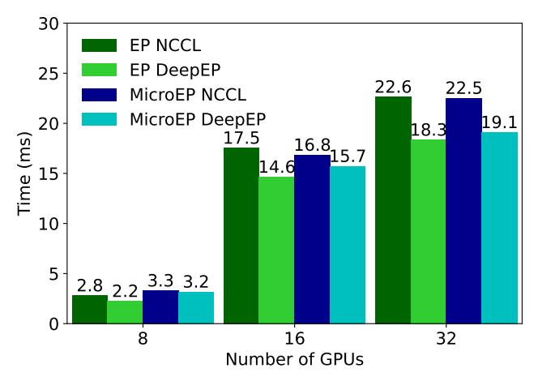

# **B** Expert Placement using Cayley Graphs

#### **B.1** Cayley Graphs

In many practical applications, we can construct near-optimal symmetric expert placements in FineEP using Cayley graphs. The inherent symmetry of Cayley graphs makes them well-suited for constructing optimal expert placements.

A Cayley graph is constructed from a group A and its generating set S. Each element in the group  $a \in A$  is assigned as a vertex. For every  $a \in A$  and  $s \in S$ , there is an edge from the vertex a to the vertex as.

We assume the FineEP parameter d=2, so the hypergraph is a conventional graph. We observe that in practical applications, the quantities of GPUs and experts are usually powers of two. Let the number of GPUs be  $2^p$ , and the number of experts per GPU be  $2^q$ . Consequently, the number of vertices is  $2^p$ , the degree of each vertex is  $2^q$ , and the number of edges is  $2^{p+q-1}$ . In practice, we heuristicly construct many Cayley graphs for different (p,q)s.

#### **B.2** Examples of Cayley Graphs

We illustrate some example constructions as follows.

**Example 1:** 8 vertices, 8 edges.

We have p = 3, q = 1. The group is  $(\mathbb{Z}_8, +)$ , and the generating set is  $\{1, -1\}$ . The constructed graph is a cycle.

Example 2: 16 vertices, 32 edges.

&lt;sup>5Since we have already changed expert placement, this EP is somehow different from typical EP and more like FlexMoE.

We have p = 4, q = 2. The group is  $(\mathbb{Z}_4 \times \mathbb{Z}_4, +)$ , and the generating set is  $\{(0,1), (0,-1), (1,0), (-1,0)\}$ . This graph is a  $4 \times 4$  toroidal grid graph, as shown in Figure 15a.

#### Example 3: 8 vertices, 16 edges.

We have p = 3, q = 2. The group is  $(\mathbb{Z}_2 \times \mathbb{Z}_4, +)$ , and the generating set is  $\{(0,1), (0,-1), (1,1), (1,-1)\}$ . The constructed graph is shown in Figure 15b, which is isomorphic to the complete bipartite graph  $K_{4,4}$ .

This construction satisfies a good property:  $\forall i \in 1,...,8$ , the maximum edge counts among all induced subgraphs with exactly i vertices is minimal.

#### Example 4: 8 vertices, 32 edges.

Note that a complete graph with 8 vertices has  $C_8^2 = 28$  edges. Since complete graphs are certainly optimal, we can first generate a complete graph and then add the remaining 32-28=4 edges. For the remaining 4 edges, we can simply create an edge between every vertex pair (0, 1), (2, 3), (4, 5), (6, 7) without using Cayley theory.

This method is generalizable to scenarios with more edges: We can first generate multiple complete graphs and then allocate the remaining edges. Note that the number of edges is a power of 2, the number of vertices is  $2^p$ , and the number of edges in a complete graph is  $\frac{2^p(2^p-1)}{2^p}$ . Consequently, the number of remaining edges must still be a power of 2, ranging from  $2^{p-1}$  to  $2^{2p-2}$ .

#### **B.3** Synchronization Consistency

Different EDP groups across experts can lead to a consistency issue during parameter and gradient synchronization. Specifically, the synchronization for different experts occurs in different EDP groups, which may incur deadlocks. To prevent deadlocks, we add a consistency restriction in expert placement: All replicas of an expert must have identical local expert indices. For example, in Figure 3c, the replicas of expert 2 are the first local replicas of both GPU 1 and GPU 2; the colors of edges in Figure 15 also indicate the local expert indices. Since DDP executes parameter synchronization following the order of local parameters (and gradient synchronization following the reverse order) [29], deadlocks are effectively avoided.

#### **C** Supplementary Experiments

## **C.1** Detailed Experimental Settings

This section provides detailed configurations for our experiments in §7. Table 2 lists the detailed hyperparameters for models used in §7.2.

Activation recomputation is a technique to reduce memory footprint by avoiding recording activations in the forward pass and recomputing them in the backward pass [5]. Furthermore, selective activation recomputation enables recomputing a subset of model modules to perform a fine-grained trade-off

Figure 16: Dispatch time of FineEP and EP with DeepEP and NCCL, varying number of GPUs.

between computation efficiency and memory [24]. We enable selective recomputation in Megatron-LM to recompute only the MoE FFN, avoiding the out-of-memory (OOM) issue while maintaining relatively high throughput. Since Deep-Speed currently does not support selective recomputation, we recompute the whole layer in DeepSpeed. Furthermore, we find that we can adjust the granularity of selective recomputation at runtime. When the expert loads are highly imbalanced, we can recompute the whole MoE layer for better memory efficiency, avoiding OOM. Otherwise, we can recompute only the MoE FFN for better computation efficiency. For fair comparison, we do not adjust the recomputation granularity during evaluation.

#### **C.2** Evaluation of DeepEP

We evaluate the dispatch time of FineEP and vanilla EP with DeepEP [9], a high-performance all-to-all communication backend. Megatron-LM [50] currently supports both NCCL [19] (by default) and DeepEP for all-to-all communication. We additionally implement FineEP with DeepEP.

Before analyzing the experimental results, two important experimental considerations should be noted: (1) Our testbed consists of 8 GPUs and only 2 NICs per node, resulting in limited inter-node network bandwidth. Therefore, we avoid employing EP or FineEP across multiple nodes in §7. However, in this section, we focus on the performance of different communication backends, so we expand the communication group into multiple nodes. Consequently, the all-to-all time for inter-node communication is significantly longer than the intra-node communication. (2) In §7, we focus on the system performance, so we compare FineEP using 8 GPUs per group with EP using 4 GPUs per group (d=2). However, in this section, we focus on the communication performance, so we compare FineEP and EP using the same group size.

Figure 16 shows the dispatch time comparison between

| Model                      | GPT 32×1.3B | GPT 16×3.2B | GPT 8×6.7B | Mixtral 16×2B | Mixtral 8×7B |
|----------------------------|-------------|-------------|------------|---------------|--------------|
| # layers                   | 24          | 16          | 32         | 32            | 32           |
| # attention heads          | 16          | 32          | 32         | 32            | 32           |
| hidden size                | 2048        | 4096        | 4096       | 2048          | 4096         |
| FFN hidden size            | 8192        | 16384       | 16384      | 8192          | 14336        |
| sequence length            | 2048        | 2048        | 2048       | 4096          | 4096         |
| # experts                  | 32          | 16          | 8          | 16            | 8            |
| top-K                      | 2           | 2           | 2          | 2             | 2            |
| micro batch size           | 4           | 2           | 2          | 2             | 1            |
| global batch size          | 512         | 512         | 512        | 256           | 256          |
| learning rate              | 1e-5        | 2e-6        | 1e-6       | 1e-5          | 1e-6         |
| load-balancing loss coeff. | 1e-4        | 1e-4        | 1e-4       | 1e-4          | 5e-4         |
| # GPUs                     | 16          | 16          | 32         | 16            | 32           |
| PP degree                  | 2           | 2           | 4          | 2             | 4            |
| EP degree                  | 4           | 4           | 4          | 4             | 4            |

Figure 17: Execution time breakdown of an MoE layer with FineEP, varying the levels of communication-aware scheduling.

FineEP and EP using both DeepEP and NCCL, varying number of GPUs. We use the same setting as in [§7.4,](#page-9-3) except for the all-to-all group size. DeepEP exhibits better performance than NCCL due to its high-performance all-to-all implementation. When using NCCL, FineEP requires less time than EP thanks to the locality-aware routing in [§5.2.](#page-5-0) However, when using DeepEP, FineEP requires more time than EP due to the data format incompatibilities between DeepEP and Megatron-LM. Consequently, Megatron-LM needs to pre-process the data for DeepEP, while FineEP incurs a higher pre-processing overhead than EP.

