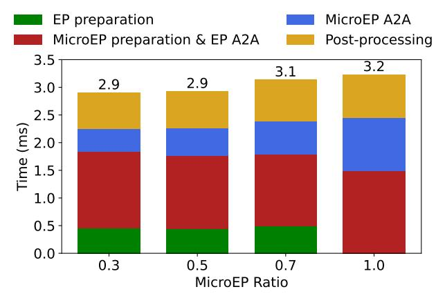

# C.4 Evaluation of FineEP with Pipelining

We evaluate the performance of FineEP with pipelining in Appendix [A.2.](#page-17-3) We enable the communication-aware scheduling and DeepEP. We use 8 GPUs and 128 experts. Other parameters are the same as Appendix [C.3.](#page-19-2)

We compare the dispatch time with varying ratios of data in FineEP. Figure [18](#page-20-0) demonstrates that pipelining can reduce the dispatch time by overlapping FineEP preparation with EP allto-all communication. However, the dispatch time increases as the FineEP ratio increases. This is because the EP all-toall time decreases and becomes insufficient to fully hide the FineEP scheduling time.

Figure 18: Dispatch time breakdown with pipelining, vary the ratios of data in FineEP (1.0 indicates no pipelining).