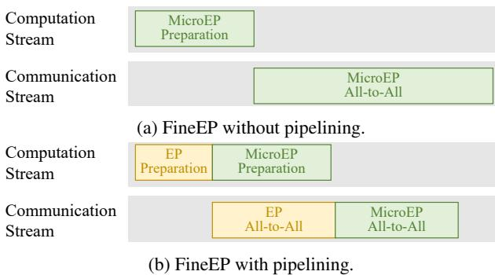

# References

- [1] Anthropic. Introducing claude 4. [https://www.](https://www.anthropic.com/news/claude-4) [anthropic.com/news/claude-4](https://www.anthropic.com/news/claude-4), 2025.
- [2] Tom B. Brown, Benjamin Mann, Nick Ryder, Melanie Subbiah, Jared Kaplan, Prafulla Dhariwal, Arvind Neelakantan, Pranav Shyam, Girish Sastry, Amanda Askell, Sandhini Agarwal, Ariel Herbert-Voss, Gretchen Krueger, Tom Henighan, Rewon Child, Aditya Ramesh, Daniel M. Ziegler, Jeffrey Wu, Clemens Winter, Christopher Hesse, Mark Chen, Eric Sigler, Mateusz Litwin, Scott Gray, Benjamin Chess, Jack Clark, Christopher Berner, Sam McCandlish, Alec Radford, Ilya Sutskever, and Dario Amodei. Language models are few-shot learners. In *Proceedings of the 34th International Conference on Neural Information Processing Systems (NIPS '20)*, 2020.
- [3] Bing Cao, Yiming Sun, Pengfei Zhu, and Qinghua Hu. Multi-modal gated mixture of local-to-global experts for dynamic image fusion. In *Proceedings of the IEEE/CVF International Conference on Computer Vision (ICCV '23)*, 2023.
- [4] Chang Chen, Min Li, Zhihua Wu, Dianhai Yu, and Chao Yang. Ta-moe: Topology-aware large scale mixture-ofexpert training. In S. Koyejo, S. Mohamed, A. Agarwal, D. Belgrave, K. Cho, and A. Oh, editors, *Advances in Neural Information Processing Systems (NIPS '22)*. Curran Associates, Inc., 2022.
- [5] Tianqi Chen, Bing Xu, Chiyuan Zhang, and Carlos Guestrin. Training deep nets with sublinear memory cost. <https://arxiv.org/abs/1604.06174>, 2016.
- [6] Aakanksha Chowdhery, Sharan Narang, Jacob Devlin, Maarten Bosma, Gaurav Mishra, Adam Roberts, Paul Barham, Hyung Won Chung, Charles Sutton, Sebastian Gehrmann, Parker Schuh, Kensen Shi, Sashank Tsvyashchenko, Joshua Maynez, Abhishek Rao, Parker Barnes, Yi Tay, Noam Shazeer, Vinodkumar Prabhakaran, Emily Reif, Nan Du, Ben Hutchinson, Reiner Pope, James Bradbury, Jacob Austin, Michael Isard, Guy Gur-Ari, Pengcheng Yin, Toju Duke, Anselm Levskaya, Sanjay Ghemawat, Sunipa Dev, Henryk Michalewski, Xavier Garcia, Vedant Misra, Kevin Robinson, Liam Fedus, Denny Zhou, Daphne Ippolito, David Luan, Hyeontaek Lim, Barret Zoph, Alexander Spiridonov, Ryan Sepassi, David Dohan, Shivani Agrawal, Mark Omernick, Andrew M. Dai, Thanumalayan Sankaranarayana Pillai, Marie Pellat, Aitor Lewkowycz, Erica Moreira, Rewon Child, Oleksandr Polozov, Katherine Lee, Zongwei Zhou, Xuezhi Wang, Brennan Saeta, Mark Diaz, Orhan Firat, Michele Catasta, Jason Wei, Kathy Meier-Hellstern, Douglas Eck, Jeff Dean, Slav Petrov, and

- Noah Fiedel. Palm: scaling language modeling with pathways. *J. Mach. Learn. Res.*, 2023.
- [7] Peizhuang Cong, Aomufei Yuan, Shimao Chen, Yuxuan Tian, Bowen Ye, and Tong Yang. Prediction is all moe needs: Expert load distribution goes from fluctuating to stabilizing. <https://arxiv.org/abs/2404.16914>, 2024.
- [8] DeepSeek. Linear-programming-based load balancer. <https://github.com/deepseek-ai/LPLB>, 2025.
- [9] DeepSeek-AI. Deepseek-v3 technical report. [https:](https://arxiv.org/abs/2412.19437) [//arxiv.org/abs/2412.19437](https://arxiv.org/abs/2412.19437), 2024.
- [10] Nan Du, Yanping Huang, Andrew M Dai, Simon Tong, Dmitry Lepikhin, Yuanzhong Xu, Maxim Krikun, Yanqi Zhou, Adams Wei Yu, Orhan Firat, Barret Zoph, Liam Fedus, Maarten P Bosma, Zongwei Zhou, Tao Wang, Emma Wang, Kellie Webster, Marie Pellat, Kevin Robinson, Kathleen Meier-Hellstern, Toju Duke, Lucas Dixon, Kun Zhang, Quoc Le, Yonghui Wu, Zhifeng Chen, and Claire Cui. GLaM: Efficient scaling of language models with mixture-of-experts. In *Proceedings of the 39th International Conference on Machine Learning (ICML '22)*, 2022.
- [11] William Fedus, Barret Zoph, and Noam Shazeer. Switch transformers: scaling to trillion parameter models with simple and efficient sparsity. *J. Mach. Learn. Res.*, 2022.
- [12] Wikimedia Foundation. Wikimedia downloads. [https:]( https://dumps.wikimedia.org/) [//dumps.wikimedia.org/]( https://dumps.wikimedia.org/), 2025.
- [13] Trevor Gale, Deepak Narayanan, Cliff Young, and Matei Zaharia. Megablocks: Efficient sparse training with mixture-of-experts. *Proceedings of Machine Learning and Systems (MLSys '23)*, 2023.
- [14] Google. Gemini 3: Our most intelligent ai model that brings any idea to life. [https://deepmind.google/](https://deepmind.google/models/gemini/) [models/gemini/](https://deepmind.google/models/gemini/), 2025.
- [15] Hongcan Guo, Haolang Lu, Guoshun Nan, Bolun Chu, Jialin Zhuang, Yuan Yang, Wenhao Che, Sicong Leng, Qimei Cui, and Xudong Jiang. Advancing expert specialization for better moe. [https://arxiv.org/abs/](https://arxiv.org/abs/2505.22323) [2505.22323](https://arxiv.org/abs/2505.22323), 2025.
- [16] Hussein Hazimeh, Zhe Zhao, Aakanksha Chowdhery, Maheswaran Sathiamoorthy, Yihua Chen, Rahul Mazumder, Lichan Hong, and Ed Chi. Dselect-k: Differentiable selection in the mixture of experts with applications to multi-task learning. In M. Ranzato, A. Beygelzimer, Y. Dauphin, P.S. Liang, and J. Wortman Vaughan, editors, *Advances in Neural Information Processing Systems (NIPS '21)*. Curran Associates, Inc., 2021.

- [17] Jiaao He, Jiezhong Qiu, Aohan Zeng, Zhilin Yang, Jidong Zhai, and Jie Tang. Fastmoe: A fast mixtureof-expert training system. [https://arxiv.org/abs/](https://arxiv.org/abs/2103.13262) [2103.13262](https://arxiv.org/abs/2103.13262), 2021.
- [18] Jiaao He, Jidong Zhai, Tiago Antunes, Haojie Wang, Fuwen Luo, Shangfeng Shi, and Qin Li. Fastermoe: modeling and optimizing training of large-scale dynamic pre-trained models. In *Proceedings of the 27th ACM SIGPLAN Symposium on Principles and Practice of Parallel Programming (PPoPP '22)*, 2022.
- [19] Zhiyi Hu, Siyuan Shen, Tommaso Bonato, Sylvain Jeaugey, Cedell Alexander, Eric Spada, James Dinan, Jeff Hammond, and Torsten Hoefler. Demystifying nccl: An in-depth analysis of gpu communication protocols and algorithms. [https://arxiv.org/abs/2507.](https://arxiv.org/abs/2507.04786) [04786](https://arxiv.org/abs/2507.04786), 2025.
- [20] Yanping Huang, Youlong Cheng, Ankur Bapna, Orhan Firat, Dehao Chen, Mia Chen, HyoukJoong Lee, Jiquan Ngiam, Quoc V Le, Yonghui Wu, and zhifeng Chen. Gpipe: Efficient training of giant neural networks using pipeline parallelism. In H. Wallach, H. Larochelle, A. Beygelzimer, F. d'Alché-Buc, E. Fox, and R. Garnett, editors, *Advances in Neural Information Processing Systems*. Curran Associates, Inc., 2019.
- [21] Q. Huangfu and J. A. J. Hall. Parallelizing the dual revised simplex method. *Mathematical Programming Computation*, 2018.
- [22] Changho Hwang, Wei Cui, Yifan Xiong, Ziyue Yang, Ze Liu, Han Hu, Zilong Wang, Rafael Salas, Jithin Jose, Prabhat Ram, HoYuen Chau, Peng Cheng, Fan Yang, Mao Yang, and Yongqiang Xiong. Tutel: Adaptive mixture-of-experts at scale. In D. Song, M. Carbin, and T. Chen, editors, *Proceedings of Machine Learning and Systems (MLSys '23)*. Curan, 2023.
- [23] Albert Q. Jiang, Alexandre Sablayrolles, Antoine Roux, Arthur Mensch, Blanche Savary, Chris Bamford, Devendra Singh Chaplot, Diego de las Casas, Emma Bou Hanna, Florian Bressand, Gianna Lengyel, Guillaume Bour, Guillaume Lample, Lélio Renard Lavaud, Lucile Saulnier, Marie-Anne Lachaux, Pierre Stock, Sandeep Subramanian, Sophia Yang, Szymon Antoniak, Teven Le Scao, Théophile Gervet, Thibaut Lavril, Thomas Wang, Timothée Lacroix, and William El Sayed. Mixtral of experts. [https://arxiv.org/abs/2401.](https://arxiv.org/abs/2401.04088) [04088](https://arxiv.org/abs/2401.04088), 2024.
- [24] Vijay Anand Korthikanti, Jared Casper, Sangkug Lym, Lawrence McAfee, Michael Andersch, Mohammad Shoeybi, and Bryan Catanzaro. Reducing activation

- recomputation in large transformer models. In *Proceedings of Machine Learning and Systems (MLSys '23)*, 2023.
- [25] Dmitry Lepikhin, HyoukJoong Lee, Yuanzhong Xu, Dehao Chen, Orhan Firat, Yanping Huang, Maxim Krikun, Noam Shazeer, and Zhifeng Chen. Gshard: Scaling giant models with conditional computation and automatic sharding. [https://arxiv.org/abs/2006.](https://arxiv.org/abs/2006.16668) [16668](https://arxiv.org/abs/2006.16668), 2020.
- [26] Mike Lewis, Shruti Bhosale, Tim Dettmers, Naman Goyal, and Luke Zettlemoyer. Base layers: Simplifying training of large, sparse models. In *International Conference on Machine Learning (ICML '21)*. PMLR, 2021.
- [27] Jiamin Li, Yimin Jiang, Yibo Zhu, Cong Wang, and Hong Xu. Accelerating distributed MoE training and inference with lina. In *2023 USENIX Annual Technical Conference (USENIX ATC '23)*. USENIX Association, July 2023.
- [28] Jing Li, Zhijie Sun, Xuan He, Li Zeng, Yi Lin, Entong Li, Binfan Zheng, Rongqian Zhao, and Xin Chen. Locmoe: A low-overhead moe for large language model training. <https://arxiv.org/abs/2401.13920>, 2024.
- [29] Shen Li, Yanli Zhao, Rohan Varma, Omkar Salpekar, Pieter Noordhuis, Teng Li, Adam Paszke, Jeff Smith, Brian Vaughan, Pritam Damania, and Soumith Chintala. Pytorch distributed: experiences on accelerating data parallel training. *Proc. VLDB Endow.*, 2020.
- [30] Juncai Liu, Jessie Hui Wang, and Yimin Jiang. Janus: A unified distributed training framework for sparse mixture-of-experts models. In *Proceedings of the ACM SIGCOMM 2023 Conference (SIGCOMM '23)*, New York, NY, USA, 2023. Association for Computing Machinery.
- [31] Ze Liu, Yutong Lin, Yue Cao, Han Hu, Yixuan Wei, Zheng Zhang, Stephen Lin, and Baining Guo. Swin transformer: Hierarchical vision transformer using shifted windows. In *Proceedings of the IEEE/CVF International Conference on Computer Vision (ICCV '21)*, October 2021.
- [32] Jiasen Lu, Dhruv Batra, Devi Parikh, and Stefan Lee. *ViLBERT: pretraining task-agnostic visiolinguistic representations for vision-and-language tasks*. 2019.
- [33] Meta. The llama 4 herd: The beginning of a new era of natively multimodal ai innovation. [https://ai.meta.](https://ai.meta.com/blog/llama-4-multimodal-intelligence/) [com/blog/llama-4-multimodal-intelligence/](https://ai.meta.com/blog/llama-4-multimodal-intelligence/), 2025.

- [34] Deepak Narayanan, Aaron Harlap, Amar Phanishayee, Vivek Seshadri, Nikhil R. Devanur, Gregory R. Ganger, Phillip B. Gibbons, and Matei Zaharia. Pipedream: generalized pipeline parallelism for dnn training. In *Proceedings of the 27th ACM Symposium on Operating Systems Principles (SOSP '19)*. Association for Computing Machinery, 2019.
- [35] Xiaonan Nie, Qibin Liu, Fangcheng Fu, Shenhan Zhu, Xupeng Miao, Xiaoyang Li, Yang Zhang, Shouda Liu, and Bin Cui. Lsh-moe: Communication-efficient moe training via locality-sensitive hashing. In A. Globerson, L. Mackey, D. Belgrave, A. Fan, U. Paquet, J. Tomczak, and C. Zhang, editors, *Advances in Neural Information Processing Systems (NIPS '24)*. Curran Associates, Inc., 2024.
- [36] Xiaonan Nie, Xupeng Miao, Zilong Wang, Zichao Yang, Jilong Xue, Lingxiao Ma, Gang Cao, and Bin Cui. Flexmoe: Scaling large-scale sparse pre-trained model training via dynamic device placement. *Proc. ACM Manag. Data*, 2023.
- [37] OpenAI. Gpt-5 is here. <https://openai.com/gpt-5>, 2025.
- [38] Myle Ott, Sergey Edunov, Alexei Baevski, Angela Fan, Sam Gross, Nathan Ng, David Grangier, and Michael Auli. fairseq: A fast, extensible toolkit for sequence modeling. In *Proceedings of NAACL-HLT 2019: Demonstrations*, 2019.
- [39] Adam Paszke, Sam Gross, Francisco Massa, Adam Lerer, James Bradbury, Gregory Chanan, Trevor Killeen, Zeming Lin, Natalia Gimelshein, Luca Antiga, Alban Desmaison, Andreas Köpf, Edward Yang, Zach DeVito, Martin Raison, Alykhan Tejani, Sasank Chilamkurthy, Benoit Steiner, Lu Fang, Junjie Bai, and Soumith Chintala. *PyTorch: An Imperative Style, High-Performance Deep Learning Library*. 2019.
- [40] Penghui Qi, Xinyi Wan, Guangxing Huang, and Min Lin. Zero bubble pipeline parallelism. [https://arxiv.](https://arxiv.org/abs/2401.10241) [org/abs/2401.10241](https://arxiv.org/abs/2401.10241), 2023.
- [41] Yuhao Qing, Guichao Zhu, Fanxin Li, Lintian Lei, Zekai Sun, Xiuxian Guan, Shixiong Zhao, Xusheng Chen, Dong Huang, Sen Wang, and Heming Cui. Hecate: Unlocking efficient sparse model training via fully sharded sparse data parallelism. [https://arxiv.org/abs/](https://arxiv.org/abs/2502.02581) [2502.02581](https://arxiv.org/abs/2502.02581), 2025.
- [42] Zihan Qiu, Zeyu Huang, Bo Zheng, Kaiyue Wen, Zekun Wang, Rui Men, Ivan Titov, Dayiheng Liu, Jingren Zhou, and Junyang Lin. Demons in the detail: On implementing load balancing loss for training specialized mixture-of-expert models. [https://arxiv.org/abs/](https://arxiv.org/abs/2501.11873) [2501.11873](https://arxiv.org/abs/2501.11873), 2025.

- [43] Alec Radford, Jeff Wu, Rewon Child, David Luan, Dario Amodei, and Ilya Sutskever. Language models are unsupervised multitask learners. 2019.
- [44] Samyam Rajbhandari, Conglong Li, Zhewei Yao, Minjia Zhang, Reza Yazdani Aminabadi, Ammar Ahmad Awan, Jeff Rasley, and Yuxiong He. DeepSpeed-MoE: Advancing mixture-of-experts inference and training to power next-generation AI scale. In Kamalika Chaudhuri, Stefanie Jegelka, Le Song, Csaba Szepesvari, Gang Niu, and Sivan Sabato, editors, *Proceedings of the 39th International Conference on Machine Learning (ICML '22)*, 2022.
- [45] Samyam Rajbhandari, Jeff Rasley, Olatunji Ruwase, and Yuxiong He. Zero: Memory optimizations toward training trillion parameter models. In *International Conference for High Performance Computing, Networking, Storage and Analysis (SC '20)*, 2020.
- [46] Jeff Rasley, Samyam Rajbhandari, Olatunji Ruwase, and Yuxiong He. Deepspeed: System optimizations enable training deep learning models with over 100 billion parameters. In *Proceedings of the 26th ACM SIGKDD International Conference on Knowledge Discovery & Data Mining (KDD '20)*. Association for Computing Machinery, 2020.
- [47] Carlos Riquelme, Joan Puigcerver, Basil Mustafa, Maxim Neumann, Rodolphe Jenatton, André Susano Pinto, Daniel Keysers, and Neil Houlsby. Scaling vision with sparse mixture of experts. In *Proceedings of the 35th International Conference on Neural Information Processing Systems (NIPS '21)*, 2021.
- [48] Stephen Roller, Sainbayar Sukhbaatar, arthur szlam, and Jason Weston. Hash layers for large sparse models. In M. Ranzato, A. Beygelzimer, Y. Dauphin, P.S. Liang, and J. Wortman Vaughan, editors, *Advances in Neural Information Processing Systems (NIPS '21)*. Curran Associates, Inc., 2021.
- [49] Noam Shazeer, Azalia Mirhoseini, Krzysztof Maziarz, Andy Davis, Quoc Le, Geoffrey Hinton, and Jeff Dean. Outrageously large neural networks: The sparsely-gated mixture-of-experts layer. [https://arxiv.org/abs/](https://arxiv.org/abs/1701.06538) [1701.06538](https://arxiv.org/abs/1701.06538), 2017.
- [50] Mohammad Shoeybi, Mostofa Patwary, Raul Puri, Patrick LeGresley, Jared Casper, and Bryan Catanzaro. Megatron-lm: Training multi-billion parameter language models using model parallelism. [https://arxiv.org/](https://arxiv.org/abs/1909.08053) [abs/1909.08053](https://arxiv.org/abs/1909.08053), 2020.
- [51] Athinagoras Skiadopoulos, Mark Zhao, Swapnil Gandhi, Thomas Norrie, Shrijeet Mukherjee, and Christos Kozyrakis. Accelerating mixture-of-experts training

- with adaptive expert replication. [https://arxiv.org/](https://arxiv.org/abs/2504.19925) [abs/2504.19925](https://arxiv.org/abs/2504.19925), 2025.
- [52] Yehui Tang, Xiaosong Li, Fangcheng Liu, Wei Guo, Hang Zhou, Yaoyuan Wang, Kai Han, Xianzhi Yu, Jinpeng Li, Hui Zang, Fei Mi, Xiaojun Meng, Zhicheng Liu, Hanting Chen, Binfan Zheng, Can Chen, Youliang Yan, Ruiming Tang, Peifeng Qin, Xinghao Chen, Dacheng Tao, and Yunhe Wang. Pangu pro moe: Mixture of grouped experts for efficient sparsity. [https://arxiv.](https://arxiv.org/abs/2505.21411) [org/abs/2505.21411](https://arxiv.org/abs/2505.21411), 2025.
- [53] Ashish Vaswani, Noam Shazeer, Niki Parmar, Jakob Uszkoreit, Llion Jones, Aidan N. Gomez, Łukasz Kaiser, and Illia Polosukhin. Attention is all you need. In *Proceedings of the 31st International Conference on Neural Information Processing Systems (NIPS'17)*, 2017.
- [54] Lean Wang, Huazuo Gao, Chenggang Zhao, Xu Sun, and Damai Dai. Auxiliary-loss-free load balancing strategy for mixture-of-experts. [https://arxiv.org/abs/](https://arxiv.org/abs/2408.15664) [2408.15664](https://arxiv.org/abs/2408.15664), 2024.
- [55] Wei Wang, Zhiquan Lai, Shengwei Li, Weijie Liu, Keshi Ge, Yujie Liu, Ao Shen, and Dongsheng Li. Prophet: Fine-grained load balancing for parallel training of largescale moe models. In *2023 IEEE International Conference on Cluster Computing (CLUSTER '23)*, 2023.
- [56] Wei Wang, Zhiquan Lai, Shengwei Li, Weijie Liu, Keshi Ge, Ao Shen, Huayou Su, and Dongsheng Li. Proprophet: A systematic load balancing method for efficient parallel training of large-scale moe models. [https:](https://arxiv.org/abs/2411.10003) [//arxiv.org/abs/2411.10003](https://arxiv.org/abs/2411.10003), 2024.
- [57] Wikipedia. Cayley graph. [https://en.wikipedia.](https://en.wikipedia.org/wiki/Cayley_graph) [org/wiki/Cayley\\_graph](https://en.wikipedia.org/wiki/Cayley_graph), 2025.
- [58] Shaohua Wu, Jiangang Luo, Xi Chen, Lingjun Li, Xudong Zhao, Tong Yu, Chao Wang, Yue Wang, Fei Wang, Weixu Qiao, Houbo He, Zeru Zhang, Zeyu Sun, Junxiong Mao, and Chong Shen. Yuan 2.0-m32: Mixture of experts with attention router. [https://arxiv.](https://arxiv.org/abs/2405.17976) [org/abs/2405.17976](https://arxiv.org/abs/2405.17976), 2024.
- [59] xAI. Grok 4. <https://x.ai/news/grok-4>, 2025.
- [60] Fuzhao Xue, Zian Zheng, Yao Fu, Jinjie Ni, Zangwei Zheng, Wangchunshu Zhou, and Yang You. Openmoe: An early effort on open mixture-of-experts language models. [https://arxiv.org/abs/2402.](https://arxiv.org/abs/2402.01739) [01739](https://arxiv.org/abs/2402.01739), 2024.
- [61] An Yang, Anfeng Li, Baosong Yang, Beichen Zhang, Binyuan Hui, Bo Zheng, Bowen Yu, Chang Gao, Chengen Huang, Chenxu Lv, Chujie Zheng, Dayiheng Liu, Fan Zhou, Fei Huang, Feng Hu, Hao Ge, Haoran Wei,

Huan Lin, Jialong Tang, Jian Yang, Jianhong Tu, Jianwei Zhang, Jianxin Yang, Jiaxi Yang, Jing Zhou, Jingren Zhou, Junyang Lin, Kai Dang, Keqin Bao, Kexin Yang, Le Yu, Lianghao Deng, Mei Li, Mingfeng Xue, Mingze Li, Pei Zhang, Peng Wang, Qin Zhu, Rui Men, Ruize Gao, Shixuan Liu, Shuang Luo, Tianhao Li, Tianyi Tang, Wenbiao Yin, Xingzhang Ren, Xinyu Wang, Xinyu Zhang, Xuancheng Ren, Yang Fan, Yang Su, Yichang Zhang, Yinger Zhang, Yu Wan, Yuqiong Liu, Zekun Wang, Zeyu Cui, Zhenru Zhang, Zhipeng Zhou, and Zihan Qiu. Qwen3 technical report. https://arxiv.org/abs/2505.09388, 2025.

- [62] Dianhai Yu, Liang Shen, Hongxiang Hao, Weibao Gong, Huachao Wu, Jiang Bian, Lirong Dai, and Haoyi Xiong. Moesys: A distributed and efficient mixture-of-experts training and inference system for internet services. *IEEE Transactions on Services Computing*, 2024.
- [63] Mingshu Zhai, Jiaao He, Zixuan Ma, Zan Zong, Runqing Zhang, and Jidong Zhai. SmartMoE: Efficiently training Sparsely-Activated models through combining offline and online parallelization. In *2023 USENIX Annual Technical Conference (USENIX ATC '23)*, 2023.
- [64] Shulai Zhang, Ningxin Zheng, Haibin Lin, Ziheng Jiang, Wenlei Bao, Chengquan Jiang, Qi Hou, Weihao Cui, Size Zheng, Li-Wen Chang, Quan Chen, and Xin Liu. COMET: Fine-grained computation-communication overlapping for mixture-of-experts. In Eighth Conference on Machine Learning and Systems (MLSys '25), 2025.
- [65] Yanli Zhao, Andrew Gu, Rohan Varma, Liang Luo, Chien-Chin Huang, Min Xu, Less Wright, Hamid Shojanazeri, Myle Ott, Sam Shleifer, Alban Desmaison, Can Balioglu, Pritam Damania, Bernard Nguyen, Geeta Chauhan, Yuchen Hao, Ajit Mathews, and Shen Li. Pytorch fsdp: Experiences on scaling fully sharded data parallel. *Proc. VLDB Endow.*, 2023.
- [66] Yanqi Zhou, Tao Lei, Hanxiao Liu, Nan Du, Yanping Huang, Vincent Zhao, Andrew M Dai, zhifeng Chen, Quoc V Le, and James Laudon. Mixture-of-experts with expert choice routing. In Advances in Neural Information Processing Systems (NIPS '22), 2022.

#### A Optimizations to FineEP

#### A.1 Communication-Aware Scheduling

Many studies demonstrate that the all-to-all communication also takes a significant amount of time in MoE layers [18, 22, 27]. However, the optimization problem 1 only considers the computation time. Therefore, we can further consider the communication time during scheduling.

In many existing frameworks [46, 50], the time of an MoE layer is mainly determined by the communication time + the computation time (unless using some communication-computation overlapping techniques, such as Comet [64] and DualPipe [9]). Therefore, we introduce an additional objective to minimize the maximum communication volume on a GPU. According to Algorithm 1, Line 6, the local data volume of GPU g can be formulated as  $local_g = \sum \min(x_e^g, input_e^g)$ . For each GPU, we consider its all-

 $e \in E: g \in G_{EDP}^e$  to-all communication volume as the greater value between its send volume and receive volume. The send/receive volume of GPU g can be calculated from  $x_e^g$ ,  $input_e^g$ , and  $local_g$ . Putting them together, we derive the new optimization problem:

minimize  $comp + \alpha \cdot comm$ , subject to  $comp = \max_{g \in G_{FineEP}} \left\{ \sum_{e \in E: g \in G_{EDP}^e} x_e^g \right\}$ ,  $comm = \max_{g \in G_{FineEP}} \left\{ \max(send_g, recv_g) \right\}$ ,  $send_g = \left( \sum_{e \in E: g \in G_{EDP}^e} input_e^g \right) - local_g$ ,  $recv_g = \left( \sum_{e \in E: g \in G_{EDP}^e} x_e^g \right) - local_g$ ,  $local_g = \sum_{e \in E: g \in G_{EDP}^e} \min(x_e^g, input_e^g)$ ,  $\sum_{g \in G_{EDP}^e} x_e^g = load_e, \quad \forall e \in E$ ,  $x_e^g > 0$ .

 $\alpha$  is a constant parameter reflecting the weight of the communication time in the optimization problem. In practice, we can set  $\alpha$  to the ratio of expert computation throughput to all-to-all communication throughput. The optimization problem 4 is still an LPP. We omit the derivation of converting problem 4 to a standard LPP format.

**Topology-aware scheduling.** We can further consider the impact of network topology on communication. In a typical network topology, intra-node communication (e.g., through NVLink) is many times faster than inter-node communication (e.g., through Infiniband). Therefore, we can consider this difference during scheduling for better communication efficiency.

In the LPP 4, we can split the communication time into intra-node and inter-node. Intra-node communication has a lower weight  $(\alpha_1)$  than inter-node communication  $(\alpha_2)$ . Additionally, we modify the routing mechanism as follows: First, route local tokens to local replicas within the same GPUs. Second, route tokens to replicas on other GPUs in the same nodes. Third, route tokens to other global GPUs.

**Overhead.** While communication-aware scheduling minimizes communication volume, it increases computational

complexity due to additional parameters and constraints in the LPP (comparing LPP 4 and 1). Therefore, we should carefully consider when to enable the communication-aware scheduling, performing a trade-off between the LPP solving time and the communication time.

#### **A.2** Pipelining FineEP

(b) ThicEr with pipenning

Figure 14: Pipelining FineEP.

Pipelining offers an additional approach to hide the scheduling overhead of FineEP, different from the overlapping technique in §5.4. Pipelining is particularly useful in scenarios where it is impossible to fully hide the scheduling time through overlapping. For example, some high-performance frameworks, such as DeepEP [9], have no intermediate operations to overlap between the gate network and all-to-all communication; when dealing with large-scale deployments with numerous GPUs and experts, the scheduling can incur substantial overhead (as illustrated in §7.6). With pipelining, we can overlap the scheduling of some tokens with the all-to-all communication of other tokens. This approach provides more flexibility in latency hiding.

We find many design choices to perform pipelining for FineEP and illustrate one of them as follows. We observe that FineEP can achieve perfect load balance in most circumstances (as shown in §7.3). Our intuition is that even if the expert load becomes more imbalanced, FineEP can still achieve perfect balance. Inspired by this observation, we can split the tokens into two parts: We apply EP to the former part5, and apply FineEP to the latter part. Moreover, the optimization problem 1 should consider the computational workloads in both EP and FineEP. In this way, we can overlap the scheduling of the latter part with the all-to-all communication of the former part, as shown in Figure 14.

**Overhead.** Pipelining FineEP introduces some additional system overhead. For example, splitting one all-to-all communication operation into two increases synchronization time and GPU kernel launching time. Therefore, we recommend

Figure 15: Examples of Cayley graphs.

using FineEP with pipelining in scenarios with substantial scheduling time but minimal system overhead.

