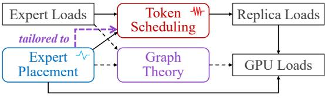

# **6.2** Symmetric Placement without Expert Loads

If we have no prior knowledge of the real expert load distribution, we can construct *symmetric placements*, treating all

&lt;sup>2We omit the derivation from Equation 2 to Equation 3.

&lt;sup>3This definition may differ from conventional graph density definitions in the literature.

(a) Data flow and analysis flow of MicroMoE.

(b) Data flow of expert scheduling systems.

Figure 6: Differences between MicroMoE and expert scheduling systems.

experts equally. Symmetric placements provide conservative and general load balancing capability in terms of unknown load distributions. In such scenarios, we can assume that all expert loads follow an independent and identically distributed (i.i.d.) pattern. Thereby, the problem becomes: Given the number of vertices and edges as well as the identical distribution of edge weights, how to construct a graph that minimizes the expectation of the maximum induced subgraph density?

We recognize the challenge of the above problem due to the vast space of possible graphs and distributions. Nevertheless, we propose a near-optimal symmetric placement strategy for many practical configurations using *Cayley graphs* [57]. Our intuition is that the inherent symmetry of Cayley graphs ensures a balanced distribution of edges across vertices, preventing some induced subgraphs from having significantly larger density than others. Since Cayley graphs involve complex group theory, we illustrate our construction method in Appendix B.

#### **6.3** Asymmetric Placement with Expert Loads

If we know real expert load distributions in advance, we can construct *asymmetric placements* tailored to them. Unlike symmetric scenarios, we can vary both replica counts and replica locations across different experts for better load balancing, similar to previous works [36,55,63].

We adopt an empirical strategy to construct a near-optimal asymmetric expert placement in two steps: (1) First, we determine the number of replicas for each expert with a *greedy* algorithm: We maintain a heap of experts sorted by load-per-replica, and iteratively allocate remaining replicas to the expert with the maximum load-per-replica. (2) Second, we determine the placement of expert replicas across GPUs with *Monte Carlo sampling*: We randomly generate many placement graphs, and choose the one whose maximum induced subgraph density is minimal.

#### 6.4 Adaptive Replacement

Based on symmetric and asymmetric placements, we further propose an *adaptive replacement* (AR) mechanism for FineMoE to optimize performance under dynamic expert loads.

Relationship between token scheduling and adaptive replacement. The adaptive replacement mechanism complements the token scheduling in §5 by addressing different levels of load balancing. Token scheduling performs *transient*, *fine-grained* load balancing through per-micro-batch token arrangement, while adaptive replacement handles *longterm*, *coarse-grained* load imbalances through periodic expert arrangement.

Specifically, for moderately imbalanced workloads, token scheduling sufficiently maintains complete balance with static, symmetric placements (as shown in §7.3). For highly skewed workloads, FineMoE adopts asymmetric placements to mitigate coarse-grained imbalances before using token scheduling for fine-grained optimization. Since asymmetric placements require real-time expert loads, FineMoE adopts adaptive replacement to monitor expert load distributions and adjust placements when significant distributional shifts are detected. Implementation of adaptive replacement. We implement the adaptive replacement mechanism in FineMoE using the placement manager (according to Figure 4). (1) During model initialization, the placement manager initializes the model states of all devices using the symmetric placement strategy, providing conservative and general load balancing capabilities. (2) During training, the placement manager monitors expert load information within each micro-batch in the background. (3) For every few iterations, the placement manager predicts future load distributions using historical data with time series analysis techniques, such as moving averages [7]. Then, it evaluates the performance of current placements on future distributions using Equation 3. If the future performance drops below a specific threshold, the placement manager generates new optimal asymmetric placements and reinitializes global model states accordingly.

Difference between FineMoE's adaptive replacement and expert scheduling solutions. The system implementation of FineMoE's adaptive replacement is similar to existing expert scheduling solutions, such as FlexMoE [36] and Smart-MoE [63]. Nevertheless, their design goals and algorithms are fundamentally different:

Design goals: In systems like FlexMoE, changing expert placement is the only means for load balancing, as shown in Figure 6b. However, in FineMoE, the primary weapon is token scheduling, while adaptive replacement is a further optimization to token scheduling, as shown in Figure 6a. Even with static placement, FineMoE can still achieve good load balancing performance at micro-batch granularity.

Algorithms: Different design goals yield distinct placement algorithms. In existing expert scheduling systems,

Figure 7: End-to-end speedup of different systems compared with Megatron-LM.

an expert's replicas typically have identical loads (i.e., replica\_load=expert\_load/replica\_count). Therefore, they can leverage greedy or dynamic programming algorithms accordingly [36,63]. In contrast, replica loads in FineMoE are determined by linear programming. Therefore, FineMoE requires the graph theory in §6.1 to guide the placement strategy.

#### 7 Evaluation

#### 7.1 Experimental Setup

**Testbed.** Our testbed consists of 4 nodes, each equipped with 8 NVIDIA H100 80GB SXM GPUs connected via 900 GBps NVLink. Nodes are interconnected using two 400 Gbps Infiniband NICs per node.

**Models.** We use GPT [2] and Mixtral [23] models for evaluation. We use GPT 32×1.3B to represent an MoE model converted from a 1.3B dense GPT model with 32 experts. We pretrain these models with the Wikipedia dataset [12]. A detailed list of model hyperparameters is provided in Appendix C.

**Baselines.** We compare FineMoE with four baseline systems.

- Megatron-LM [50] is a popular distributed training framework for large language models (LLMs). It supports various parallelism strategies, as well as state-of-the-art optimizations [5].
- SmartMoE [63] balances GPU loads by adjusting the expert placement within EP groups.
- FlexMoE [36] achieves load balancing by dynamically adjusting replica counts based on expert loads. FlexMoE places expert replicas across the entire DP group, similar to FineMoE's asymmetric placement (§6.3).
- DeepSpeed [46] is a high-performance distributed framework for both LLM training and inference. We enable ZeRO-1 [45] optimization in DeepSpeed (currently, ZeRO-2 does not support PP, and Tutel [22] does not support top-K>1).

We compare two variants of FineMoE: "FineMoE (w/o AR)" uses static, symmetric placement (§6.2), while "FineMoE" uses adaptive, asymmetric placement (§6.3-6.4).

**Implementation.** We implement FineMoE upon Megatron-LM [50]. FineMoE provides a model wrapper similar to Pytorch's Distributed Data Parallel (DDP) [29], enabling users to benefit from FineEP's fine-grained load balancing capabilities within their training jobs. We modify Megatron-LM, including its MoELayer and DDP with Python, and implement the token scheduling algorithm in FineEP with C++.

For fair comparison, we also implement SmartMoE and FlexMoE in Megatron-LM, as SmartMoE's repository is outdated (last commit in 2023) [63], and FlexMoE is not open-sourced [36].

**Parallelization configurations.** Due to the limited inter-node network bandwidth in our testbed, we only employ PP for inter-node parallelism. Specifically, we set the PP degree to the number of nodes used, and the DP degree to 8. We set the EP degree to 4, resulting in 2 EP groups per DP group. We set the parameter *d* in FineEP to 2, resulting in a single FineEP group per DP group. We disable TP due to its high communication overhead.

Other configurations. We use a small auxiliary loss (listed in the appendix) to prevent extreme load imbalance from degrading model accuracy. We enable the distributed optimizers in Megatron-LM, which resembles DeepSpeed's ZeRO-1 [45]. We disable the token dropping mechanism introduced by GShard [25]. We use BF16 precision.

#### 7.2 End-to-end Performance

Figure 7 shows the end-to-end performance of all systems, varying models and number of GPUs. DeepSpeed exhibits poor performance with 16 or 32 experts. This is because DeepSpeed always adopts a padding mechanism, padding the load of each expert to the maximum expert load [25]. This mechanism wastes significant time and memory when expert loads are highly imbalanced. With as few as 8 experts, the inefficiency of padding becomes less significant, allowing DeepSpeed to outperform Megatron-LM due to its system-level optimizations.

Comparing SmartMoE and FineMoE (w/o AR), where experts have uniform replica counts, FineMoE (w/o AR) ex-

Figure 8: Max GPU load normalized by average GPU load, varying skewness of expert loads. DP\_degree=8, num\_experts=32.

hibits superior performance, thanks to FineEP's fine-grained token scheduling. While SmartMoE attempts to optimize performance by changing expert placement for load balancing among GPUs, it sometimes performs worse than vanilla Megatron-LM. This is because SmartMoE optimizes expert placement based on long-term expert load distributions. However, expert loads are highly dynamic during training, and SmartMoE's long-term optimal placement may be suboptimal for individual micro-batches.

Comparing FlexMoE and FineMoE (with AR), where experts have varied replica counts, FineMoE exhibits superior performance, thanks to its fine-grained, per-micro-batch token scheduling.

In conclusion, **compared with Megatron-LM, FineMoE improves the end-to-end throughput by up to 47.6%, with an average improvement of 36.9%.** The average performance improvement of FineMoE surpasses FlexMoE, the second-best system, by 13.9%. Note that this is already the upper bound of performance improvement attainable through load balancing, since MicroMoE already achieves complete balance (detailed in § 7.3).

#### 7.3 Load Balancing Capability

We evaluate the load balancing capabilities of SmartMoE, FlexMoE, and FineMoE with skewed expert loads. We generate expert loads following a Zipfian distribution with skewness s, where the probability of a token being assigned to the i-th most loaded expert is proportional to  $i^{-s}$ .

Figure 8 shows the load balancing performance of different systems across varied skewness s. SmartMoE's maximum GPU load increases as load skewness increases. While Flex-MoE maintains relatively balanced GPU loads by adjusting expert replica counts, it falls short of achieving optimal load balance due to its lack of fine-grained dynamicity. FineMoE (random) represents FineMoE with pure random placement, which performs slightly worse than FineMoE (w/o AR) with symmetric placement. FineMoE (w/o AR) achieves perfect load balance when s < 1 thanks to FineEP's fine-grained to-

Figure 9: Execution time breakdown of an MoE layer. DP\_degree=8, num\_experts=32, micro\_batch\_size=8, sequence\_length=2048, topK=2, hidden\_size=4096, skewness *s*=1.

ken scheduling. Nonetheless, its performance degrades when s>1 as uniform replica counts are insufficient for severe imbalances. FineMoE with asymmetric placements can always achieve complete load balance, due to the combination of both coarse-grained expert replacement and fine-grained token scheduling. Overall, **FineMoE exhibits the best load balancing capability among all systems and consistently achieves complete load balance.** 

#### 7.4 Execution Time Breakdown

Figure 9 shows the execution time breakdown of an MoE layer across different systems. We omit DeepSpeed due to its poor performance. For all remaining systems, the primary bottleneck is expert computation time. FineMoE achieves the shortest computation time by maintaining perfect load balance (with either symmetric or asymmetric placement, as shown in Figure 8).

Specifically, the dispatch time consists of two primary components: (1) Preparation time, which includes the all-gather operation of expert load information and the scheduling of FineEP. While FineMoE introduces additional overhead in dispatch time due to token scheduling operations, we effectively minimize this impact through overlapping with other operations in Megatron-LM. (2) All-to-all communication time. Each all-to-all communication in dispatch and combine requires approximately 1.3 ms in Megatron-LM.

#### 7.5 Inter-node Communication with DeepEP

We evaluate the dispatch time of FineEP and vanilla EP for inter-node communication. We additionally integrate FineEP with DeepEP [9], a high-performance all-to-all communication backend. Currently, Megatron-LM [50] supports both NCCL [19] (by default) and DeepEP for all-to-all communication.

**Experimental considerations.** Due to testbed limitations, two important experimental considerations should be noted: (1) Our testbed consists of 8 GPUs but only 2 NICs per node,

Figure 10: Dispatch time of FineEP and EP Figure 11: Scheduling time for FineEP, Figure 12: Migration time for adaptive rewith DeepEP and NCCL, varying number of varying number of experts and GPUs. placement of FineMoE. GPUs.

resulting in limited inter-node network bandwidth. Therefore, we avoid employing EP or FineEP across multiple nodes in §7. However, since this section focuses on evaluating the performance of different communication backends, we expand the communication group to multiple nodes. Consequently, the all-to-all time for inter-node communication is significantly higher than the intra-node communication. (2) §7 focuses on system performance, so we compare FineEP using 8 GPUs per group with EP using 4 GPUs per group (d=2). However, this section focuses on communication performance, so we compare FineEP and EP using the same group size.

Overhead of inter-node communication. Notably, since FineEP expands the all-to-all group size by a factor of d, FineEP may convert some inter-node communication into inter-node, leading to extra overhead. However, this overhead is minimal in two typical scenarios: (1) When  $d \times \text{EP\_degree} \le \#$  GPUs per node, the all-to-all communication in FineEP remains entirely intra-node. (2) When EP\_degree is super large (e.g., 64 in DeepSeek-v3 [9]), nearly all communication is inherently inter-node. Consequently, FineEP incurs negligible overheads in both single-node and massive-node scenarios. Furthermore, our communication-aware scheduling mechanism can jointly optimize the time of both communication and computation, as shown in Appendix C.2.

Results. Figure 16 shows the dispatch time comparison between FineEP and EP using both DeepEP and NCCL, varying number of GPUs. We use the same setting as in §7.4, except for the all-to-all group size. DeepEP exhibits better performance than NCCL due to its superior implementation. When using NCCL, FineEP requires less time than EP, thanks to the locality-aware routing in §5.2. However, when using DeepEP, FineEP requires more time than EP due to data format incompatibilities between DeepEP and Megatron-LM. Consequently, Megatron-LM needs to pre-process the data for DeepEP, while FineEP incurs a higher pre-processing overhead than EP. We believe that FineMoE will yield lower communication overheads on other practical testbeds (e.g., with one NIC per GPU).

## 7.6 Overhead Analysis

**Scheduling Overhead.** We evaluate the scheduling overhead of FineEP, including the LPP solving time and token routing time. Our evaluation reveals that the LPP solving time is the dominant factor, which scales with the number of experts and GPUs. As shown in Figure 11, the scheduling overhead remains remarkably low, with a minimum time of approximately 100 us. Even with 64 GPUs and 256 experts, the scheduling time remains below 1 ms. This minimal overhead per micro-batch enables FineEP to maintain high training throughput while providing load balancing benefits. Additionally, we evaluate the performance of pipelining to hide the scheduling latency, which results are shown in Appendix C.3. **Replacement overhead.** The adaptive replacement strategy in FineMoE necessitates model re-initialization to transition to new configurations. Although replacement is beneficial for load balancing, model re-initialization causes temporary suspension of training. Our evaluation highlights two key components in the replacement overhead: the migration time of expert parameters and their optimizer states. As shown in Figure 12, the total migration time typically spans hundreds of milliseconds across different model configurations.

The above results emphasize the importance of carefully selecting the expert replacement frequency to optimize the trade-off between per-micro-batch training efficiency and overall replacement overhead. In practice, we recommend tuning the replacement interval to 50 iterations during the beginning phase of training, which adds less than 1% overhead to the entire system. One may increase this interval to several hundred iterations or even make no replacement when workloads become less volatile, as shown in Figure 2.

