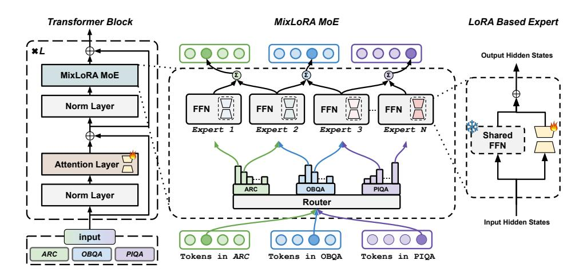
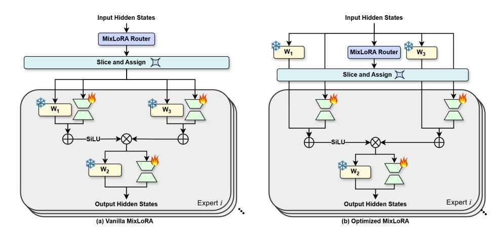
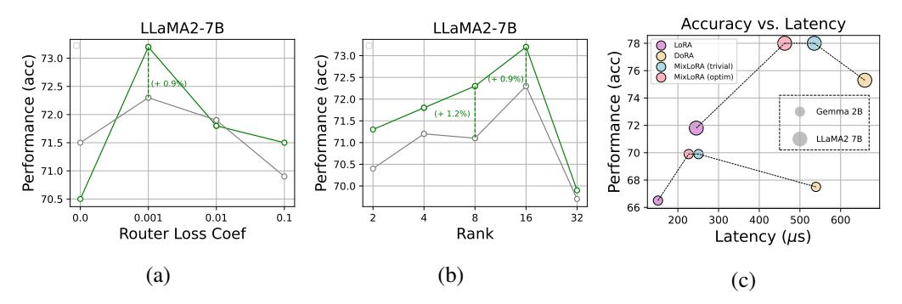
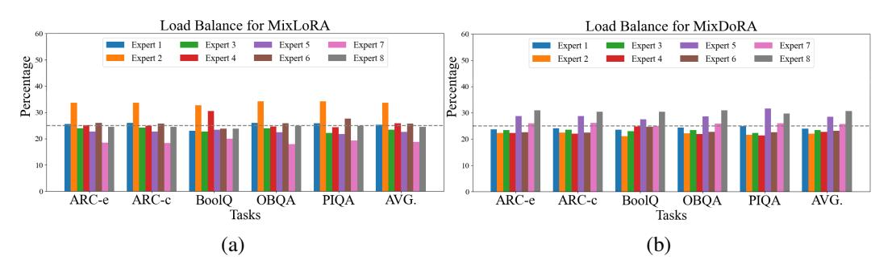

# 2 Related Works

PEFT For LLMs. Large Language Models (LLMs)[\[1;](#page-10-0) [2;](#page-10-1) [3;](#page-10-2) [4;](#page-10-3) [5\]](#page-10-4) have demonstrated remarkable capabilities in NLP tasks. Following this advancement, instruction finetuning [\[6;](#page-10-5) [7;](#page-10-6) [8\]](#page-11-0) has further enabled LLMs to understand human intentions and follow instructions, serving as the foundation of chat systems [\[42;](#page-12-16) [43\]](#page-12-17). However, as the size of LLMs scales up, finetuning them becomes a process that is time-consuming, and memory-intensive. To mitigate this issue, various studies explore different approaches: parameter-efficient finetuning (PEFT)[\[44\]](#page-13-0), distillation[\[45;](#page-13-1) [46\]](#page-13-2), quantization [\[47;](#page-13-3) [48\]](#page-13-4), pruning [\[49;](#page-13-5) [50\]](#page-13-6), etc. LoRA [\[15\]](#page-11-7), leveraging low-rank matrices to decompose linear layer weights is one of the most popular PEFT methods, thus enhancing model performance without introducing any additional computational overhead during inference. For instance, VeRA [\[51\]](#page-13-7) incorporate learnable scaling vectors to adjust shared pairs of frozen random matrices across layers. Furthermore, FedPara [\[52\]](#page-13-8) concentrates on low-rank Hadamard products for federated learning scenarios. Tied-Lora [\[53\]](#page-13-9) implement weight tying to further reduce the number of trainable parameters. AdaLoRA [\[54\]](#page-13-10) employ Singular Value Decomposition (SVD) to decompose matrices and prune less significant singular values for streamlined updates. DoRA [\[19\]](#page-11-11) decomposes pre-trained weights into two components, magnitude and direction, and utilizes LoRA for directional updates during fine-tuning, thereby efficiently reducing the number of trainable parameters.

Mixture-of-Experts. The concept of Mixture-of-Experts (MoE) [\[55\]](#page-13-11) dates back to as early as 1991, introducing a novel supervised learning approach involving multiple networks (experts), each specialized in handling a subset of training examples. The modern incarnation of MoE modifies the traditional feed-forward sub-layer within transformer blocks by incorporating sparsely activated experts, thereby enabling substantial increases in model width without a corresponding surge in computational demands. Various MoE architectures have emerged, distinguished by their sampling

1GitHub: <https://github.com/TUDB-Labs/MixLoRA>

Figure 2: The architecture of MIXLORA transformer block. MIXLORA consists of n experts formed by an original FFN sublayer combined with different LoRAs, where the weights of the FFN sublayer are shared among all experts.

strategies and routing mechanisms. Building on this evolution, LLaVA-MoLE [56] effectively routes tokens to domain-specific experts within transformer layers, mitigating data conflicts and achieving consistent performance gains over plain LoRA baselines. For other MoE based methods, MoRAL [23]addresses the challenge of adapting LLMs to new domains/tasks and enabling them to be efficient lifelong learners. LoRAMoE [26] integrates LoRAs using a router network to alleviate world knowledge forgetting. PESC [25] transitions dense models to sparse models using a MoE architecture, reducing computational costs and GPU memory requirements. MoE-LoRA [24] propose a novel parameter-efficient MoE method with Layer-wise Expert Allocation (MoLA) for Transformer-based models. MoCLE [27] proposes a MoE architecture to activate task-customized model parameters based on instruction clusters. As for ours, we integrate LoRAs as stochastic experts, reducing computational cost while expanding model capacity and enhancing LLMs' generalization ability.

## 3 MIXLORA

In this section, we first introduce the foundational concepts of LoRA and MoEs in Section 3.1 and the architectural design of MIXLORA in Section 3.2. Then, we explain how we optimize the performance of MIXLORA for model training and inference in Section 3.3,.

#### 3.1 Preliminaries

**LoRA.** LoRA only tunes the additional adaptation parameters and replaces the original weight update. A LoRA block consists of two matrices,  $\mathbf{B} \in \mathbb{R}^{d_1 \times r}$  and  $\mathbf{A} \in \mathbb{R}^{r \times d_2}$ , where  $d_1$  and  $d_2$  denote the dimensions of the pretrained weights  $\mathbf{W}$  of the LLMs ( $\mathbf{W} \in \mathbb{R}^{d_1 \times d_2}$ ). The parameter r denotes the hidden dimension of Lora, with  $r \ll min(d_1, d_2)$ . Then, the updated weights  $\mathbf{W}'$  are calculated through:

$$W' = W + BA \tag{1}$$

**Mixture-of-Experts (MoE).** The MoE architecture is initially introduced to language models through GShard [57]. An MoE layer consists of n experts, denoted by  $\{E_i\}_{i=1}^n$ , along with a router R. The output  $\mathbf{h}'$  of an MoE layer for a given hidden states  $\mathbf{h}$  is determined by:

$$\mathbf{h}' = \sum_{i=1}^{n} R(\mathbf{h})_i E_i(\mathbf{h}). \tag{2}$$

Here,  $R(\mathbf{h})_i$  indicates the router's output for the *i*-th expert for selecting specific experts, and  $E_i(\mathbf{h})$  is the result from the *i*-th expert.

### 3.2 Architecture of MIXLORA

As shown in Figure 2, MIXLORA is constructed from two main parts. The first part involves constructing the sparse MoE block using the vanilla transformer block augmented with LoRAs. The second part utilizes a top-k router to assign each token from various tasks (such as ARC, OBQA, PIQA, etc.) to different expert modules. Given the input text is  $\mathbf{s} = (s_1, s_2, \dots, s_n)$  with label of  $\mathbf{y}$ . Let  $\mathbf{h}_i^{\ell} \in \mathbb{R}^{1 \times d}$  ( $1 \le i \le n, 1 \le \ell \le L$ ) denote the output hidden state of the i-th token at the  $\ell$ -th large language model (LLM) layer, where  $\ell$  is the total number of the LLM layers and  $\ell$  is the hidden dimension. The large language model consists of stacked multi-head self-attention (MSA) and feed-forward neural networks (FFN). Layer normalization (LN) and residual connections are applied within each block [58; 59]. Formally, the output  $\mathbf{h}^{\ell}$  of the  $\ell$ -th LLM layer in a normal transformers block is calculated via:

$$\mathbf{h}^0 = [s_1, s_2, \cdots, s_n],\tag{3}$$

$$\mathbf{z}^{\ell} = MSA(LN(\mathbf{h}^{\ell-1})) + \mathbf{h}^{\ell-1}, \quad \mathbf{h}^{\ell} = FFN(LN(\mathbf{z}^{\ell})) + \mathbf{z}^{\ell}$$
 (4)

MIXLORA Forward. MIXLORA constructs experts based on the LoRA technique [15]. MIXLORA utilizes LoRA to effectively store the updated parameters of each expert during fine-tuning, rather than employing LoRA solely for constructing each expert. This approach aligns MIXLORA more closely with existing pre-trained MoE models. In MIXLORA's MoE blocks, the base weights of these experts are shared from a single feed-forward network (FFN) of the dense model (as illustrated in Figure 2) to enhance both training and inference efficiency:

$$\mathbf{h}^{\ell} = MixLoRA(LN(\mathbf{z}^{\ell})) + \mathbf{z}^{\ell}$$
 (5)

$$MixLoRA(\mathbf{h}^{\ell}) = \sum_{k=1}^{K} R^{\ell}(\mathbf{h}^{\ell})_{k} E_{k}^{\ell}(\mathbf{h}^{\ell}), \quad E_{k}^{\ell}(\mathbf{h}^{\ell}) = \mathbf{W}^{\ell} \cdot \mathbf{h}^{\ell} + \mathbf{B}_{i}^{\ell} \mathbf{A}_{i}^{\ell} \cdot \mathbf{h}^{\ell}$$
(6)

where W is the pretrained weights of the FFN layer, which is shared by  $\{E_k\}_{k=1}^K$ ,  $R(\cdot)$  denotes the Top-K router we employed to select specific LoRA experts for different tokens and tasks and  $E_k(\cdot)$  represents k-th LoRA experts in the MIXLORA module. The role of MIXLORA is to replace the FFN layer of the dense models in Equation 5, and its key concept is to select different experts by the router for each token, where each expert is composed of a different LoRA and origin FFN layer (Equation 6).

**Top-K Router.** The Top-K router in an MoE layer determines the assignment of each token to the most suitable experts [57]. The router is a linear layer that computes the probability of the input token  $\mathbf{x}_i$  being routed to each expert:  $\mathbf{W}_r(s)$ . Within the sparse transformer block, this router activates the most appropriate LoRA experts based on the input tokens. It leverages the softmax activation function to model a probability distribution over the experts. The router's weights  $\mathbf{W}_r$  are the trainable parameters of the routing network. As shown in Figure 2, a top-2 gate router is employed in our design, which chooses the best two experts from n available  $\{E_k\}_{k=1}^K$  for each input token  $\mathbf{x}_i$ :

$$R^{\ell}(\mathbf{h}_{i}^{\ell}) = \text{KeepTop-2}(\text{Softmax}(\boldsymbol{W}_{r}^{\ell} \cdot \mathbf{x}_{i})). \tag{7}$$

During inference, the top-k gate router dynamically selects the best k experts for each token. Through this mechanism, the mix-experts and the router work in tandem, enabling the experts to develop varied capacities and efficiently handle diverse types of tasks.

**Experts Load Balance.** Unbalanced load of experts is a significant challenge for MoEs. This is because some experts tend to be chosen more frequently by the top-k routers [34]. To encounter this load imbalance, we apply load balancing loss to mitigate the unbalanced load for experts when training. Inspired by Switch Transformers [60], we calculate the auxiliary loss and add it to a total loss. Given N experts indexed by i=1 to N and a batch B with T tokens, the auxiliary loss is computed as following:

$$\mathcal{L}_{\text{aux}} = a \cdot N \cdot \sum_{i=1}^{N} \mathcal{F}_i \cdot \mathcal{P}_i, \tag{8}$$

Figure 3: Comparison of the forward propagation processes: (a) the process in a vanilla MIXLORA MoE block; (b) the optimized process that shares computation results of W1 and W3 to reduce computational complexity.

$$\mathcal{F}_i = \frac{1}{T} \sum_{x \in B} \mathbb{1}\{\operatorname{argmax}_k R(x)_k = i\}, \mathcal{P}_i = \frac{1}{T} \sum_{x \in B} R(x)_i. \tag{9}$$

Where R(·) is the top-k router, Fi is the fraction of tokens dispatched to expert i and Pi is the fraction of the router probability allocated for expert i. The final loss is multiplied by the expert count N to keep the loss constant as the number of experts varies. Additionally, we utilize a = 10−2 as a multiplicative coefficient for auxiliary losses, which is large enough to ensure load balancing while remaining small enough not to overwhelm the primary cross-entropy objective.

Adding LoRA with Attention Layer. MIXLORA further extends its fine-tuning capabilities to encompass the attention layer. Previous studies, such as ST-MoE [\[32\]](#page-12-6), have suggested that fine-tuning the attention layer can significantly improve performance. To enhance the fine-tuning process with MIXLORA, we integrate LoRA adapters into the attention layer of the dense model (as shown in Figure [2\)](#page-3-1). Experimental results demonstrate that the MIXLORA model, fine-tuned with q, k, v, and o projection, consistently achieves superior average scores compared to the identical configuration trained solely with a sparse layer of mixture of LoRA experts (i.e., MIXLORA MoE).

## 3.3 Performance Optimization of MIXLORA

Reducing the Computational Complexity (I). As describes in previous section, each expert network in MIXLORA includes a shared frozen FFN and several LoRAs used for storing the updated parameters of each linear projection layer of experts during fine-tuning. This setup causes the computational complexity to vary based on the K settings of the router. This is because the tokenlevel Top-K router in MIXLORA sends each token to K experts for computation and then aggregates their residuals to produce the output. Taking LLaMA as an example, the FFN block of LLaMA consists of three linear projection weights: W1, W2, and W3, and the forward propagation process can be expressed as H = W2(SiLU(W1(x)) · W3(x)). As shown in Figure [3](#page-5-1) (a), each expert in MIXLORA has the same forward propagation process, except that every linear projection layer has a separate LoRA, and the input x of each expert is pre-allocated by the MIXLORA router. This introduces a notable overhead when processing long sequence inputs, posing a significant challenge for the performance optimization of MIXLORA: *How to reduce the computational complexity of* MIXLORA *while maintaining model accuracy?*

Considering we have shared the weights of the FFN block, we further share the computation results to reduce computational complexity. As shown in Figure [3](#page-5-1) (b), rather than pre-allocating the input sequence of the MIXLORA block, the efficient approach first sends the input directly to W1 and W3 of the FFN block in parallel, then slices the output of these linear projections by the routing weights output by the MIXLORA router. The computational complexity of the W2 projection cannot be reduced because its computation process depends on the outputs of the W1 and W3 projections. This approach significantly reduces one-third of the computational complexity of the MIXLORA

| Table 1: Comparison of different PEFT methods for single-task learning, using base models with |
|------------------------------------------------------------------------------------------------|
| different architectures and number of parameters. Reported results are accuracy scores.        |

| Model        | Method  | # Params | ARC-e | ARC-c | BoolQ | OBQA | PIQA | SIQA | HellaS | WinoG | AVG. |
|--------------|---------|----------|-------|-------|-------|------|------|------|--------|-------|------|
|              | LoRA    | 3.2%     | 71.9  | 43.2  | 62.1  | 71.4 | 80.9 | 71.4 | 84.4   | 46.8  | 66.5 |
| Gemma 2B     | DoRA    | 3.2%     | 71.5  | 46.2  | 62.2  | 70.4 | 81.6 | 71.9 | 85.4   | 50.4  | 67.5 |
| Gennia 2B    | MixLoRA | 4.3%     | 76.3  | 47.4  | 65.8  | 75.8 | 81.1 | 73.6 | 89.0   | 50.4  | 69.9 |
|              | MixDoRA | 4.3%     | 77.0  | 54.3  | 67.2  | 75.4 | 81.8 | 75.9 | 89.3   | 51.6  | 71.6 |
|              | LoRA    | 2.9%     | 73.8  | 50.9  | 62.2  | 80.4 | 82.1 | 69.9 | 88.4   | 66.8  | 71.8 |
| LLaMA-2 7B   | DoRA    | 2.9%     | 76.5  | 59.8  | 71.7  | 80.6 | 82.7 | 74.1 | 89.6   | 67.3  | 75.3 |
| LLawiA-2 /D  | MixLoRA | 2.9%     | 77.7  | 58.1  | 72.7  | 81.6 | 83.2 | 78.0 | 93.1   | 76.8  | 77.6 |
|              | MixDoRA | 2.9%     | 77.5  | 58.2  | 72.6  | 80.9 | 82.2 | 80.4 | 90.6   | 83.4  | 78.2 |
|              | LoRA    | 2.6%     | 89.0  | 75.7  | 67.2  | 85.0 | 80.7 | 78.3 | 74.2   | 75.3  | 78.2 |
| LLaMA-3 8B   | DoRA    | 2.6%     | 88.1  | 76.4  | 61.7  | 80.6 | 82.3 | 76.2 | 78.8   | 83.7  | 78.5 |
| LLawin-5 ob  | MixLoRA | 3.0%     | 86.5  | 79.9  | 75.0  | 84.8 | 87.6 | 78.8 | 93.3   | 82.1  | 83.5 |
|              | MixDoRA | 3.0%     | 87.7  | 78.9  | 76.8  | 86.9 | 83.4 | 80.1 | 94.6   | 84.2  | 84.1 |
|              | LoRA    | 2.4%     | 83.2  | 67.6  | 75.4  | 83.2 | 86.7 | 80.0 | 94.3   | 81.9  | 81.5 |
| LLaMA-2 13B  | DoRA    | 2.4%     | 83.1  | 67.7  | 75.1  | 84.5 | 87.8 | 80.1 | 94.8   | 82.4  | 81.9 |
| LLawiA-2 13D | MixLoRA | 2.5%     | 83.5  | 69.9  | 77.1  | 83.0 | 86.8 | 82.5 | 94.7   | 86.3  | 83.0 |
|              | MixDoRA | 2.5%     | 83.7  | 68.4  | 76.9  | 83.4 | 86.9 | 83.9 | 95.2   | 86.5  | 83.1 |

MoE block. In our experiments, the token computation latency of this approach was approximately 30% less than that of the vanilla MIXLORA, while maintaining the same model performance.

Optimizing Multi-MIXLORA Training and Inference (II). Inspired by the Multi-LoRA Optimization proposed by m-LoRA [33], we also optimized MIXLORA for multi-model high-throughput training and inference. Previously, we reduced the computational complexity of MIXLORA by eliminating duplicated calculations. When training and inferencing with two or more MIXLORA models, the multi-task inputs of these models are packed into a single batch to improve the training throughput. Specifically, we first send the batched inputs into  $W_1$  and  $W_3$  in parallel, and then slice the outputs of these linear projections using the separate routing weights of different MIXLORA models. This approach significantly reduces the memory usage of multiple MIXLORA models by sharing the same pre-trained model weights. In our experiments, the peak GPU memory usage of this approach was reduced by approximately 45% per model, while maintaining the same token computation latency. We describe our optimization algorithm in detail in Appendix A.7.

## 4 Experiments

### 4.1 Experimental Setup

**Datasets.** To assess MIXLORA, we conducted experiments on diverse commonsense reasoning datasets, including question-answer tasks (ARC [35], OpenBookQA [37], PIQA [61], SocialIQA [39]), a classification task (BoolQ [36]), a science completion task (Hellaswag [40]), and a fill-in-the-blank task (Winogrande [41]). These datasets evaluate LLMs on various challenges from scientific queries to commonsense inference. The performance of all methods was measured using the accuracy metric across all datasets. Details can be found in Appendix A.2.

**Baselines.** We employ commonly utilized language models: LLaMA-2 7B, LLaMA-2 13B, along with the recently introduced Gemma 2B, and LLaMA-3 8B for LoRA and DoRA, correspondingly. To maintain uniformity in parameter sizes across all PEFT methods, we instantiate LoRA and DoRA with r=80 and activate q,k,v,o in attention layers, as well as  $w_1,w_2,w_3$  in feed-forward layers, serving as our baseline techniques. Detailed hyperparameters can be found in Appendix A.1.

**Settings.** In order to comprehensively evaluate the effectiveness of our method, we apply it on the basis of LoRA and DoRA, which are labeled as  $\mathbf{MIXLORA}$  and  $\mathbf{MIXDORA}$  respectively in the experiment. Both  $\mathbf{MIXLORA}$  and  $\mathbf{MIXDORA}$  are configured with r=16, incorporating 8 experts and a top-2 router mechanism. We apply the q,k,v,o parameters on the attention layers, as well as the weights  $w_1,w_2,w_3$  on the feed-forward layers for the experts.

Table 2: Comparison of different PEFT methods for multi-task learning, using LLaMA2 7B as the base model. Single-Task (**ST**) setup refers to training and evaluating PEFT modules for each task, while Multi-Task (**MT**) setup refers to training on mixed tasks, followed by separate evaluation. Reported results are accuracy scores.

| PEFT Method | # Params (%) | ST/MT | ARC-e | ARC-c | BoolQ | OBQA | PIQA | AVG. |
|-------------|--------------|-------|-------|-------|-------|------|------|------|
| LoRA        | 2.9%         | ST    | 73.8  | 50.9  | 62.2  | 80.4 | 82.1 | 69.9 |
| 2010.1      | 2.9%         | MT    | 61.3  | 55.7  | 66.7  | 71.6 | 72.4 | 65.5 |
|             |              |       | -12.5 | 4.8   | 4.5   | -8.8 | 2.5  | -1.9 |
| DoRA        | 2.9%         | ST    | 76.5  | 59.8  | 71.7  | 80.6 | 82.7 | 74.3 |
| DUKA        | 2.9%         | MT    | 64.5  | 54.1  | 65.4  | 75.8 | 71.9 | 66.3 |
|             |              |       | -12.0 | -5.7  | -6.3  | -2.8 | -6.9 | -6.7 |
| MixLoRA     | 2.9%         | ST    | 77.7  | 58.1  | 72.7  | 81.6 | 83.2 | 74.7 |
| MIXLUKA     | 2.9%         | MT    | 76.6  | 64.2  | 71.2  | 81.6 | 82.7 | 75.3 |
|             |              |       | -1.1  | 6.1   | -1.5  | -    | -0.5 | 0.6  |
| MixDoRA     | 2.9%         | ST    | 77.5  | 58.2  | 72.6  | 80.9 | 82.2 | 74.3 |
| MIXDUKA     | 2.9%         | MT    | 76.9  | 63.4  | 71.8  | 82.2 | 80.4 | 74.9 |
|             |              |       | -0.6  | 5.2   | 0.8   | 1.3  | -1.8 | 0.6  |

Figure 4: Ablation studies on router loss coefficient (a) and rank (b) on LLaMA2 7B. (c) MIXLORA outperforms LoRA and DoRA without introducing significant latency on diverse commonsense tasks.

#### 4.2 Main Results

**Single-Task Setup.** Table 1 compares the performance of LoRA, DoRA, MIXLORA, and MIXDORA when employing these methods for fine-tuning on a single evaluation task. The results demonstrate that DoRA outperforms LoRA in most evaluations, and our methods **MIXLORA** and **MIXDORA** achieve commendable performance across all evaluation metrics. However, MIXDORA does not consistently exhibit superior performance compared to MIXLORA, only showing a small advantage in average accuracy. Additionally, in most evaluations, it can be observed that the fine-tuning results of MIXLORA and MIXDORA on LLaMA3 8B (83.5%, 84.1%) surpass the results on LLaMA2 13B (83.0%, 83.1%), while LoRA and DoRA leave a significant gap (8B: 78.2%, 78.5%; 13B: 81.5%, 81.9%). This indicates that our method effectively extends the model's capacity by building multiple experts on the FFN of the dense model.

Multi-Task Setup. Table 2 presents the results of LoRA, DoRA, MIXLORA, and MIXDORA with LLaMA2-7B in multi-task learning. In contrast to the single-task learning results shown in Table 1, during multi-task learning, we mixed training data from ARC, BoolQ, OBQA, and PIQA to train the model, followed by separate evaluations to investigate the generalization ability of each method. The results indicate that, compared to single-task learning, LoRA and DoRA exhibit degradation in average accuracy in multi-task learning (LoRA: -1.9%, DoRA: -6.7%), while MIXLORA and MIXDORA maintain nearly the same average accuracy. Additionally, we conducted multi-task learning on Gemma 2B, with results presented in Appendix A.3. MIXLORA and MIXDORA maintain their superiority, showing the lowest performance degradation. This suggests that MIXLORA and MIXDORA demonstrate stronger generalization ability and mitigate the issue of knowledge forgetting in multi-task learning compared to LoRA and DoRA.

Figure 5: Distribution of expert loadings. The average workload of the 8 experts in MIXLORA (a) and MIXDORA (b) during the evaluation of multi-task learning is depicted in the figure. The average standard deviation of MIXLORA is smaller than that of MIXDORA (0.0223 < 0.0328). However, both standard deviations are small enough, indicating that the workload of these experts is balanced.

## 4.3 Ablation Study

Analysis of Auxiliary Loss. We investigated the influence of different router loss coefficients on model performance with ARC, OpenBookQA, and BoolQ using LLaMA2-7B. As shown in Figure [4](#page-7-1) (a), results indicate that with the coefficient of 1e-3, MIXLORA achieves the highest average accuracy. Disabling router loss or using a higher coefficient results in lower average accuracy. This suggests that a reasonable router loss coefficient can help address the imbalance problem of experts, while a higher coefficient can impede model convergence during fine-tuning. Furthermore, MIXLORA imposes higher requirements on the rationality of the router loss coefficient compared to MIXDORA, indicating that MixDoRA is less sensitive to hyperparameter settings than MIXLORA. For example, when disabling router loss (coefficient = 0), MIXLORA lags behind MIXDORA by 1% in average accuracy, while surpassing MIXDORA by 0.9% in average accuracy when the coefficient is set to 1e-3.

To confirm the effectiveness of auxiliary loss, we also present the distribution of experts across diverse tasks for MIXLORA and MIXDORA in Figure [5.](#page-8-0) Intuitively, we can observe that the expert loads in all tasks are balanced, indicating that these experts are allocated to different tasks evenly. Specifically, both MIXLORA and MIXDORA achieves low average standard deviation (0.0223 and 0.0328). This verifies that the use of auxiliary load balance loss mitigates the imbalance problem of experts.

Analysis of Model Rank. We investigated the influence of different ranks on model performance with ARC, OpenBookQA, and BoolQ using LLaMA2-7B. As shown in Figure [4](#page-7-1) (b), both MIXLORA and MIXDORA consistently perform well from rank 2 to rank 16. However, the average accuracy of them both drops when rank is 32 due to convergence difficulties. Moreover, MIXDORA slightly lags behind MIXLORA at all ranks. This is because our method introduces more fine-tuning diversity through the MoE structure, making DoRA's weight decomposition method less effective when applied to our method (MIXDORA). For example, in our previous multi-task experiments on Tabel [2,](#page-7-0) DoRA often showed more degradation compared to MIXLORA and even LoRA.

Analysis of Computation Efficiency. To measure the computational overhead between LoRA, DoRA, and MIXLORA, we collected the token computation latency and peak GPU memory usage from PEFT for LoRA and DoRA, and from m-LoRA for MIXLORA during training and inference separately. The trainable parameters for all methods were strictly controlled to be equal both on Gemma 2B and LLaMA2 7B. Figure [4](#page-7-1) (c) shows the overall comparison of model accuracy and token computation latency between different model sizes (2B and 7B). Our method, MIXLORA, achieves the best accuracy in both Gemma 2B and LLaMA2 7B, while the token computation latency falls between LoRA and DoRA. The optimized MIXLORA (in Section [3.3\)](#page-5-0) shows significant improvement while maintaining the same model accuracy, especially with the larger 7B model. Details can be found in Appendix [A.4.](#page-15-1)

