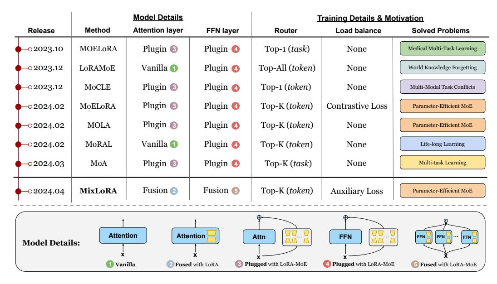

# MIXLORA: Enhancing Large Language Models Fine-Tuning with LoRA-based Mixture of Experts

Dengchun Li\*, Yingzi Ma\*, Naizheng Wang\*, Zhengmao Ye\*, Zhiyuan Cheng¹, Yinghao Tang\*, Yan Zhang³, Lei Duan\*, Jie Zuo\*, Cal Yang², and Mingjie Tang\*

\*Sichuan University, Chengdu, China

1Purdue University, West Lafayette, USA

2Emory University, Atlanta, USA

3Nanyang Technological University, Singapore

mikecovlee@163.com, {g19myz, pherenice1125, yezhengmaolove}@gmail.com,
cheng443@purdue.edu,, {yinghaotang2001, yanzhang.jlu}@gmail.com, {leiduan,
 zuojie}@scu.edu.cn, j.carlyang@emory.edu, tangrock@gmail.com

## **Abstract**

Fine-tuning Large Language Models (LLMs) is a common practice to adapt pretrained models for specific applications. While methods like LoRA have effectively addressed GPU memory constraints during fine-tuning, their performance often falls short, especially in multi-task scenarios. In contrast, Mixture-of-Expert (MoE) models, such as Mixtral 8x7B, demonstrate remarkable performance in multi-task learning scenarios while maintaining a reduced parameter count. However, the resource requirements of these MoEs remain challenging, particularly for consumergrade GPUs with less than 24GB memory. To tackle these challenges, we propose MIXLORA, an approach to construct a resource-efficient sparse MoE model based on LoRA. MIXLORA inserts multiple LoRA-based experts within the feed-forward network block of a frozen pre-trained dense model and employs a commonly used top-k router. Unlike other LoRA-based MoE methods, MIXLORA enhances model performance by utilizing independent attention-layer LoRA adapters. Additionally, an auxiliary load balance loss is employed to address the imbalance problem of the router. Our evaluations show that MIXLORA improves about 9% accuracy compared to state-of-the-art PEFT methods in multi-task learning scenarios. We also propose a new high-throughput framework to alleviate the computation and memory bottlenecks during the training and inference of MOE models. This framework reduces GPU memory consumption by 40% and token computation latency by 30% during both training and inference.

### 1 Introduction

Instruction fine-tuning of Large Language Models (LLMs) [1; 2; 3; 4; 5] for various downstream tasks has achieved impressive proficiency in Natural Language Processing (NLP) [6; 7; 8]. As the scale of parameters increases, LLMs have been demonstrated to be able to identify complex linguistic patterns, thereby enabling the emergence of powerful cross-task generalization capabilities [9]. The paradigm of instruction tuning leads to a trade-off between the computational resources required and the performance achieved on downstream tasks, which has been a valuable facet.

To substantially reduce the computational and memory resources required by full parameter fine-tuning processes, Parameter-Efficient Fine-Tuning (PEFT) methods have emerged [10; 11; 12; 13; 14; 15]. Among these methods, Low-Rank Adaptation (LoRA) [15], a popular PEFT approach,

Figure 1: The timeline of public LoRA-MoE methods' release dates, including the detailed model information on the position of integration, how to train with the LoRA-MoE method (router and load balance), and the problems they aim to solve.

offers performance comparable to full fine-tuning across various downstream tasks while demanding less computational effort. This is achieved by introducing low-rank adaption matrices to simulate the gradient updates while keeping pre-trained model weights frozen. However, its performance still falls short of full fine-tuning [16; 17]. Recent studies, such as LoRA+ [18] and DoRA [19], aim to enhance the performance of LoRA by optimizing the parameter updating process. Despite these improvements, LoRA-based methods face challenges in handling multiple tasks simultaneously due to limited trainable parameters and the problem of catastrophic forgetting [20; 21], which hampers cross-task generalization in LLMs. To mitigate this, some approaches attempt to integrate additional components into existing methods. For instance, AdapterFusion [22] and LoRAHub [21] introduce task-specific LoRA modules or experts, combining knowledge into domain adapters through additional attention fusion and element-wise composition. However, these additional components often add complexity to the training process, limiting their applicability compared to simpler PEFT methods like LoRA and its variants.

A promising solution is to design an architecture that combines LoRA's resource-saving features with the versatility of MoE models. This approach involves adding multiple LoRA modules as experts in transformer sublayers (i.e., attention and feedforward layers) [23; 24; 20], using a router to assign experts to tokens [23; 25; 26; 27; 28; 20], and incorporating an expert balancing loss to prevent uneven token distribution [23; 25]. As shown in Fig. 1, most methods in this direction focus on solving specific-domain problems such as medical multi-task learning [28] and world knowledge forgetting [26]. Only MoELoRA [24] and MOLA [29] are proposed to enhance the general capability of multi-task learning for LLMs. However, they only focus on single-task learning while ignoring multi-task learning, leading to certain limitations. We observe that these LoRA-MoE models plug multiple LoRA modules into a single self-attention or FFN block to form the MoE structure (③) and ④ in Figure 1), while the high-performance pre-trained MoE models, such as Mixtral 8x7B [30], often use multiple FFN based expert networks during forward propagation. Moreover, research on vanilla transformers [31] indicates that employing MoE only on the FFN block can be more efficient than on both self-attention and FFN blocks, with fine-tuning the attention layer with LoRA can further enhance MoE models [32]. Additionally, these LoRA-MoE methods introduce multiple LoRAs within a single transformer block, providing opportunities to improve the computational efficiency using Multi-LoRA parallel computing techniques [33].

Inspired by these, we propose MIXLORA, which fuses multiple LoRAs with the shared FFN layer and employs them to store updated parameters for each expert during fine-tuning, thereby aligning it more with conventional MoE models such as Mixtral 8x7B [30]. Additionally, we employ LoRA, instead

of MoE, on the self-attention layer to further improve the performance of MIXLORA. Following the previous work [\[34\]](#page-12-8), we also employ an auxiliary load balance loss for MIXLORA to address the expert imbalance problem. Furthermore, we design a high-performance framework to optimize the computation process of multiple LoRA based experts in MIXLORA both for training and inference[1](#page-2-0) . As a result, this framework reduces the computational complexity of MIXLORA by 30%, and saves about 40% GPU memory usage when training or inferencing multiple MIXLORA models.

We validate the effectiveness of MIXLORA across a wide variety of tasks. For baselines, we choose the widely used PEFT method LoRA [\[15\]](#page-11-7) and the current state-of-the-art PEFT method DoRA [\[19\]](#page-11-11). Quantitative results demonstrate that MIXLORA consistently outperforms LoRA and DoRA in both single-task and multi-task learning scenarios. For single-task learning, MIXLORA achieves an average accuracy improvement of 5.8% compared to LoRA and 2.3% compared to DoRA on LLaMA-2 7B. In multi-task learning, MIXLORA significantly surpasses LoRA by 9.8% and DoRA by 9% in accuracy, while demonstrating less performance degradation compared to the baseline methods. In summary, our contributions in this paper are as follows:

- 1. We introduce MIXLORA, a parameter-efficient mixture-of-experts method that constructs multiple LoRA based experts and a frozen shared FFN block from a pre-trained dense model. This approach simplifies the creation of an efficient sparse mixture-of-experts model with limited resources, and enhances performance across various downstream tasks.
- 2. We implement a high-throughput framework for the training and inference process. By optimizing redundant overhead in the computation process, we achieve approximately a 30% reduction in the token computation latency of MIXLORA, and save 40% or more in GPU memory usage during both training and inference of multiple MIXLORA models on a single consumer-grade GPU with 24GB memory, using LLaMA2-7B in half precision.
- 3. We conduct comprehensive evaluations on several commonly used benchmarks, including ARC [\[35\]](#page-12-9), BoolQ [\[36\]](#page-12-10), OpenBookQA [\[37\]](#page-12-11), PIQA [\[38\]](#page-12-12), SIQA [\[39\]](#page-12-13), HellaSwag [\[40\]](#page-12-14) and Wino-Grande [\[41\]](#page-12-15). The results demonstrate that MIXLORA exhibits superior performance in handling various downstream tasks compared to existing fine-tuning methods. Specifically, MIXLORA increase the average accuracy by 5.8% on single-task evaluations and 9.8% on multi-task evaluations for LoRA with LLaMA2-7B.

