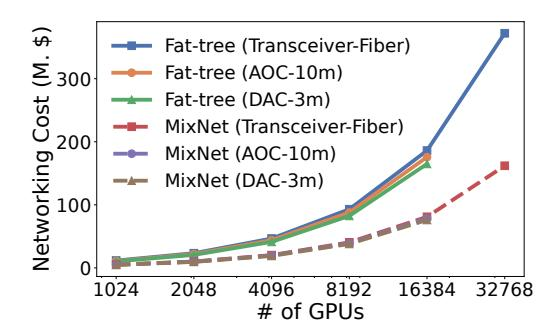
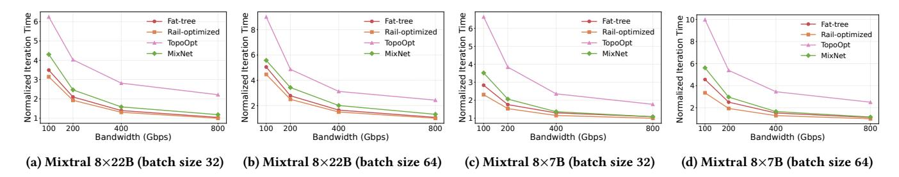
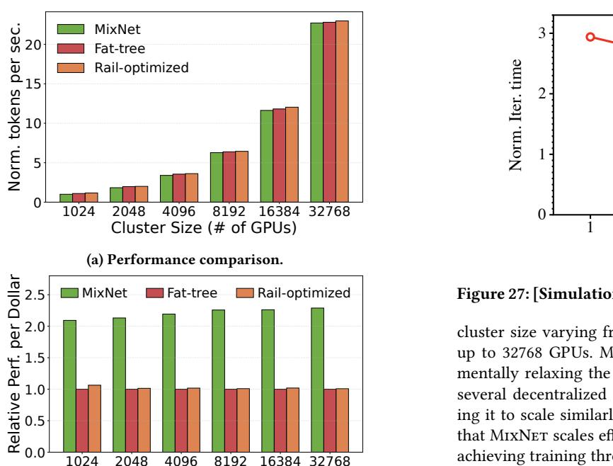
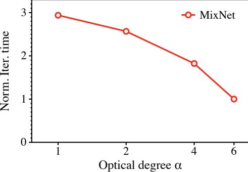
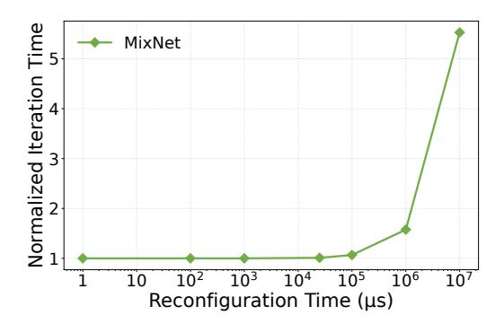

# D.1 Simulated MoE Models and Parallelization Strategies

We simulate the training process of four MoE models: Mixtral 8×22B [21], Mixtral 8×7B [23], Qwen-MoE [40] and DeepSeek-R1 [54]. For Mixtral 8×22B, we use a hybrid parallelism that combines an EP degree of 8, TP degree of 8, PP degree of 8 at a sequence length of 4096, and micro-batch size of 8. For DeepSeek-R1, we follow the default training parallelisms in [54] with 64-way EP and

| Link     | Trans-    | NIC (\$)               | Elec.     | OCS      | Patch     |
|----------|-----------|------------------------|-----------|----------|-----------|
| Band-    | ceiver    |                        | switch    | port     | panel     |
| width    | (\$)      |                        | port (\$) | (\$)     | port (\$) |
| 100 Gbps | 99 [1]    | 659 [29]               | 187 [107] | 520 [37] | 100 [42]  |
| 200 Gbps | 239 [2]   | 1079 [30]              | 374 [107] | 520 [37] | 100 [42]  |
| 400 Gbps | 659 [3]   | 1499 [31]              | 1090 [24] | 520 [37] | 100 [42]  |
| 800 Gbps | 1399 [13] | 2248 1 [31] | 1400 [32] | 520 [37] | 100 [42]  |

 $^1\,$  Conservatively estimated as 1.5 times the price of 400G NIC, as 800G products are not yet commercially available.

Table 4: Cost of network components.

Figure 24: [Simulation] Cost comparison of different EPS links at 400 Gbps bandwidth.

16-way PP. For other models, we reuse the same configurations in Table 1.

#### D.2 Cost Analysis Details

Table 4 lists the costs of network components used in §7.2. We reuse the prices for electronic switches at 100G, 200G as well as for NICs, OCS ports, and patch panel ports from TopoOpt [107], and we add the prices of transceivers, NICs, and electronic switch ports for 400 Gbps and 800 Gbps link accordingly. We also follow the same methodology as in TopoOpt when calculating the fiber costs.

#### **D.3** Different EPS Link Options

The OCS portion of MIXNET requires optical transceivers with pluggable fibers to allow optical switching. For the EPS part of MIXNET, especially short-reach rack-scale links between the servers and ToR switches, Direct Attach Copper (DAC) cables or Active Optical Cables (AOC) are more cost-effective alternatives to optical transceivers plus fibers (typically used for long-reach links). We analyze the cost implications of these link options in Figure 24. The results show that replacing the EPS links with DAC or AOC slightly reduce the costs for both fat-tree interconnect and MIXNET. Most importantly, the cost effectiveness of MIXNET is orthogonal to the choices of EPS links, and maintains significant cost advantages over fat-tree topology. For example, with 400 Gbps DAC cables option in a 4096-GPU cluster, MIXNET achieves 2.2× lower total cost compared to fat-tree topology.

Figure 25: [Simulation] Training speed ups of Mixtral models with large batch sizes.

Figure 26: [Simulation] Scalability analysis of MIXNET with different cluster sizes.

(b) Performance-cost comparison.

Cluster Size (# of GPUs)

## D.4 Training Speed Ups of Mixtral Models with Larger Batch Sizes

We further evaluate MixNet's performance with larger batch sizes using two Mixtral MoE models (Mixtral 8×7B and Mixtral 8×22B). For each model, we test batch sizes of 32 and 64 across varying network bandwidths (100-800 Gbps). As shown in Figure 25, MixNet consistently outperforms TopoOpt under all configurations. Specifically, MixNet achieves an average speedup of 1.8× for Mixtral-8x7B with a batch size of 32 and 2.0× with a batch size of 64, as training becomes more communication-intensive compared to the settings in Figure 12. Furthermore, we observe that as link bandwidth increases, MixNet's performance gradually approaches that of Fat-tree and Rail-optimized architectures.

#### D.5 Scalability

We demonstrate the scalability of MixNeT in Figure 26a. The Mixtral 8×7B model is evaluated at 400 Gbps bandwidth, with the

Figure 27: [Simulation] Impact of optical degree  $\alpha$  in MIXNET.

cluster size varying from 128 servers to 4,096 servers, covering up to 32768 GPUs. MIXNET demonstrates scalability by fundamentally relaxing the port limits of OCS through the design of several decentralized regionally reconfigurable domains, allowing it to scale similarly to a fat-tree topology. Our results show that MIXNET scales effectively with increasing number of GPUs, achieving training throughput comparable to both non-blocking Fat-tree and Rail-optimized topologies in terms of tokens processed per second. We further present the performance-cost comparison in Figure 26b, which shows that MIXNET consistently achieves a superior performance-cost trade-off—approximately 2× higher performance-per-dollar—compared to Fat-tree and Rail-optimized topologies as the number of GPUs increases. This suggests that MIXNET maintains the training cost-effectiveness even as the cluster size grows.

#### D.6 Impact of Optical Degree

We show the impact of the optical degree on MixNet's performance in Figure 27. We evaluate the Mixtral 8×22B model on a cluster of 128 servers with 100 Gbps link bandwidth. The optical degree  $\alpha$  in MixNet is varied to adjust its connectivity in the OCS. We reduce the bandwidth of each electronic port when increasing their number, to ensure a cost-equivalent comparison. Our findings show that, as the optical degree increases, MixNet further reduces iteration time, as more communication-intensive GPU pairs can be provisioned with dedicated high-bandwidth optical circuits.

#### D.7 Impact of Reconfiguration Latency

To investigate MixNet's sensitivity to OCS reconfiguration latency, we evaluate the Mixtral 8×22B model on a cluster of 128 servers

Figure 28: [Simulation] Impact of reconfiguration latency.

with 400 Gbps link bandwidth, varying the reconfiguration latency from 1 µs to 10 s. Figure 28 shows the normalized iteration time. MIXNET assumes the use of a millisecond-scale reconfigurable OCS (25 ms) in its current implementation. We observe that further reducing reconfiguration latency does not yield significant performance gains, as the OCS reconfiguration process can already be fully hidden during the computation phase. However, provisioned with microsecond-scale reconfigurable OCS, MIXNET can enable fully accurate topology reconfigurations for the first all-to-all communication in the forward pass (FP), resulting in marginal performance improvements in this specific phase. On the other hand, when the reconfiguration latency exceeds 1000 ms, performance degrades obviously, as the OCS reconfiguration may not be hidden and starts to block the training process. As a result, MIXNET does not perform well with second-scale reconfigurable OCS systems.