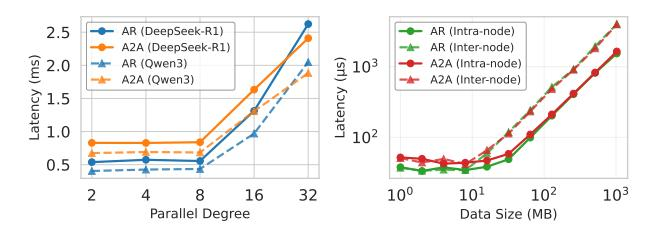

# A. Hybrid Parallelism for MoE Models

The core component of the MoE model primarily utilizes a hybrid TP and EP parallelism strategy. TP refers to the partitioning of model parameters across multiple nodes in a distributed system, initially proposed in Megatron-LM [5]. Each node holds a replica of a subset of the model parameters, and they are updated independently using AR. AR aggregates gradients

Fig. 3: Communication overhead of AR and A2A operators. The left subfigure shows the communication overhead for DeepSeek-R1 [2] and Qwen3 [3] models with different parallel degrees, while the right subfigure presents the results for intra-node and inter-node communication with different data sizes.

from all nodes and updates the parameters in a synchronous manner. This approach enables efficient training of large-scale models by distributing the workload across multiple nodes. Fig. 1a illustrates the execution process of TP, which sums up the hidden states after  $W^{\text{in}}$  and  $W^{\text{out}}$  projection. Fig. 1b shows the execution process of AR. It is usually divided into two operators: (1) Reduce Scatter (RS), (2) All Gather (AG), because it has lower communication overhead compared to direct implementations. In a Decoder-structured LLM, TP result synchronization is performed once during both the forward and backward propagation phases of the Attention and Feed-Forward Network (FFN) blocks. As a result, TP is generally unsuitable for inter-node implementation and is typically executed within a single node equipped with high-speed interconnect protocols.

EP refers to the partitioning of model computation across multiple experts in a MoE model, first explicitly proposed in Switch Transformer [6]. Each expert holds a replica of a subset of the model computation, and they are updated independently using A2A operators. A2A exchanges gradients between nodes and updates the parameters in an asynchronous manner. This approach enables efficient inference of large-scale MoE models by distributing the computation across multiple experts. In the DeepSeek-V3 technical report [1], researchers assert that the MoE block should fully adopt EP to ensure that each expert can process sufficiently large batch sizes. Fig. 2a illustrates the execution process of EP, where each token is sent to the device hosting the corresponding expert (i.e. Dispatch). Upon completing inference through the MLP layer, the results are returned along the original route (i.e. Combine). Fig. 2b shows the execution process of A2A. A2A communication can be implemented through various algorithms, among which Ring and Pairwise are commonly used. Both require N-1 rounds (N denotes the total number of participating devices) to complete the transmission and reception of all data.

