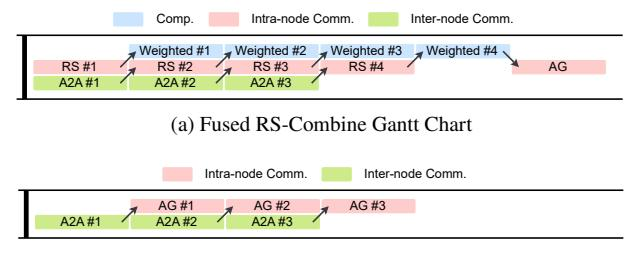

# B. Automatic Analyzer

- 1) Definition of Parallel Strategies: First of all, in order to facilitate a comprehensive investigation of various parallel strategies, we define a set of context-free grammars to represent the parallel strategies employed by a single Decoder Layer, as follows:
  - 1)  $strategy \longrightarrow Decoder \mid Decoder \mid PP = degree \mid$
  - 2)  $Decoder \longrightarrow Attention, MoE$
  - 3) Attention  $\longrightarrow$  block
  - 4)  $MoE \longrightarrow block$
  - 5)  $block \longrightarrow intra-node + inter-node \mid parallel$
  - 6)  $intra-node \longrightarrow parallel$
  - 7)  $inter-node \longrightarrow parallel$
  - 8)  $parallel \longrightarrow TP \mid EP (DP) = degree$
  - 9)  $degree \longrightarrow 2^k (k \in \mathbb{N})$

The above definition indicates that for each layer of the MoE, the Attention block and the MoE can adopt different parallel strategies. Specifically, the Attention block may utilize TP and DP, while the MoE block may employ TP and EP. It is important to note that we have introduced an additional constraint on the MoE block, namely that DP is typically not considered. This is due to the fact that each expert in the MoE model functions as an independent Multi-Layer Perceptron (MLP), making EP essentially equivalent to DP among the experts. Furthermore, each block may implement different parallel strategies based on the distinct network topologies present both within and between nodes. Furthermore, PP should be applied exclusively between the layers of the Decoder. The previously defined parallelism strategies are confined to a single layer of the Decoder so that they are orthogonal and complementary. The optimal parallel strategy defined herein is the output generated by the automatic analyzer. For example, according to the details presented in the DeepSeek-V3 technical report [1], the parallelism strategy for the prefill phase is TP=4 + DP=8, EP=32.

2) Analysis of Collective Communication Operators: First of all, we conduct a fine-grained analysis of the additional communication overhead resulting from the use of various parallel strategies. Without considering PP, we focus on a single layer of the Decoder in the MoE model.

AR: According to the principles of block matrix multiplication, after each rank computes its respective results, it is

TABLE I: Overhead of collective communication operators.

| Block     | Strategy | Collective Communication |                     | Communication per Round    | Algorithm | Rounds of Communication | Communication Domain     |
|-----------|----------|-----------------------------|---------------------|----------------------------|-----------|----------------------------|-----------------------------|
| Attention | TP       | AR                          | RS AG            | $O(bs \cdot \frac{h}{d})$  | Broadcast | 1                          | Intra-node                  |
| МоЕ       | TP       | AR                          | RS AG            | $O(bs \cdot \frac{h}{d})$  | Broadcast | 1                          | Intra-node                  |
|           | EP       | A2A                         | Dispatch Combine | $O(\frac{bs}{d} \cdot hk)$ | Pairwise  | d - 1                      | Intra-node or Inter-node |

Fig. 6: Trade-off between DP and EP during A2A communication. (a)  $d_{\rm DP}=d_{\rm EP}$  (Example: DP=4, EP=4). (b)  $d_{\rm DP}>d_{\rm EP}$  (Example: DP=4, EP=2). (c)  $d_{\rm DP}< d_{\rm EP}$  (Example: DP=2, EP=4). The yellow cross marks represent the redundancy parts to drop out.

necessary to sum these results to guarantee the accuracy of the final outcome. This requires performing an AR communication among the ranks. Although the dimension of the tensor  $X \in \mathbb{R}^{b \times s \times h}$ , the AR collective communication operator can be decomposed into RS and AG to reduce the communication volume. According to Table. I, the communication volume is  $O(bs \cdot \frac{h}{d})$  per round based on Broadcast algorithm. Based on the communication capabilities of modern computational nodes, this process entails full-duplex communication between pairs of devices, which can be accomplished in a single round. Therefore, the overhead of AR communication is theoretically as follows:

$$RS(size, degree) = AG(size, degree) \propto \frac{size}{degree}$$
 (1)

$$AR(size, degree) = RS(\frac{size}{degree}, degree) + AG(\frac{size}{degree}, degree)$$
(2)

**A2A**: According to the routing mechanism of the MoE models, each token is assigned to its corresponding activated expert for inference. This requires the use of A2A communication to exchange the hidden states among the experts. According to Table I, the communication volume is  $O(\frac{bs}{d} \cdot hk)$  per round based on Pairwise algorithm, where k denotes the top-k experts

activated. The Pairwise algorithm requires d-1 rounds to complete the communication process. Therefore, the overhead of A2A communication is theoretically as follows:

A2A(size, degree) 
$$\propto \frac{\text{size}}{\text{degree}} \times (\text{degree} - 1)$$
 (3)

- 3) Trade-off between DP and EP: Based on the formal definition of parallel strategies presented in §III-B1, an important issue is the integration of DP from the Attention block and EP from the MoE block. Based on the relationships between the parallel degrees, three distinct cases can be identified as follows:
  - $d_{\rm DP} = d_{\rm EP}$ : This case represents the most balanced and easily implementable situation, in which the DP rank of the Attention block corresponds one-to-one with the EP rank of the MoE block. In this case, all devices within the communication group engage in A2A communication, as shown in Fig. 6a.
  - $d_{\rm DP} > d_{\rm EP}$ : A smaller  $d_{\rm EP}$  results in redundancy in expert weights, incurring additional memory overhead to enhance DP degree and consequently improve system throughput. In this case, a total of  $\frac{d_{\rm DP}}{d_{\rm EP}}$  communication groups perform A2A communication in parallel, with each group comprising  $d_{\rm EP}$  devices, as shown in Fig. 6b.
  - $d_{\mathrm{DP}} < d_{\mathrm{EP}}$ : A smaller  $d_{\mathrm{DP}}$  results in redundancy in hidden states and lower throughput; however, this is mitigated by an effective dropping strategy that reduces communication overhead. In this case, a total of  $\frac{d_{\mathrm{EP}}}{d_{\mathrm{DP}}}$  communication groups perform A2A communication in parallel, with each group comprising  $d_{\mathrm{DP}}$  devices, as shown in Fig. 6c.

Based on the aforementioned analysis, MixServe will automatically manage trade-offs between DP and EP, considering the specified latency and throughput requirements while adhering to memory constraints.

4) Token Generation Latency: Aside from embedding and sampling, the latency associated with generating a single token consists of three components: computational latency, communication latency, and an additional queuing latency induced by request contention at the serving system.

**Computational Latency**: MixServe analyzes and predicts computational cost under hybrid parallelism. The computational latency of each rank can be expressed as follows:

$$\tau(d_{\text{TP}}, d_{\text{EP}}, d_{\text{DP}}) \propto \frac{\Psi}{d_{\text{TP}} \cdot d_{\text{EP}}} \cdot \frac{b}{d_{\text{DP}}} \cdot sh$$
(4)

**Communication Latency**: According to the analysis in §III-B2 and §III-B3, the communication latency of each rank can be expressed as follows:

 $^{3}b$ : batch size, s: sequence length, h: hidden dimension.

Fig. 7: An example of TP-EP hybrid parallelism. Assume that we have a 2-node cluster (*i.e.*  $n_{\text{node}} = d_{\text{DP}} = 2$ ) with 4 NPUs each (*i.e.*  $n_{\text{proc}} = d_{\text{TP}} = 4$ ). (a) MoE weights partition. For Attention blocks, model weights are partitioned by intra-node TP and by inter-node DP. For MoE blocks, model weights are partitioned by intra-node TP and by inter-node EP. (b) Distributed MoE inference. Activations are partitioned by inter-node DP with dimension of batch. At the output of MoE blocks, activations are communicated by RS, combine A2A and AG operators.

$$\begin{split} &\lambda(d_{\text{TP}}, d_{\text{EP}}, d_{\text{DP}}) \\ &= 2 \times \text{AR}(\frac{b}{d_{\text{DP}}} \cdot sh, d_{\text{TP}}) \\ &+ 2 \times \begin{cases} \text{A2A}(\frac{b}{d_{\text{DP}}} \cdot shk, d_{\text{EP}}) & \text{if } d_{\text{DP}} \ge d_{\text{EP}} \\ \text{A2A}(\frac{b}{d_{\text{EP}}} \cdot shk, d_{\text{DP}}) & \text{else} \end{cases} \end{split} \tag{5}$$

Notice that when  $d_{\rm DP} < d_{\rm EP}$ , the hidden states exhibits  $\frac{d_{\rm EP}}{d_{\rm DP}}$  times redundancy within DP groups, as shown in Fig. 6c illustrated in §III-B3. In Eq. (5), the batch size is specified as  $\frac{b}{d_{\rm EP}}$  because  $\frac{b}{d_{\rm EP}} = \frac{b}{d_{\rm DP}}/\frac{d_{\rm EP}}{d_{\rm DP}}$ .

Service Latency per Token: Combining computation and

**Service Latency per Token**: Combining computation and communication, the service latency for generating one token through an l-layer Decoder is

$$\Delta t_{\text{svc}} = l[\tau(d_{\text{TP}}, d_{\text{EP}}, d_{\text{DP}}) + \lambda(d_{\text{TP}}, d_{\text{EP}}, d_{\text{DP}})] + (d_{\text{PP}} - 1) \cdot P2P(\frac{b}{d_{\text{DP}}} \cdot sh)$$
(6)

Here, P2P denotes the point-to-point (P2P) communication latency induced by PP.

**Queuing Latency**: In practical online serving, token generation requests arrive stochastically and may queue before being served. We model the serving system as a queue with arrival rate  $\lambda_a$  (tokens per second) and service rate  $\mu = 1/\Delta t_{\rm syc}$ .

For analytical tractability, we adopt an M/M/1 approximation. Under the stability condition  $\rho = \lambda_a/\mu < 1$ , the expected queuing delay is given by

$$W_q = \frac{\rho}{\mu(1-\rho)} = \frac{\lambda_a}{\mu(\mu - \lambda_a)} \tag{7}$$

This term captures the contention-induced waiting time caused by concurrent requests, which becomes significant as system utilization approaches saturation.

**Constraints**: The constraints primarily stem from the limitations imposed by NPU memory, which encompasses two components: model weights and the K/V cache. Assuming that the maximum NPU memory for a single NPU is M, it is

approximated that the model weights  $\Psi$  are primarily composed of Attention blocks and MoE blocks, with a total of l layers in the Decoder.

$$\frac{\Psi_{\text{Attn}}}{d_{\text{TP}}} + \frac{\Psi_{\text{MoE}}}{d_{\text{EP}}d_{\text{TP}}} + 2bsh \cdot \frac{l}{d_{\text{PP}}} < M \tag{8}$$

5) Performance Indicators: In existing evaluations, performance indicators such as TTFT, ITL, and throughput are typically defined based on empirical measurements collected from the serving system. While these observed metrics faithfully reflect end-to-end behavior, they conflate architectural factors with workload-dependent effects. To complement empirical evaluation, we further introduce theoretically estimated performance indicators derived from the latency model in §III-B4, enabling principled analysis and optimization.

Time to First Token (TTFT): TTFT is defined as the time taken to generate the first token after receiving a request, which reflects the performance of the prefill stage. Under our queuing-aware latency model, TTFT consists of (i) the queuing delay experienced before service and (ii) the service latency required to generate the first token. Importantly, first-token generation differs from steady-state decoding in that the full prompt of length  $L_{\rm in}$  must be processed and the KV cache initialized. Therefore, the theoretically estimated TTFT is defined as:

$$TTFT = W_q + \Delta t_{\text{svc}}^{\text{prf}} = W_q + \Delta t_{\text{svc}} \Big|_{s=L_{\text{in}}}$$
 (9)

**Inter-Token Latency (ITL)**: ITL is defined as the average time interval between the generation of two consecutive tokens, which reflects the performance of the decode stage. In this phase, previously computed keys and values are reused via the KV cache, and each iteration only processes a single newly generated token. As a result, the theoretical ITL corresponds to the steady-state per-token service latency:

$$ITL = \Delta t_{\text{svc}}^{\text{dec}} = \Delta t_{\text{svc}} \Big|_{s=1}$$
 (10)

Fig. 8: An example of fused AR-A2A communication algorithm. Assume that we have a 4-node cluster with 4 GPUs each. Steps 1-5 illustrates how hidden states are synchronized by intra-node TP and inter-node EP.

**Throughput:** We model throughput at the service level by jointly accounting for both the prefill stage and the steady-state decoding stage. For a request with input length  $L_{\rm in}$  and output length  $L_{\rm out}$ , the expected service time is:

$$\Theta = \frac{L_{\rm in} + L_{\rm out}}{W_q + \Delta t_{\rm svc}^{\rm prf} + L_{\rm out} \cdot \Delta t_{\rm svc}^{\rm dec}}$$
(11)

## C. Hybrid TP-EP Partitioner

1) Hybrid TP-EP Design: Fig. 7 illustrates a simple design of hybrid TP-EP. In this example, we assume that there is a 2-node cluster (i.e.  $n_{\text{node}} = d_{\text{DP}} = 2$ ) with 4 NPUs each (i.e.  $n_{\text{proc}} = d_{\text{TP}} = 4$ ). The Attention blocks are partitioned by intra-node TP and by inter-node DP, while the MoE blocks are partitioned by intra-node TP and by inter-node EP. Considering that the hybrid TP-EP involves communication between two distinct communication groups, MixServe has implemented fine-grained optimizations on the communication process. Specifically, MixServe decouples the AR of the TP group into RS and AG, and reorganizes the A2A of the EP group, ultimately forming the RS-A2A-AG communication process. Correspondingly, MixServe injects the specified parallel strategy into the model's weight loader through the partitioner.

2) Theoretical Analysis of Communication: Existing serving systems commonly utilize EP entirely within the MoE blocks, while TP is used in the Attention blocks in intra-node. Assuming a cluster of  $n_{\text{node}}$  nodes, each with  $n_{\text{proc}}$  NPUs, the parallel strategy is defined as TP =  $n_{\text{proc}}$  + DP =  $n_{\text{node}}$ , EP =  $n_{\text{node}} \cdot n_{\text{proc}}$ . Thus, communication overhead of a Docoder layer is as follows:

(b) Fused AG-Dispatch Gantt Chart

Fig. 9: Gantt chart of fused AR-A2A communication algorithm. (a) Fused RS-Combine communication algorithm. (b) Fused AG-Dispatch communication algorithm. Both of them facilitate the overlapping of intra-node and inter-node communication.

$$\lambda_{\text{EP}} = \text{AR}(bsh, n_{\text{proc}}) + 2 \times \text{A2A}(bshk, n_{\text{pode}})$$
(12)

The hybrid TP-EP parallelism decouples and reorganizes AR and A2A, resulting in a reduction of the per-unit communication volume of the Combine stage, as well as a decrease in communication scale both intra-nodes and inter-nodes. Considering the impact of network topology and the interconnection methods between nodes and NPUs, pure TP or EP is often constrained by inter-node bandwidth, which prevents the optimization of the overall communication group's efficiency. When  $n_{\rm proc} = d_{\rm TP}$  and  $n_{\rm node} = d_{\rm EP}$ , the TP group and EP are precisely allocated to intra-nodes and inter-nodes. The parallel strategy of MixServe is defined as TP =  $n_{\rm proc}$  + DP =  $n_{\rm node}$ , TP =  $n_{\rm proc}$  + EP =  $n_{\rm node}$ . The communication overhead at this stage is as follows:

$$\lambda_{\text{mix}} = AR(bsh, n_{\text{proc}}) + AG(\frac{bshk}{n_{\text{proc}}}, n_{\text{proc}})$$

$$+ 2 \times A2A(\frac{bshk}{n_{\text{proc}}}, n_{\text{node}})$$
(13)

Certainly, MixServe is not restricted to merely identifying  $n_{\text{proc}} = d_{\text{TP}}$  and  $n_{\text{node}} = d_{\text{EP}}$  as the optimal parallel strategy; instead, it conducts theoretical analyses and predictions for all parallel strategies that satisfy  $n_{\text{proc}} \cdot n_{\text{node}} = d_{\text{TP}} \cdot d_{\text{EP}}$ . Following the completion of the parallel strategy decision for MoE blocks, the parallel strategy for Attention blocks will be optimized in conjunction with the theoretical analysis presented in §III-B3. Consequently, the partitioner will output the optimal parallel strategy.

