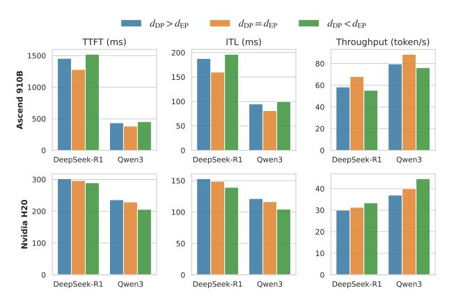

# B. Performance Evaluation

We established the range of request rates at 2, 4, and 8 requests per second (req/s), while also defining the maximum batch size as 16 and the maximum sequence length as 4096 tokens. Fig. 10 shows the performance evaluation of MixServe and baselines across different metrics.

TTFT: Fig. 10a illustrates that MixServe achieves significantly lower TTFT compared to baselines, indicating faster response times during the prefill stage. Specifically, MixServe achieves 1.08× ~ 3.80× acceleration in TTFT across different configurations and models. On the Ascend 910B cluster, MixServe demonstrates particularly impressive improvements: for DeepSeek-R1, it achieves 2.67× acceleration compared to vLLM TP+PP and 1.70× compared to vLLM DP+EP; for Qwen3-235B-A22B, it achieves 3.80× acceleration compared

Fig. 10: Performance evaluation of MixServe and baselines. The results are averaged over 10 runs, with error bars representing the standard deviation.

to vLLM TP+PP and  $1.32 \times \sim 1.93 \times$  compared to vLLM DP+EP configurations. On the H20 cluster, MixServe achieves  $1.08 \times \sim 1.23 \times$  acceleration compared to various baselines. The experimental results demonstrate that: (1) the hybrid TP-EP parallelism proposed by MixServe effectively reduces TTFT across diverse hardware platforms and model architectures; (2) the overlapping communication between intra-nodes and internodes significantly reduces overall communication overhead, resulting in improved P994 performance for MixServe.

ITL: Fig. 10b shows that MixServe demonstrates lower ITL, indicating faster token generation during the decode stage. The

4P99 refers to the 99th percentile latency, which means 99% of requests are served within this time.

Fig. 11: Performance comparison of MixServe with different DP and EP configurations.

hybrid TP-EP parallelism achieves  $1.03\times\sim1.66\times$  acceleration across all evaluated configurations. On the Ascend 910B cluster, MixServe reduces ITL from 227.33ms to 160.06ms (1.42× acceleration) for DeepSeek-R1 compared to vLLM TP+PP, and from 134.27ms to 81.1ms (1.66× acceleration) for Qwen3-235B-A22B. On the H20 cluster, MixServe achieves  $1.03\times\sim1.16\times$  acceleration compared to various baselines. Although the acceleration effect is less pronounced than TTFT due to the smaller communication volume in the decode stage, the consistent improvements demonstrate the effectiveness of the fused AR-A2A communication algorithm.

Throughput: Fig. 10c illustrates that MixServe achieves substantially higher throughput compared to baselines, allowing it to handle more requests simultaneously and improve overall system efficiency. The total token throughput improvements range from 5.2% to 50.3% across different configurations. On the Ascend 910B cluster, MixServe achieves 22.0% throughput improvement (from 100.61 to 122.72 tokens/s) for DeepSeek-R1 and 32.2% improvement (from 113.52 to 150.08 tokens/s) for Owen3-235B-A22B compared to vLLM TP+PP. On the H20 cluster, the improvements are even more substantial: 50.3% for DeepSeek-R1 (from 362.78 to 545.23 tokens/s) and 43.5% for Qwen3-235B-A22B (from 435.82 to 625.45 tokens/s) compared to vLLM TP+PP. When compared to other EP-based approaches, MixServe consistently achieves  $6.8\% \sim 24.5\%$  throughput improvements, demonstrating the effectiveness of the automatic parallel strategy selection and fused communication algorithm.

