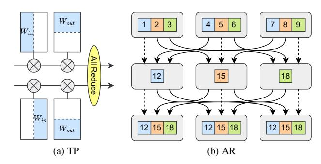
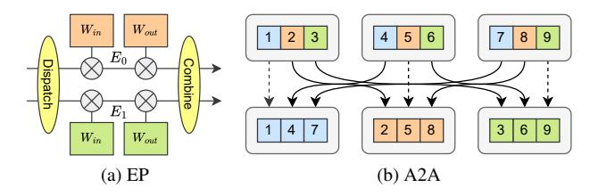

# I. Introduction

Mixture of Experts (MoE) models (*e.g.*, DeepSeek-V3 [1], DeepSeek-R1 [2], Qwen3 [3]) are emerging as the latest paradigm for Large Language Models (LLMs). Benifiting from the sparse activation mechanism, MoE models can scale up the model capacity to tens of billions, hundreds of billions, or even trillions of parameters, so that they can achieve competitive performance while maintaining inference-time computational efficiency. By leveraging a routing mechanism that activates only a subset of model parameters (experts) for each input token, MoE models achieve competitive accuracy while maintaining inference-time computational efficiency. This sparse activation strategy enables MoE models to reach parameter counts in the tens of billions, hundreds of billions, or even trillions while keeping the activated parameters manageable.

However, the increasing scale and complexity of MoE models pose significant challenges for achieving efficient inference in real-world deployment scenarios. Due to their massive parameter counts, these models can only be deployed in multi-GPU or even multi-node & multi-GPU distributed environments, where communication becomes a critical performance bottleneck, especially inter-node communication. Although intra-node highspeed interconnect protocols (*e.g.*, NVLink) offer substantial bandwidth advantages, inter-node connections typically rely on protocols like InfiniBand or RoCE1 that provide bandwidth significantly lower than intra-node interconnects. The disparity in bandwidth necessitates that high-frequency or extensive internode communication must be minimized during the design of communication algorithms, as this has emerged as a significant bottleneck in distributed MoE model service systems.

Contemporary distributed MoE implementations primarily rely on two main parallelism strategies for handling the computational and communication demands: tensor parallelism (TP) using all-reduce (AR) operators, and expert parallelism (EP) using all-to-all (A2A) operators. TP distributes model parameters across multiple devices and requires frequent synchronization through AR operators, which typically performs well within a single node due to high-speed intra-node interconnects but scales poorly across nodes due to limited inter-node bandwidth. In contrast, EP distributes different experts across multiple devices and uses A2A operators to route tokens to their assigned experts, offering better inter-node scaling potential but often suffering from load imbalance and communication inefficiencies, especially when the parallel degree is high.

Building on these observations, current deployment strategies for MoE models typically adopt a hybrid approach: utilizing TP for the Attention blocks and EP for the MoE blocks, utilizing pipeline parallelism (PP) to shard the Decoders [4]. This division

\*Corresponding author.

is motivated by the fact that Attention blocks generally contain fewer parameters than MoE blocks, making them suitable for TP with manageable communication overhead. Meanwhile, data parallelism (DP) can be effectively implemented within the Attention blocks to improve overall system throughput. For instance, in the DeepSeek-V3 technical report [1], the authors advocate that MoE blocks should fully adopt EP to ensure that each expert can process sufficiently large batch sizes, thereby maximizing computational efficiency. However, existing parallel strategies suffer from the following critical limitations:

Lack of Systematic Theoretical Analysis. Existing parallel strategies are primarily based on empirical intuition and practical experience, lacking comprehensive theoretical analysis and systematic validation. These approaches fail to adequately consider the complex interplay between model hyperparameters, network topology, and hardware resource configurations.

Ineffective Exploitation of Communication Bandwidth Hierarchies. Most critically, current approaches do not effectively exploit the significant bandwidth disparities that exist between intra-node and inter-node communication channels. Current communication operators treat all communication uniformly, missing opportunities to optimize performance by leveraging the heterogeneous nature of distributed computing environments.

To address these fundamental communication and scalability challenges, we introduce MixServe, a novel automatic distributed serving system designed specifically for efficient deployment of MoE models. MixServe employs a systematic approach that begins by comprehensively evaluating the communication overhead associated with various parallel strategies, taking into account not only the hyperparameters of the MoE model but also the detailed configuration of network topology and hardware resources. Based on this analysis, MixServe automatically selects the most efficient parallel strategy for each specific deployment scenario.

The core innovation of MixServe lies in its TP-EP hybrid parallelism, implemented through a sophisticated fused AR-A2A communication algorithm. This algorithm strategically overlaps intra-node AR communication with inter-node A2A communication, effectively exploiting the bandwidth hierarchy present in modern distributed systems. By carefully orchestrating these overlapping communication patterns, MixServe minimizes overall communication latency while maintaining computational correctness. Our comprehensive evaluation on large-scale MoE models, including DeepSeek-R1 and Qwen3, demonstrates that MixServe consistently achieves superior inference performance compared to state-of-the-art approaches. Specifically, MixServe delivers  $1.08 \times \sim 3.80 \times \text{acceleration}$ in time to first token (TTFT),  $1.03 \times \sim 1.66 \times$  acceleration in inter-token latency (ITL), and  $5.2\% \sim 50.3\%$  improvement in overall throughput. By bridging the gap between system-level efficiency and model scalability, MixServe enables practical, high-performance deployment of MoE models in real-world distributed serving environments. Our contributions can be summarized as follows:

• Automatic Serving System: We present MixServe, a

Fig. 1: Tensor Parallelism (TP) and All Reduce (AR) operators.

Fig. 2: Expert Parallelism (EP) and All To All (A2A) operators.

novel automatic distributed serving system that systematically evaluates communication overhead and automatically selects optimal parallel strategies based on model hyperparameters and network configurations, replacing empirical intuition with rigorous analysis.

- Theoretical Communication Analysis: We conduct comprehensive theoretical analysis of communication overhead for distributed MoE serving, deriving rigorous models for TP, PP, EP, and DP strategies that enable informed strategy selection based on hardware characteristics and network bandwidth hierarchies.
- Fused AR-A2A Communication Algorithm: We propose a novel TP-EP hybrid parallelism with fused AR-A2A communication algorithm that efficiently overlaps intra-node AR communication with inter-node A2A communication, significantly reducing overall communication latency.
- Performance Evaluation on Mainstream MoEs: We demonstrate substantial performance improvements on DeepSeek-R1 and Qwen3 models: 1.08× ~ 3.80× TTFT acceleration, 1.03× ~ 1.66× ITL acceleration, and 5.2% ~ 50.3% throughput improvement compared to existing approaches.

#### II. BACKGROUND & MOTIVATION

