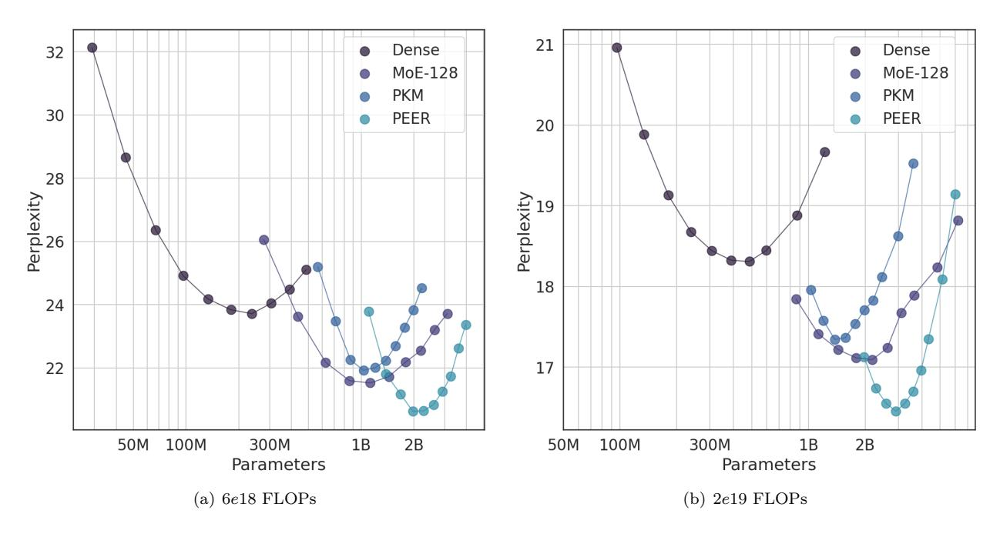
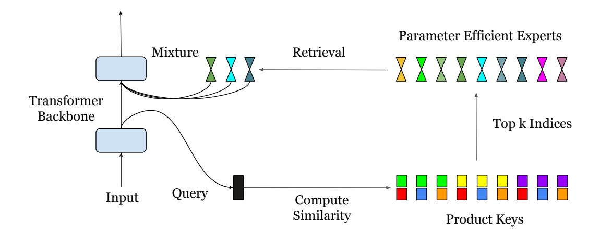

# **Abstract**

The feedforward (FFW) layers in standard transformer architectures incur a linear increase in computational costs and activation memory as the hidden layer width grows. Sparse mixture-of-experts (MoE) architectures have emerged as a viable approach to address this issue by decoupling model size from computational cost. The recent discovery of the finegrained MoE scaling law shows that higher granularity leads to better performance. However, existing MoE models are limited to a small number of experts due to computational and optimization challenges. This paper introduces PEER (parameter efficient expert retrieval), a novel layer design that utilizes the product key technique for sparse retrieval from a vast pool of tiny experts (over a million). Experiments on language modeling tasks demonstrate that PEER layers outperform dense FFWs and coarse-grained MoEs in terms of performance-compute trade-off. By enabling efficient utilization of a massive number of experts, PEER unlocks the potential for further scaling of transformer models while maintaining computational efficiency.

Figure 1: Isoflop comparison on the C4 dataset between PEER and other baselines with two different FLOP budgets (6*e*18 and 2*e*19 FLOPs). The *x* axis is in log scale.

## **1 Introduction**

The past few years have seen the power of scaling [\(Kaplan et al., 2020;](#page-10-0) [Hoffmann et al., 2022\)](#page-10-1): increasing the number of parameters, amount of training data, or the computational budget has proven to be a reliable way to improve model performance. Notably, feedforward (FFW) layers, responsible for storing factual knowledge [\(Geva et al., 2021;](#page-10-2) [Dai et al., 2022\)](#page-9-0), account for two-thirds of the total parameters in a transformer. However, one drawback of these dense FFWs is that their computational footprint (FLOPs and device memory consumption) is linearly proportional to their parameter count.

To break the coupling between computational cost and parameter count, many recent works [\(Shazeer et al.,](#page-11-0) [2017;](#page-11-0) [Lepikhin et al., 2020;](#page-11-1) [Fedus et al., 2022;](#page-10-3) [Zhou et al., 2022\)](#page-11-2) have adopted the Mixture-of-Experts (MoE) architecture, which uses a set of sparsely activated expert modules (often FFWs) in place of a single dense FFW. [Clark et al.](#page-9-1) [\(2022\)](#page-9-1) studied the scaling law of MoE language models and showed that increasing the number of experts is an effective way to improve performance without increasing the inference cost. However, their experiments showed that the efficiency gains provided by MoEs plateau after a certain model size is reached. More recently, [Krajewski et al.](#page-10-4) [\(2024\)](#page-10-4) discovered that this plateau was caused by using a fixed number of training tokens. When the number of training tokens is compute-optimal, MoEs consistently outperform dense models in terms of FLOP efficiency. Moreover, they introduced granularity (the number of active experts) as a new scaling axis and empirically showed that using higher granularity improves performance. Extrapolating this fine-grained MoE scaling law suggests that continued improvement of model capacity will ultimately lead to a large model with high granularity, corresponding to an architecture of an immense number of tiny experts.

Beyond efficient scaling, another reason to have a vast number of experts is lifelong learning, where MoE has emerged as a promising approach [\(Aljundi et al., 2017;](#page-9-2) [Chen et al., 2023;](#page-9-3) [Yu et al., 2024;](#page-11-3) [Li et al.,](#page-11-4) [2024\)](#page-11-4). For instance, [Chen et al.](#page-9-3) [\(2023\)](#page-9-3) showed that, by simply adding new experts and regularizing them properly, MoE models can adapt to continuous data streams. Freezing old experts and updating only new ones prevents catastrophic forgetting and maintains plasticity by design. In lifelong learning settings, the data stream can be indefinitely long or never-ending [\(Mitchell et al., 2018\)](#page-11-5), necessitating an expanding pool of experts.

Although both efficient scaling and lifelong learning require MoE designs capable of handling a vast number of experts, to the best of our knowledge, the only architecture supporting more than ten thousands of experts is the Mixture of Word Experts (MoWE) [\(dos Santos et al., 2023\)](#page-10-5). However, MoWE is language-specific and uses a fixed routing scheme. Theoretical and empirical evidence [\(Clark et al., 2022;](#page-9-1) [Dikkala et al., 2023\)](#page-10-6) highlights the advantages of learned routers over non-trainable ones. Thus, an MoE design with a learned router scalable to over a million experts remains an open area for exploration.

This work introduces the Parameter Efficient Expert Retrieval (PEER) architecture, leveraging product key retrieval [\(Lample et al., 2019\)](#page-11-6) for efficient routing to an extremely large number of experts, decoupling computational cost from parameter count. This design demonstrates a superior compute-performance tradeoff in our experiments, positioning it as a competitive alternative to dense FFW layers for scaling foundation models. The main contributions of this work are:

- Exploration of Extreme MoE Setting: Deviating from the focus on a small number of large experts in previous MoE research, this work investigates the under-explored case of numerous tiny experts.
- Learned Index Structure for Routing: Demonstrating for the first time that a learned index structure [\(Kraska et al., 2018\)](#page-10-7) can efficiently route to over a million experts.
- New Layer Design: Combining product key routing with single-neuron experts, we introduce the PEER layer that expands layer capacity without significant computational overheads. Empirical results demonstrate its superior efficiency compared to dense FFW, coarse-grained MoEs and Product Key Memory (PKM) layers.
- Comprehensive Ablation Studies: We investigate the impact of different design choices of PEER such as number of experts, active parameters, number of heads and query batch normalization on language modeling tasks.

Figure 2: Illustration of the PEER layer. A PEER layer can be inserted in the middle of a transformer backbone or can be used to replace FFW layers. Given the state vector x from the previous layer, a query network q maps it to a query vector q(x), which is then compared with the product keys to compute the router scores and to retrieve the top k experts  $e_1, ..., e_k$ . After the retrieved experts make their predictions  $e_i(x)$ , their outputs are linearly combined using the softmax-normalized router scores as weights.

#### 2 Method

In this section, we introduce the Parameter Efficient Expert Retrieval (PEER) layer, which is a Mixture of Experts architecture using product keys (Lample et al., 2019) in the router and single-neuron MLPs as experts. Fig. 2 illustrates the computational process within a PEER layer.

**PEER Overview** Formally, a PEER layer is a function  $f: \mathbb{R}^n \to \mathbb{R}^m$  that consists of three parts: a pool of N experts  $\mathbb{E} := \{e_i\}_{i=1}^N$ , where each expert  $e_i: \mathbb{R}^n \to \mathbb{R}^m$  shares the same signature as f, a corresponding set of N product keys  $\mathbb{K} := \{k_i\}_{i=1}^N \subset \mathbb{R}^d$ , and a query network  $q: \mathbb{R}^n \to \mathbb{R}^d$  that maps the input vector  $x \in \mathbb{R}^n$  to a query vector q(x). Let  $\mathcal{T}_k$  denote the top-k operator. Given an input x, we first retrieve a subset of k experts whose corresponding product keys have the highest inner products with the query q(x).

$$\mathbb{I} = \mathcal{T}_k \left( \{ q(x)^T k_i \}_{i=1}^N \right)$$
