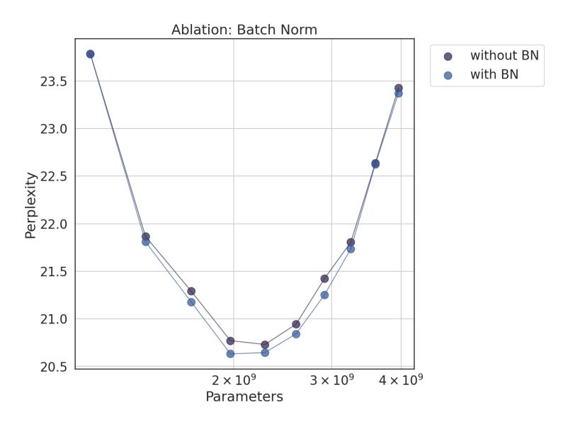

# **3.3 Ablations**

Varying the Number of Total Experts The models in the isoFLOP plot depicted in Fig. [1](#page-0-0) all have over a million (10242 ) experts. Here we conduct an ablation study on the effect of the number of experts *N*, which determines the total parameter count *P* in Eq. [9.](#page-3-0) We selected the model at the isoFLOP-optimal position and vary the number of experts (*N* = 1282 *,* 2562 *,* 5122 *,* 10242 ) in the PEER layer while keeping the number of active experts constant (*h* = 8*, k* = 16). The results are shown in Fig. [3](#page-6-0) (a). As can be seen, the isoFLOP curve interpolates between the PEER model with 10242 experts and the corresponding dense backbone without replacing the FFW layer in the middle block by a PEER layer. This demonstrates that simply increasing the number experts can improve model performance.

Varying the Number of Active Experts We also conducted an ablation study on the effect of the number of active experts *hk*, which equals the granularity *G* in Eq. [9.](#page-3-0) We systematically varied the number of

Figure 3: We conduct two ablation studies using the same PEER model configuration. In (a), we vary the total number of experts *N* while keeping the same number of active experts *hk* = 128. In (b), we vary the number of active experts *G* = *hk* by jointly changing *h* and *k* while keeping the total number of experts at *N* = 10242 .

active experts (*hk* = 32*,* 64*,* 128*,* 256*,* 512) while keeping the number of total experts constant (*N* = 10242 ). Furthermore, for a given *hk*, we jointly varied *h* and *k* to identify the optimal composition. The resulting isoFLOP curves, plotted over the number of heads (*h*), are shown in Fig. [3](#page-6-0) (b).

The results indicate that, within the range of values considered, higher *hk* generally leads to improved performance. Notably, the optimal *h* increases as *hk* increases. However, the performance gradually saturates, and increasing the number of active experts also increases device memory consumption and may necessitate additional accelerator devices. Thus in practice, the appropriate *hk* values should be selected based on the trade-off between performance, device number and computational resource requirements.

Table 2: KL and expert usage for different memory sizes, with and without query BN. Similar to the findings in PKM, using query BN results in a more balanced usage of the experts.

| Expert num N     | 16k   |       | 65k   |       | 262k  |       | 1M    |       |
|------------------|-------|-------|-------|-------|-------|-------|-------|-------|
| BatchNorm        | No    | Yes   | No    | Yes   | No    | Yes   | No    | Yes   |
| Perplexity       | 23.47 | 23.47 | 22.61 | 22.55 | 21.54 | 21.47 | 20.73 | 20.64 |
| Expert Usage (%) | 100.0 | 100.0 | 100.0 | 100.0 | 100.0 | 100.0 | 99.8  | 100.0 |
| Unevenness (↓)   | 0.45  | 0.30  | 0.63  | 0.44  | 0.97  | 0.66  | 1.52  | 1.06  |

Expert Usage and Query Batch Normalization Given the presence of over a million experts in the PEER layer, it is natural to inquire how many of these experts are actually selected during inference and whether their usage is evenly distributed. To analyze this, we kept an accumulated router score, denoted as *z* ′ P *i* = *x gi*(*x*) for each expert *ei* across all tokens *x* within the C4 validation set. Here *gi*(*x*) is the router score used to aggregate the expert output when token *x* is given as input, with *gi*(*x*) = 0 if expert *ei* is not selected. From these accumulated router scores, we can obtain an empirical probability distribution vector, denoted as *z* = *z* ′*/*||*z* ′ ||1, representing the distribution of all experts over the C4 validation set. Then we computed the following metrics proposed by [Lample et al.](#page-11-6) [\(2019\)](#page-11-6) to assess the usage and distribution of experts:

- *Expert Usage*: the fraction of experts retrieved during inference: #{*zi* ̸= 0}
- *Unevenness*: KL divergence between *z* and the uniform distribution: log(*N*) + P *i zi* log(*zi*)

where *N* is the number of total experts.

By default, we also added a batch normalization (BN) layer on top of the query network, as proposed by [Lample et al.](#page-11-6) [\(2019\)](#page-11-6) to increase the expert usage during training. Here we study the effect of adding this BN layer on the above-mentioned metrics.

Table [2](#page-6-1) presents the expert usage and unevenness for varying numbers of experts, with and without BN. We can see that even for 1M experts, the expert usage is close to 100%, and using BN can lead to more balanced utilization of the experts and lower perplexities. These findings demonstrate the effectiveness of the PEER model in utilizing a large number of experts.

Figure 4: Query BatchNorm Ablation. IsoFLOP curves of a PEER model with 1M experts on the C4 dataset, with and without query BatchNorm.

We additionally compared isoFLOP curves with and without BN. Fig. [4](#page-7-1) shows that the PEER model with BN generally achieves lower perplexities. While the difference is not significant, it is most pronounced around the isoFLOP-optimal region.

