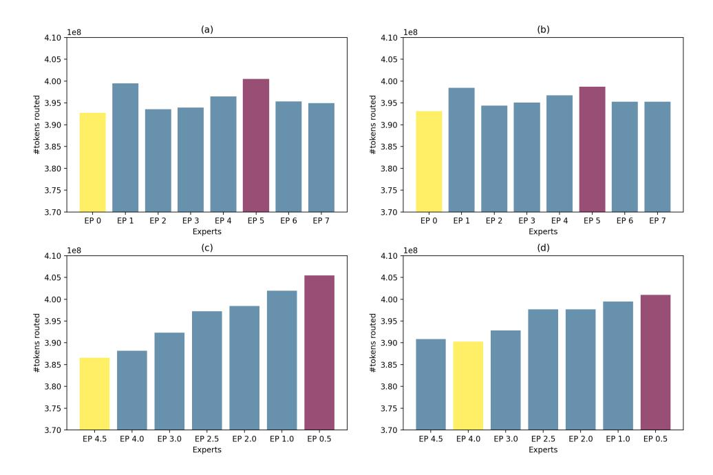

# 4.1 Experimental Setup

Models Our baseline MoE structure is based on the Llama 2 model [\(Touvron et al.,](#page-8-5) [2023\)](#page-8-5) with the dense FFNs layers replaced by expert layers. Table [1](#page-3-1) summarises the model architecture parameters. For the MoDSE setting, we adjust the expert sizes in baseline by modifying the dimensions of the hidden layers in 300M × 8 and 700M × 8 settings, as listed in Table [2.](#page-3-2) There are 8 experts grouped into 4 pairs, with the ratio to the input size as (4.5, 0.5), (4.0, 1.0), (3.0, 2.0), and (2.5, 2.5). We train byte pair encoding (BPE) [\(Sennrich et al.,](#page-8-6) [2016\)](#page-8-6) tokenizer with both English and Chinese datasets, and use it in the following experiments.

Training configurations We utilize the Adam optimizer [\(Kingma and Ba,](#page-7-5) [2017\)](#page-7-5), with hyperparameters β1 = 0.9, β2 = 0.95, eps = 1e − 8,

| Parameter  | 300M × 8 | 700M × 8 |  |  |  |  |
|------------|----------|----------|--|--|--|--|
| dim        | 1536     | 2048     |  |  |  |  |
| n_layers   | 8        | 12       |  |  |  |  |
| # heads    | 12       | 32       |  |  |  |  |
| # expert   | 8        | 8        |  |  |  |  |
| top k      | 2        | 2        |  |  |  |  |
| vocal_size | 30064    | 30064    |  |  |  |  |
| h          | 3840     | 5120     |  |  |  |  |

Table 1: MoE model architecture with 300M × 8 and 700M × 8 parameters, both with identical expert sizes.

| Model    | Expert size pairs          |
|----------|----------------------------|
| 300M × 8 | [(6912,768), (6144,1536),  |
|          | (4608,3072), (3840,3840)]  |
| 700M × 8 | [(9216,1024), (8192,2048), |
|          | (6144,4096), (5120,5120)]  |

Table 2: The list of expert pair sizes in 300M × 8 and 700M × 8 parameters.

weight decay = 0.1 and gradient clipping = 1.0. We use a cosine learning rate schedule [\(Loshchilov](#page-7-6) [and Hutter,](#page-7-6) [2017\)](#page-7-6), such that the initial learning rate is 2e-7, the warm-up update steps are 2000 and the minimal learning rate is 3e-5. We employ the ZeRO optimization [\(Rajbhandari et al.,](#page-8-7) [2020\)](#page-8-7) for distributed training. All experiments are carried out on clusters equipped with NVIDIA A800 GPUs. The A800 cluster features 8 GPUs per node, interconnected using NVLink and NVSwitch within nodes. Two nodes are used for the 300M × 8 setting, and 8 nodes are used for the 700M ×8 setting.

Datasets We collected 100B tokens training data from various reputable sources for pre-training. This dataset includes both English and Chinese language, and spans multiple fields, including CommonCrawl [\(Wenzek et al.,](#page-8-8) [2020\)](#page-8-8), code, academic papers, books, mathematics, and Q&A.

### 4.2 Main Results

Evaluations We evaluate models in downstream tasks using in-context learning including AGIEval [\(Zhong et al.,](#page-8-9) [2024\)](#page-8-9), MMLU [\(Hendrycks et al.,](#page-7-7) [2021a\)](#page-7-7), GSM8K [\(Cobbe et al.,](#page-7-8) [2021\)](#page-7-8), LAMBADA [\(Paperno et al.,](#page-7-9) [2016\)](#page-7-9), MATH [\(Hendrycks et al.,](#page-7-10) [2021b\)](#page-7-10), TriviaQA [\(Joshi et al.,](#page-7-11) [2017\)](#page-7-11), PIQA [\(Bisk](#page-7-12) [et al.,](#page-7-12) [2020\)](#page-7-12), SIQA [\(Sap et al.,](#page-8-10) [2019\)](#page-8-10), and INTENT from [Tech](#page-8-11) [\(2024\)](#page-8-11) which contains 43 different user intention classes. The model with identical expert sizes is used as the baseline, all the evaluation results are listed in Table [3.](#page-3-3)

| Benchmark      | Baseline | MoDSE |
|----------------|----------|-------|
| AGIEval (Acc.) | 26.2     | 28.1  |
| MMLU (Acc.)    | 26.5     | 29.9  |
| INTENT (Acc.)  | 13.6     | 16.5  |
| GSM8K (EM)     | 5.9      | 7.7   |
| LAMBADA (EM)   | 36.8     | 38.9  |
| MATH (EM)      | 0.8      | 2.6   |
| TriviaQA (EM)  | 5.2      | 8.3   |
| PIQA (EM)      | 53.1     | 57.6  |
| SIQA (EM)      | 42.9     | 60.9  |

Table 3: Comparison between MoE baseline and MoDSE on size of 700M × 8. The bold font indicates the better. With the same parameter, MoDSE achieves better performance than the baseline. All the tasks are fewshot in context learning, and GSM8k includes 8 shots examples and others include 5 shots examples.

Training convergence As shown in Figure [2,](#page-4-1) in both 300M × 8 and 700M × 8 settings, MoSDE demonstrates an earlier convergence and exhibits a lower cross-entropy loss value, compared to the baseline throughout the entire training process in both 300M × 8 and 700M × 8 settings. Additionally, MoSDE on both settings outperforms the baseline on the validation set.

We use the average hidden size of the chosen experts with 10B tokens data to represent the model workload. The experiment shows that the average workload across experts in MoSDE is 4045, compared to 3840 in the baseline. We also conduct experiments on 4045 as the same size as MoSDE, which corresponds to Baseline 105% in Figure [2.](#page-4-1) The result shows that the curve of Baseline 105% aligns closely with the original baseline. Thus, MoSDE shows better convergence features even without the benefits of a slightly larger workload capacity. We analyze the benefits of distinct expert sizes in the following section.

During training, the distribution of tokens routed to each expert in MoDSE becomes more and more balanced. As illustrated in Figure [3,](#page-5-0) the distribution is initially uneven, with smaller experts receiving more tokens and the largest expert receiving the fewest, as shown in Figure [3](#page-5-0) (c). By the end of the training process, as depicted in Figure [3](#page-5-0) (d), the distribution evens out, ensuring the workload balance described in Section [3.2.](#page-2-0)

Decoding efficiency We record the inference duration for both the baseline and MoDSE models during the evaluation of downstream tasks, with the

Figure 2: Training and validation loss curves for the 300M × 8 and 700M × 8 models, with cross-entropy loss values indicated on the curves.

results presented in Table [4.](#page-4-2) The inference times for both models are quite comparable. As illustrated in Figure [3](#page-5-0) (d) and the final table in Table [8,](#page-12-0) tokens are nearly uniformly distributed across different experts in the last training epoch. Given the expert-pair allocation strategy described in Section [3.2,](#page-2-0) the inference speeds of the baseline and MoDSE models should be similar.

| Benchmark | MoE       | MoDSE     |
|-----------|-----------|-----------|
| AGIEval   | 48s       | 59s       |
| MMLU      | 3min 26s  | 3min 27s  |
| INTENT    | 1min 31s  | 1min 34s  |
| GSM8K     | 20min 26s | 20min 43s |
| LAMBADA   | 40min44s  | 40min48s  |
| MATH      | 21min 21s | 21min 34s |
| TriviaQA  | 46min 53s | 48min 55s |
| PIQA      | 44min56s  | 43min34s  |
| SIQA      | 2min35s   | 2min36s   |

Table 4: The inference duration of the baseline and MoDSE models on downstream tasks. The AGIEval task contains 615 examples, the MMLU task contains 2341 examples, the INTENT task contains 741 examples and the rest tasks with 100 examples.

#### 4.3 Analysis on Token Routing

We further conduct the experiments on 10B tokens data, to analyze the choices of tokens. The statistics from the 2nd to the 7th epoch are listed in Appendix [A.](#page-9-0) The baseline model shows an even distribution of experts' workload. The ratio between the largest and the smallest number of tokens routed to the experts ranges from 1.2 to 3.0. The statistics for the MoDSE setting show a non-uniform distribution, with ratios larger than 3.0 appearing, particularly in the first 2 layers of the model and for the experts with the second largest probability.

However, after the entire training process, in the last epoch, only one ratio remains larger than 3.0, with the others ranging from 1.5 to 3.0, indicating that the token distribution among experts becomes more balanced by the end of the training.

As shown in Figure [3](#page-5-0) (c, d) and Table [8,](#page-12-0) it is notable that the experts chosen by the most tokens are not always the ones with larger sizes. Conversely, experts with larger sizes can sometimes be the least visited by the tokens.

Figure 3: The number of tokens routed to each expert. The bar is the sum of the number across the layers. Figure (a) shows results in Baseline in epoch 2, and (b) in the last epoch. Figure (c) shows results in MoDSE in epoch 2, and (d) in the last epoch. The purple bar indicates the most routed expert, and the yellow indicates the least.

Analysis on Difficult Tokens We track the tokens in the MoDSE setting which exhibits a higher cross entropy (CE) loss than the mean value of 1.05 in the baseline, considering them having greater prediction difficulty. The average CE loss values in the MoDSE setting are lower than those in the baseline, indicating that MoDSE improves generating ability. This improvement is achieved by routing tokens that are more difficult to predict to the expert whose size better fits the token's generating task. Table [5](#page-5-1) shows the results for the tokens with a higher CE loss than the mean loss value. The tokens in the higher loss threshold show a larger loss decline in the MoDSE setting, demonstrating that the MoDSE model performs better on more difficult tokens.

| loss threshold | avg. loss red. | #tokens |
|----------------|----------------|---------|
| 2.0            | 0.58           | 180     |
| 1.8            | 0.46           | 222     |
| 1.6            | 0.36           | 337     |
| 1.4            | 0.32           | 730     |
| 1.2            | 0.22           | 1991    |
| 1.05           | 0.18           | 3633    |

Table 5: Average CE loss reduction across different intervals. The higher the initial CE loss, the more significant the improvement demonstrated by the MoDSE model. The avg. loss red. stands for the average CE loss decrease from baseline to MoDSE.

Difficult Tokens Routing Distribution To identify which experts handle the difficult tokens, further analysis is conducted on the 180 tokens with a CE loss greater than 2.0 in the baseline setting. We track the distribution of these 180 difficult tokens across the distinct experts in the 10B tokens data using the converged training model checkpoint. The full tracking results can be found in Appendix [B.](#page-13-0)

For these difficult tokens, as shown in Figure [4](#page-6-0) and Table [6,](#page-6-1) more tokens choose the larger experts, while fewer tokens select the smaller experts. This phenomenon is even more pronounced when only considering the top one expert. More than twice as many tokens (6215) chose the larger experts compared to the smaller ones (3085). This result indicates that the larger experts, with capabilities to handle tokens with more difficult prediction tasks, are more frequently chosen by tokens facing more challenging next-token generation tasks.

### 5 Related Work

#### 5.1 FFNs Designs

In the field of FFNs structure designs, there have been several notable works. DeepSeekMoE [\(Dai](#page-7-4) [et al.,](#page-7-4) [2024\)](#page-7-4) introduces two strategies, namely Fine-Grained Expert Segmentation and Shared Expert Isolation. By utilizing a finer granularity of expert size, experts can focus on more specific knowl-

Figure 4: The top one expert choice of difficult tokens across eight layers. More tokens are routed to larger experts, distributed on the left half of the heat map.

| Expert Size | #tokens to | #tokens to |
|-------------|------------|------------|
|             | top1 & 2   | top1       |
| 4.5         | 2649       | 1560       |
| 4.0         | 3729       | 2313       |
| 3.0         | 4095       | 2342       |
| 2.5         | 2332       | 1166       |
| 2.5         | 2933       | 1566       |
| 2.0         | 2877       | 1363       |
| 1.0         | 2972       | 873        |
| 0.5         | 2477       | 849        |
| sum(L)      | 10473      | 6215       |
| sum(S)      | 8326       | 3085       |

Table 6: The distribution of difficult tokens across different experts. The sum(L) stands for the total token number routed to larger experts (4.5, 4.0, 3.0), and the sum(S) stands for the total token number routed to smaller experts (2.0, 1.0, 0.5).

edge domains. In contrast, conventional expert sizes tend to cover a wider range of knowledge. The isolated shared experts handle common knowledge across various contexts, ensuring no shared parameters among experts, thereby compressing the parameter space. To tackle the issue of Knowledge Redundancy, HyperMoE [\(Zhao et al.,](#page-8-1) [2024\)](#page-8-1) also introduces HyperNetworks that contain Hyper-Experts to facilitate knowledge transfer between experts through conditional generation. In addition, DeLighT [\(Mehta et al.,](#page-7-13) [2021\)](#page-7-13) and Apple OpenELM [\(McKinzie et al.,](#page-7-14) [2024\)](#page-7-14) introduce block-wise scaling and layer-wise scaling, respectively. These modifications involve adjusting the width of the hidden dimension for FFNs and the number of attention heads on a per-layer basis, leading to more efficient parameter allocation and improved model performance.

In contrast to previous works, our research focuses on the allocation of expert parameters within a single MoE layer. This approach aims to equip experts with diverse predictive capacities while ensuring load balance across computational nodes.

#### 5.2 Load Balance

The LSTM MoE [\(Shazeer et al.,](#page-8-4) [2017\)](#page-8-4) achieves load balance by incorporating the coefficient of variation of the load function as part of the auxiliary loss. This represents the probability of the gating network being non-zero. GShard, Switch Transformers, and ST-MoE [\(Lepikhin et al.,](#page-7-2) [2021;](#page-7-2) [Fedus et al.,](#page-7-1) [2022;](#page-7-1) [Zoph et al.,](#page-8-12) [2022\)](#page-8-12) also use a similar auxiliary load balance loss setting by introducing the average probability of each expert being routed across all tokens in the batch in the loss function. DeepSeekMoE [\(Dai et al.,](#page-7-4) [2024\)](#page-7-4) introduces the expert-level balance loss and the device-level balance loss to deal with the load imbalance issue caused by routing collapse. The expert-level balance loss adjusts the auxiliary loss in Switch Transformers by multiplying a coefficient to fit the different numbers of experts in DeepSeekMoE. The device-level balance loss changes the expert-level balance loss from being expert-wise to device-wise.

In our work, we utilize the balance loss from Switch Transformers [\(Fedus et al.,](#page-7-1) [2022\)](#page-7-1). Additionally, we propose an expert-pair allocation strategy to address the imbalance in expert sizes.

