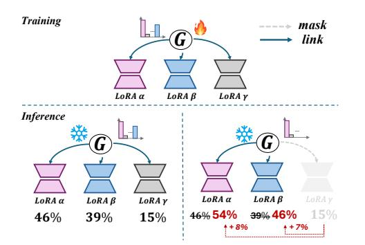
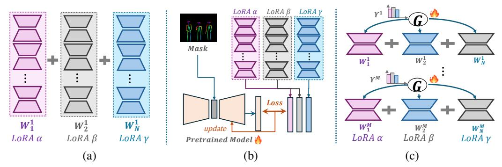
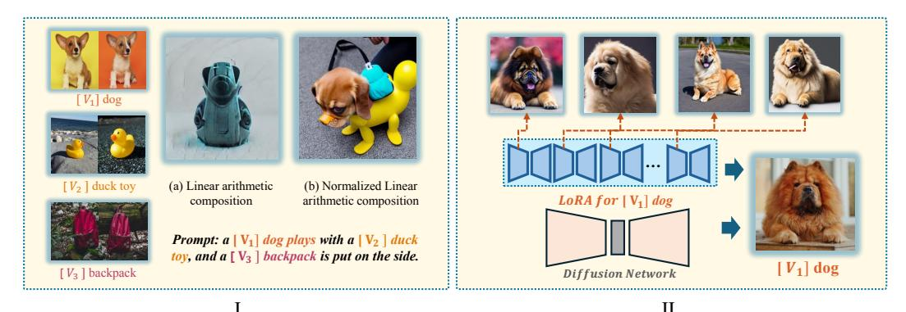

# 1 INTRODUCTION

Recent advances in deep learning have been driven by large-scale pre-trained models such as OPT [\(Zhang](#page-10-0) [et al.,](#page-10-0) [2022\)](#page-10-0), LLaMA [\(Touvron et al.,](#page-10-1) [2023\)](#page-10-1) in the Natural Language Processing (NLP) domain and CLIP [\(Radford et al.,](#page-9-1) [2021a\)](#page-9-1), DALL·E 2 [\(Ramesh](#page-10-2) [et al.,](#page-10-2) [2022\)](#page-10-2) in the Vision & Language (V&L) domain. These models show outstanding performance across various tasks when fine-tuned on down-stream datasets, but their increasing size entails significant computational costs for full fine-tuning. To mitigate this, LoRA [\(Hu et al.,](#page-9-0) [2021\)](#page-9-0) is introduced. By freezing the pretrained model weights and injecting trainable rank decomposition matrices, LoRA is proven to be an effective fine-tuning methodology in scenarios with constrained computational resources [\(Lester](#page-9-2) [et al.,](#page-9-2) [2021;](#page-9-2) [An et al.,](#page-9-3) [2022\)](#page-9-3).

While LoRA serves as plug-and-play plugins for pretrained models, recent initiatives explores the composition of separate trained LoRAs to achieve joint

Figure 1: Workflow of MOLE. In the training phase, MOLE predicts weights for multiple LoRAs. In the inference phase, MOLE can allocate weights to multiple LoRAs, or, without altering the gating weights, achieve a more flexible LoRA composition by masking out undesired LoRAs and recalculating and distributing weights proportionally.

generation of learned characteristics [\(Huang et al.,](#page-9-4) [2023;](#page-9-4) [Zhang et al.,](#page-10-3) [2023;](#page-10-3) [Ruiz et al.,](#page-10-4) [2023\)](#page-10-4). However, these efforts may encounter several challenges. As shown in Figure [2](#page-1-0) (a), linear arithmetic composition [\(Zhang et al.,](#page-10-3) [2023;](#page-10-3) [Huang et al.,](#page-9-4) [2023;](#page-9-4) [Han et al.,](#page-9-5) [2023\)](#page-9-5) composes trained LoRAs

∗Contribution during internship at Microsoft. B Corresponding Author.

Figure 2: Overview of LoRA composition methods: (a) Linear arithmetic composition (Eq.2), which commonly applies the same composition weight  $W_i$  to all layers of the  $i^{th}$  LoRA. (b) Reference tuning-based composition involves retraining a large model by integrating outputs from multiple LoRAs using manually-crafted mask information. (c) Our MoLE, which learns a distribution  $\Upsilon^j$  for the  $j^{th}$  layer of LoRAs to determine the composition weight  $W_i^j$ .

directly. However, composing multiple LoRAs (typically  $\geq 3$ ) can impair the generative performance of pre-trained models. To mitigate this, weight normalization is applied prior to the composition, but may erase the unique characteristics of individual trained LoRAs as the composing weight of each LoRA is reduced (refer to Observation 1 in § 3.1). Another approach, as depicted in Figure 2 (b), known as reference tuning-based composition (Gu et al., 2023), is tailored for the V&L domain and achieves superior performance. However, it is limited in terms of LoRA flexibility due to the utilization of manually-designed masks and involves substantial training costs, necessitating a full model retraining. In light of the above situation, an important question arises:

How can multiple trained LoRAs be composed dynamically and efficiently, while preserving all their individual characteristics?

To address that issues, we introduce Mixture of LoRA Experts (MoLE). Recognizing that individual layers of a trained LoRA exhibit distinct characteristics, which collectively define the overall characteristic of the trained LoRA (refer to Observation 2 in § 3.1), MoLE involves modulating the weights of different trained LoRAs within each layer, which we refer to as "hierarchical weight contro". As shown in Figure 2 (c), MoLE views each layer of trained LoRAs as a individual expert and incorporates a gating function within each layer to learn the optimal composition weights based on a specified domain objective. This dynamically enhances desirable characteristics while mitigating less favorable ones, ultimately achieving a more effective composition of LoRAs and prevents the loss of desirable LoRA characteristics that may occur in linear arithmetic composition.

Additionally, unlike reference tuning-based composition (Gu et al., 2023), our MoLE maintains flexibility in composing multiple trained LoRAs with reduced computational costs. As the workflow of MoLE shown in Figure 1, during training, MoLE learns the gating function for multiple trained LoRAs and keep all other parameters frozen, resulting in minimal computational costs. During inference, MoLE has two inference modes: In the first mode, MoLE utilizes all trained LoRAs with the learned gating function, preserving their individual characteristics with allocated weights. During the second mode, MoLE allows manual masking of unwanted LoRAs and recalculates and distributes weights proportionally without the need for retraining. These two modes enable MoLE to adapt to different scenarios, providing a versatile and flexible approach for effective LoRA composition.

We validate the effects of MoLE in both NLP and V&L domains. Our findings, encompassing both qualitative and quantitative results, demonstrate that MoLE outperforms existing LoRA composition approaches. The contributions of our paper are the following:

• We introduce a significant and intricate problem: how to dynamically and efficiently compose multiple trained LoRAs while preserving all their individual characteristics, to further investigate the applicability of LoRA in real-world scenarios.

- We introduce Mixture of LoRA Experts (MoLE), a method that achieves a more efficient and flexible composition of multiple trained LoRAs by employing hierarchical weight control through learnable gating functions within each layer of trained LoRAs.
- Extensive experiments on both V&L and NLP domain demonstrate that MoLE can enhance LoRA composition performance and mitigates issues associated with existing composition methods.

### 2 BACKGROUND

#### 2.1 Loras Composition

LoRA (Hu et al., 2021) is a parameter-efficient fine-tuning method to adapt large models to novel tasks and shows superior performance (Hu et al., 2021; Huang et al., 2023; Zhang et al., 2023; Sung et al., 2022). In practical applications, a individual LoRA often fall short of meeting user expectations. A common solution is to compose multiple trained LoRAs, each specialized in specific aspects (e.g., clothing or facial features), with the aim of creating a comprehensive character representation. Research on LoRA composition is limited and primarily concentrates on two distinct methodologies as follows:

**Linear arithmetic composition**. As shown in Figure 2 (a), the most commonly employed composition method is directly composing multiple LoRAs, i.e.,

$$\hat{\boldsymbol{W}} = \boldsymbol{W} + \sum_{i=1}^{N} \Delta \boldsymbol{W}_i, \tag{1}$$

where W indicates the original parameter of pre-trained model and  $\Delta W_i$  denotes the  $i^{th}$  trained LoRA. However, this manner may affect the original weight W when N increasing, thereby diminishing the model's generative capabilities. So, it is common practice to normalize the composition weights, termed as normalized linear arithmetic composition, i.e.,

$$\hat{\boldsymbol{W}} = \boldsymbol{W} + \sum_{i=1}^{N} w_i \cdot \Delta \boldsymbol{W}_i, \tag{2}$$

where  $\sum_{i=1}^{N} w_i = 1$ . This manner prevents any adverse impact on the embedding of the original model, but leading to the loss of individual LoRA characteristics, as the composing weight  $w_i$  for each trained LoRA is reduced (Gu et al., 2023).

In NLP domain, PEMs (Zhang et al., 2023) first define arithmetic operators for LoRA, and explore the effectiveness of composing multiple LoRAs in several scenarios. LoRAhub (Huang et al., 2023) utilizes a gradient-free manner to estimate the composition weights of trained LoRAs and achieves adaptable performance on unseen tasks. In V&L domain, SVDiff (Han et al., 2023) introduces a arithmetic-based manner to compose multiple visual concepts into a single image.

**Reference tuning-based composition**. As shown in Figure 2 (b), reference tuning-based composition (Gu et al., 2023) tackles the limitations of linear arithmetic composition by introducing gradient fusion and controllable sampling. However, it suffers from compositional inflexibility due to manually designed masks, which necessitates retraining when incorporating different LoRAs or creating new masks. Moreover, this approach entails retraining large models, resulting in substantial computational costs.

It is important to note that reference tuning-based composition relies on position masks, which distinguishes it from our model. Consequently, direct comparisons may not be appropriate due to the fundamentally different underlying principles. Therefore, our primary focus in this paper is to compare MoLE with linear arithmetic composition.

### 2.2 MIXTURE-OF-EXPERTS

Mixture-of-Experts (MoE) (Xie et al., 2023) is a promising approach to scale up the number of parameters within the same computational bounds. Different from standard transformer models, each MoE layer consists of N independent feed-forward networks  $\{E_i\}_{i=0}^N$  as the experts, along with a

Figure 3: I. Results of (a) linear arithmetic composition (Eq. 1) and (b) normalized linear arithmetic composition (Eq. 2) based on Dreambooth (Ruiz et al., 2023). II. Visualization of the effects for different layers in LoRA by selectively activating specific parameters from the network, moving from the beginning to the end.

gating function  $\alpha$  (·) to model a probability distribution indicating the weights over these experts' outputs. For the hidden representation  $h \in \mathbb{R}^d$  of input token, the gate value of routing h to expert  $E_i$  is denoted as:

$$\alpha\left(\boldsymbol{E}_{i}\right) = \exp\left(\boldsymbol{h} \cdot \boldsymbol{e}_{i}\right) / \sum_{j=0}^{N} \exp\left(\boldsymbol{h} \cdot \boldsymbol{e}_{j}\right), \tag{3}$$

where  $e_i$  denotes the trainable embedding of  $E_i$ . Then, the corresponding k experts, according to the top-k gated values, are activated and the output O of the MoE layer is

$$O = h + \sum_{i=0}^{N} \alpha(E_i) \cdot E_i(h).$$
(4)

### 3 Method

In this section, we first introduce some motivating observations in § 3.1. Then, we introduce the structure details and training objectives of MoLE in § 3.2 and § 3.3, respectively.

