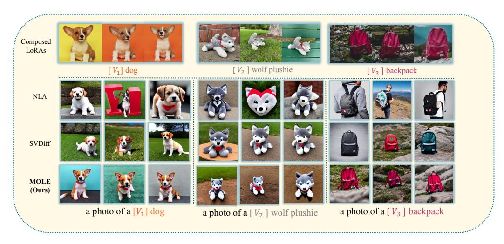
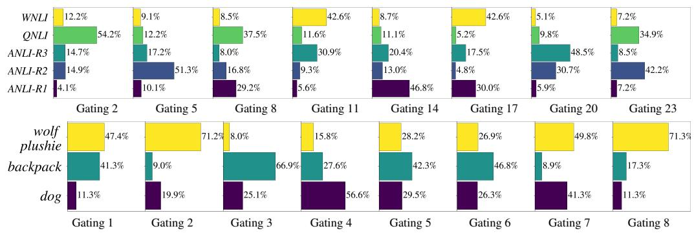
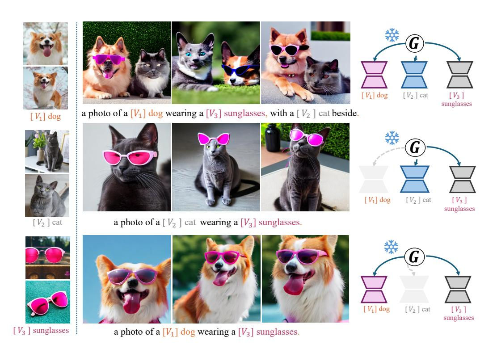
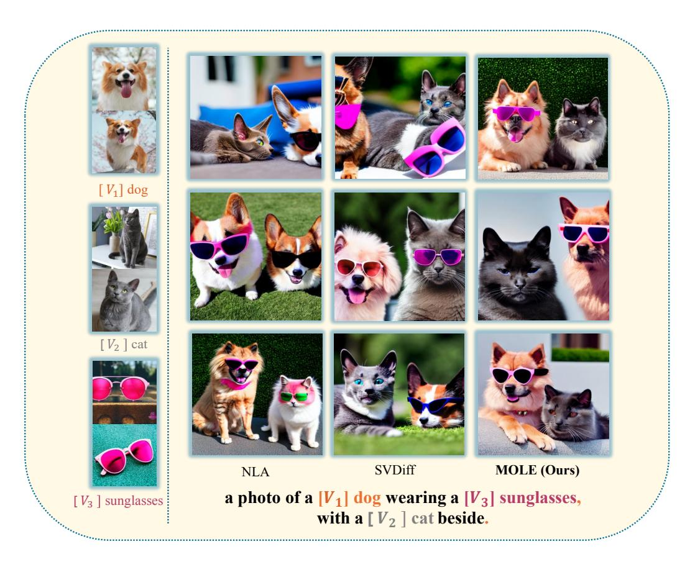
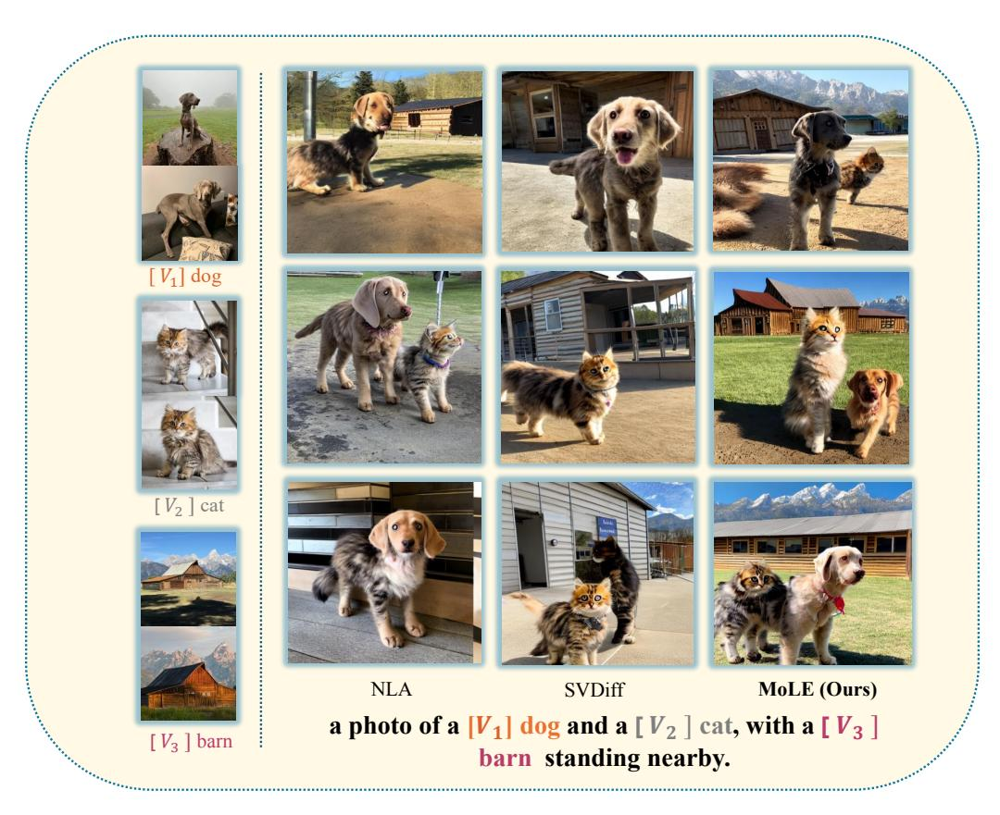
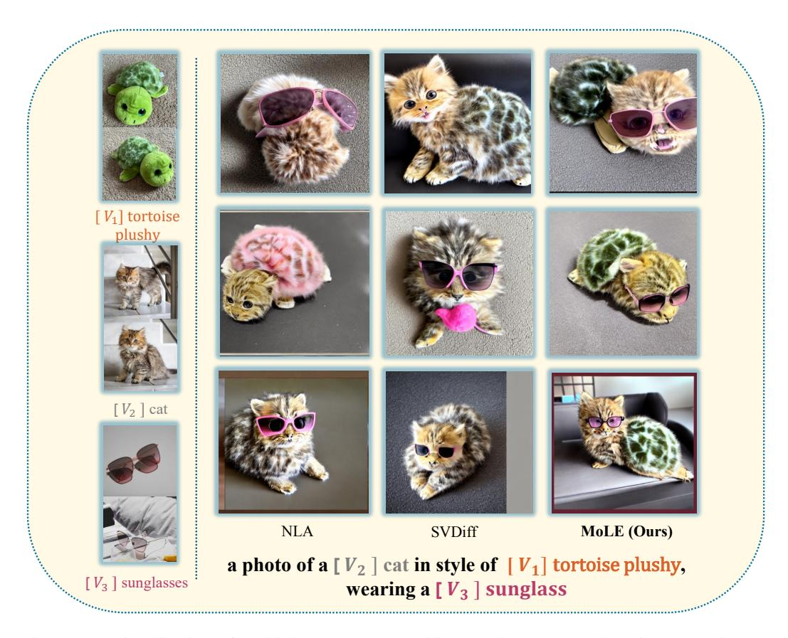

# REFERENCES

- Shengnan An, Yifei Li, Zeqi Lin, Qian Liu, Bei Chen, Qiang Fu, Weizhu Chen, Nanning Zheng, and Jian-Guang Lou. Input-tuning: Adapting unfamiliar inputs to frozen pretrained models. *arXiv preprint arXiv:2203.03131*, 2022.
- Hyung Won Chung, Le Hou, Shayne Longpre, Barret Zoph, Yi Tay, William Fedus, Eric Li, Xuezhi Wang, Mostafa Dehghani, Siddhartha Brahma, et al. Scaling instruction-finetuned language models. *arXiv preprint arXiv:2210.11416*, 2022.
- Rinon Gal, Yuval Alaluf, Yuval Atzmon, Or Patashnik, Amit H Bermano, Gal Chechik, and Daniel Cohen-Or. An image is worth one word: Personalizing text-to-image generation using textual inversion. *arXiv preprint arXiv:2208.01618*, 2022a.
- Rinon Gal, Yuval Alaluf, Yuval Atzmon, Or Patashnik, Amit H Bermano, Gal Chechik, and Daniel Cohen-Or. An image is worth one word: Personalizing text-to-image generation using textual inversion. *arXiv preprint arXiv:2208.01618*, 2022b.
- Ahmad Ghazal, Tilmann Rabl, Minqing Hu, Francois Raab, Meikel Poess, Alain Crolotte, and Hans-Arno Jacobsen. Bigbench: Towards an industry standard benchmark for big data analytics. In *Proceedings of the 2013 ACM SIGMOD international conference on Management of data*, pp. 1197–1208, 2013.
- Yuchao Gu, Xintao Wang, Jay Zhangjie Wu, Yujun Shi, Yunpeng Chen, Zihan Fan, Wuyou Xiao, Rui Zhao, Shuning Chang, Weijia Wu, et al. Mix-of-show: Decentralized low-rank adaptation for multi-concept customization of diffusion models. *arXiv preprint arXiv:2305.18292*, 2023.
- Ligong Han, Yinxiao Li, Han Zhang, Peyman Milanfar, Dimitris Metaxas, and Feng Yang. Svdiff: Compact parameter space for diffusion fine-tuning. *arXiv preprint arXiv:2303.11305*, 2023.
- Jonathan Ho, Ajay Jain, and Pieter Abbeel. Denoising diffusion probabilistic models. *Advances in neural information processing systems*, 33:6840–6851, 2020.
- Edward J Hu, Yelong Shen, Phillip Wallis, Zeyuan Allen-Zhu, Yuanzhi Li, Shean Wang, Lu Wang, and Weizhu Chen. Lora: Low-rank adaptation of large language models. *arXiv preprint arXiv:2106.09685*, 2021.
- Chengsong Huang, Qian Liu, Bill Yuchen Lin, Tianyu Pang, Chao Du, and Min Lin. Lorahub: Efficient cross-task generalization via dynamic lora composition. *arXiv preprint arXiv:2307.13269*, 2023.
- Nupur Kumari, Bingliang Zhang, Richard Zhang, Eli Shechtman, and Jun-Yan Zhu. Multi-concept customization of text-to-image diffusion. In *Proceedings of the IEEE/CVF Conference on Computer Vision and Pattern Recognition*, pp. 1931–1941, 2023.
- Brian Lester, Rami Al-Rfou, and Noah Constant. The power of scale for parameter-efficient prompt tuning. *arXiv preprint arXiv:2104.08691*, 2021.
- Yixin Nie, Adina Williams, Emily Dinan, Mohit Bansal, Jason Weston, and Douwe Kiela. Adversarial nli: A new benchmark for natural language understanding. *arXiv preprint arXiv:1910.14599*, 2019.
- Alec Radford, Jong Wook Kim, Chris Hallacy, Aditya Ramesh, Gabriel Goh, Sandhini Agarwal, Girish Sastry, Amanda Askell, Pamela Mishkin, Jack Clark, et al. Learning transferable visual models from natural language supervision. In *International conference on machine learning*, pp. 8748–8763. PMLR, 2021a.
- Alec Radford, Jong Wook Kim, Chris Hallacy, Aditya Ramesh, Gabriel Goh, Sandhini Agarwal, Girish Sastry, Amanda Askell, Pamela Mishkin, Jack Clark, et al. Learning transferable visual models from natural language supervision. In *International conference on machine learning*, pp. 8748–8763. PMLR, 2021b.
- Pranav Rajpurkar, Robin Jia, and Percy Liang. Know what you don't know: Unanswerable questions for squad. *arXiv preprint arXiv:1806.03822*, 2018.

- Aditya Ramesh, Prafulla Dhariwal, Alex Nichol, Casey Chu, and Mark Chen. Hierarchical textconditional image generation with clip latents. *arXiv preprint arXiv:2204.06125*, 1(2):3, 2022.
- Nataniel Ruiz, Yuanzhen Li, Varun Jampani, Yael Pritch, Michael Rubinstein, and Kfir Aberman. Dreambooth: Fine tuning text-to-image diffusion models for subject-driven generation. In *Proceedings of the IEEE/CVF Conference on Computer Vision and Pattern Recognition*, pp. 22500–22510, 2023.
- Yi-Lin Sung, Jaemin Cho, and Mohit Bansal. Vl-adapter: Parameter-efficient transfer learning for vision-and-language tasks. In *Proceedings of the IEEE/CVF Conference on Computer Vision and Pattern Recognition*, pp. 5227–5237, 2022.
- Hugo Touvron, Thibaut Lavril, Gautier Izacard, Xavier Martinet, Marie-Anne Lachaux, Timothee´ Lacroix, Baptiste Roziere, Naman Goyal, Eric Hambro, Faisal Azhar, et al. Llama: Open and ` efficient foundation language models. *arXiv preprint arXiv:2302.13971*, 2023.
- Andrey Voynov, Qinghao Chu, Daniel Cohen-Or, and Kfir Aberman. p+: Extended textual conditioning in text-to-image generation. *arXiv preprint arXiv:2303.09522*, 2023.
- Yuan Xie, Shaohan Huang, Tianyu Chen, and Furu Wei. Moec: Mixture of expert clusters. In *Proceedings of the AAAI Conference on Artificial Intelligence*, volume 37, pp. 13807–13815, 2023.
- Jinghan Zhang, Shiqi Chen, Junteng Liu, and Junxian He. Composing parameter-efficient modules with arithmetic operations. *arXiv preprint arXiv:2306.14870*, 2023.
- Susan Zhang, Stephen Roller, Naman Goyal, Mikel Artetxe, Moya Chen, Shuohui Chen, Christopher Dewan, Mona Diab, Xian Li, Xi Victoria Lin, et al. Opt: Open pre-trained transformer language models. *arXiv preprint arXiv:2205.01068*, 2022.

Table 4: The first motivation experiment in the NLP domain. NLA denotes normalized linear arithmetic composition (Eq. 2). The **best value** is in bold.

| Model       | ANLI-R1 | ANLI-R2 | ANLI-R3 | QNLI  | WNLI  | Average |
|-------------|---------|---------|---------|-------|-------|---------|
| Single LoRA | 80.32   | 79.02   | 75.92   | 78.62 | 74.32 | 77.64   |
| NLA         | 79.32   | 78.88   | 76.42   | 78.06 | 69.98 | 76.53   |

Table 5: The second motivation experiment in the NLP domain. Full LoRA denotes the application of the complete set of LoRA parameters for inference, whereas x%-y% indicates the inference using LoRA parameters ranging from the top x% to the top y%. The **best value** is in bold.

|           | ANLI-R1 | ANLI-R2 | QNLI  |
|-----------|---------|---------|-------|
| Full LoRA | 81.65   | 80.03   | 76.42 |
| 0%-20%    | 78.72   | 78.35   | 78.14 |
| 20%-40%   | 76.10   | 77.96   | 77.85 |
| 40%-60%   | 76.95   | 81.47   | 74.57 |
| 60%-80%   | 77.25   | 78.19   | 75.71 |
| 80%-100%  | 82.59   | 77.91   | 75.48 |

Table 6: NLP domain experimental results on the impact of exploring expand expert numbers on model performance. The result is the average EM on the Big-Bench Hard (BBH) dataset. NLA denotes normalized linear arithmetic composition (Eq. 2). The **best value** is in bold and <u>the second-best value</u> is indicated with an underline.

| # Number of LoRA | NLA  | LoRAHub     | PEMs | MoLE |
|------------------|------|-------------|------|------|
| 8                | 32.7 | 33.9        | 33.7 | 36.6 |
| 24               | 36.8 | 37.1        | 36.9 | 38.7 |
| 48               | 34.4 | <u>36.9</u> | 34.6 | 39.4 |
| 128              | 34.1 | <u>35.5</u> | 34.9 | 38.5 |
| Average          | 34.5 | <u>35.9</u> | 35.0 | 38.3 |

Table 7: Experimental results on gating balance of MoLE. NLA denotes normalized linear arithmetic composition (Eq. 2). The **best value** is in bold.

| # Model                          | ANLI-R1 | ANLI-R2 | ANLI-R3 | QNLI  | WNLI  | Average |
|----------------------------------|---------|---------|---------|-------|-------|---------|
| NLA                              | 79.32   | 78.88   | 76.42   | 78.06 | 69.98 | 76.53   |
| MoLE                             | 81.49   | 79.38   | 77.63   | 79.52 | 72.31 | 78.07   |
| MoLE w/o $\mathcal{L}_{balance}$ | 80.81   | 79.11   | 77.42   | 79.09 | 71.44 | 77.57   |
| $MoLE^{\tau_1}$                  | 80.52   | 79.27   | 77.30   | 79.11 | 71.07 | 77.45   |
| $MoLE^{\tau_2}$                  | 80.01   | 79.03   | 76.33   | 77.81 | 70.37 | 76.71   |
| $MoLE^{\tau_3}$                  | 78.50   | 79.20   | 76.07   | 78.02 | 70.00 | 76.35   |

Table 8: Evaluation results on generalization to new datasets. All lora candidates and LoRA merging variants are optimized on NLI tasks. The **best value** is in bold and <u>the second-best value</u> is indicated with an underline.

| # Task                          | Metric | LoRAHub     | PEMs | MoLE |
|---------------------------------|--------|-------------|------|------|
| Big-Bench Hard (BBH)            |        |             |      |      |
| Boolean Expressions             | EM     | 45.3        | 45.5 | 48.7 |
| Causal Judgement                | EM     | 51.3        | 46.1 | 52.4 |
| Date Understanding              | EM     | 27.5        | 24.6 | 26.6 |
| Disambiguation                  | EM     | 39.7        | 42.4 | 43.8 |
| Penguins in a Table             | EM     | 35.3        | 33.6 | 39.0 |
| Reasoning about Colored Objects | EM     | <u>32.2</u> | 31.4 | 34.7 |
| Average                         |        | <u>38.5</u> | 37.2 | 40.9 |

Table 9: Coarse-to-fine gating comparison. The **best value** is in bold and <u>the second-best value</u> is indicated with an underline.

| # Method | Text-alignment | Image-alignment |           |           |  |  |  |
|----------|----------------|-----------------|-----------|-----------|--|--|--|
|          |                | Concept 1       | Concept 2 | Concept 3 |  |  |  |
| m-MoLE   | 0.731          | 0.719           | 0.714     | 0.747     |  |  |  |
| 1-MoLE   | 0.760          | 0.727           | 0.731     | 0.757     |  |  |  |
| b-MoLE   | 0.766          | 0.726           | 0.737     | 0.755     |  |  |  |
| n-MoLE   | 0.722          | 0.739           | 0.682     | 0.730     |  |  |  |

Table 10: Experimental results on the impact of exploring expand expert numbers on model performance. We evaluate each composition pair on 200 images generated using 5 prompts with 50 steps of DDPM sampler and scale=7.5. NLA denotes normalized linear arithmetic composition (Eq. 2). The best performance is in bold.

| # Number of LoRA      | To    | ext-alignn | nent  | Average Image-alignment |        |       |  |
|-----------------------|-------|------------|-------|-------------------------|--------|-------|--|
| " I tallioof of Botti | NLA   | SVDiff     | MoLE  | NLA                     | SVDiff | MoLE  |  |
| 3                     | 0.678 | 0.728      | 0.759 | 0.694                   | 0.719  | 0.757 |  |
| 4                     | 0.681 | 0.717      | 0.725 | 0.712                   | 0.721  | 0.742 |  |
| 5                     | 0.652 | 0.723      | 0.762 | 0.682                   | 0.708  | 0.737 |  |
| 6                     | 0.698 | 0.709      | 0.737 | 0.703                   | 0.701  | 0.709 |  |
| Average               | 0.677 | 0.719      | 0.746 | 0.698                   | 0.712  | 0.736 |  |

Figure 6: Qualitative result for retaining ability experiment. NLA denotes normalized linear arithmetic composition (Eq. 2). The first row displays the composed trained LoRAs. The second to the last row showcases the respective abilities of different composition methods to preserve the characteristics of each LoRA without altering the model.

Figure 7: Visualization of the weights (%) predicted by each gating function (horizontal axis) for LoRA experts (vertical axis) during inference. The top row corresponds to experiments in the NLP domain, while the bottom row pertains to experiments in the V&L domain.

Figure 8: Visualization for different inference modes of MOLE. MOLE has two inference modes: In the first mode (the first line), MOLE can use all the LoRA experts and allocate weights for each LoRA, preserving their individual characteristics. In the second mode (the second and third lines), we can manually mask some unwanted LoRAs without changing the gating weights. It can recalculate and distribute weights proportionally. These two modes enable MOLE to adapt to different scenarios, providing a versatile and flexible approach for effective LoRA composition.

Figure 9: Visualization of multiple LoRA composition results on V&L domain. NLA denotes normalized linear arithmetic composition (Eq. [2\)](#page-2-0). Our MOLE has higher visual similarity with the personal cat and dog images while following the text condition better, e.g., SVDiff is unable to fully recover all the characteristics of LoRA (in the second line, the appearance of the dog is completely altered, and in the first line, two cats are present but the dog is missing). Moreover, SVDiff and NLA struggles to generate images that match the text condition effectively (e.g., it might add sunglasses to both dogs and cats in response to conditions mentioning "dog" and "cat").

Figure 10: Visualization of multiple LoRA composition results on V&L domain. NLA denotes normalized linear arithmetic composition (Eq. [2\)](#page-2-0). Our model consistently produces results that better align with the prompt descriptions. The outputs from our model consistently contain all three visual concepts that need to be combined. In contrast, SVDiff and NLA often exhibit issues such as concept confusion (e.g., in the third row of NLA, where features of both the cat and dog are confused) and concept omission (e.g., in the second row of SVDiff, where the concept of the dog is missing, and in the first row, where the concept of the cat is missing).

Figure 11: Visualization of multiple LoRA composition results on V&L domain. NLA denotes normalized linear arithmetic composition (Eq. [2\)](#page-2-0). Our model consistently produces results that better align with the prompt descriptions. The outputs from our model consistently contain all three visual concept features that need to be combined. In contrast, SVDiff and NLA often exhibit issues such as concept omission (e.g., in the first row of NLA, where the concepts of the cat and sunglasses are missing, and in the first row of SVDiff, where the concept of sunglasses is missing). Additionally, our output results better match the original visual concept features. For example, the shell of the turtle is green, whereas SVDiff and NLA generate shells in pink and brown colors.