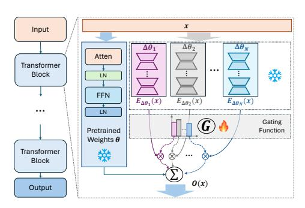
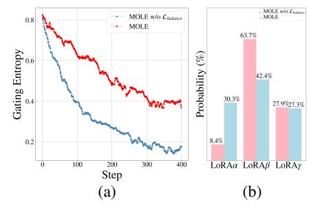

# 3.1 MOTIVATING OBSERVATION

**Observation 1:** Directly composing multiple trained LoRAs (Eq. 1) impacts the model's generative ability, whereas applying weight normalization (Eq. 2) preserves this capacity but may sacrifice LoRA characteristics.

Specifically, in V&L domain, as depicted in Figure 3 I, we observe that directly composing multiple trained LoRAs into the original embedding led to significant parameter variations, resulting in meaningless output. Furthermore, when normalization was applied, some of the original characteristics of these trained LoRAs are indeed compromised. These observations align with those elaborated upon in (Gu et al., 2023).

In NLP domain, when composing four or more LoRAs within the FLAN-T5 (Chung et al., 2022) model, we observed that the model's output became disordered. Furthermore, implementing weight normalization for LoRAs trained across five datasets, as presented in Table 4, led to a decreased performance of the composition model. This suggests that while weight normalization preserves generative capacity, it adversely affects the intrinsic qualities of these trained LoRAs.

**Observation 2:** Individual layers of a trained LoRA exhibit unique traits, which cumulatively define the LoRA's overall attributes.

Inspired by the findings of (Voynov et al., 2023), which revealed that different layers in text-toimage models govern various attributes, such as style and color, we investigate the features learned by different layers within LoRA. In V&L domain, as illustrated in Figure 3 II, we observed that different layers of LoRA encode distinct features, such as dog coat color and facial features. In NLP domain, we trained a single LoRA on a combined dataset comprising ANLI-R1 (Nie et al., 2019), ANLI-R2 (Nie et al., 2019), and QNLI (Rajpurkar et al., 2018) datasets, as depicted in Table 5. Notably, when evaluated on these sub-datasets, we observed significant variations in performance across different layers of this LoRA. Specifically, the layers ranging from 0% to 20% performed best on QNLI, the layers spanning from 40% to 60% excelled on ANLI-R2, and the layers covering 80% to 100% outperformed others on ANLI-R1. This observation inspires that we can dynamically optimizes the layer-specific weights according to a defined domain objective, enhancing desirable characteristics while suppressing less favorable ones, thereby achieving a more effective composition of trained LoRAs.

#### 3.2 MIXTURE OF LORA EXPERTS

Drawing inspiration from above observations, we introduce the Mixture of LoRA Experts.

Referring to Figure 4, consider a transformer block within the pre-trained model, parameterized by  $\theta$  (encompassing both the multi-head attention layer and the feed-forward neural network), and a set of corresponding trained LoRAs  $\Omega = \{\Delta \theta_i\}_{i=0}^N$  where N represents the number of trained LoRA candidates, when given a input  $\boldsymbol{x} \in \mathbb{R}^{L \times d}$ , the output of the pre-trained model block  $\theta$  is presented as  $\boldsymbol{F}_{\theta} \in \mathbb{R}^{L \times d}$ :

$$\mathbf{x}_{\theta}^{'} = \mathbf{x} + f_{\text{Attn}}(\text{LN}(\mathbf{x})|\theta),$$
 (5)

$$\boldsymbol{F}_{\theta}\big(\boldsymbol{x}\big) = \boldsymbol{x}_{\theta}^{'} + f_{\text{FFN}}\big(\text{LN}\big(\boldsymbol{x}_{\theta}^{'}\big)\big|\theta\big), \qquad (6$$

Figure 4: **Illustration of proposed MoLE**. MoLE employs a learnable gating function that utilizes the outputs of multiple LoRAs at each layer to determine composition weights.

where L and d indicate the sequence length and the dimension of  $\boldsymbol{x}$ , respectively.  $f_{\text{Attn}}\left(\cdot\right)$  and  $f_{\text{FFN}}\left(\cdot\right)$  denotes the multi-head attention layer and feed-forward neural network, respectively. LN refers to layer normalization. The output of each LoRA is presented as  $\boldsymbol{E}_{\Delta\theta_s}\left(\boldsymbol{x}\right) \in \mathbb{R}^{L\times d}$ ,

$$\mathbf{x}_{\Delta\theta_i}^{'} = \mathbf{x} + f_{\text{Attn}} \Big( \text{LN}(\mathbf{x}) \big| \Delta\theta_i \Big),$$
 (7)

$$\boldsymbol{E}_{\Delta\theta_{i}}(\boldsymbol{x}) = \boldsymbol{x}_{\Delta\theta_{i}}^{'} + f_{\text{FFN}}\left(\text{LN}(\boldsymbol{x}_{\Delta\theta_{i}}^{'}) \big| \Delta\theta_{i}\right). \tag{8}$$

After that, MoLE applies a learnable gating function  $\mathcal{G}\left(\cdot\right)$  to model the optimal distribution of composition weights for outputs of these trained LoRAs. Specifically, by taking  $\left\{\boldsymbol{E}_{\Delta\theta_{i}}\left(\boldsymbol{x}\right)\right\}_{i=0}^{N}$  as input,  $\mathcal{G}\left(\cdot\right)$  first apply concatenation (denoted as  $\oplus$ ) and normalization (for training stability), i.e.

$$E_{\Omega}(x) = \text{Normalization}\Big(E_{\Delta\theta_0}(x) \oplus \ldots \oplus E_{\Delta\theta_{N-1}}(x)\Big),$$
 (9)

where  $\boldsymbol{E}_{\Omega}\left(\boldsymbol{x}\right)\in\mathbb{R}^{\xi}$  and  $\xi=N\times L\times d$ .  $\oplus$  indicates the concatenation operation. Then we flatten and reduce the  $\boldsymbol{E}_{\Omega}\left(\boldsymbol{x}\right)$  to N-dimensions by a dot-product operation with the learnable parameter  $\boldsymbol{e}\in\mathbb{R}^{\xi\times N}$  in the gating function  $\mathcal{G}\left(\cdot\right)$ ,

$$\varepsilon = \operatorname{Flatten}\left(\boldsymbol{E}_{\Omega}\left(\boldsymbol{x}\right)\right)^{\top} \cdot \boldsymbol{e}, \quad \varepsilon \in \mathbb{R}^{N},$$
(10)

The gate value for each LoRA is computed as

$$\mathcal{G}(\varepsilon_i) = \frac{\exp\left(\varepsilon_i/\tau\right)}{\sum_{j=1}^{N} \exp\left(\varepsilon_j/\tau\right)},\tag{11}$$

the temperature scalar  $\tau$  is learnable. The final output  $E_{\Omega}(x)$  of the gating function  $\mathcal{G}(\cdot)$  is obtained by multiplying the output of each LoRA expert with the corresponding gating values, presented as

$$\tilde{\boldsymbol{E}}_{\Omega}(\boldsymbol{x}) = \sum_{i=0}^{N} \mathcal{G}_{i}\left(\varepsilon_{i}\right) \cdot \boldsymbol{E}_{\Delta\theta_{i}}\left(\boldsymbol{x}\right), \tag{12}$$

Table 1: Text-alignment and image-alignment results for multiple LoRAs composition in CLIP feature space. NLA denotes normalized linear arithmetic composition (Eq. 2). The best performance is in bold.

| # Visual Concepts                        | Text-alignment |        | Image-alignment, (Concept 1) |       | Image-alignment, (Concept 2) |       |       | Image-alignment, (Concept 3) |       |       |        |       |
|------------------------------------------|----------------|--------|---------------------------------|-------|---------------------------------|-------|-------|---------------------------------|-------|-------|--------|-------|
|                                          | NLA            | SVDiff | MoLE                            | NLA   | SVDiff                          | MoLE  | NLA   | SVDiff                          | MoLE  | NLA   | SVDiff | MoLE  |
| Fancy boot + Monster + Clock             | 0.754          | 0.742  | 0.832                           | 0.781 | 0.758                           | 0.784 | 0.791 | 0.749                           | 0.801 | 0.763 | 0.812  | 0.809 |
| Emoji + Car + Cartoon                    | 0.610          | 0.607  | 0.696                           | 0.619 | 0.734                           | 0.839 | 0.711 | 0.702                           | 0.709 | 0.652 | 0.686  | 0.679 |
| Vase + Wolf plushie + Teapot             | 0.752          | 0.812  | 0.863                           | 0.687 | 0.807                           | 0.835 | 0.705 | 0.782                           | 0.746 | 0.653 | 0.694  | 0.721 |
| White Cat + Wolf plushie + Can           | 0.704          | 0.772  | 0.780                           | 0.801 | 0.804                           | 0.802 | 0.678 | 0.763                           | 0.825 | 0.650 | 0.729  | 0.714 |
| Shiny sneaker + Wolf plushie + Teapot    | 0.778          | 0.789  | 0.791                           | 0.812 | 0.783                           | 0.690 | 0.723 | 0.751                           | 0.790 | 0.688 | 0.676  | 0.721 |
| Car + Wolf plushie + Teapot              | 0.635          | 0.681  | 0.684                           | 0.652 | 0.763                           | 0.713 | 0.601 | 0.664                           | 0.745 | 0.685 | 0.612  | 0.707 |
| Can + Wolf plushie + backpack            | 0.601          | 0.782  | 0.754                           | 0.653 | 0.705                           | 0.767 | 0.602 | 0.755                           | 0.782 | 0.681 | 0.738  | 0.723 |
| Golden Retriever + Wolf plushie + Teapot | 0.670          | 0.716  | 0.784                           | 0.713 | 0.784                           | 0.790 | 0.601 | 0.802                           | 0.809 | 0.678 | 0.761  | 0.748 |
| Golden Retriever + Boot + Monster        | 0.614          | 0.762  | 0.755                           | 0.665 | 0.662                           | 0.620 | 0.748 | 0.832                           | 0.862 | 0.723 | 0.719  | 0.735 |
| Backpack dog + Bowl + Teapot             | 0.607          | 0.712  | 0.703                           | 0.653 | 0.672                           | 0.756 | 0.734 | 0.720                           | 0.755 | 0.692 | 0.688  | 0.701 |
| Backpack dog + White Cat + Emoji         | 0.648          | 0.703  | 0.717                           | 0.674 | 0.692                           | 0.812 | 0.719 | 0.741                           | 0.701 | 0.742 | 0.720  | 0.796 |
| Dog + Wolf + Backpack                    | 0.717          | 0.738  | 0.722                           | 0.547 | 0.565                           | 0.552 | 0.679 | 0.681                           | 0.707 | 0.766 | 0.795  | 0.831 |
| Cat + Sunglasses + Boot                  | 0.770          | 0.791  | 0.837                           | 0.845 | 0.793                           | 0.815 | 0.845 | 0.793                           | 0.815 | 0.845 | 0.793  | 0.815 |
| Table + Can + Teapot                     | 0.836          | 0.827  | 0.810                           | 0.753 | 0.770                           | 0.741 | 0.751 | 0.799                           | 0.806 | 0.818 | 0.771  | 0.829 |
| Robot + Dog + Clock                      | 0.663          | 0.638  | 0.693                           | 0.689 | 0.764                           | 0.797 | 0.645 | 0.674                           | 0.710 | 0.661 | 0.715  | 0.717 |
| Average                                  | 0.678          | 0.728  | 0.759                           | 0.715 | 0.746                           | 0.783 | 0.682 | 0.731                           | 0.756 | 0.686 | 0.708  | 0.732 |

in which  $\tilde{E}_{\Omega}(x) \in \mathbb{R}^{L \times d}$  and  $\mathcal{G}_i(\cdot)$  represents the weight of the  $i^{th}$  trained LoRA. So, the final output of this block is computed by adding the output of the gating function to the output of the pre-trained network:

$$O(x) = F_{\theta}(x) + \tilde{E}_{\Omega}(x)$$
 (13)

Besides, we conducted an exploration of MoLE's performance when employing gating functions at different hierarchical levels (layer-wise and matrix-wise, etc). Please refer to Section 5.

### 3.3 Training Objective

Gating Balancing Loss. As shown in Figure 5 (a), we observed that the average entropy of the distribution probabilities from the gating functions gradually decreases as the number of training steps increases, i.e., the gating function tends to converge to a state where it always produces large weights for a early-stage well-performing LoRA (e.g., shown in Figure. 5 (b), 68% gating probability for LoRA  $\beta$  among three LoRAs), leading to only a handful of LoRAs having a significant impact in the end and a loss of the characteristics of other LoRAs. To alleviate this, we propose a gating balancing loss  $\mathcal{L}_{\text{balance}}$  as

$$\mathcal{L}_{\text{balance}} = -\log \left( \prod_{i=0}^{N} \mathbf{q}^{(i)} \right), \tag{14}$$

where

$$\mathbf{q}^{(i)} = \frac{1}{M} \sum_{k=1}^{M} \frac{\exp\left(\varepsilon_i^k/\tau\right)}{\sum_{j=1}^{N} \exp\left(\varepsilon_j^k/\tau\right)},\tag{15}$$

and M represents the number of blocks where gating functions are placed and N denotes the number of LoRAs. This balanced loss encourages balanced gating because it is minimized when the dispatching is ideally balanced.

**Domain-specific Loss**. Additionally, for adaptation to different domains, we employ distinct domain-specific training objectives denoted as  $\mathcal{L}_D$ . In V&L domain. we employ unsupervised training with both local and global guidance from CLIP (Radford et al., 2021b) to optimize MoLE. In NLP domain, we follow the loss function in FLAN-T5 (Chung et al., 2022). The overall training objective  $\mathcal{L}$  is the weighted sum of the above-mentioned two losses, represented as:

$$\mathcal{L} = \mathcal{L}_{D} + \alpha \mathcal{L}_{balance}, \tag{16}$$

where  $\alpha$  is a coefficient for weight balancing.

Figure 5: (a) The average gating entropy of all gating functions varies with the training steps. (b) The average weight distribution (%) of three LoRAs w and w/o  $\mathcal{L}_{balance}$ .

Table 2: Text-alignment and image-alignment results for multiple LoRA experts composition in CLIP feature space. The best performance is in bold and the second-best value is indicated with an underline. NLA denotes normalized linear arithmetic composition (Eq. 2). SOTA full-parameter training methods are highlighted by

| # Number of Concepts |       | Text-alignment |                   |        |       | Average Image-alignment |        |                   |        |       |
|----------------------|-------|----------------|-------------------|--------|-------|-------------------------|--------|-------------------|--------|-------|
|                      | NLA   | Custom         | Textual Inversion | SVDiff | MoLE  | NLA                     | Custom | Textual Inversion | SVDiff | MoLE  |
| 3                    | 0.678 | 0.751          | 0.709             | 0.728  | 0.759 | 0.694                   | 0.761  | 0.720             | 0.719  | 0.757 |
| 4                    | 0.681 | 0.735          | 0.721             | 0.717  | 0.725 | 0.712                   | 0.760  | 0.736             | 0.721  | 0.742 |
| 5                    | 0.652 | 0.731          | 0.704             | 0.723  | 0.762 | 0.682                   | 0.798  | 0.710             | 0.708  | 0.737 |
| 6                    | 0.678 | 0.722          | 0.735             | 0.709  | 0.727 | 0.698                   | 0.721  | 0.747             | 0.712  | 0.736 |
| Average              | 0.672 | 0.734          | 0.717             | 0.719  | 0.752 | 0.692                   | 0.760  | 0.728             | 0.715  | 0.743 |

**Optimization Gating Function Only.** We freeze all trained LoRAs and pre-trained model parameters, optimizing only the gating function's parameters. This helps preserve characteristics of trained LoRAs, particularly when training data is limited.

