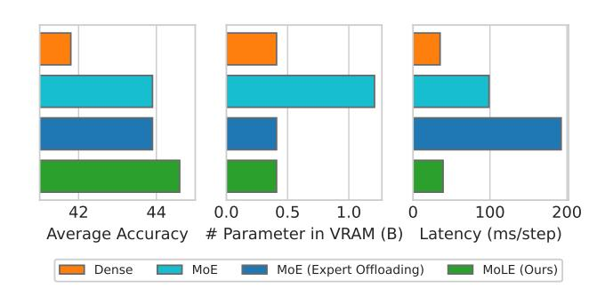

# Abstract

Mixture-of-Experts (MoE) activates only a subset of experts during inference, allowing the model to maintain low inference FLOPs and latency even as the parameter count scales up. However, since MoE dynamically selects the experts, all the experts need to be loaded into VRAM. Their large parameter size still limits deployment, and offloading, which load experts into VRAM only when needed, significantly increase inference latency. To address this, we propose Mixture of Lookup Experts (MoLE), a new MoE architecture that is efficient in both communication and VRAM usage. In MoLE, the experts are Feed-Forward Networks (FFNs) during training, taking the output of the embedding layer as input. Before inference, these experts can be reparameterized as lookup tables (LUTs) that retrieves expert outputs based on input ids, and offloaded to storage devices. Therefore, we do not need to perform expert computations during inference. Instead, we directly retrieve the expert's computation results based on input ids and load them into VRAM, and thus the resulting communication overhead is negligible. Experiments show that, with the same FLOPs and VRAM usage, MoLE achieves inference speeds comparable to dense models and significantly faster than MoE with experts offloading, while maintaining performance on par with MoE. Code: <https://github.com/JieShibo/MoLE>.

*Proceedings of the* 42 nd *International Conference on Machine Learning*, Vancouver, Canada. PMLR 267, 2025. Copyright 2025 by the author(s).

Figure 1. With the same 410M activated parameters, MoE outperforms the dense model in terms of performance, but it comes with significant VRAM usage. If experts are offloaded, inference latency will increase. Our MoLE maintains competitive performance without increasing the model's VRAM usage or decoding latency.

