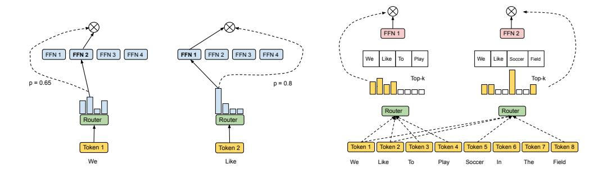

# 1 Introduction

Scaling up model capacity, dataset size, and training time has demonstrated huge success in enhancing the performance of computer vision architectures [\[4,](#page-9-0) [11,](#page-9-1) [13,](#page-9-2) [14\]](#page-9-3) as well as neural language models [\[2,](#page-9-4) [20,](#page-10-0) [26,](#page-10-1) [27\]](#page-10-2). The final model quality has been found to have a power-law relationship with the amount of data, model size, and compute time [\[16,](#page-9-5) [20\]](#page-10-0). However, training efficiency, which is defined as the total amount of computation used to achieve superior model quality than the state of the art system [\[21\]](#page-10-3), should receive greater attention as we increase our efforts towards green AI [\[29\]](#page-10-4).

Sparsely gated mixture-of-experts [\[31\]](#page-10-5) (MoE) provides an effective way to scale model capacity given a fixed computational cost, and has recently played an important role in increasing the training efficiency of large-scale language models [\[10,](#page-9-6) [21\]](#page-10-3). MoE operate by adopting a number of experts, each as a sub-network, and by activating only one or a few experts for each input token. A gating network must be chosen and optimized in order to route each token to the most suited expert(s). For example, recent work has implemented sparse routing via k-means clustering [\[12\]](#page-9-7), linear assignment to maximize token-expert affinities [\[22\]](#page-10-6), or hashing [\[8,](#page-9-8) [28\]](#page-10-7). Many of the prior work use a routing strategy concerning the *token choice*, where each token selects the best one or two experts.

We argue that the independent token choice of prior work often leads to an imbalanced load of experts, which causes training inefficiency and sub-optimal training of the model. In order to mitigate this

Figure 1: High-level Comparison Between Conventional MoE and expert choice MoE.

issue, previous sparsely gated networks introduce additional auxiliary losses as regularization to prevent too many tokens being routed to a single expert, but the effectiveness is still limited. Recent approaches [\[8,](#page-9-8) [22,](#page-10-6) [28\]](#page-10-7) explore alternative strategies for routing, but they focus on pre-training only and do not demonstrate performance gain on downstream tasks. Moreover, none of the previous methods consider allocating a variable number of experts to each token based on importance, which can be beneficial.

We propose a very simple yet effective routing method we are calling *expert choice*. Unlike conventional MoE where tokens select one or two top-scoring experts, our method lets each *expert* pick the top-k tokens. Our method guarantees perfect load balancing, allows a variable number of experts for each token, and achieves substantial gains in training efficiency and downstream performance as demonstrated in our experiments. Our major contributions include:

- We identify common pitfalls in conventional MoE such as load imbalance as described in Section [3.1.](#page-2-0) We then propose a heterogeneous, expert choice method to provide a fluid allocation of model parameters based on a learnt token-to-expert importance. This method intrinsically guarantees load balance without imposing an auxiliary loss.
- We show our method provides over 2× faster training convergence in a 8B/64E (8 billion activated parameters, 64 experts) model, compared to the top-1 and top-2 gating counterparts in Switch Transformer [\[10\]](#page-9-6) and GShard [\[21\]](#page-10-3).
- We show our method demonstrates strong scaling when increasing the number of experts from 16 to 128, evaluated in training perplexity.
- We show our method demonstrates strong performance on downstream tasks selected from GLUE and SuperGLUE at all the evaluated scales. More specifically, our 8B/64E model outperforms a T5 11B dense model in 7 out of 11 tasks evaluated.

