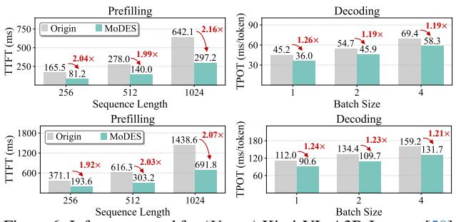
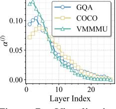

# 6. Experiments

#### 6.1. Setups

Models and datasets. We choose 3 series of MoE MLLMs to evaluate *MoDES*: Kimi-VL [50], Qwen3-VL-MoE [26], and InternVL-3.5 [57]. We use 8 zero-shot evaluation tasks for image understanding: TextVQAval [49], ChartQA [45], MMStar [7], MMBenchdev, en [41], MMVet [65], MME [16], Real-WorldQA [62], and COCO2017-Capval [37] (COCO). For video understanding tasks, we adopt 5 benchmarks: MVBench [33], EgoSchema [44], VideoMME [17] (VMME), LongVideoBenchval,v [59] (LVB), and VideoM-MMU [20] (VMMMU). 1mms-eval [67] is utilized to perform the above evaluation. For MMBench and MMVet, we use DeepSeek-V3.1 [12] to rate the generated texts.

**Baselines.** As there is no *expert skipping* baselines for MLLMs and previous methods for LLMs only consider models with top-2 routing in practice, we re-implement and adjust them to top-k (k > 2) settings for MLLMs: For the l-th layer, NAEE [42] originally skips the top-2 expert if  $\pi_{\text{top-2}}^{(l)} < \beta^{(l)} \cdot \pi_{\text{top-1}}^{(l)}$ , where  $\pi_{\text{top-1}}^{(l)}$  and  $\pi_{\text{top-2}}^{(l)}$  denotes the top-1 and top-2 routing probabilities (Eq. (1)).  $\beta^{(l)}$  is a hyperparameter. Here, we adapt this strategy, referring to the Appendix of NAEE, to a more general top-k scenario. Specifically, top-i to top-k experts are skipped if  $\sum_{u=i}^k \pi_{\text{top-}u}^{(l)} < \beta^{(l)} \cdot \sum_{v=1}^k \pi_{\text{top-}v}^{(l)}$ . We also apply similar adjustments for MC-MoE [22] and DiEP [6], which build on top of NAEE. To be noted, without a specific claim, we adopt only the expert skipping component of these works to enable a fair comparison. Moreover, we also compare our method with expert skipping guided by directly reducing the value k of top-k routing.

**Implementation.** We employ 1024 samples randomly picked from the GQA [25] dataset to calibrate  $\alpha^{(l)}$  (Eq. (4)) and search optimal  $(\tau_t, \tau_v)$  (Eq. (5)). The search space  $\mathcal{B}$  is given by D=100 grid points sampled in (0,1). More implementation details can be found in the Appendix.

#### 6.2. Evaluation

**Comparison with baselines.** We benchmark MoDES against baselines on Kimi-VL-A3B-Instruct [50]. As

 $^1\mbox{We compute }f$  and g on data  $\mathcal C$  (with N samples), which is also used in Eq. (4).

Table 1. Performance comparisons for Kimi-VL-A3B-Instruct [50] across various expert skipping ratios. We mark the target  $\rho$  (Eq. (6)) and the practical skipping ratio x% (i.e., "Skip x% Experts") in the table. For each method, we compute the score proportion relative to the default setting (i.e., k=6) across benchmarks, and then compute the average value in the "Avg. (%)" column. For the COCO dataset, we report the CIDEr [54] score here. The best and second-best results are highlighted in **bold** and <u>underlined</u> formats, respectively.

| Method                           |         |         |        | Image Unde   | rstanding | <u> </u> |                        |       |         | Video Ur  | nderstand | ing   |       | Avg.   |
|----------------------------------|---------|---------|--------|--------------|-----------|----------|------------------------|-------|---------|-----------|-----------|-------|-------|--------|
| Wiethou                          | TextVQA | ChartQA | MMStar | MMBench      | MMVet     | MME      | RealWorldQA            | COCO  | MVBench | EgoSchema | VMME      | LVB   | VMMMU | (%)    |
| k = 6 (Default)                  | 88.70   | 89.48   | 49.89  | 83.16        | 66.33     | 2207     | 65.36                  | 86.70 | 61.80   | 78.18     | 66.59     | 63.13 | 49.33 | 100.00 |
|                                  |         |         |        |              | SI        | kip 50%  | Experts ( $\rho = 0$ . | 48)   |         |           |           |       |       |        |
| k = 3                            | 85.41   | 86.20   | 51.21  | 80.67        | 57.71     | 2065     | 63.53                  | 87.56 | 60.42   | 75.71     | 64.30     | 60.14 | 44.22 | 95.93  |
| NAEE [42]                        | 86.14   | 85.74   | 50.82  | 80.58        | 60.81     | 2084     | 64.55                  | 85.33 | 60.02   | 75.81     | 65.16     | 60.27 | 45.08 | 96.44  |
| MC-MoE [22]                      | 86.28   | 87.94   | 51.61  | 81.32        | 62.54     | 2138     | 63.82                  | 86.24 | 60.39   | 76.57     | 66.24     | 60.62 | 46.26 | 97.69  |
| DiEP [6]                         | 87.43   | 88.32   | 51.48  | 80.26        | 60.41     | 2159     | 64.74                  | 87.43 | 61.06   | 77.32     | 65.96     | 61.04 | 47.83 | 98.17  |
| MoDES (Ours)                     | 88.18   | 89.08   | 49.65  | 83.16        | 65.09     | 2203     | 65.62                  | 88.23 | 61.95   | 78.41     | 67.19     | 62.83 | 49.00 | 99.91  |
| Skip 67% Experts ( $\rho=0.65$ ) |         |         |        |              |           |          |                        |       |         |           |           |       |       |        |
| k = 2                            | 83.49   | 85.12   | 52.10  | 78.87        | 53.49     | 2022     | 63.79                  | 92.61 | 59.35   | 70.80     | 62.15     | 57.67 | 41.44 | 93.88  |
| NAEE [42]                        | 82.84   | 85.29   | 50.74  | 77.31        | 56.67     | 2083     | 64.54                  | 82.09 | 59.68   | 72.29     | 63.74     | 58.36 | 43.68 | 94.03  |
| MC-MoE [22]                      | 85.07   | 86.32   | 51.13  | 77.65        | 58.42     | 2104     | 63.61                  | 84.23 | 59.86   | 74.36     | 64.22     | 59.73 | 45.21 | 95.45  |
| DiEP [6]                         | 84.21   | 85.56   | 50.76  | <u>78.94</u> | 57.05     | 2087     | 64.02                  | 87.54 | 60.02   | 72.97     | 61.07     | 58.45 | 44.93 | 94.81  |
| MoDES (Ours)                     | 85.57   | 88.24   | 49.25  | 82.73        | 60.78     | 2204     | 64.58                  | 85.37 | 61.65   | 77.98     | 66.52     | 62.90 | 48.78 | 98.46  |
|                                  |         |         |        |              | SI        | kip 83%  | Experts ( $\rho = 0.3$ | 80)   |         |           |           |       |       |        |
| k = 1                            | 77.17   | 76.68   | 42.65  | 54.55        | 22.98     | 1647     | 54.38                  | 77.37 | 51.10   | 37.23     | 50.52     | 43.83 | 24.56 | 71.60  |
| NAEE [42]                        | 75.73   | 78.41   | 41.48  | 69.14        | 43.41     | 1827     | 60.32                  | 72.35 | 58.41   | 57.28     | 53.49     | 49.68 | 42.64 | 82.81  |
| MC-MoE [22]                      | 79.41   | 80.25   | 43.57  | 73.42        | 50.37     | 2063     | 62.54                  | 80.42 | 54.87   | 63.56     | 59.87     | 54.39 | 44.02 | 88.32  |
| DiEP [6]                         | 82.32   | 78.31   | 42.47  | 76.28        | 47.45     | 2071     | 61.34                  | 77.91 | 59.15   | 61.27     | 57.49     | 52.41 | 43.81 | 87.58  |
| MoDES (Ours)                     | 82.38   | 84.20   | 46.68  | 81.44        | 60.46     | 2162     | 64.84                  | 81.33 | 61.30   | 76.98     | 65.48     | 62.60 | 47.11 | 96.25  |

Table 2. Performance of combination with quantization. MoDES employs the quantization strategy in MC-MoE [22]: weight-only mixed-precision quantization for MoE-based FFNs and 4-bit weight-only quantization for other layers.

| Method                             | #Bit                      | ChartQA       | MME       | MMBench  | LVB   | VMMMU |  |  |  |  |  |
|------------------------------------|---------------------------|---------------|-----------|----------|-------|-------|--|--|--|--|--|
| Kimi-VL-A3B-Ins                    | Kimi-VL-A3B-Instruct [50] |               |           |          |       |       |  |  |  |  |  |
| k = 6 (Default)                    | 16                        | 89.48         | 2207      | 83.16    | 63.13 | 49.33 |  |  |  |  |  |
| Skip 67% Experts ( $\rho = 0.65$ ) |                           |               |           |          |       |       |  |  |  |  |  |
| MC-MoE [22]                        | 2.5                       | 78.47         | 2036      | 68.84    | 54.46 | 41.92 |  |  |  |  |  |
| MoDES (Ours)                       | 2.5                       | 81.23         | 2137      | 76.48    | 58.10 | 43.67 |  |  |  |  |  |
| MC-MoE [22]                        | 1.5                       | 69.46         | 1728      | 62.18    | 42.87 | 38.45 |  |  |  |  |  |
| MoDES (Ours)                       | 1.5                       | 72.28         | 1899      | 68.57    | 48.14 | 40.06 |  |  |  |  |  |
| Qwen3-VL-MoE-                      | 30B-A.                    | 3B-Instruct [ | [26]      |          |       |       |  |  |  |  |  |
| k = 8 (Default)                    | 16                        | 85.08         | 2500      | 86.60    | 55.42 | 47.11 |  |  |  |  |  |
|                                    |                           | Skip 75% E    | Experts ( | p = 0.73 |       |       |  |  |  |  |  |
| MC-MoE [22]                        | 2.5                       | 76.36         | 2084      | 79.62    | 51.85 | 42.06 |  |  |  |  |  |
| MoDES (Ours)                       | 2.5                       | 78.24         | 2281      | 81.34    | 53.63 | 46.28 |  |  |  |  |  |
| MC-MoE [22]                        | 1.5                       | 70.42         | 1968      | 73.18    | 46.08 | 36.94 |  |  |  |  |  |
| MoDES (Ours)                       | 1.5                       | 73.42         | 2113      | 75.54    | 47.32 | 42.01 |  |  |  |  |  |

shown in Tab. 1, prior methods, such as NAEE [42], MC-MoE [22], and DiEP [6], struggle to balance performance and efficiency, especially at high expert-skipping ratios ( $\geq$ 67%). Specifically, these baselines incur an average accuracy drop of more than 11% when skipping 83% of experts during inference. We argue that these declines arise because they rely solely on intra-layer routing logits (Eq. (1)) to determine the skipping schedule and are originally designed for unimodal LLMs. By contrast, our method, which considers both the impact of expert skipping on the final output and the modality gap in MLLMs (Sec. 4.2), executes only 13% of experts, while preserving 96.25% of the full model's average accuracy. Moreover, even at a lower skipping ratio of 50%, our approach still surpasses DiEP and MC-MoE by 1.74% and 2.22%, respectively. These findings validate the superiority of our method across different skipping ratios compared with existing SOTA approaches. In addition, on some benchmarks (e.g., RealWorldQA [62] and VideoMME [17]), using MoDES to skip redundant experts not only prevents degradation but also improves accuracy, suggesting that certain experts are not merely redundant but may actively interfere with inference.

Combination with quantization. We conduct experiments to demonstrate the high compatibility of our MoDES with model quantization. As shown in Tab. 2 (see the performance without quantization for expert skipping in Tab. 1 and the Appendix), quantization causes a much smaller performance drop for MoDES than for MC-MoE. For instance, on Kimi-VL-A3B-Instruct with a ~10.67× compression ratio (i.e., 1.5 bits), quantization reduces MoDES's performance by 17.30%, compared with >20% for MC-MoE. In addition, 2.5-bit quantization keeps MoDES more than 90% of the original model performance. Remarkably, for Qwen3-VL-MoE-30B-A3B-Instruct, it retains 94.43% performance, whereas 2.5-bit MC-MoE retains 89.58%. In future work, we will explore combining MoDES with other orthogonal techniques, such as pruning and distillation, to further reduce the computational demands of MoE MLLMs. **Comparison across backbones.** In Tab. 3, we evaluate our method across multiple backbones. On the powerful Owen3-VL-MoE-30B-A3B-Instruct model [26], our approach retains 97.33% of the original performance at an aggressive skipping ratio of 88%. Moreover, across backbones, our method outperforms other skipping strategies by more than 5% points in average accuracy. Taken together, these results highlight the effectiveness and universality of our technique in identifying redundant experts for tokens of different modalities and across different layers. In addition, we provide comparisons across different skipping ratios for

Table 3. Performance comparisons across different backbones. InternVL series employs Qwen3 [64] and GPT-OSS [46] as LLM backbones for 30B and 20B models, respectively. The number of experts for each layer of models from upper to lower is 128, 128, and 32.

| Method                           |              |              |              | Image Unde   | rstanding    | ;           |                        |       |              | Video Ur     | nderstand    | ing          |              | Avg.   |  |  |  |
|----------------------------------|--------------|--------------|--------------|--------------|--------------|-------------|------------------------|-------|--------------|--------------|--------------|--------------|--------------|--------|--|--|--|
| Withou                           | TextVQA      | ChartQA      | MMStar       | MMBench      | MMVet        | MME         | RealWorldQA            | COCO  | MVBench      | EgoSchema    | VMME         | LVB          | VMMMU        | (%)    |  |  |  |
| Qwen3-VL-MoE                     | -30B-A3B-I   | nstruct [26  | 1            |              |              |             |                        |       |              |              |              |              |              |        |  |  |  |
| k = 8 (Default)                  | 83.41        | 85.08        | 59.67        | 86.60        | 69.68        | 2500        | 66.80                  | 80.37 | 64.67        | 62.45        | 54.89        | 55.42        | 47.11        | 100.00 |  |  |  |
| Skip 88% Experts ( $\rho=0.85$ ) |              |              |              |              |              |             |                        |       |              |              |              |              |              |        |  |  |  |
| k = 1                            | 60.71        | 52.16        | 31.63        | 54.90        | 28.07        | 1590        | 52.42                  | 45.64 | 41.51        | 32.52        | 39.78        | 42.41        | 12.51        | 60.11  |  |  |  |
| NAEE [42]                        | 72.41        | 65.83        | 48.88        | 73.62        | 54.52        | 1984        | 58.62                  | 60.37 | 50.24        | 49.77        | 44.48        | 45.59        | 35.57        | 80.60  |  |  |  |
| MC-MoE [22]                      | 74.87        | 71.43        | 50.74        | <u>75.42</u> | 61.35        | 2168        | 60.41                  | 68.15 | 56.60        | 51.84        | 52.51        | 47.22        | 37.41        | 86.66  |  |  |  |
| DiEP [6]                         | 73.46        | 70.51        | 53.28        | 73.21        | 58.64        | 2074        | 63.41                  | 62.89 | <u>57.21</u> | 53.61        | 50.78        | 46.13        | 34.79        | 85.30  |  |  |  |
| MoDES (Ours)                     | 80.97        | 78.84        | 58.18        | 85.57        | 67.75        | 2403        | 64.58                  | 74.66 | 62.98        | 62.04        | 55.26        | 55.50        | 46.56        | 97.33  |  |  |  |
| InternVL-3.5-30B-A3B-HF [57]     |              |              |              |              |              |             |                        |       |              |              |              |              |              |        |  |  |  |
| k = 8 (Default)                  | 85.76        | 84.08        | 62.49        | 83.81        | 69.93        | 2312        | 64.77                  | 69.30 | 68.92        | 60.49        | 58.07        | 57.64        | 45.11        | 100.00 |  |  |  |
| Skip 88% Experts ( $\rho=0.85$ ) |              |              |              |              |              |             |                        |       |              |              |              |              |              |        |  |  |  |
| k = 1                            | 58.49        | 46.24        | 42.27        | 51.74        | 35.05        | 1683        | 51.44                  | 26.01 | 31.99        | 34.47        | 35.26        | 37.40        | 24.27        | 59.63  |  |  |  |
| NAEE [42]                        | 66.24        | 68.32        | 50.14        | 64.37        | 49.52        | 1802        | 55.23                  | 50.64 | 54.78        | 50.25        | 48.69        | 47.42        | 37.27        | 78.88  |  |  |  |
| MC-MoE [22]                      | 70.41        | <u>73.49</u> | 56.14        | 64.38        | 72.41        | <u>1972</u> | <u>57.49</u>           | 60.12 | <u>58.97</u> | <u>52.31</u> | <u>49.72</u> | 48.31        | <u>40.06</u> | 86.20  |  |  |  |
| DiEP [6]                         | 69.37        | 71.84        | <u>57.21</u> | 63.19        | 65.32        | 1838        | 56.38                  | 55.78 | 56.26        | 51.48        | 48.94        | 47.26        | 38.18        | 83.26  |  |  |  |
| MoDES (Ours)                     | 80.58        | 82.00        | 61.20        | 81.67        | 67.80        | 2222        | 61.73                  | 65.16 | 68.65        | 60.79        | 57.63        | 54.49        | 44.33        | 97.03  |  |  |  |
| InternVL-3.5-GF                  | PT-OSS-20B   | -A4B-Previ   | ew-HF [57    | 7]           |              |             |                        |       |              |              |              |              |              |        |  |  |  |
| k = 4 (Default)                  | 80.20        | 90.64        | 57.64        | 79.78        | 69.68        | 2270        | 61.63                  | 70.61 | 67.65        | 58.79        | 53.93        | 54.65        | 43.79        | 100.00 |  |  |  |
|                                  |              |              |              |              | Sk           | ip 75%      | Experts ( $\rho = 0$ . | 73)   |              |              |              |              |              |        |  |  |  |
| k = 1                            | 68.74        | 79.72        | 45.77        | 67.63        | 48.49        | 1833        | 53.20                  | 60.70 | 56.95        | 49.40        | 44.04        | 44.28        | 41.66        | 77.58  |  |  |  |
| NAEE [42]                        | 73.89        | 82.34        | 44.89        | 71.59        | 54.97        | 2017        | 63.46                  | 59.73 | 51.25        | 46.21        | 47.83        | 45.48        | 42.08        | 86.79  |  |  |  |
| MC-MoE [22]                      | 76.49        | 84.53        | 46.25        | 73.68        | 56.83        | <u>2137</u> | 61.07                  | 60.42 | <u>60.06</u> | 50.28        | 48.37        | 46.68        | 42.89        | 89.91  |  |  |  |
| DiEP [6]                         | <u>77.31</u> | 86.24        | <u>48.18</u> | <u>74.26</u> | <u>58.07</u> | 2109        | 60.25                  | 62.08 | 54.18        | 49.83        | 49.42        | <u>47.91</u> | 42.31        | 90.07  |  |  |  |
| MoDES (Ours)                     | 77.93        | 89.60        | 56.48        | 78.14        | 66.33        | 2206        | 60.64                  | 68.32 | 66.60        | 57.95        | 53.59        | 53.68        | 43.13        | 97.89  |  |  |  |

these models in the Appendix, where our method consistently delivers higher accuracy at matched skipping ratios. We further exhibit some qualitative visual reasoning examples in the Appendix to comprehensively demonstrate the superiority of our method.

#### **6.3.** Efficiency Discussion

Figure 5. (*Left*)  $\alpha^{(l)}$  calibration time. (*Right*) Search time of *frontier search* (blue) *vs. naive search* (yellow). The bars/markers from *left* to *right* are for Kimi-VL-A3B-Instruct [50], Qwen3-VL-MoE-30B-A3B-Instruct [26], InternVL-3.5-30B-A3B-HF [57], and InternVL-3.5-GPT-OSS-20B-A4B-Preview-HF [57].

Calibration and search efficiency. As illustrated in Fig. 5, we evaluate the calibration and search times of MoDES for MoE MLLMs with  $\geq$ 20B parameters on 8×H200 GPUs. It is important to note that since InternVL-3.5-GPT-OSS-20B-A4B-Preview-HF [57] in the transformers [58] library supports only naive attention computation, its time consumption is significantly higher compared to the same-sized Kimi-VL-A3B-Instruct, which uses flash-attention2 [11]. As observed from the other models, MoDES processes 20-30B MoE MLLMs (i.e., calibration + search) in 20 minutes to under 4 hours, demonstrating high efficiency. Furthermore, compared to naive search with  $\mathcal{O}(ND^2)$  complexity, our frontier search with  $\mathcal{O}(ND)$  significantly reduces the search time

by  $\sim 45 \times$ . In terms of performance, we benchmarked *naive* search for Kimi-VL-A3B-Instruct [50] with an 83% expert skipping ratio and found nearly identical average performance with frontier search (96.24% vs. 96.25%). This result helps confirm the correctness of our Alg. 1.

Figure 6. Inference speed for (*Upper*) Kimi-VL-A3B-Instruct [50] and (*Lower*) Qwen3-VL-MoE-30B-A3B-Instruct [26] on a single H200 GPU. The *expert skipping* ratios for the former and the latter are 83% and 88%, respectively. The batch size for prefilling is 8, and the sequence length for decoding is 1024.

Inference efficiency. Next, we study the practical inference speedup. As shown in Fig. 6, MoDES attains an  $\sim 2\times$  speedup in the prefill phase compared with the original model. In the decoding phase, it still delivers a  $\sim 1.2\times$  speedup. The smaller ratio during decoding likely arises because: (i) MoDES primarily reduces computation in MoE layers, while decoding remains memory-bound; and (ii) only text tokens are processed during decoding, which leads to lower *expert skipping* ratios (Sec. 6.5). In addition, baselines like DiEP [6] use offline calibration to select hyperparameters, so their inference overhead is negligible. Under

the same skipping ratios, their speedup ratios are similar to ours with <1% difference. Despite this, our method outperforms them across benchmarks by a clear margin (Sec. 6.2).

### 6.4. Ablation Studies

In this section, we employ Kimi-VL-A3B-Instruct [50], and the settings are the same as those in Sec. 6.1 without specific claims. More ablations can be found in the Appendix.

Effect of each component. We evaluate each component of MoDES and use a single threshold  $\tau$  w.r.t.  $s_i^{(l)} = \pi_i^{(l)}$ (denoted as "Thresholding") with a grid search as our baseline. As shown in Tab. 4, GMLG, which incorporates both global and local contributions, significantly enhances both Thresholding and DMT. Moreover, by applying different thresholds for different modalities, DMT outperforms Thresholding by a large margin. These results underscore the importance of the two key insights discussed in Sec. 4, highlighting the substantial contributions of both GMLG and DMT. Remarkably, performance improvements derived from GMLG and DMT increase as the skipping ratio grows. Table 4. Ablation results for each component of MoDES. "Thresholding" means we employ a single threshold  $\tau$  for both modalities and adopt a grid search for the optimal  $\tau.$  For Thresholding and DMT, we set  $s_i^{(l)} = \pi_i^{(l)}$ , instead of using Eq. (3).

| Method                           | ChartQA     | MME       | MMBench | LVB   | VMMMU |  |  |  |  |  |
|----------------------------------|-------------|-----------|---------|-------|-------|--|--|--|--|--|
| k = 6 (Default)                  | 89.48       | 2207      | 83.16   | 63.13 | 49.33 |  |  |  |  |  |
| Skip 67% Experts ( $\rho=0.65$ ) |             |           |         |       |       |  |  |  |  |  |
| Thresholding                     | 85.48       | 2030      | 77.67   | 57.97 | 45.56 |  |  |  |  |  |
| Thresholding w/ GMLG             | 87.64       | 2172      | 79.46   | 60.24 | 46.48 |  |  |  |  |  |
| DMT                              | 87.47       | 2158      | 81.07   | 61.26 | 46.88 |  |  |  |  |  |
| DMT w/ GMLG (Ours)               | 88.24       | 2204      | 82.73   | 62.90 | 48.78 |  |  |  |  |  |
|                                  | Skip 83% E. | xperts (ρ | = 0.80) |       |       |  |  |  |  |  |
| Thresholding                     | 76.74       | 1956      | 65.48   | 54.67 | 40.33 |  |  |  |  |  |
| Thresholding w/ GMLG             | 79.28       | 2107      | 75.19   | 60.02 | 43.87 |  |  |  |  |  |
| DMT                              | 82.94       | 2081      | 79.42   | 61.16 | 45.08 |  |  |  |  |  |
| DMT w/ GMLG (Ours)               | 84.20       | 2162      | 81.44   | 62.60 | 47.11 |  |  |  |  |  |

Table 5. Ablation results of using 3 different datasets for both calibration and frontier search (C&S).

| C&S     | GQA     | COCO            | VMMMU |
|---------|---------|-----------------|-------|
| Skip    | 83% Exp | erts ( $\rho =$ | 0.80) |
| GQA     | 62.68   | 62.65           | 62.63 |
| COCO    | 81.33   | 81.72           | 80.72 |
| VMMMU   | 47.11   | 47.67           | 47.67 |
| ChartQA | 84.20   | 86.56           | 83.46 |
| MMBench | 81.44   | 79.38           | 81.87 |
| MME     | 2162    | 2138            | 2136  |
| LVB     | 62.60   | 62.30           | 62.75 |

Figure 7. Visualization results of global contributions  $\alpha^{(l)}$  (Eq. (4)) across layers and various datasets.

Choice of data. We also investigate the effect of different datasets with randomly sampled 1024 examples on MoDES. In Fig. 7, the trends of  $\alpha^{(l)}$  across datasets are similar, with shallow layers having larger values than deep layers. This aligns with our insight in Sec. 4.1, where experts in shallow layers contribute more to the final outputs. Additionally, the performance is also consistent across datasets,

as shown in Tab. 5. These results indicate that MoDES is robust and not sensitive to the choice of dataset.

#### 6.5. Visualization Analysis

Figure 8. Visualization of *expert skipping* ratios (%) across modalities and layers on 13 benchmarks (Sec. 6.1). The *left* subfigure is for Kimi-VL-A3B-Instruct [50] and the *right* subfigure is for Qwen3-VL-MoE-30B-A3B-Instruct [26]. The *overall* skipping ratios for the former and the latter are 83% and 88%, respectively.

In this section, we visualize the *expert skipping* ratios of MoDES across modalities and layers to interpret the effectiveness of our approach. As shown in Fig. 8, our method skips substantially more experts in deeper layers than in shallower layers, which is consistent with the key insight discussed in Sec. 4.1. In addition, it skips far more experts for vision tokens than for text tokens, indicating greater redundancy among experts for vision tokens. We corroborate this observation with experiments in the Appendix. These results suggest that a uniform, modality-agnostic skipping schedule is inappropriate. This finding also reinforces the second insight in Sec. 4.2 and helps explain how our method preserves the model's strong performance.

