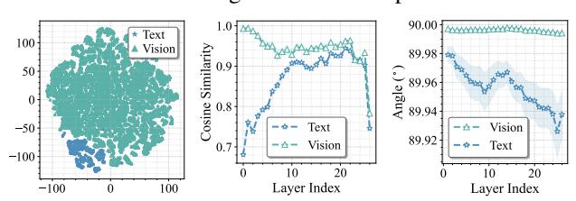
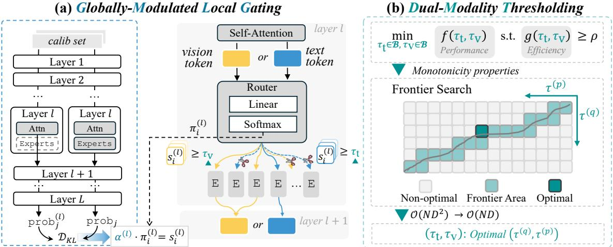

# 4. Motivation

Existing studies [6, 22, 42] have found that not every selected expert provides essential contributions for tokens. They thus propose to skip the computation of unimportant experts to improve inference efficiency. However, they focus on text-only LLMs [27]. In this study, we have identified that directly adapting these methods to MoE MLLMs [26, 50] overlooks two key factors: Global contribution (Sec. 4.1) and modality gap (Sec. 4.2). Both factors significantly affect the performance and efficiency of *expert skipping* in MLLMs.

#### 4.1. Global Contribution Disregard

Recent skipping strategies [6, 22, 42] rely on the *local* routing probabilities (Eq. (1)) to determine the skipping schedule of the l-th layer, reflecting only input-dependent gating within a single layer. Such layer-agnostic rules ignore the global contribution (i.e., impact on final outputs) imbalance of experts across different layers. Empirically, as shown in Fig. 2, we observe that when reducing the value of k for expert routing, shallower layers incur much severe performance drops than those of deeper layers. This may result from that, relative to the error of deeper layers, errors introduced in shallow layers are amplified by subsequent layers [23], leading to a significant error explosion. Accordingly, the aforementioned layer-independent expert skipping strategies [6, 22, 42] risk excessive skipping at shallow layers, which are critical to final outputs, and vice versa for deep layers.

<u>Insight (i):</u> The observation yields a core design principle: With higher global contributions, experts in shallow-critical layers should be preserved; while experts in deeper, less influential ones can be skipped more aggressively.

#### 4.2. Modality Gap Matters

Focusing on *expert skipping* for MLLMs, we further examine the properties of modality-specific tokens with respect

Figure 2. Performance on image (*i.e.*, (a)-(b)) and video (*i.e.*, (c)) understanding tasks across various numbers of top-k routed experts applied to different layer ranges for Kimi-VL-A3B-Instruct [50]. The model has 64 routed experts for each FFN within the 1-st to the 26-th layers, and sets k=6 by default.

to the FFN layers. We first visualize the FFN input representations via t-SNE in Fig. 3 (Left), which reveals a consistent distributional gap between text and vision tokens across layers. To quantify the effect of this modality disparity, we compute the cosine similarity between token representations before and after the FFNs. As shown in Fig. 3 (Middle), FFNs induce a smaller effect on vision tokens (i.e., higher similarity for tokens pre- vs. post-FFN), whereas text tokens undergo substantially larger updates. By tracking the angles between tokens and FFN weights in Fig. 3 (Right), we attribute this phenomenon to their geometry: Vision tokens are more orthogonal to FFN weights (angles $\rightarrow 90^{\circ}$ ), which alleviates the magnitude of their updates.

Figure 3. (*Left*) t-SNE [52] visualization of pre-FFN text/vision tokens across *all* layers. (*Middle*) Cosine similarity between pre-FFN and post-FFN text/vision tokens across layers. (*Right*) Angle between text/vision tokens and weights across different FFN layers. Here, GQA [25] dataset is used as the model inputs, and the model is employed the same as that in Fig. 2.

<u>Insight (ii)</u>: In a word, tokens from different modalities differ, and the magnitudes of updates by FFNs for tokens also vary across modalities. Intuitively, when deciding whether to skip the experts *w.r.t.* the current token, we should account for these modality-specific differences. In the following, a modality-aware skipping policy is proposed for multimodal expert routing.

#### 5. MoDES

Based on the above analyses, we propose *MoDES* (*Multimodal Dynamic Expert Skipping*), an efficient training-free framework composed of two key components, as illustrated in Fig. 4: (i) A *globally-modulated local gating* (*GMLG*) (Sec. 5.1) mechanism that integrates a global and layer-level calibration with local routing probabilities to compute re-

#### (a) Globally-Modulated Local Gating

Figure 4. Overview of MoDES. At inference, use a text token (e.g., ■ above) at the l-th FFN layer as an example. (a) We compute importance scores  $s_i^{(l)}$  ( $i \in \{2,4,M\}$ ) by combining the offline-calibrated globally-modulated factor  $\alpha^{(l)}$  with the local routing probability  $\pi_i^{(l)}$ . These scores evaluate the top-k (k=3) routed experts for token  $\blacksquare$ . (b) We then apply a modality-specific threshold— $\tau_t$  for text and  $\tau_v$  for vision—found by an efficient and effective frontier search. Experts with scores below the threshold are skipped. This method significantly reduces computation while preserving performance for MoE MLLMs. "E" and "calib set" denote the expert and C (Eq. (4)).

fined importance scores for top-k experts; and (ii) a dualmodality thresholding (DMT) (Sec. 5.2) method that determines modality-specific skipping boundaries based on these importance scores. An efficiency-effectiveness search strategy is further introduced to optimize the threshold configuration under a given computational budget.

