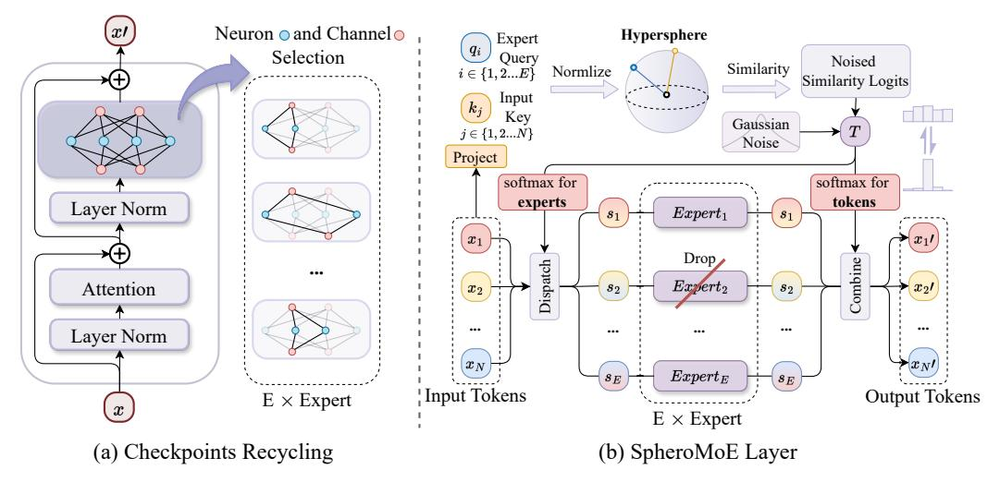

# 2 Background

In this section, we recap the main components used in MoE Jetpack: the sparsely activated mixture of expert (MoE) architectures and different routing mechanisms in MoE. Existing MoE models are typically derived from dense Vision Transformer (ViT) architectures by replacing certain multilayer perceptron (MLP) layers with MoE layers. Each MoE layer comprises a Router(x; θgate) and several "experts", each parameterized as MLP(·; θi). MoE models typically use similar experts, with differences primarily in their routing mechanisms. Several routing algorithms have been developed, including Top-K [17], BASE and Sinkhorn-BASE layers [18, 19], Hash layers [20], Expert Choice routing [21], and soft routing [6]. The most commonly employed routing mechanism is the Top-K, which effectively reduces computational overhead by sparsely activating only the top-K experts relevant to the input token. The routing decision is formulated as:

$$Router(x; \theta_{qate}) = Top-K \left( softmax(MLP(x; \theta_{qate})) \right), \tag{1}$$

$$y = x + \sum_{i \in E} \text{Router}(x; \theta_{gate}) \cdot \text{Expert}(x; \theta_i), \tag{2}$$

where  $\theta$  denotes the weights, E is the set of activated experts, and |E| = K. However, Top-K routing faces challenges such as imbalanced expert utilization, token dropping, and scalability issues.

Enhanced mechanisms like Soft MoE [6] address these issues and serve as our baseline. The Soft MoE routing algorithm processes input tokens  $\mathbf{X} \in \mathbb{R}^{m \times d}$ , where m represents the number of tokens, and d is their dimensionality. It uses learnable parameters  $\Phi \in \mathbb{R}^{d \times (e \cdot s)}$  to reconfigure these tokens into  $e \times s$  slots. The transformed input slots  $\tilde{\mathbf{X}} \in \mathbb{R}^{(e \cdot s) \times d}$  are combinations of the input tokens:  $\tilde{\mathbf{X}} = \operatorname{softmax}(\mathbf{X}\Phi)^{\top}\mathbf{X}$ . Each MoE layer includes e expert functions  $\{f_i : \mathbb{R}^d \to \mathbb{R}^d\}_{i=1}^e$ , with each expert handling s slots. The intermediate output  $\tilde{\mathbf{Y}} \in \mathbb{R}^{(e \cdot s) \times d}$  is obtained by applying the expert functions to the transformed slots:  $\tilde{\mathbf{Y}}_{i,j} = f_i(\tilde{\mathbf{X}}_{i,j})$  for  $i \in \{1, \dots, e\}$  and  $j \in \{1, \dots, s\}$ . The output tokens  $\mathbf{Y} \in \mathbb{R}^{m \times d}$  are generated by reassembling the outputs of the experts:  $\mathbf{Y} = \operatorname{softmax}(\mathbf{X}\Phi)\tilde{\mathbf{Y}}$ .

## 3 MoE Jetpack

In this section, we present the overarching concept of the MoE Jetpack. It is divided into two phases: initializing MoE models with checkpoint recycling and fine-tuning MoE models using the hyperspherical adaptive MoE (SpheroMoE) layer.

#### 3.1 Checkpoint Recycling

Checkpoint recycling is a foundational phase in the MoE Jetpack framework, transforming pretrained dense model checkpoints (**predecessors**) into high-quality initialization weights for MoE models (**successors**). This approach ensures efficient utilization of resources invested in predecessors, boosting the performance and convergence speed of successors. The recycling procedure involves splitting the predecessors' multilayer perceptrons (MLPs) into multiple experts, ensuring expert diversity and adaptability in expert size to meet varied needs.

To define the process of checkpoint recycling (as illustrated in Fig. 2(a)), consider predecessors with N layers  $L_i$ , a channel dimension of d, and a hidden dimension (neuron) of 4d. We aim to transform these into a successor MoE model S with N layers  $L_i'$ , a reduced channel dimension d', where  $d' \leq d$ . Following the Soft MoE [6], the successor comprises two segments: a dense part with  $N_1$  layers and an MoE part with  $N_2$  layers, where  $N_1 = N_2 = \frac{N}{2}$ . Formally, the successor model is represented as:

$$S = \left( \{ L_i' \}_{i=0}^{\frac{N}{2} - 1}, \{ L_i' \}_{i=\frac{N}{2}}^{N-1} \right). \tag{3}$$

Inspired by Weight Selection [22], our recycling process maintains channel consistency. We explore four primary strategies to guide the recycling of checkpoints:

Importance-Based Weight Sampling (default): Weights are sampled based on their importance, determined by activation values. We pass batches of images through the predecessor model and obtain the activation values for each channel and neuron in the MLP layers. For channel selection, we average the activation values across the N layers and select the top-d' channels:

$$A_{c} = \frac{1}{N} \sum_{i=0}^{N-1} A_{L_{i}}^{c}, \quad \text{Top-}d' = \operatorname{argmax}_{c}(A_{c}), \quad |c| = d', \tag{4}$$

where  $A_{L_i}^c$  is the activation value of channel c in layer  $L_i$ ,  $A_c$  is the averaged activation value of channel c across N layers, and Top-d' represents the indices of the top-d' channels with the highest average activation values.

Figure 2: (a) Checkpoint Recycling selects neurons and channels from the MLP of pre-trained dense checkpoints using weight sampling methods. This process transforms pre-trained knowledge into multiple experts of any size for initializing MoE models. (b) The SpheroMoE layer uses crossattention to adaptively dispatch input tokens to expert slots. It starts with a randomly initialized query and uses keys and values derived and normalized from the input. The similarity logits between the query and key are calculated in a hyperspherical space, stabilizing the random query. The outputs from the experts are then combined back into the input using the generated similarity logits.

For hidden dimensions, we convert the activation values into a probability distribution and sample different experts based on this distribution:

$$P(h|H) = \frac{A_h}{\sum_{h' \in H} A_{h'}}, \quad h_{\text{successor}} \sim P(h|H), \quad |h_{\text{successor}}| = 4d', \tag{5}$$

where Ah is the activation value of hidden neuron h, and H is the set of all hidden neurons. This method ensures that the most important weights are selected for the successor model.

Co-Activation Graph Partitioning: This strategy groups frequently co-activated neurons into one expert. We construct a co-activation graph by counting the co-activations of neurons in the predecessor for training samples. Each neuron is a vertex in the graph, and edges represent their co-activation frequency. Formally, let G = (V, E) be the co-activation graph, where V represents the neurons and E represents edges with weights indicating co-activation counts. Using the Metis graph partitioning [\[23\]](#page-10-5), we get several subgraphs:

$$G = \bigcup_{i=1}^{k} G_i, \quad G_i = (V_i, E_i), \quad V_i \cap V_j = \emptyset \text{ for } i \neq j.$$

$$(6)$$

Experts are formed by the combination of sub-graphs. This method leverages the natural grouping of neurons, ensuring each expert captures a specific functional subset of the predecessor model.

Uniform Weight Selection: Weights are selected uniformly across channels. For a predecessor with channel dimension d and a successor with dimension d ′ , weights are chosen as:

$$W_{\text{successor}}^{(i)} = W_{\text{predecessor}}^{(k)}, \quad k = \left| \frac{i \cdot d}{d'} \right|, \quad i \in \{0, \dots, d' - 1\}.$$
 (7)

This method ensures an even distribution of the pre-trained weights across the successor MoE.

Random Weight Sampling: Weights are randomly selected from the predecessor model. Let S be a random subset of channel indices:

$$S \subseteq 0, \dots, d-1, \quad |S| = d'. \tag{8}$$

Then, the weights for the successor are chosen as:

$$W_{\text{successor}}^{(i)} = W_{\text{predecessor}}^{(j)}, \quad j \in S, \quad i \in \{0, \dots, d' - 1\}.$$
 (9)

Through the ablation in Sec. [4.3,](#page-6-0) Importance-Based Weight Sampling is identified as the default method for recycling dense checkpoints to initialize MoE models.

#### 3.2 SpheroMoE Layer

Following the initialization of MoE weights through Checkpoint Recycling, the next step is fine-tuning on downstream datasets. To enhance performance and stability, we designed the hyperspherical adaptive MoE (SpheroMoE) layer (Fig. 2(b)), introducing three key improvements: SpheroMoE Routing to alleviate optimization challenges, Expert Regularization to prevent over-specialization, and Adaptive Dual-path MoE (Fig. 3 for better performance and efficiency. Additionally, the pseudo-code detailing these features' implementation can be found in Appendix C.

**SpheroMoE Routing**: As shown in Fig. 2(b), the proposed hyperspherical MoE (SpheroMoE) routing mechanism utilizes cross-attention [24] to distribute inputs across experts. Each expert receives an input slot, a weighted average of all input tokens. To maintain consistency between dense checkpoints and MoE layers  $M = \{L_i'\}_{i=N/2}^{N-1}$ , input tokens  $\mathbf{X} \in \mathbb{R}^{b \times n \times d}$  (where brepresents the batch size, n represents the token length, and n represents the input dimension) are layer normalized inherited from dense checkpoints, resulting in  $\mathbf{X}_{\text{norm}}$ . Queries  $\mathbf{Q} \in \mathbb{R}^{b \times (e \times s) \times d}$  are randomly initialized and similarly normalized to align with Xnorm, producing  $\mathbf{Q}_{norm}$ . The layer normalization process ensures the consistency of distributions between the MoE model, input queries, and the pre-trained dense model. The normalized  $\mathbf{X}_{\text{norm}}$  are projected to form keys  $\mathbf{K} \in \mathbb{R}^{b \times n \times d}$ 

Figure 3: The Adaptive Dual-path MoE structure enhances the SpheroMoE Router by adapting it into a dual-branch system, designed to optimize computational efficiency and model performance. This configuration directs high-impact tokens to a core path with fewer but larger experts, while routing less critical tokens to a universal path equipped with a greater number of smaller experts.

for the cross-attention mechanism. To address numerical instability with randomly initialized queries,  $\mathbf{Q}_{\text{norm}}$  are projected onto a hyperspherical space using L2 normalization. The similarity between  $\mathbf{Q}_{\text{norm}}$  and  $\mathbf{K}$  is computed in this space, yielding similarity logits  $\mathbf{S} \in \mathbb{R}^{b \times (e \times s) \times n}$ :  $\mathbf{S} = \mathbf{Q}_{\text{norm}} \mathbf{K}^T$ . We do not apply L2 normalization to  $\mathbf{K}$  to preserve their scale information, enhancing the matching process. Input slots  $\tilde{\mathbf{X}} \in \mathbb{R}^{b \times (e \times s) \times d}$  for experts are formed by a softmax operation along the n dimension of similarity logits:

$$\tilde{\mathbf{X}} = \frac{\exp(\mathbf{S}_{ijk})}{\sum_{k'=1}^{n} \exp(\mathbf{S}_{ijk'})} \mathbf{X}_{\text{norm}}.$$
(10)

Each expert processes its corresponding input slots  $\tilde{\mathbf{X}}_i$  independently, generating outputs  $\tilde{\mathbf{Y}}_i$ . These outputs are then weighted by  $\mathbf{S}$  (after applying a softmax operation along the  $(e \times s)$  dimension) to aggregate the experts' contributions, producing the final output  $\mathbf{Y} \in \mathbb{R}^{b \times n \times d}$  of the MoE layer:

$$\mathbf{Y} = \frac{\exp(\mathbf{S}_{ijk})}{\sum_{j'=1}^{e \times s} \exp(\mathbf{S}_{ij'k})} \tilde{\mathbf{Y}}.$$
 (11)

In summary, SpheroMoE routing leverages layer normalization, hyperspherical projection, and crossattention to effectively distribute inputs across experts, ensuring consistency with pre-trained dense models for improved optimization.

**Expert Regularization**: To prevent over-specialization and enhance generalization during fine-tuning, we regulate SpheroMoE Routing and expert behavior. We aim to prevent experts from overly focusing on specific inputs and to avoid outputs becoming overly dependent on particular experts. For the former, we introduced a learnable softmax temperature T. During the early stages of fine-tuning, T is initialized to a large value, causing experts to distribute their attention across all input tokens and preventing early convergence on specific tokens. As training progresses, T gradually decreases, enabling experts to focus more on specific relevant features and enhancing their specialization where beneficial. Additionally, we added a certain level of expert noise to the similarity logits S, which improves generalization. For the latter, we utilized stochastic expert dropout, where

each expert i is randomly deactivated with a probability p. It ensures that no single expert becomes a crutch for the entire output, promoting a more balanced utilization of all experts. These techniques form an expert regularization strategy that maintains expert versatility and mitigates overfitting, ensuring the MoE model performs robustly on downstream datasets.

Adaptive Dual-path MoE: To mitigate computational redundancy for less critical tokens and enhance MoE model performance, we introduce the Adaptive Dual-path MoE structure. Building on the checkpoint recycling, which enables MoE models to inherit pre-trained knowledge from dense checkpoints and discern crucial from non-crucial tokens, our structure employs two pathways. The first pathway features fewer core experts with more parameters for processing important tokens. Conversely, the second pathway consists of a larger number of universal experts, each with approximately one-fourth of the parameters of the core experts, designated for handling less critical tokens. The structure is illustrated in Fig. [3.](#page-4-0) The SpheroMoE Routing mechanism segments input tokens into core and universal slots, assigning them to the respective pathways. The core path processes high-impact tokens, while the universal path handles less important ones, ensuring optimal resource utilization and preserving model accuracy while accelerating the MoE model.

